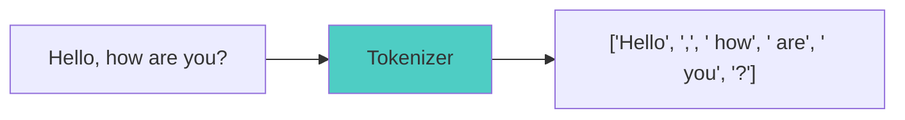
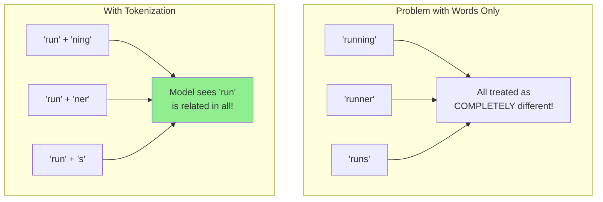
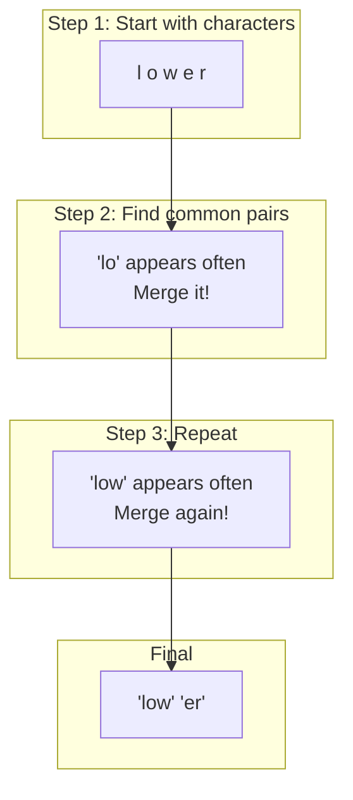
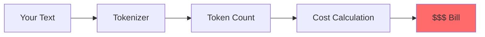
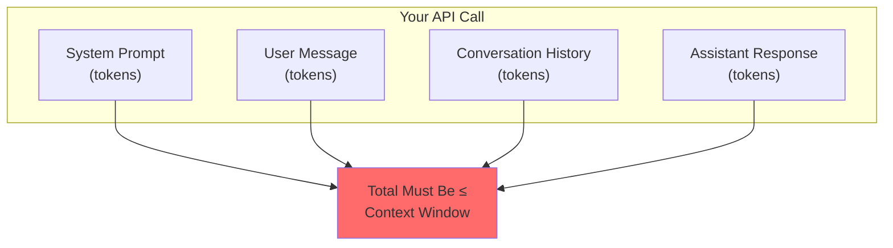
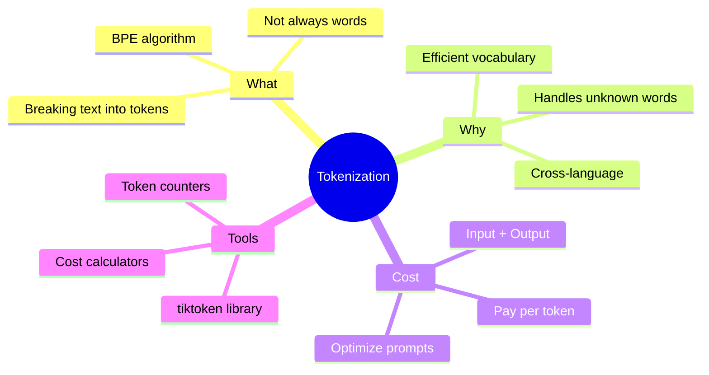

# Tokenization: How LLMs See Your Text

Ever wondered what happens to your text before an LLM processes it? Spoiler: the model doesn't see words like you do. It sees **tokens** - and understanding this will save you money and help you write better prompts!

---

## What is Tokenization?

Tokenization is the process of breaking text into smaller pieces called **tokens**. These tokens are what the LLM actually processes.



### The Key Insight

**Tokens are NOT always words!**

A token can be:
- A whole word: `"hello"`
- Part of a word: `"un"` + `"believ"` + `"able"`
- A single character: `"!"`
- A space + word: `" the"`
- Multiple characters: `"ing"`

---

## Why Not Just Use Words?

Great question! Here's why tokenization is smarter than simple word splitting:



### Benefits of Tokenization

1. **Smaller vocabulary**: Instead of millions of words, models use ~50,000-100,000 tokens
2. **Handles new words**: Can tokenize words it's never seen before
3. **Efficient encoding**: Common patterns get shorter representations
4. **Language agnostic**: Works across different languages

---

## How Tokenization Actually Works

Most modern LLMs use **Byte-Pair Encoding (BPE)** or similar algorithms.

### The BPE Intuition

Imagine you're creating a texting shorthand:



The algorithm:
1. Starts with individual characters
2. Finds the most common pair of adjacent tokens
3. Merges them into a new token
4. Repeats until vocabulary size is reached

---

## Let's See Real Tokenization in Python!

Here's how to actually tokenize text using the `tiktoken` library (OpenAI's tokenizer):

```python
# Install: pip install tiktoken

import tiktoken

# Get the tokenizer for GPT-4
encoder = tiktoken.encoding_for_model("gpt-4")

# Let's tokenize some text!
text = "Hello, how are you doing today?"

# Encode text to tokens
tokens = encoder.encode(text)
print(f"Text: {text}")
print(f"Tokens: {tokens}")
print(f"Number of tokens: {len(tokens)}")

# Output:
# Text: Hello, how are you doing today?
# Tokens: [9906, 11, 1268, 527, 499, 3815, 3432, 30]
# Number of tokens: 8
```

### Decoding Tokens Back to Text

```python
import tiktoken

encoder = tiktoken.encoding_for_model("gpt-4")

text = "Hello, how are you doing today?"
tokens = encoder.encode(text)

# Decode each token individually to see what it represents
for token in tokens:
    decoded = encoder.decode([token])
    print(f"Token {token} = '{decoded}'")

# Output:
# Token 9906 = 'Hello'
# Token 11 = ','
# Token 1268 = ' how'
# Token 527 = ' are'
# Token 499 = ' you'
# Token 3815 = ' doing'
# Token 3432 = ' today'
# Token 30 = '?'
```

Notice how most tokens include the leading space? That's a design choice in GPT tokenizers!

---

## Tokenization Surprises

Let's explore some interesting tokenization behaviors:

### Example 1: Numbers

```python
import tiktoken

encoder = tiktoken.encoding_for_model("gpt-4")

# Numbers can be tricky!
numbers = ["42", "1000", "123456789"]

for num in numbers:
    tokens = encoder.encode(num)
    print(f"'{num}' = {len(tokens)} tokens: {tokens}")

# Output:
# '42' = 1 tokens: [2983]
# '1000' = 1 tokens: [1041]
# '123456789' = 3 tokens: [4513, 10961, 19608]
```

Large numbers get split into multiple tokens!

### Example 2: Different Languages

```python
import tiktoken

encoder = tiktoken.encoding_for_model("gpt-4")

texts = [
    "Hello world",      # English
    "Bonjour monde",    # French
    "こんにちは世界",      # Japanese
    "مرحبا بالعالم",    # Arabic
]

for text in texts:
    tokens = encoder.encode(text)
    print(f"'{text}' = {len(tokens)} tokens")

# Output:
# 'Hello world' = 2 tokens
# 'Bonjour monde' = 3 tokens
# 'こんにちは世界' = 5 tokens
# 'مرحبا بالعالم' = 8 tokens
```

Non-English text often uses more tokens because the tokenizer was trained primarily on English!

### Example 3: Code vs Text

```python
import tiktoken

encoder = tiktoken.encoding_for_model("gpt-4")

# Prose
prose = "The function calculates the sum of two numbers."
prose_tokens = encoder.encode(prose)

# Code
code = "def calculate_sum(a, b): return a + b"
code_tokens = encoder.encode(code)

print(f"Prose ({len(prose)} chars): {len(prose_tokens)} tokens")
print(f"Code ({len(code)} chars): {len(code_tokens)} tokens")

# Prose (47 chars): 9 tokens
# Code (38 chars): 14 tokens
```

Code often requires more tokens than natural language!

---

## Calculating Token Costs

This is where understanding tokenization saves you money!



### Pricing Structure

LLMs typically charge per token:

| Model | Input Cost | Output Cost |
|-------|------------|-------------|
| GPT-4 | $0.03/1K tokens | $0.06/1K tokens |
| GPT-3.5-Turbo | $0.0005/1K tokens | $0.0015/1K tokens |
| Claude 3 Opus | $0.015/1K tokens | $0.075/1K tokens |

### Cost Calculator

```python
import tiktoken

def calculate_cost(prompt: str, expected_response_tokens: int = 500):
    """
    Calculate the estimated cost of an API call.
    """
    encoder = tiktoken.encoding_for_model("gpt-4")
    input_tokens = len(encoder.encode(prompt))

    # GPT-4 pricing (as of 2024)
    input_cost_per_1k = 0.03
    output_cost_per_1k = 0.06

    input_cost = (input_tokens / 1000) * input_cost_per_1k
    output_cost = (expected_response_tokens / 1000) * output_cost_per_1k
    total_cost = input_cost + output_cost

    return {
        "input_tokens": input_tokens,
        "estimated_output_tokens": expected_response_tokens,
        "input_cost": f"${input_cost:.4f}",
        "output_cost": f"${output_cost:.4f}",
        "total_cost": f"${total_cost:.4f}"
    }

# Example usage
prompt = """
You are an expert Python developer. Please review the following code
and provide detailed feedback on:
1. Code quality
2. Performance optimizations
3. Security concerns
4. Best practices

Code:
def process_user_data(users):
    results = []
    for user in users:
        if user['age'] > 18:
            results.append(user['name'])
    return results
"""

cost = calculate_cost(prompt, expected_response_tokens=800)
print(cost)

# Output:
# {
#   'input_tokens': 89,
#   'estimated_output_tokens': 800,
#   'input_cost': '$0.0027',
#   'output_cost': '$0.0480',
#   'total_cost': '$0.0507'
# }
```

---

## Practical Tips for Token Efficiency

### Tip 1: Be Concise in Prompts

```python
# Bad: Verbose prompt (more tokens = more cost)
verbose_prompt = """
I would really appreciate it if you could please help me by
providing a comprehensive and detailed summary of the following
text. I want you to make sure that you capture all the important
points and key takeaways from the content below:
"""

# Good: Concise prompt (fewer tokens = less cost)
concise_prompt = "Summarize this text, highlighting key points:"

# The concise version saves ~30 tokens per request!
```

### Tip 2: Remove Unnecessary Whitespace

```python
import tiktoken

encoder = tiktoken.encoding_for_model("gpt-4")

# Extra whitespace wastes tokens!
messy = """

    Hello     world!

    How    are   you?

"""

clean = "Hello world! How are you?"

print(f"Messy: {len(encoder.encode(messy))} tokens")
print(f"Clean: {len(encoder.encode(clean))} tokens")

# Messy: 15 tokens
# Clean: 7 tokens
```

### Tip 3: Use Abbreviations Strategically

```python
import tiktoken

encoder = tiktoken.encoding_for_model("gpt-4")

# In system prompts, abbreviations can help
full = "JavaScript Object Notation"
abbrev = "JSON"

print(f"'{full}': {len(encoder.encode(full))} tokens")
print(f"'{abbrev}': {len(encoder.encode(abbrev))} tokens")

# 'JavaScript Object Notation': 4 tokens
# 'JSON': 1 token
```

---

## Token Limits and Context Windows

Remember: **Context Window = Maximum Tokens**



```python
import tiktoken

def check_fits_context(messages: list, model: str = "gpt-4"):
    """
    Check if messages fit within the context window.
    """
    encoder = tiktoken.encoding_for_model(model)

    context_limits = {
        "gpt-4": 8192,
        "gpt-4-32k": 32768,
        "gpt-3.5-turbo": 4096,
        "gpt-3.5-turbo-16k": 16384,
    }

    total_tokens = 0
    for message in messages:
        total_tokens += len(encoder.encode(message["content"]))
        total_tokens += 4  # Overhead per message

    limit = context_limits.get(model, 8192)
    fits = total_tokens < limit

    return {
        "total_tokens": total_tokens,
        "context_limit": limit,
        "fits": fits,
        "remaining": limit - total_tokens if fits else 0
    }

# Example
messages = [
    {"role": "system", "content": "You are a helpful assistant."},
    {"role": "user", "content": "Explain quantum computing in simple terms."},
]

result = check_fits_context(messages)
print(result)

# Output:
# {
#   'total_tokens': 19,
#   'context_limit': 8192,
#   'fits': True,
#   'remaining': 8173
# }
```

---

## Quick Reference: Token Rules of Thumb

| Text Type | Rough Token Ratio |
|-----------|-------------------|
| English text | ~1 token per 4 characters |
| English text | ~0.75 tokens per word |
| Code | ~1 token per 3 characters |
| Numbers | Varies widely |
| Non-English | 2-4x more tokens than English |

---

## Summary



---

## What's Next?

Now that you understand tokenization, let's explore how to control the LLM's creativity using **Temperature, Top-P, and Frequency Penalties** - the knobs that tune your AI's output!

---

## Exercises

1. **Token Counter**: Write a function that counts tokens in a file and estimates the API cost

2. **Language Comparison**: Compare token counts for the same sentence in 5 different languages

3. **Optimization Challenge**: Take a 500-token prompt and reduce it to under 300 tokens while keeping the same meaning

```python
# Starter code for Exercise 1
import tiktoken

def analyze_file(filepath: str):
    encoder = tiktoken.encoding_for_model("gpt-4")

    with open(filepath, 'r') as f:
        content = f.read()

    tokens = encoder.encode(content)

    return {
        "characters": len(content),
        "tokens": len(tokens),
        "ratio": len(content) / len(tokens),
        "estimated_cost_gpt4": f"${(len(tokens)/1000) * 0.03:.4f}"
    }

# Try it on your own files!
```
