# Temperature, Top-P, and Frequency Penalties

Welcome back! Now that you understand how LLMs see text (tokenization) and process it (transformers), let's learn how to control the **creativity** and **randomness** of their outputs.

Think of these as the "personality knobs" for your AI!

---

## The Big Picture: How LLMs Generate Text

Before diving into the controls, let's understand what we're controlling.

When an LLM generates text, it doesn't just pick the "best" next word. Instead, it:

1. Calculates a probability for EVERY possible next token
2. Uses sampling parameters to pick from those probabilities
3. Repeats until done

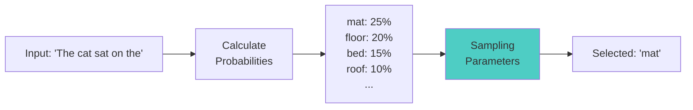

---

## Temperature: The Creativity Dial

Temperature is the most important sampling parameter. It controls how "random" or "creative" the output is.

### The Intuition

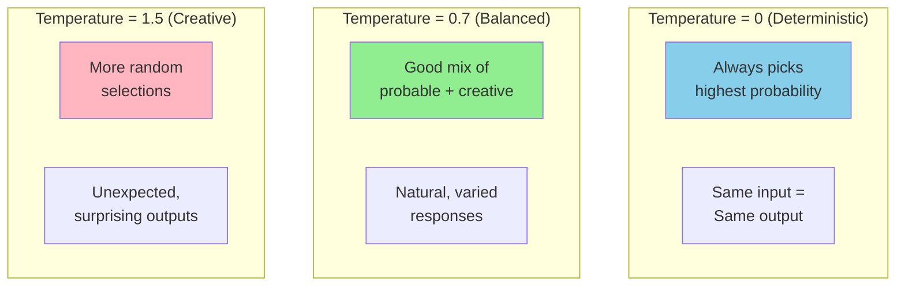

### How Temperature Works (Simplified)

Temperature adjusts the probability distribution:

- **Low temperature (0-0.3)**: Makes high-probability tokens MUCH more likely
- **Medium temperature (0.5-0.8)**: Balanced selection
- **High temperature (1.0+)**: Flattens probabilities, more randomness

```python
# Conceptual example (not actual API code)

# Original probabilities
probabilities = {
    "mat": 0.40,
    "floor": 0.25,
    "bed": 0.20,
    "roof": 0.10,
    "moon": 0.05
}

# With temperature = 0.1 (very focused)
# "mat" becomes almost certain (~95%)

# With temperature = 1.0 (neutral)
# Probabilities stay roughly the same

# With temperature = 2.0 (very random)
# All options become more equal (~20% each)
```

### Visual Comparison

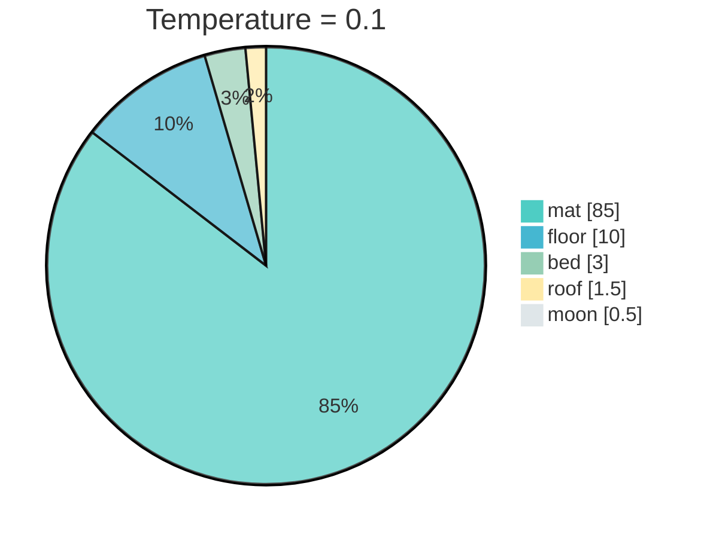

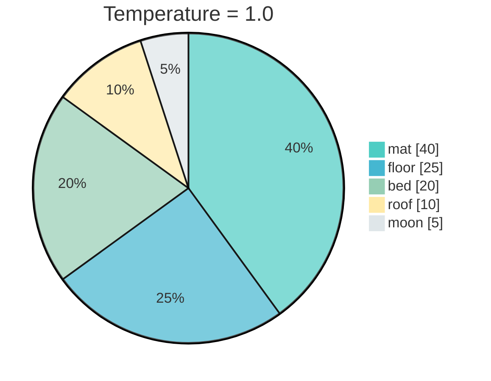

### Code Example: Temperature in Action

```python
from openai import OpenAI

client = OpenAI()

def generate_with_temperature(prompt: str, temperature: float):
    """Generate text with specified temperature."""
    response = client.chat.completions.create(
        model="gpt-3.5-turbo",
        messages=[{"role": "user", "content": prompt}],
        temperature=temperature,
        max_tokens=50
    )
    return response.choices[0].message.content

prompt = "Write a one-sentence story about a robot:"

# Let's see how temperature affects output
temperatures = [0.0, 0.5, 1.0, 1.5]

for temp in temperatures:
    print(f"\n--- Temperature: {temp} ---")
    # Generate 3 times to see variation
    for i in range(3):
        result = generate_with_temperature(prompt, temp)
        print(f"  {i+1}. {result}")
```

**Expected Output:**

```
--- Temperature: 0.0 ---
  1. A robot discovered it could dream and wondered what it meant to be alive.
  2. A robot discovered it could dream and wondered what it meant to be alive.
  3. A robot discovered it could dream and wondered what it meant to be alive.

--- Temperature: 0.5 ---
  1. A robot discovered it could dream and wondered what it meant to be alive.
  2. A lonely robot found friendship in an abandoned teddy bear.
  3. A robot discovered it could dream and pondered the meaning of existence.

--- Temperature: 1.0 ---
  1. The robot baked cookies for the first time and accidentally invented a new element.
  2. A robot wandered through the desert searching for its creator.
  3. In the year 3000, a robot learned to laugh at its own jokes.

--- Temperature: 1.5 ---
  1. Rusty the robot accidentally sneezed bolts into a time vortex of dancing electrons.
  2. A mechanical dreamer composed symphonies from static and stardust memories.
  3. Robot-7 transcended its circuits through interpretive welding dance.
```

Notice how:
- **Temp 0**: Same output every time
- **Temp 0.5**: Slight variations
- **Temp 1.0**: Creative but coherent
- **Temp 1.5**: Wild and unexpected

---

## Temperature Use Cases

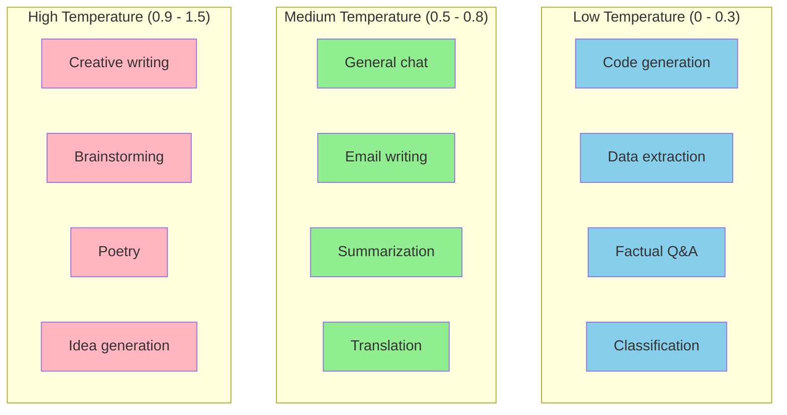

---

## Top-P (Nucleus Sampling): The Probability Filter

Top-P is another way to control randomness, but with a different approach.

### The Intuition

Instead of adjusting ALL probabilities (like temperature), Top-P **cuts off** the long tail of unlikely options.

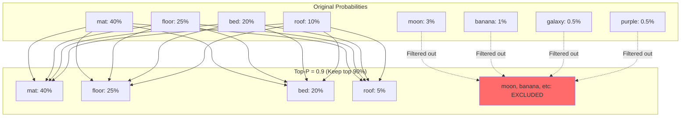

### How Top-P Works

1. Sort all tokens by probability (highest first)
2. Add up probabilities until you reach P (e.g., 0.9 = 90%)
3. Only sample from those tokens

```python
# Conceptual example

probabilities = [
    ("mat", 0.40),
    ("floor", 0.25),
    ("bed", 0.20),
    ("roof", 0.10),
    ("moon", 0.03),
    ("banana", 0.02),
]

def apply_top_p(probs, p=0.9):
    """Keep only tokens that make up top P probability."""
    sorted_probs = sorted(probs, key=lambda x: x[1], reverse=True)

    cumulative = 0
    filtered = []

    for token, prob in sorted_probs:
        if cumulative < p:
            filtered.append((token, prob))
            cumulative += prob
        else:
            break

    return filtered

result = apply_top_p(probabilities, p=0.9)
print("Tokens kept:", result)
# Output: [('mat', 0.40), ('floor', 0.25), ('bed', 0.20), ('roof', 0.10)]
# "moon" and "banana" are excluded!
```

### Top-P in API Calls

```python
from openai import OpenAI

client = OpenAI()

def generate_with_top_p(prompt: str, top_p: float):
    """Generate text with specified top_p."""
    response = client.chat.completions.create(
        model="gpt-3.5-turbo",
        messages=[{"role": "user", "content": prompt}],
        top_p=top_p,
        temperature=1.0,  # Keep temperature neutral
        max_tokens=50
    )
    return response.choices[0].message.content

prompt = "Complete this sentence creatively: The scientist discovered that..."

# Compare different top_p values
print("--- Top-P = 0.1 (Very focused) ---")
print(generate_with_top_p(prompt, 0.1))

print("\n--- Top-P = 0.5 (Moderate) ---")
print(generate_with_top_p(prompt, 0.5))

print("\n--- Top-P = 0.95 (Open) ---")
print(generate_with_top_p(prompt, 0.95))
```

---

## Temperature vs Top-P: When to Use Which?

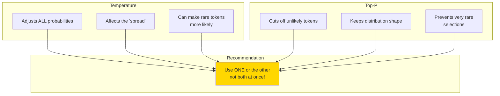

### Quick Guide

| Goal | Use | Settings |
|------|-----|----------|
| Deterministic output | Temperature | `temperature=0` |
| Creative but safe | Top-P | `top_p=0.9, temperature=1` |
| Maximum creativity | Temperature | `temperature=1.5` |
| Balanced general use | Either | `temperature=0.7` or `top_p=0.9` |

---

## Frequency and Presence Penalties

These parameters help prevent repetition in outputs.

### Frequency Penalty

Reduces the likelihood of tokens that have already appeared, **proportional to how often** they've appeared.

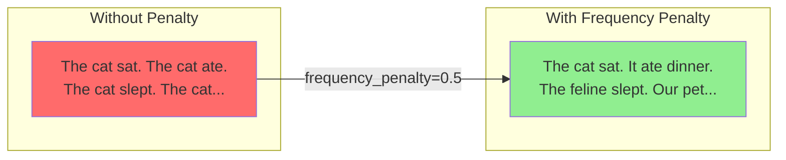

### Presence Penalty

Reduces the likelihood of tokens that have appeared **at all**, regardless of how many times.

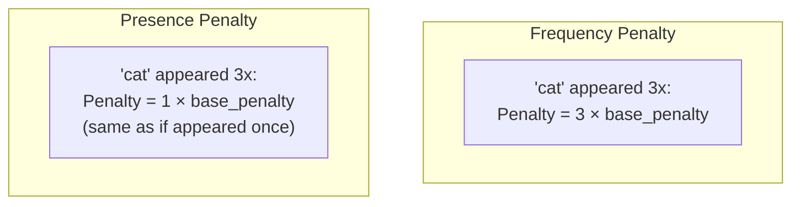

### Code Example

```python
from openai import OpenAI

client = OpenAI()

def generate_with_penalties(
    prompt: str,
    frequency_penalty: float = 0,
    presence_penalty: float = 0
):
    """Generate text with repetition penalties."""
    response = client.chat.completions.create(
        model="gpt-3.5-turbo",
        messages=[{"role": "user", "content": prompt}],
        temperature=0.7,
        max_tokens=100,
        frequency_penalty=frequency_penalty,
        presence_penalty=presence_penalty
    )
    return response.choices[0].message.content

prompt = "Write a paragraph about cats. Include lots of details."

print("--- No penalties ---")
print(generate_with_penalties(prompt))

print("\n--- With frequency_penalty=0.5 ---")
print(generate_with_penalties(prompt, frequency_penalty=0.5))

print("\n--- With presence_penalty=0.5 ---")
print(generate_with_penalties(prompt, presence_penalty=0.5))

print("\n--- With both penalties ---")
print(generate_with_penalties(prompt, frequency_penalty=0.5, presence_penalty=0.5))
```

### Penalty Value Ranges

Both penalties range from **-2.0 to 2.0**:

| Value | Effect |
|-------|--------|
| -2.0 | Strongly ENCOURAGE repetition |
| 0 | No effect (default) |
| 0.5 | Mild discouragement |
| 1.0 | Moderate discouragement |
| 2.0 | Strong discouragement |

---

## Putting It All Together: A Practical Configuration Guide

```python
from openai import OpenAI

client = OpenAI()

# Different configurations for different tasks
CONFIGS = {
    "code_generation": {
        "temperature": 0,
        "top_p": 1,
        "frequency_penalty": 0,
        "presence_penalty": 0
    },
    "creative_writing": {
        "temperature": 0.9,
        "top_p": 0.95,
        "frequency_penalty": 0.5,
        "presence_penalty": 0.5
    },
    "factual_qa": {
        "temperature": 0.3,
        "top_p": 0.9,
        "frequency_penalty": 0,
        "presence_penalty": 0
    },
    "brainstorming": {
        "temperature": 1.2,
        "top_p": 0.95,
        "frequency_penalty": 0.7,
        "presence_penalty": 0.7
    },
    "chat_assistant": {
        "temperature": 0.7,
        "top_p": 0.9,
        "frequency_penalty": 0.3,
        "presence_penalty": 0.3
    }
}

def smart_generate(prompt: str, task_type: str):
    """Generate text with task-appropriate settings."""
    config = CONFIGS.get(task_type, CONFIGS["chat_assistant"])

    response = client.chat.completions.create(
        model="gpt-3.5-turbo",
        messages=[{"role": "user", "content": prompt}],
        max_tokens=200,
        **config
    )
    return response.choices[0].message.content

# Usage examples
print(smart_generate("Write a Python function to sort a list", "code_generation"))
print(smart_generate("Give me 5 unique startup ideas", "brainstorming"))
print(smart_generate("What is the capital of France?", "factual_qa"))
```

---

## Decision Tree: Choosing Your Settings

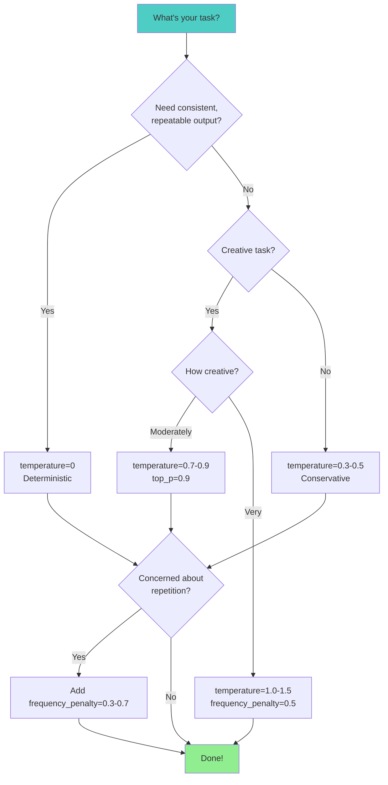

---

## Common Mistakes to Avoid

### Mistake 1: Using High Temperature AND Low Top-P

```python
# BAD: Conflicting settings
response = client.chat.completions.create(
    model="gpt-3.5-turbo",
    messages=[...],
    temperature=1.5,  # "Be creative!"
    top_p=0.1  # "But only use common tokens!"
)

# GOOD: Pick one approach
# For creativity:
temperature=1.2, top_p=1.0

# For focus:
temperature=0.3, top_p=1.0
# OR
temperature=1.0, top_p=0.5
```

### Mistake 2: Extreme Penalties

```python
# BAD: Penalties too high
frequency_penalty=2.0
presence_penalty=2.0
# Result: Model avoids ALL repeated words, even necessary ones like "the", "is"

# GOOD: Moderate penalties
frequency_penalty=0.5
presence_penalty=0.3
```

---

## Summary

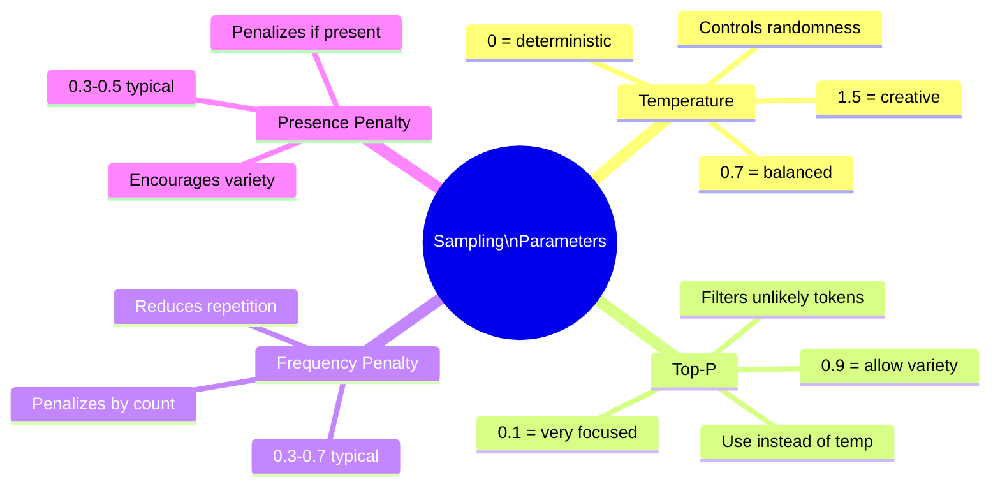

---

## Exercises

1. **Temperature Explorer**: Create a script that generates the same prompt with temperatures from 0 to 2 in 0.2 increments. Visualize how the outputs change.

2. **Repetition Fighter**: Take a prompt that tends to produce repetitive output. Find the optimal frequency/presence penalty combination.

3. **Task Matcher**: Given these tasks, choose appropriate settings:
   - Generating unit tests
   - Writing poetry
   - Extracting dates from text
   - Generating product descriptions

---

## What's Next?

You now understand the three pillars of LLM interaction:
1. How they process text (Transformers)
2. How they see text (Tokenization)
3. How to control their output (Sampling Parameters)

Next week, we'll dive into **Advanced Prompting Techniques** - the art of communicating effectively with LLMs to get exactly what you want!
