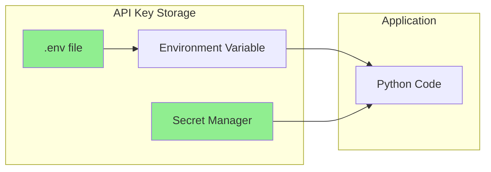
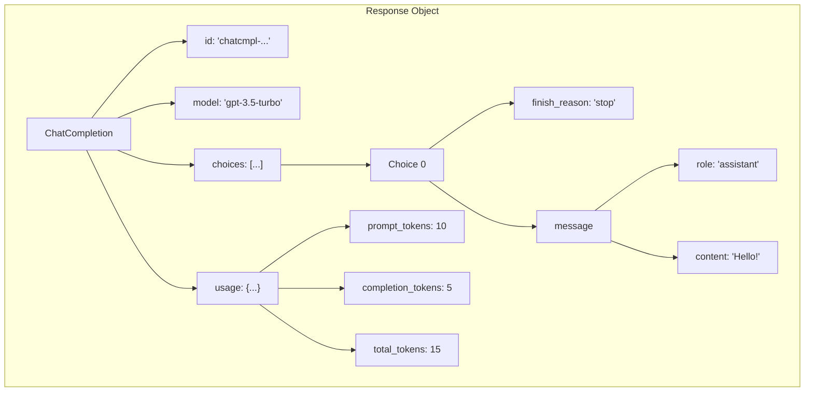
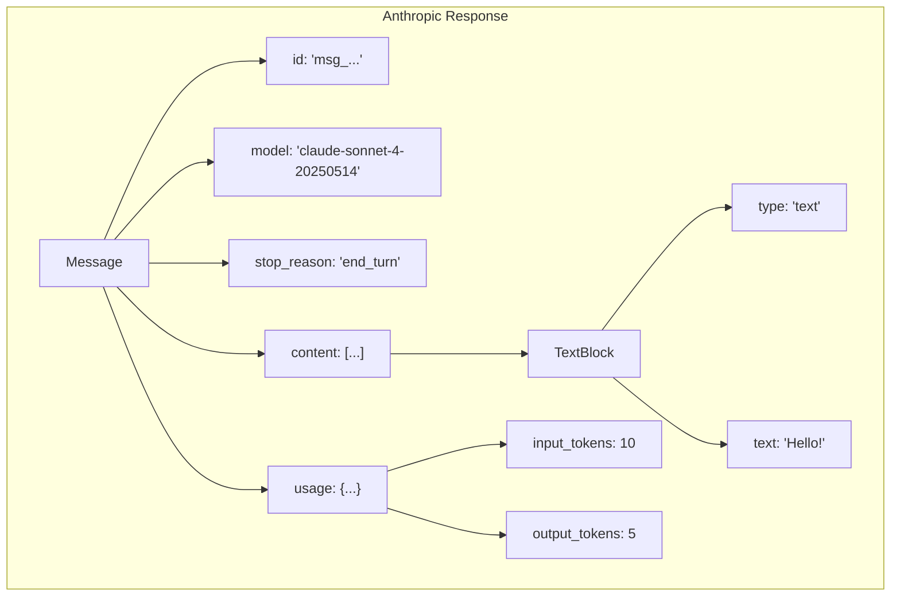
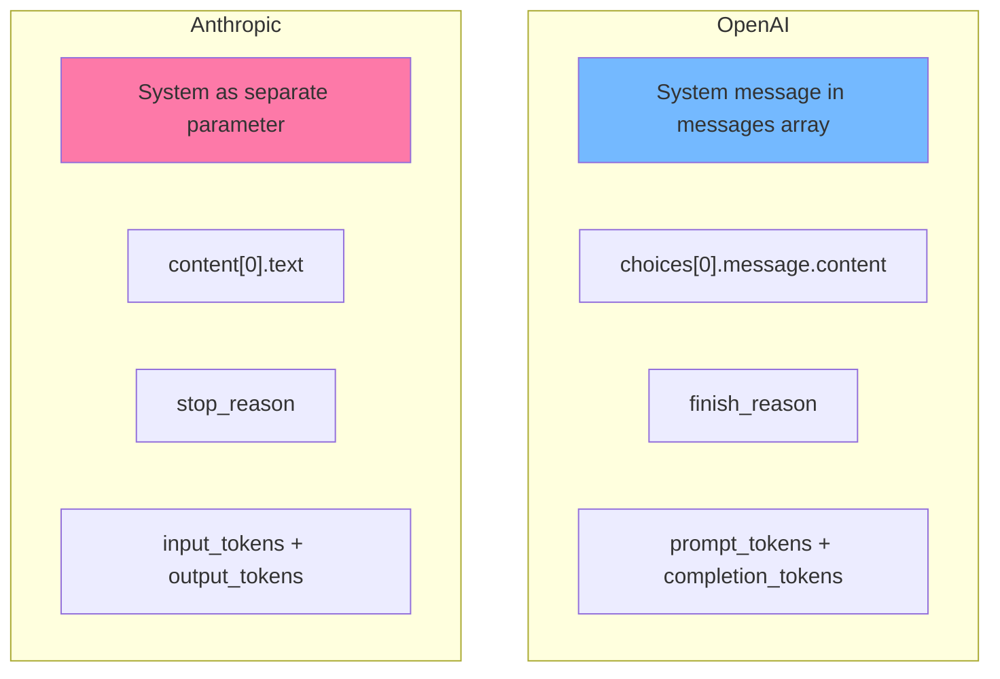
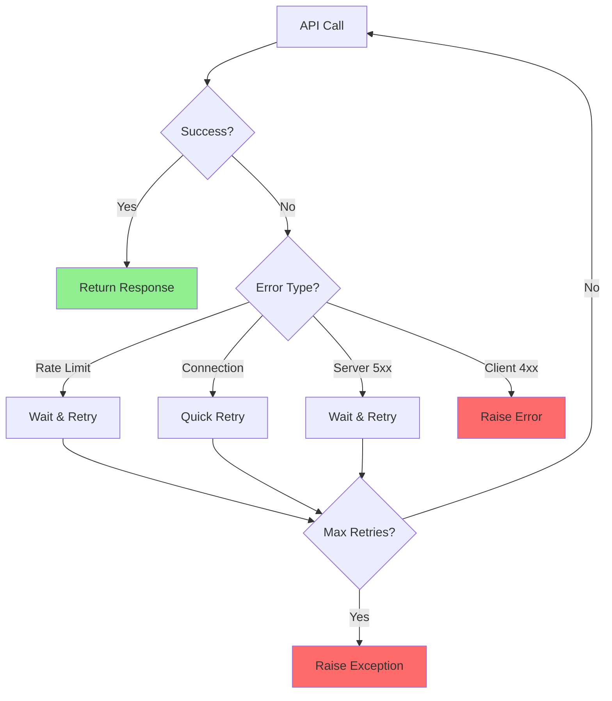

# Using OpenAI and Anthropic Python SDKs

Welcome to the hands-on world of LLM programming! In this guide, you'll learn to work with the two most popular LLM providers: OpenAI (GPT models) and Anthropic (Claude models).

Let's get coding!

---

## Getting Started

### Installation

```bash
# Install both SDKs
pip install openai anthropic

# Or add to requirements.txt
# openai>=1.0.0
# anthropic>=0.18.0
```

### API Keys Setup

Both providers require API keys. Never hardcode them!

```python
# Best practice: Use environment variables

# In your terminal or .env file:
# export OPENAI_API_KEY="sk-..."
# export ANTHROPIC_API_KEY="sk-ant-..."

import os
from openai import OpenAI
from anthropic import Anthropic

# Clients automatically read from environment variables
openai_client = OpenAI()  # Reads OPENAI_API_KEY
anthropic_client = Anthropic()  # Reads ANTHROPIC_API_KEY

# Or explicitly pass the key (not recommended for production)
# openai_client = OpenAI(api_key="sk-...")
```



---

## OpenAI SDK Basics

### Your First API Call

```python
from openai import OpenAI

client = OpenAI()

def simple_chat(message: str) -> str:
    """Make a simple chat completion request."""
    response = client.chat.completions.create(
        model="gpt-3.5-turbo",
        messages=[
            {"role": "user", "content": message}
        ]
    )
    return response.choices[0].message.content

# Try it!
result = simple_chat("What is Python in one sentence?")
print(result)
```

### Understanding the Response Object

```python
from openai import OpenAI

client = OpenAI()

response = client.chat.completions.create(
    model="gpt-3.5-turbo",
    messages=[{"role": "user", "content": "Hello!"}]
)

# Let's explore the response structure
print("Full response type:", type(response))
print("ID:", response.id)
print("Model:", response.model)
print("Created:", response.created)

# The actual content
print("\nChoices:", len(response.choices))
choice = response.choices[0]
print("Finish reason:", choice.finish_reason)
print("Message role:", choice.message.role)
print("Message content:", choice.message.content)

# Token usage
print("\nToken usage:")
print("  Prompt tokens:", response.usage.prompt_tokens)
print("  Completion tokens:", response.usage.completion_tokens)
print("  Total tokens:", response.usage.total_tokens)
```



### Complete OpenAI Example with All Parameters

```python
from openai import OpenAI

client = OpenAI()

def advanced_chat(
    messages: list,
    model: str = "gpt-3.5-turbo",
    temperature: float = 0.7,
    max_tokens: int = 1000,
    top_p: float = 1.0,
    frequency_penalty: float = 0,
    presence_penalty: float = 0,
    stop: list = None
) -> dict:
    """
    Make an advanced chat completion request with all common parameters.
    """
    response = client.chat.completions.create(
        model=model,
        messages=messages,
        temperature=temperature,
        max_tokens=max_tokens,
        top_p=top_p,
        frequency_penalty=frequency_penalty,
        presence_penalty=presence_penalty,
        stop=stop
    )

    return {
        "content": response.choices[0].message.content,
        "finish_reason": response.choices[0].finish_reason,
        "tokens_used": response.usage.total_tokens,
        "model": response.model
    }

# Usage example
messages = [
    {"role": "system", "content": "You are a helpful coding assistant."},
    {"role": "user", "content": "Write a Python function to reverse a string."}
]

result = advanced_chat(
    messages=messages,
    model="gpt-4",
    temperature=0,  # Deterministic for code
    max_tokens=500
)

print(result["content"])
print(f"\nTokens used: {result['tokens_used']}")
```

---

## Anthropic SDK Basics

### Your First Claude API Call

```python
from anthropic import Anthropic

client = Anthropic()

def simple_claude_chat(message: str) -> str:
    """Make a simple message request to Claude."""
    response = client.messages.create(
        model="claude-sonnet-4-20250514",
        max_tokens=1024,
        messages=[
            {"role": "user", "content": message}
        ]
    )
    return response.content[0].text

# Try it!
result = simple_claude_chat("What is Python in one sentence?")
print(result)
```

### Understanding Claude's Response Object

```python
from anthropic import Anthropic

client = Anthropic()

response = client.messages.create(
    model="claude-sonnet-4-20250514",
    max_tokens=1024,
    messages=[{"role": "user", "content": "Hello!"}]
)

# Explore the response structure
print("Response type:", type(response))
print("ID:", response.id)
print("Model:", response.model)
print("Stop reason:", response.stop_reason)

# The content (can be multiple blocks!)
print("\nContent blocks:", len(response.content))
for i, block in enumerate(response.content):
    print(f"  Block {i} type:", block.type)
    print(f"  Block {i} text:", block.text)

# Token usage
print("\nToken usage:")
print("  Input tokens:", response.usage.input_tokens)
print("  Output tokens:", response.usage.output_tokens)
```



### Complete Anthropic Example

```python
from anthropic import Anthropic

client = Anthropic()

def advanced_claude_chat(
    messages: list,
    system: str = None,
    model: str = "claude-sonnet-4-20250514",
    max_tokens: int = 1024,
    temperature: float = 1.0,
    top_p: float = None,
    stop_sequences: list = None
) -> dict:
    """
    Make an advanced message request to Claude.
    """
    # Build kwargs
    kwargs = {
        "model": model,
        "max_tokens": max_tokens,
        "messages": messages,
    }

    # Add optional parameters
    if system:
        kwargs["system"] = system
    if temperature != 1.0:
        kwargs["temperature"] = temperature
    if top_p is not None:
        kwargs["top_p"] = top_p
    if stop_sequences:
        kwargs["stop_sequences"] = stop_sequences

    response = client.messages.create(**kwargs)

    return {
        "content": response.content[0].text,
        "stop_reason": response.stop_reason,
        "input_tokens": response.usage.input_tokens,
        "output_tokens": response.usage.output_tokens,
        "model": response.model
    }

# Usage example
result = advanced_claude_chat(
    messages=[
        {"role": "user", "content": "Write a Python function to reverse a string."}
    ],
    system="You are a helpful coding assistant. Write clean, well-documented code.",
    model="claude-sonnet-4-20250514",
    temperature=0,  # Deterministic for code
    max_tokens=500
)

print(result["content"])
print(f"\nTokens - Input: {result['input_tokens']}, Output: {result['output_tokens']}")
```

---

## Key Differences: OpenAI vs Anthropic



### Side-by-Side Comparison

| Aspect | OpenAI | Anthropic |
|--------|--------|-----------|
| System prompt | In messages array | Separate `system` parameter |
| Response content | `choices[0].message.content` | `content[0].text` |
| Stop indicator | `finish_reason` | `stop_reason` |
| Input tokens | `prompt_tokens` | `input_tokens` |
| Output tokens | `completion_tokens` | `output_tokens` |
| Default temp | 1.0 | 1.0 |
| Max tokens | Optional | **Required** |

### Unified Wrapper

```python
from openai import OpenAI
from anthropic import Anthropic

class UnifiedLLM:
    """A unified interface for both OpenAI and Anthropic."""

    def __init__(self):
        self.openai = OpenAI()
        self.anthropic = Anthropic()

    def chat(
        self,
        messages: list,
        provider: str = "openai",
        model: str = None,
        system: str = None,
        temperature: float = 0.7,
        max_tokens: int = 1000
    ) -> dict:
        """
        Send a chat message to either provider.

        Args:
            messages: List of {"role": "user/assistant", "content": "..."}
            provider: "openai" or "anthropic"
            model: Model name (defaults based on provider)
            system: System prompt
            temperature: Sampling temperature
            max_tokens: Maximum response tokens
        """
        if provider == "openai":
            return self._openai_chat(messages, model, system, temperature, max_tokens)
        elif provider == "anthropic":
            return self._anthropic_chat(messages, model, system, temperature, max_tokens)
        else:
            raise ValueError(f"Unknown provider: {provider}")

    def _openai_chat(self, messages, model, system, temperature, max_tokens):
        model = model or "gpt-3.5-turbo"

        # Add system message if provided
        full_messages = []
        if system:
            full_messages.append({"role": "system", "content": system})
        full_messages.extend(messages)

        response = self.openai.chat.completions.create(
            model=model,
            messages=full_messages,
            temperature=temperature,
            max_tokens=max_tokens
        )

        return {
            "content": response.choices[0].message.content,
            "input_tokens": response.usage.prompt_tokens,
            "output_tokens": response.usage.completion_tokens,
            "model": response.model,
            "provider": "openai"
        }

    def _anthropic_chat(self, messages, model, system, temperature, max_tokens):
        model = model or "claude-sonnet-4-20250514"

        kwargs = {
            "model": model,
            "messages": messages,
            "max_tokens": max_tokens,
        }

        if system:
            kwargs["system"] = system
        if temperature != 1.0:
            kwargs["temperature"] = temperature

        response = self.anthropic.messages.create(**kwargs)

        return {
            "content": response.content[0].text,
            "input_tokens": response.usage.input_tokens,
            "output_tokens": response.usage.output_tokens,
            "model": response.model,
            "provider": "anthropic"
        }

# Usage - same interface for both!
llm = UnifiedLLM()

# OpenAI
result1 = llm.chat(
    messages=[{"role": "user", "content": "Hello!"}],
    provider="openai",
    system="Be brief."
)
print("OpenAI:", result1["content"])

# Anthropic
result2 = llm.chat(
    messages=[{"role": "user", "content": "Hello!"}],
    provider="anthropic",
    system="Be brief."
)
print("Anthropic:", result2["content"])
```

---

## Error Handling

Both SDKs can throw various errors. Handle them gracefully!

```python
from openai import OpenAI, APIError, RateLimitError, APIConnectionError
from anthropic import Anthropic, APIError as AnthropicAPIError
import time

client = OpenAI()

def robust_openai_call(messages: list, max_retries: int = 3) -> str:
    """Make an OpenAI call with retry logic."""

    for attempt in range(max_retries):
        try:
            response = client.chat.completions.create(
                model="gpt-3.5-turbo",
                messages=messages
            )
            return response.choices[0].message.content

        except RateLimitError as e:
            # Rate limited - wait and retry
            wait_time = 2 ** attempt  # Exponential backoff
            print(f"Rate limited. Waiting {wait_time}s... (Attempt {attempt + 1})")
            time.sleep(wait_time)

        except APIConnectionError as e:
            # Network issue - retry
            print(f"Connection error: {e}. Retrying...")
            time.sleep(1)

        except APIError as e:
            # Other API error
            print(f"API error: {e}")
            if e.status_code >= 500:
                # Server error - might be temporary
                time.sleep(2)
            else:
                # Client error - don't retry
                raise

    raise Exception("Max retries exceeded")

# Usage
try:
    result = robust_openai_call([{"role": "user", "content": "Hello!"}])
    print(result)
except Exception as e:
    print(f"Failed: {e}")
```



---

## Model Selection Guide

### OpenAI Models

| Model | Best For | Context | Cost |
|-------|----------|---------|------|
| gpt-4 | Complex reasoning | 8K | $$$ |
| gpt-4-turbo | Long context + reasoning | 128K | $$ |
| gpt-3.5-turbo | Fast, general use | 16K | $ |

### Anthropic Models

| Model | Best For | Context | Cost |
|-------|----------|---------|------|
| claude-opus-4-20250514 | Highest capability | 200K | $$$ |
| claude-sonnet-4-20250514 | Balance of speed/quality | 200K | $$ |
| claude-3-5-haiku-20241022 | Fast, efficient | 200K | $ |

---

## Summary

```mermaid
mindmap
  root((SDK Mastery))
    Setup
      pip install
      API keys
      Environment vars
    OpenAI
      chat.completions.create
      choices[0].message.content
      prompt_tokens
    Anthropic
      messages.create
      content[0].text
      input_tokens
    Best Practices
      Error handling
      Retry logic
      Unified wrappers
```

---

## Quick Reference

```python
# OpenAI Quick Template
from openai import OpenAI
client = OpenAI()
response = client.chat.completions.create(
    model="gpt-3.5-turbo",
    messages=[{"role": "user", "content": "Hello"}]
)
print(response.choices[0].message.content)

# Anthropic Quick Template
from anthropic import Anthropic
client = Anthropic()
response = client.messages.create(
    model="claude-sonnet-4-20250514",
    max_tokens=1024,
    messages=[{"role": "user", "content": "Hello"}]
)
print(response.content[0].text)
```

---

## Exercises

1. **Cost Tracker**: Build a class that tracks cumulative token usage and estimated costs across multiple calls

2. **Model Comparison**: Create a script that sends the same prompt to both providers and compares responses

3. **Error Simulator**: Write tests that simulate various API errors and verify your retry logic works

---

## What's Next?

Now that you can make basic API calls, let's speed things up with **Async LLM Calls** using `asyncio`!
