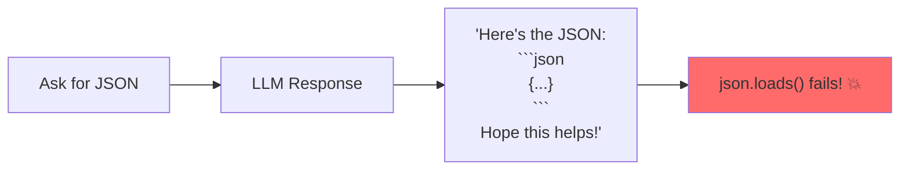
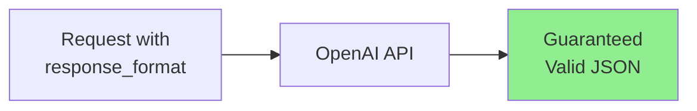
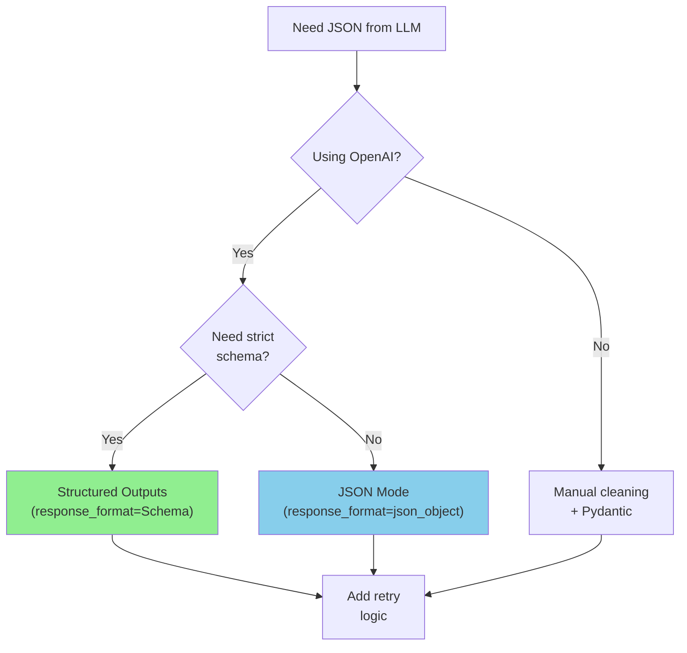
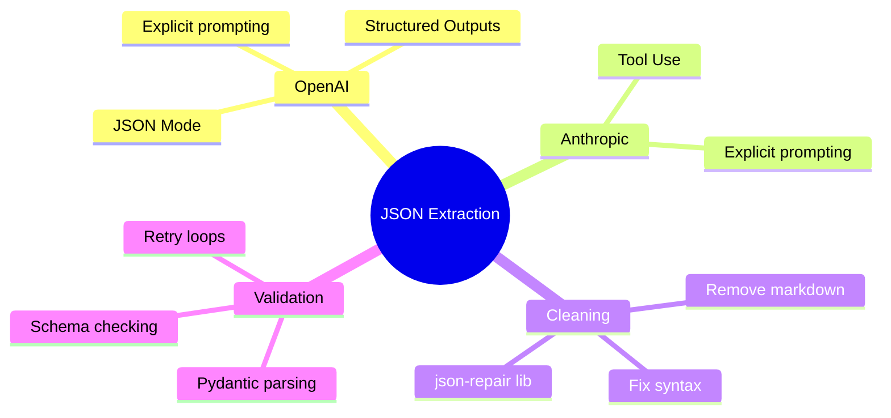

# Forcing LLMs to Return Valid JSON

LLMs are helpful, but they don't always follow instructions perfectly. Sometimes they add extra text, use markdown formatting, or produce malformed JSON. In this guide, you'll learn battle-tested techniques to get reliable JSON output every time.

---

## The Problem: LLMs Add Extra Stuff



Common issues:
- Markdown code blocks (` ```json ... ``` `)
- Explanatory text before/after
- Comments inside JSON
- Trailing commas
- Invalid escape sequences

---

## Technique 1: Explicit Instructions

The simplest approach - be very explicit about what you want:

```python
from openai import OpenAI
import json

client = OpenAI()

def get_json_explicit(prompt: str, schema: dict) -> dict:
    """Get JSON with explicit instructions."""
    system_prompt = """You are a JSON generator.

CRITICAL RULES:
1. Return ONLY valid JSON
2. Do NOT include markdown formatting (no ```)
3. Do NOT include any text before or after the JSON
4. Do NOT include comments in the JSON
5. The response must start with { or [ and end with } or ]

If you cannot fulfill the request, return: {"error": "description"}"""

    user_prompt = f"""Generate JSON matching this schema:
{json.dumps(schema, indent=2)}

Data to extract from: {prompt}

Remember: Return ONLY the JSON object, nothing else."""

    response = client.chat.completions.create(
        model="gpt-3.5-turbo",
        messages=[
            {"role": "system", "content": system_prompt},
            {"role": "user", "content": user_prompt}
        ],
        temperature=0  # Reduce randomness
    )

    return json.loads(response.choices[0].message.content)

# Usage
schema = {
    "name": "string",
    "age": "number",
    "hobbies": ["string"]
}

result = get_json_explicit(
    "John is 25 years old and enjoys reading and hiking",
    schema
)
print(result)
```

---

## Technique 2: OpenAI JSON Mode

OpenAI offers a built-in JSON mode that guarantees valid JSON output:

```python
from openai import OpenAI
import json

client = OpenAI()

def get_json_mode(prompt: str) -> dict:
    """Use OpenAI's JSON mode for guaranteed valid JSON."""
    response = client.chat.completions.create(
        model="gpt-3.5-turbo",
        messages=[
            {
                "role": "system",
                "content": "You extract data and return it as JSON."
            },
            {
                "role": "user",
                "content": f"Extract information from: {prompt}\n\nReturn as JSON with fields: name, age, location"
            }
        ],
        response_format={"type": "json_object"}  # Magic!
    )

    return json.loads(response.choices[0].message.content)

# Usage
result = get_json_mode("Sarah, 30, lives in New York")
print(result)  # {"name": "Sarah", "age": 30, "location": "New York"}
```



### Important Notes about JSON Mode

1. **Must mention JSON in prompt**: The system or user message must contain the word "JSON"
2. **No schema enforcement**: It guarantees valid JSON syntax, but not structure
3. **Available models**: GPT-4 Turbo, GPT-3.5 Turbo (1106 and later)

---

## Technique 3: Structured Outputs (OpenAI)

For strict schema enforcement, use OpenAI's Structured Outputs:

```python
from openai import OpenAI
from pydantic import BaseModel
from typing import List

client = OpenAI()

# Define your schema with Pydantic
class MovieExtraction(BaseModel):
    title: str
    year: int
    genre: List[str]
    rating: float

def extract_with_structure(text: str) -> MovieExtraction:
    """Use structured outputs for guaranteed schema compliance."""
    response = client.beta.chat.completions.parse(
        model="gpt-4o-mini",
        messages=[
            {
                "role": "system",
                "content": "Extract movie information from text."
            },
            {
                "role": "user",
                "content": text
            }
        ],
        response_format=MovieExtraction
    )

    return response.choices[0].message.parsed

# Usage
result = extract_with_structure(
    "Inception (2010) is a sci-fi thriller directed by Nolan. Critics gave it 8.8/10."
)

print(f"Title: {result.title}")
print(f"Year: {result.year}")
print(f"Genres: {result.genre}")
print(f"Rating: {result.rating}")
```

---

## Technique 4: JSON Cleaning/Repair

When LLMs don't cooperate, clean the output:

```python
import json
import re
from typing import Optional

def clean_json_response(response: str) -> str:
    """Clean common LLM JSON issues."""

    # Remove markdown code blocks
    if "```" in response:
        # Extract content between code blocks
        pattern = r"```(?:json)?\s*([\s\S]*?)\s*```"
        matches = re.findall(pattern, response)
        if matches:
            response = matches[0]

    # Remove leading/trailing whitespace
    response = response.strip()

    # Remove common prefixes
    prefixes_to_remove = [
        "Here's the JSON:",
        "Here is the JSON:",
        "JSON output:",
        "Result:",
    ]
    for prefix in prefixes_to_remove:
        if response.lower().startswith(prefix.lower()):
            response = response[len(prefix):].strip()

    # Find the JSON object/array
    # Look for first { or [ and last } or ]
    start_obj = response.find('{')
    start_arr = response.find('[')
    end_obj = response.rfind('}')
    end_arr = response.rfind(']')

    if start_obj != -1 and end_obj != -1:
        if start_arr == -1 or start_obj < start_arr:
            response = response[start_obj:end_obj + 1]
        elif start_arr < start_obj:
            response = response[start_arr:end_arr + 1]
    elif start_arr != -1 and end_arr != -1:
        response = response[start_arr:end_arr + 1]

    return response

def repair_json(json_str: str) -> str:
    """Attempt to repair common JSON syntax errors."""

    # Remove trailing commas before } or ]
    json_str = re.sub(r',\s*([}\]])', r'\1', json_str)

    # Replace single quotes with double quotes (risky but sometimes needed)
    # Only do this if there are no double quotes
    if '"' not in json_str and "'" in json_str:
        json_str = json_str.replace("'", '"')

    # Fix unquoted keys (simple cases)
    json_str = re.sub(r'(\{|,)\s*(\w+)\s*:', r'\1"\2":', json_str)

    return json_str

def safe_parse_json(response: str) -> Optional[dict]:
    """Safely parse JSON with cleaning and repair."""
    try:
        # Try direct parse first
        return json.loads(response)
    except json.JSONDecodeError:
        pass

    # Clean the response
    cleaned = clean_json_response(response)

    try:
        return json.loads(cleaned)
    except json.JSONDecodeError:
        pass

    # Try repairing
    repaired = repair_json(cleaned)

    try:
        return json.loads(repaired)
    except json.JSONDecodeError as e:
        print(f"Failed to parse JSON: {e}")
        print(f"Cleaned: {cleaned}")
        print(f"Repaired: {repaired}")
        return None

# Test it
messy_responses = [
    'Here is the JSON: {"name": "John", "age": 30}',
    '```json\n{"name": "Jane"}\n```',
    "{'name': 'Bob', 'age': 25,}",  # Single quotes and trailing comma
    '{"items": [1, 2, 3,]}',  # Trailing comma
]

for response in messy_responses:
    print(f"Input: {response[:50]}...")
    result = safe_parse_json(response)
    print(f"Parsed: {result}\n")
```

---

## Technique 5: Using json-repair Library

For more robust repair, use the `json-repair` library:

```python
# pip install json-repair

from json_repair import repair_json
import json

def robust_json_parse(text: str) -> dict:
    """Parse JSON with automatic repair."""
    # First try clean parse
    try:
        return json.loads(text)
    except json.JSONDecodeError:
        # Use json-repair
        repaired = repair_json(text)
        return json.loads(repaired)

# Examples
broken_json_samples = [
    '{name: "John", age: 30}',  # Unquoted keys
    '{"items": [1, 2, 3,],}',  # Trailing commas
    "{'nested': {'key': 'value'}}",  # Single quotes
    '{"text": "He said "hello""}',  # Unescaped quotes
]

for sample in broken_json_samples:
    try:
        result = robust_json_parse(sample)
        print(f"✅ Parsed: {result}")
    except Exception as e:
        print(f"❌ Failed: {e}")
```

---

## Technique 6: Two-Step Extraction

Ask the LLM to extract, then ask again to format:

```python
from openai import OpenAI
import json

client = OpenAI()

def two_step_extraction(text: str, schema: dict) -> dict:
    """Extract data in two steps for more reliability."""

    # Step 1: Extract information (free-form)
    extraction_response = client.chat.completions.create(
        model="gpt-3.5-turbo",
        messages=[
            {
                "role": "user",
                "content": f"List all the key information from this text:\n\n{text}"
            }
        ]
    )

    extracted_info = extraction_response.choices[0].message.content

    # Step 2: Format as JSON
    format_response = client.chat.completions.create(
        model="gpt-3.5-turbo",
        messages=[
            {
                "role": "system",
                "content": "Convert information to JSON. Return ONLY valid JSON."
            },
            {
                "role": "user",
                "content": f"""Information:
{extracted_info}

Format as JSON with this structure:
{json.dumps(schema, indent=2)}

Return only the JSON object."""
            }
        ],
        response_format={"type": "json_object"}
    )

    return json.loads(format_response.choices[0].message.content)

# Usage
schema = {
    "products": [{"name": "string", "price": "number"}],
    "total": "number"
}

receipt = """
ACME Store Receipt
------------------
Apples x3 @ $1.50 = $4.50
Bread = $2.99
Milk 2L = $3.25
------------------
Total: $10.74
"""

result = two_step_extraction(receipt, schema)
print(json.dumps(result, indent=2))
```

---

## Technique 7: Anthropic's Tool Use

Claude supports structured extraction via tool definitions:

```python
from anthropic import Anthropic
import json

client = Anthropic()

def extract_with_claude_tools(text: str) -> dict:
    """Use Claude's tool use for structured extraction."""

    tools = [
        {
            "name": "record_extraction",
            "description": "Record the extracted information",
            "input_schema": {
                "type": "object",
                "properties": {
                    "name": {
                        "type": "string",
                        "description": "Person's full name"
                    },
                    "email": {
                        "type": "string",
                        "description": "Email address"
                    },
                    "phone": {
                        "type": "string",
                        "description": "Phone number"
                    }
                },
                "required": ["name"]
            }
        }
    ]

    response = client.messages.create(
        model="claude-sonnet-4-20250514",
        max_tokens=1024,
        tools=tools,
        tool_choice={"type": "tool", "name": "record_extraction"},
        messages=[
            {
                "role": "user",
                "content": f"Extract contact info from: {text}"
            }
        ]
    )

    # Get the tool use response
    for block in response.content:
        if block.type == "tool_use":
            return block.input

    return {}

# Usage
result = extract_with_claude_tools(
    "Contact John Smith at john@email.com or call 555-1234"
)
print(result)
# {"name": "John Smith", "email": "john@email.com", "phone": "555-1234"}
```

---

## Complete Robust JSON Extractor

Here's a production-ready implementation combining multiple techniques:

```python
from openai import OpenAI
from pydantic import BaseModel, ValidationError
from typing import TypeVar, Type, Optional
import json
import re

client = OpenAI()
T = TypeVar('T', bound=BaseModel)

class JSONExtractor:
    """Robust JSON extraction from LLM responses."""

    def __init__(self, model: str = "gpt-3.5-turbo"):
        self.model = model

    def extract(
        self,
        text: str,
        schema: Type[T],
        max_retries: int = 3
    ) -> Optional[T]:
        """Extract structured data matching a Pydantic schema."""

        json_schema = schema.model_json_schema()

        for attempt in range(max_retries):
            try:
                # Make API call
                response = self._call_api(text, json_schema)

                # Clean the response
                cleaned = self._clean_response(response)

                # Parse JSON
                data = json.loads(cleaned)

                # Validate with Pydantic
                return schema(**data)

            except json.JSONDecodeError as e:
                print(f"Attempt {attempt + 1}: JSON parse error - {e}")
            except ValidationError as e:
                print(f"Attempt {attempt + 1}: Validation error - {e}")
            except Exception as e:
                print(f"Attempt {attempt + 1}: Unexpected error - {e}")

        return None

    def _call_api(self, text: str, schema: dict) -> str:
        """Make the API call."""
        response = client.chat.completions.create(
            model=self.model,
            messages=[
                {
                    "role": "system",
                    "content": "Extract information and return as JSON only. No markdown, no explanations."
                },
                {
                    "role": "user",
                    "content": f"Schema: {json.dumps(schema)}\n\nText: {text}\n\nJSON:"
                }
            ],
            temperature=0,
            response_format={"type": "json_object"}
        )
        return response.choices[0].message.content

    def _clean_response(self, response: str) -> str:
        """Clean the response string."""
        # Remove markdown
        response = re.sub(r'```(?:json)?\s*', '', response)
        response = re.sub(r'\s*```', '', response)

        # Trim whitespace
        response = response.strip()

        # Find JSON boundaries
        start = min(
            (response.find('{'), response.find('[')),
            key=lambda x: x if x >= 0 else float('inf')
        )
        end = max(response.rfind('}'), response.rfind(']'))

        if start < float('inf') and end >= 0:
            response = response[start:end + 1]

        return response

# Usage
class Person(BaseModel):
    name: str
    age: int
    occupation: str

extractor = JSONExtractor()
result = extractor.extract(
    "Meet Sarah, a 28-year-old software engineer from Boston.",
    Person
)

if result:
    print(f"Extracted: {result}")
else:
    print("Extraction failed")
```

---

## Decision Tree: Choosing Your Approach



---

## Summary



---

## Quick Reference

```python
# OpenAI JSON Mode
response = client.chat.completions.create(
    model="gpt-3.5-turbo",
    messages=[...],
    response_format={"type": "json_object"}
)

# OpenAI Structured Outputs
response = client.beta.chat.completions.parse(
    model="gpt-4o-mini",
    messages=[...],
    response_format=MyPydanticModel
)

# Manual cleaning
import re
cleaned = re.sub(r'```(?:json)?\s*', '', response)
```

---

## Exercises

1. **Robust Extractor**: Build a function that tries multiple extraction methods in sequence until one succeeds

2. **Error Reporter**: Create a system that logs failed extractions for analysis and prompt improvement

3. **Schema Validator**: Build a tool that validates LLM output against arbitrary JSON schemas

---

## What's Next?

Now let's learn about **Building Retry Loops** - handling the inevitable cases when LLMs still produce invalid output!
