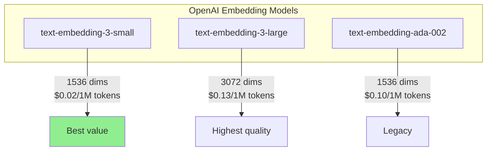
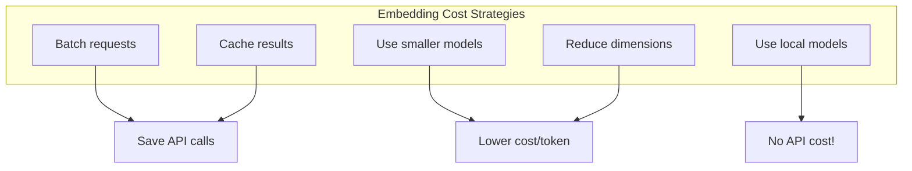
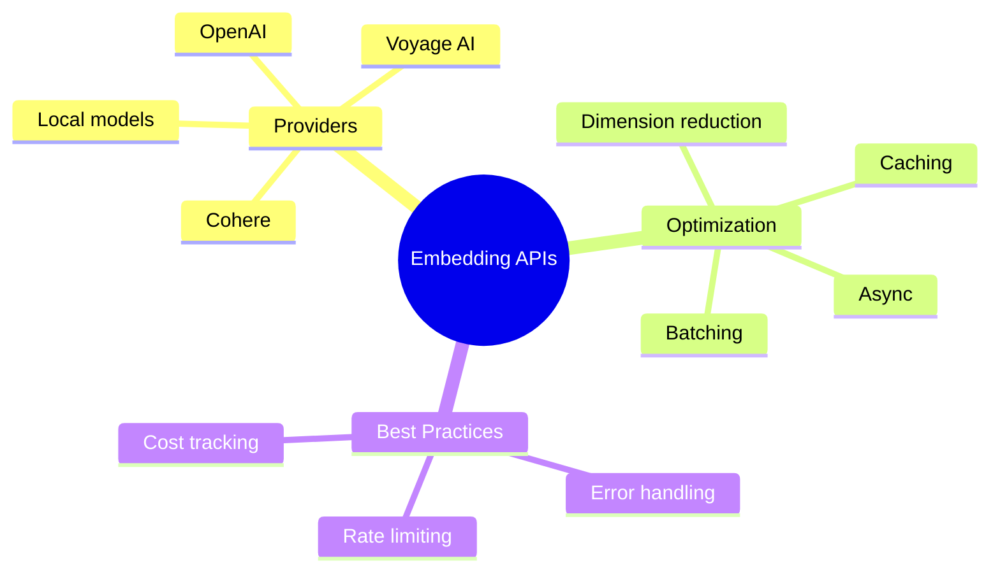

# Generating Embeddings via API

Now that you understand what embeddings are and how to compare them, let's dive deep into the practical side: **generating embeddings efficiently at scale** using various APIs.

---

## OpenAI Embeddings API

### Basic Usage

```python
from openai import OpenAI

client = OpenAI()

def get_embedding(text: str, model: str = "text-embedding-3-small") -> list[float]:
    """Get embedding for a single text."""
    response = client.embeddings.create(
        model=model,
        input=text
    )
    return response.data[0].embedding

# Simple usage
embedding = get_embedding("Hello, world!")
print(f"Dimensions: {len(embedding)}")
print(f"First 5 values: {embedding[:5]}")
```

### Available Models



### Batch Processing

Always batch your requests for efficiency:

```python
from openai import OpenAI
from typing import List

client = OpenAI()

def get_embeddings_batch(
    texts: List[str],
    model: str = "text-embedding-3-small",
    batch_size: int = 100
) -> List[List[float]]:
    """
    Get embeddings for multiple texts efficiently.
    Handles batching automatically.
    """
    all_embeddings = []

    for i in range(0, len(texts), batch_size):
        batch = texts[i:i + batch_size]

        response = client.embeddings.create(
            model=model,
            input=batch
        )

        # Sort by index to maintain order
        sorted_data = sorted(response.data, key=lambda x: x.index)
        batch_embeddings = [item.embedding for item in sorted_data]
        all_embeddings.extend(batch_embeddings)

        print(f"Processed {min(i + batch_size, len(texts))}/{len(texts)}")

    return all_embeddings

# Usage
documents = [f"Document number {i}" for i in range(250)]
embeddings = get_embeddings_batch(documents)
print(f"Generated {len(embeddings)} embeddings")
```

### Dimension Reduction

The new embedding models support dimension reduction:

```python
from openai import OpenAI

client = OpenAI()

def get_embedding_with_dimensions(
    text: str,
    dimensions: int = 512
) -> list[float]:
    """
    Get embedding with reduced dimensions.
    Useful for saving storage and speeding up similarity search.
    """
    response = client.embeddings.create(
        model="text-embedding-3-small",
        input=text,
        dimensions=dimensions  # Reduce from 1536 to desired size
    )
    return response.data[0].embedding

# Compare different dimension sizes
text = "Machine learning is transforming industries"

for dims in [256, 512, 1024, 1536]:
    emb = get_embedding_with_dimensions(text, dims)
    print(f"{dims} dimensions: {len(emb)} values")
```

---

## Async Embedding Generation

For high throughput applications:

```python
import asyncio
from openai import AsyncOpenAI
from typing import List

client = AsyncOpenAI()

async def get_embedding_async(text: str) -> list[float]:
    """Get single embedding asynchronously."""
    response = await client.embeddings.create(
        model="text-embedding-3-small",
        input=text
    )
    return response.data[0].embedding

async def get_embeddings_parallel(
    texts: List[str],
    max_concurrent: int = 10
) -> List[List[float]]:
    """Get embeddings with controlled concurrency."""
    semaphore = asyncio.Semaphore(max_concurrent)

    async def limited_embed(text: str, index: int):
        async with semaphore:
            response = await client.embeddings.create(
                model="text-embedding-3-small",
                input=text
            )
            return index, response.data[0].embedding

    tasks = [limited_embed(text, i) for i, text in enumerate(texts)]
    results = await asyncio.gather(*tasks)

    # Sort by index to maintain order
    sorted_results = sorted(results, key=lambda x: x[0])
    return [emb for _, emb in sorted_results]

# Usage
async def main():
    texts = [f"Sample text number {i}" for i in range(50)]
    embeddings = await get_embeddings_parallel(texts)
    print(f"Generated {len(embeddings)} embeddings")

asyncio.run(main())
```

---

## Alternative Embedding Providers

### Cohere

```python
import cohere

co = cohere.Client("YOUR_COHERE_API_KEY")

def get_cohere_embeddings(texts: list[str]) -> list[list[float]]:
    """Get embeddings from Cohere."""
    response = co.embed(
        texts=texts,
        model="embed-english-v3.0",
        input_type="search_document"  # or "search_query" for queries
    )
    return response.embeddings

# Usage
texts = ["Hello world", "Machine learning"]
embeddings = get_cohere_embeddings(texts)
print(f"Cohere embedding dimensions: {len(embeddings[0])}")  # 1024
```

### Voyage AI

```python
import voyageai

vo = voyageai.Client()

def get_voyage_embeddings(texts: list[str]) -> list[list[float]]:
    """Get embeddings from Voyage AI."""
    result = vo.embed(
        texts,
        model="voyage-2",
        input_type="document"
    )
    return result.embeddings

# Usage
embeddings = get_voyage_embeddings(["Sample text"])
```

### Hugging Face (Local)

```python
from sentence_transformers import SentenceTransformer

# Download model once, run locally
model = SentenceTransformer('all-MiniLM-L6-v2')

def get_local_embeddings(texts: list[str]) -> list[list[float]]:
    """Get embeddings using local model."""
    embeddings = model.encode(texts)
    return embeddings.tolist()

# Usage - no API calls needed!
embeddings = get_local_embeddings(["Hello world", "Local embeddings"])
print(f"Local embedding dimensions: {len(embeddings[0])}")  # 384
```

---

## Unified Embedding Interface

```python
from abc import ABC, abstractmethod
from typing import List
from enum import Enum

class EmbeddingProvider(Enum):
    OPENAI = "openai"
    COHERE = "cohere"
    LOCAL = "local"

class EmbeddingClient(ABC):
    @abstractmethod
    def embed(self, texts: List[str]) -> List[List[float]]:
        pass

class OpenAIEmbeddings(EmbeddingClient):
    def __init__(self, model: str = "text-embedding-3-small"):
        from openai import OpenAI
        self.client = OpenAI()
        self.model = model

    def embed(self, texts: List[str]) -> List[List[float]]:
        response = self.client.embeddings.create(
            model=self.model,
            input=texts
        )
        return [d.embedding for d in sorted(response.data, key=lambda x: x.index)]

class LocalEmbeddings(EmbeddingClient):
    def __init__(self, model_name: str = "all-MiniLM-L6-v2"):
        from sentence_transformers import SentenceTransformer
        self.model = SentenceTransformer(model_name)

    def embed(self, texts: List[str]) -> List[List[float]]:
        return self.model.encode(texts).tolist()

def get_embedding_client(provider: EmbeddingProvider) -> EmbeddingClient:
    """Factory function for embedding clients."""
    if provider == EmbeddingProvider.OPENAI:
        return OpenAIEmbeddings()
    elif provider == EmbeddingProvider.LOCAL:
        return LocalEmbeddings()
    else:
        raise ValueError(f"Unknown provider: {provider}")

# Usage
client = get_embedding_client(EmbeddingProvider.OPENAI)
embeddings = client.embed(["Hello", "World"])
```

---

## Cost Optimization



### Caching Embeddings

```python
import hashlib
import json
from pathlib import Path
from openai import OpenAI

client = OpenAI()

class EmbeddingCache:
    """Cache embeddings to avoid redundant API calls."""

    def __init__(self, cache_dir: str = ".embedding_cache"):
        self.cache_dir = Path(cache_dir)
        self.cache_dir.mkdir(exist_ok=True)

    def _hash_text(self, text: str, model: str) -> str:
        """Create unique hash for text+model combination."""
        content = f"{model}:{text}"
        return hashlib.sha256(content.encode()).hexdigest()[:16]

    def get(self, text: str, model: str) -> list[float] | None:
        """Get cached embedding if exists."""
        cache_file = self.cache_dir / f"{self._hash_text(text, model)}.json"
        if cache_file.exists():
            with open(cache_file) as f:
                return json.load(f)
        return None

    def set(self, text: str, model: str, embedding: list[float]):
        """Cache an embedding."""
        cache_file = self.cache_dir / f"{self._hash_text(text, model)}.json"
        with open(cache_file, 'w') as f:
            json.dump(embedding, f)

cache = EmbeddingCache()

def get_embedding_cached(text: str, model: str = "text-embedding-3-small") -> list[float]:
    """Get embedding with caching."""
    # Check cache first
    cached = cache.get(text, model)
    if cached:
        print("Cache hit!")
        return cached

    # Generate new embedding
    print("Cache miss, calling API...")
    response = client.embeddings.create(model=model, input=text)
    embedding = response.data[0].embedding

    # Cache for future use
    cache.set(text, model, embedding)
    return embedding

# First call - API
emb1 = get_embedding_cached("Hello world")  # Cache miss

# Second call - cached
emb2 = get_embedding_cached("Hello world")  # Cache hit!
```

### Cost Calculator

```python
def calculate_embedding_cost(
    texts: list[str],
    model: str = "text-embedding-3-small"
) -> dict:
    """Estimate embedding cost before making API calls."""
    import tiktoken

    # Pricing per 1M tokens (as of 2024)
    pricing = {
        "text-embedding-3-small": 0.02,
        "text-embedding-3-large": 0.13,
        "text-embedding-ada-002": 0.10
    }

    # Count tokens
    try:
        encoder = tiktoken.encoding_for_model("text-embedding-3-small")
    except:
        encoder = tiktoken.get_encoding("cl100k_base")

    total_tokens = sum(len(encoder.encode(text)) for text in texts)

    cost = (total_tokens / 1_000_000) * pricing.get(model, 0.02)

    return {
        "total_texts": len(texts),
        "total_tokens": total_tokens,
        "model": model,
        "estimated_cost": f"${cost:.6f}",
        "cost_per_text": f"${cost/len(texts):.8f}"
    }

# Usage
texts = ["Sample text"] * 1000
cost_info = calculate_embedding_cost(texts)
print(cost_info)
```

---

## Error Handling

```python
from openai import OpenAI, RateLimitError, APIError
import time

client = OpenAI()

def get_embedding_robust(
    text: str,
    max_retries: int = 3,
    model: str = "text-embedding-3-small"
) -> list[float] | None:
    """Get embedding with robust error handling."""

    for attempt in range(max_retries):
        try:
            response = client.embeddings.create(
                model=model,
                input=text
            )
            return response.data[0].embedding

        except RateLimitError:
            wait_time = 2 ** attempt
            print(f"Rate limited, waiting {wait_time}s...")
            time.sleep(wait_time)

        except APIError as e:
            if e.status_code >= 500:
                print(f"Server error, retrying...")
                time.sleep(1)
            else:
                print(f"API error: {e}")
                return None

        except Exception as e:
            print(f"Unexpected error: {e}")
            return None

    print("Max retries exceeded")
    return None

# Usage
embedding = get_embedding_robust("Test text")
if embedding:
    print(f"Success! Got {len(embedding)} dimensions")
```

---

## Summary



---

## Quick Reference

```python
# OpenAI (recommended for most use cases)
from openai import OpenAI
client = OpenAI()
response = client.embeddings.create(
    model="text-embedding-3-small",
    input=["text1", "text2"],  # Batch!
    dimensions=512  # Optional: reduce dimensions
)
embeddings = [d.embedding for d in response.data]

# Local (free, no API needed)
from sentence_transformers import SentenceTransformer
model = SentenceTransformer('all-MiniLM-L6-v2')
embeddings = model.encode(["text1", "text2"]).tolist()
```

---

## Exercises

1. **Provider Comparison**: Compare embedding quality from OpenAI, Cohere, and local models on the same text set

2. **Cost Optimizer**: Build a system that automatically chooses between cached, local, and API embeddings based on cost/quality tradeoffs

3. **Async Benchmarker**: Measure speedup from async vs sequential embedding generation for 100, 500, and 1000 texts

---

## What's Next?

Now that you can generate embeddings efficiently, let's learn how to **store and search them at scale** with Vector Databases!
