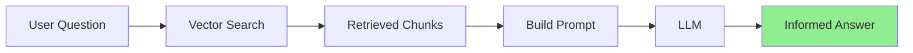
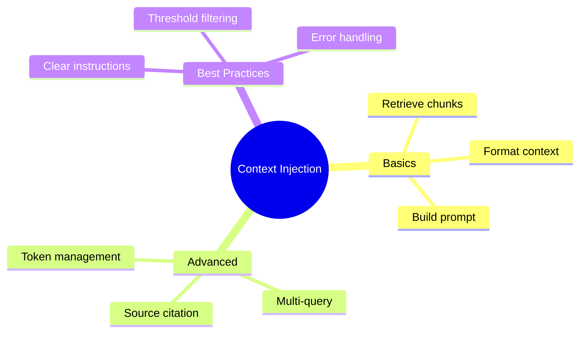

# Injecting Retrieved Context into Prompts

You've parsed documents, chunked them, and stored them in a vector database. Now comes the magic moment: **combining retrieved context with LLM prompts** to create a RAG system that actually works!

---

## The RAG Flow



---

## Basic Context Injection

The simplest approach - stuff context into the prompt:

```python
from openai import OpenAI
import chromadb

openai_client = OpenAI()
chroma_client = chromadb.PersistentClient(path="./vectordb")
collection = chroma_client.get_collection("documents")

def simple_rag(question: str, n_results: int = 3) -> str:
    """Basic RAG implementation."""

    # 1. Get question embedding
    emb_response = openai_client.embeddings.create(
        model="text-embedding-3-small",
        input=question
    )
    query_embedding = emb_response.data[0].embedding

    # 2. Retrieve relevant chunks
    results = collection.query(
        query_embeddings=[query_embedding],
        n_results=n_results,
        include=["documents"]
    )

    context = "\n\n".join(results["documents"][0])

    # 3. Build prompt with context
    prompt = f"""Answer the question based on the following context.
If the context doesn't contain relevant information, say "I don't have enough information to answer that."

Context:
{context}

Question: {question}

Answer:"""

    # 4. Get LLM response
    response = openai_client.chat.completions.create(
        model="gpt-3.5-turbo",
        messages=[{"role": "user", "content": prompt}],
        temperature=0
    )

    return response.choices[0].message.content

# Usage
answer = simple_rag("What are the key features of Python?")
print(answer)
```

---

## Structured Prompt Templates

Use clear sections for better results:

```python
RAG_PROMPT_TEMPLATE = """You are a helpful assistant that answers questions based on provided context.

## Instructions
- Only use information from the provided context
- If the context doesn't contain the answer, clearly state that
- Cite specific parts of the context when possible
- Be concise but complete

## Context
{context}

## Question
{question}

## Answer"""

def format_context(chunks: list[dict]) -> str:
    """Format retrieved chunks with source info."""
    formatted_parts = []

    for i, chunk in enumerate(chunks, 1):
        source = chunk.get("metadata", {}).get("source", "Unknown")
        text = chunk.get("document", chunk.get("text", ""))
        formatted_parts.append(f"[Source {i}: {source}]\n{text}")

    return "\n\n---\n\n".join(formatted_parts)

def structured_rag(question: str, n_results: int = 5) -> dict:
    """RAG with structured prompt and metadata."""

    # Get embeddings and search
    emb_response = openai_client.embeddings.create(
        model="text-embedding-3-small",
        input=question
    )

    results = collection.query(
        query_embeddings=[emb_response.data[0].embedding],
        n_results=n_results,
        include=["documents", "metadatas", "distances"]
    )

    # Format chunks with metadata
    chunks = [
        {
            "document": results["documents"][0][i],
            "metadata": results["metadatas"][0][i],
            "similarity": 1 - results["distances"][0][i]
        }
        for i in range(len(results["ids"][0]))
    ]

    context = format_context(chunks)
    prompt = RAG_PROMPT_TEMPLATE.format(context=context, question=question)

    response = openai_client.chat.completions.create(
        model="gpt-3.5-turbo",
        messages=[{"role": "user", "content": prompt}],
        temperature=0
    )

    return {
        "answer": response.choices[0].message.content,
        "sources": [c["metadata"].get("source") for c in chunks],
        "top_similarity": chunks[0]["similarity"] if chunks else 0
    }
```

---

## Context Window Management

Don't overflow the context window!

```python
import tiktoken

def count_tokens(text: str, model: str = "gpt-3.5-turbo") -> int:
    """Count tokens in text."""
    encoder = tiktoken.encoding_for_model(model)
    return len(encoder.encode(text))

def fit_context_to_window(
    chunks: list[str],
    question: str,
    max_context_tokens: int = 3000,
    model: str = "gpt-3.5-turbo"
) -> str:
    """Select chunks that fit within token budget."""

    # Reserve tokens for question and response
    question_tokens = count_tokens(question, model)
    overhead_tokens = 500  # For prompt template and response buffer

    available_tokens = max_context_tokens - question_tokens - overhead_tokens

    selected_chunks = []
    current_tokens = 0

    for chunk in chunks:
        chunk_tokens = count_tokens(chunk, model)

        if current_tokens + chunk_tokens <= available_tokens:
            selected_chunks.append(chunk)
            current_tokens += chunk_tokens
        else:
            break  # Stop when budget exceeded

    return "\n\n".join(selected_chunks)

def token_aware_rag(question: str, max_tokens: int = 3000) -> str:
    """RAG with token budget management."""

    # Retrieve more chunks than needed
    emb_response = openai_client.embeddings.create(
        model="text-embedding-3-small",
        input=question
    )

    results = collection.query(
        query_embeddings=[emb_response.data[0].embedding],
        n_results=10,  # Get extra for selection
        include=["documents"]
    )

    chunks = results["documents"][0]

    # Fit to token budget
    context = fit_context_to_window(chunks, question, max_tokens)

    prompt = f"""Based on the context below, answer the question.

Context:
{context}

Question: {question}"""

    response = openai_client.chat.completions.create(
        model="gpt-3.5-turbo",
        messages=[{"role": "user", "content": prompt}],
        temperature=0
    )

    return response.choices[0].message.content
```

---

## Advanced: Multi-Query RAG

Generate multiple queries for better retrieval:

```python
def generate_query_variations(question: str, n_variations: int = 3) -> list[str]:
    """Generate variations of the question for better retrieval."""

    prompt = f"""Generate {n_variations} different ways to ask this question.
Return only the questions, one per line.

Original question: {question}"""

    response = openai_client.chat.completions.create(
        model="gpt-3.5-turbo",
        messages=[{"role": "user", "content": prompt}],
        temperature=0.7
    )

    variations = response.choices[0].message.content.strip().split("\n")
    return [question] + [v.strip() for v in variations if v.strip()]

def multi_query_rag(question: str, n_results: int = 3) -> str:
    """RAG with multiple query variations."""

    # Generate query variations
    queries = generate_query_variations(question)
    print(f"Searching with {len(queries)} query variations")

    # Collect unique chunks from all queries
    all_chunks = {}

    for query in queries:
        emb_response = openai_client.embeddings.create(
            model="text-embedding-3-small",
            input=query
        )

        results = collection.query(
            query_embeddings=[emb_response.data[0].embedding],
            n_results=n_results,
            include=["documents", "distances"]
        )

        for i, doc_id in enumerate(results["ids"][0]):
            similarity = 1 - results["distances"][0][i]
            if doc_id not in all_chunks or all_chunks[doc_id]["similarity"] < similarity:
                all_chunks[doc_id] = {
                    "text": results["documents"][0][i],
                    "similarity": similarity
                }

    # Sort by similarity and take top results
    sorted_chunks = sorted(all_chunks.values(), key=lambda x: x["similarity"], reverse=True)
    context = "\n\n".join(c["text"] for c in sorted_chunks[:n_results * 2])

    # Generate answer
    prompt = f"""Answer based on this context:

{context}

Question: {question}"""

    response = openai_client.chat.completions.create(
        model="gpt-3.5-turbo",
        messages=[{"role": "user", "content": prompt}],
        temperature=0
    )

    return response.choices[0].message.content
```

---

## Complete RAG System

```python
from dataclasses import dataclass
from typing import Optional
import chromadb
from openai import OpenAI

@dataclass
class RAGResponse:
    answer: str
    sources: list[dict]
    confidence: float
    tokens_used: int

class RAGSystem:
    """Production-ready RAG system."""

    def __init__(self, collection_name: str, persist_dir: str = "./vectordb"):
        self.openai = OpenAI()
        self.chroma = chromadb.PersistentClient(path=persist_dir)
        self.collection = self.chroma.get_or_create_collection(collection_name)

        self.system_prompt = """You are a helpful assistant that answers questions based on provided context.

Guidelines:
- Only use information from the context provided
- If you can't answer from the context, say so clearly
- Be concise but thorough
- Cite sources when possible using [Source N] notation"""

    def query(
        self,
        question: str,
        n_results: int = 5,
        similarity_threshold: float = 0.5
    ) -> RAGResponse:
        """Process a question through the RAG pipeline."""

        # Embed question
        emb = self.openai.embeddings.create(
            model="text-embedding-3-small",
            input=question
        )

        # Retrieve
        results = self.collection.query(
            query_embeddings=[emb.data[0].embedding],
            n_results=n_results,
            include=["documents", "metadatas", "distances"]
        )

        # Filter by threshold
        sources = []
        context_parts = []

        for i in range(len(results["ids"][0])):
            similarity = 1 - results["distances"][0][i]
            if similarity >= similarity_threshold:
                sources.append({
                    "id": results["ids"][0][i],
                    "text": results["documents"][0][i][:200] + "...",
                    "metadata": results["metadatas"][0][i],
                    "similarity": similarity
                })
                context_parts.append(
                    f"[Source {len(sources)}]\n{results['documents'][0][i]}"
                )

        if not sources:
            return RAGResponse(
                answer="I couldn't find relevant information to answer your question.",
                sources=[],
                confidence=0.0,
                tokens_used=0
            )

        context = "\n\n---\n\n".join(context_parts)

        # Generate response
        response = self.openai.chat.completions.create(
            model="gpt-3.5-turbo",
            messages=[
                {"role": "system", "content": self.system_prompt},
                {"role": "user", "content": f"Context:\n{context}\n\nQuestion: {question}"}
            ],
            temperature=0
        )

        avg_similarity = sum(s["similarity"] for s in sources) / len(sources)

        return RAGResponse(
            answer=response.choices[0].message.content,
            sources=sources,
            confidence=avg_similarity,
            tokens_used=response.usage.total_tokens
        )

# Usage
rag = RAGSystem("knowledge_base")

# Add some documents first
rag.collection.add(
    ids=["1", "2", "3"],
    documents=[
        "Python is a programming language known for its simplicity.",
        "Machine learning uses algorithms to learn from data.",
        "RAG combines retrieval with generation for better answers."
    ],
    metadatas=[{"topic": "python"}, {"topic": "ml"}, {"topic": "rag"}]
)

# Query
result = rag.query("What is Python?")
print(f"Answer: {result.answer}")
print(f"Confidence: {result.confidence:.2%}")
print(f"Sources: {len(result.sources)}")
```

---

## Summary



---

## Quick Reference

```python
# Basic RAG prompt
prompt = f"""Context: {context}

Question: {question}

Answer based only on the context above."""

# With system prompt
messages = [
    {"role": "system", "content": "Answer using only the provided context."},
    {"role": "user", "content": f"Context: {context}\n\nQuestion: {question}"}
]
```

---

## What's Next?

Now you've built a complete RAG system! Next week, we'll learn about **Tool Calling** - giving LLMs the ability to execute functions!
