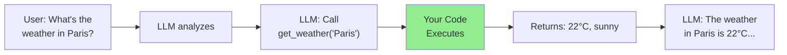
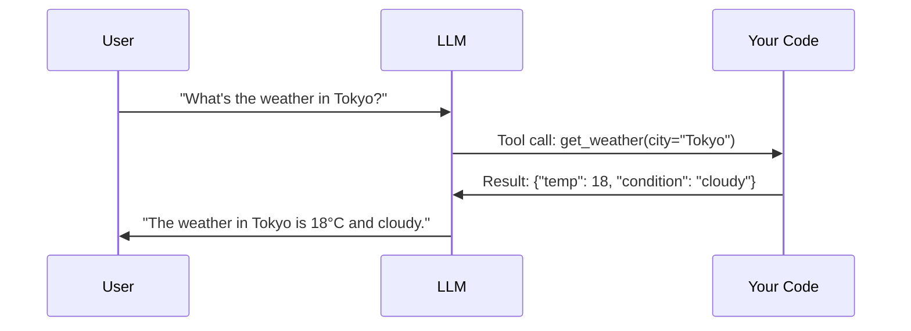
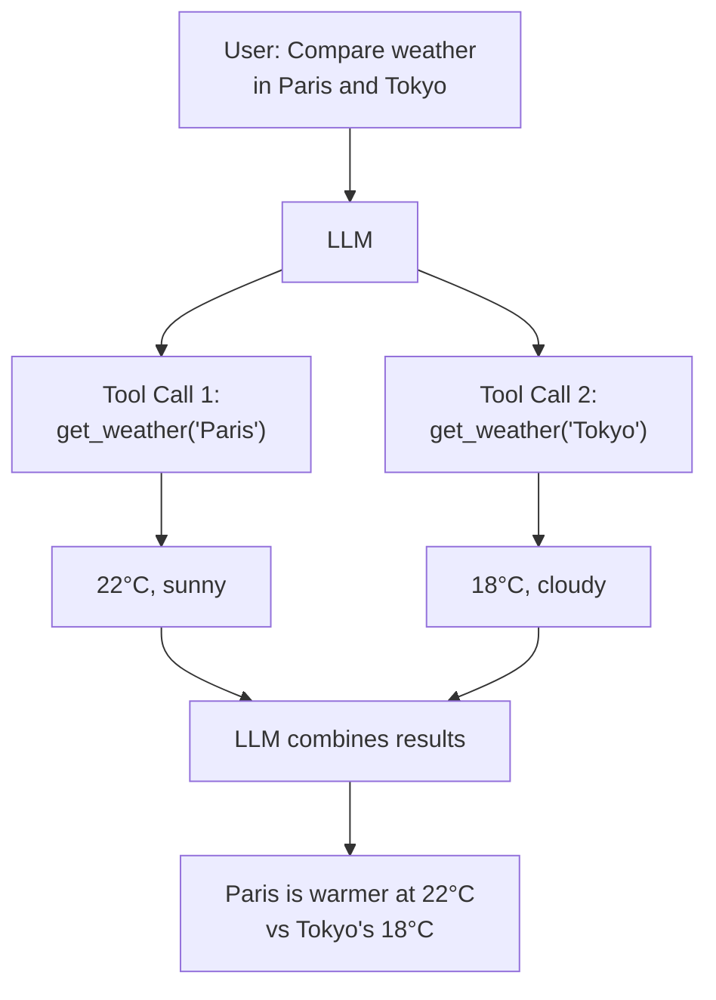
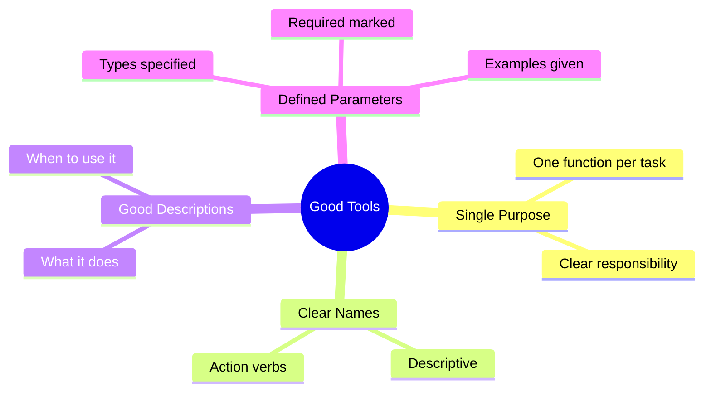
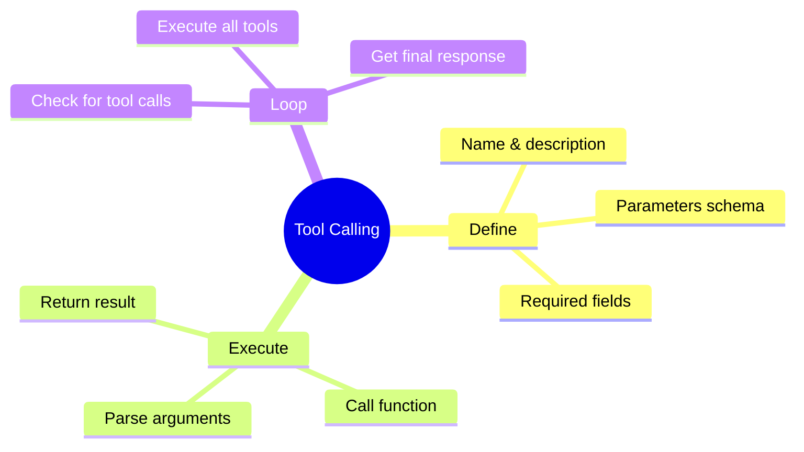

# Native Tool Calling (Function Calling)

Welcome to one of the most powerful LLM capabilities: **Tool Calling** (also known as Function Calling). This allows LLMs to invoke your Python functions, access real-time data, and take actions in the real world!

---

## What is Tool Calling?



Instead of the LLM making up information, it can request to call your functions!

---

## The Tool Calling Flow



---

## Defining Tools for OpenAI

```python
from openai import OpenAI

client = OpenAI()

# Define your tools (functions the LLM can call)
tools = [
    {
        "type": "function",
        "function": {
            "name": "get_weather",
            "description": "Get the current weather for a location",
            "parameters": {
                "type": "object",
                "properties": {
                    "city": {
                        "type": "string",
                        "description": "The city name, e.g., 'London'"
                    },
                    "unit": {
                        "type": "string",
                        "enum": ["celsius", "fahrenheit"],
                        "description": "Temperature unit"
                    }
                },
                "required": ["city"]
            }
        }
    }
]

# Make a request with tools
response = client.chat.completions.create(
    model="gpt-3.5-turbo",
    messages=[{"role": "user", "content": "What's the weather in Tokyo?"}],
    tools=tools,
    tool_choice="auto"  # Let the model decide when to use tools
)

print(response.choices[0].message)
```

---

## Implementing Tool Functions

```python
import json
from openai import OpenAI

client = OpenAI()

# Your actual functions
def get_weather(city: str, unit: str = "celsius") -> dict:
    """Get weather for a city (mock implementation)."""
    # In reality, you'd call a weather API here
    weather_data = {
        "Tokyo": {"temp": 18, "condition": "cloudy"},
        "London": {"temp": 12, "condition": "rainy"},
        "Paris": {"temp": 22, "condition": "sunny"},
    }

    data = weather_data.get(city, {"temp": 20, "condition": "unknown"})

    if unit == "fahrenheit":
        data["temp"] = data["temp"] * 9/5 + 32

    return {"city": city, **data, "unit": unit}

def calculate(expression: str) -> dict:
    """Safely evaluate a mathematical expression."""
    try:
        # Only allow safe operations
        allowed = set("0123456789+-*/().  ")
        if not all(c in allowed for c in expression):
            return {"error": "Invalid characters in expression"}

        result = eval(expression)
        return {"expression": expression, "result": result}
    except Exception as e:
        return {"error": str(e)}

# Map function names to implementations
AVAILABLE_FUNCTIONS = {
    "get_weather": get_weather,
    "calculate": calculate
}

# Tool definitions
tools = [
    {
        "type": "function",
        "function": {
            "name": "get_weather",
            "description": "Get current weather for a city",
            "parameters": {
                "type": "object",
                "properties": {
                    "city": {"type": "string", "description": "City name"},
                    "unit": {"type": "string", "enum": ["celsius", "fahrenheit"]}
                },
                "required": ["city"]
            }
        }
    },
    {
        "type": "function",
        "function": {
            "name": "calculate",
            "description": "Perform mathematical calculations",
            "parameters": {
                "type": "object",
                "properties": {
                    "expression": {"type": "string", "description": "Math expression like '2 + 2'"}
                },
                "required": ["expression"]
            }
        }
    }
]
```

---

## Complete Tool Calling Loop

```python
def chat_with_tools(user_message: str) -> str:
    """Chat with tool calling capability."""
    messages = [{"role": "user", "content": user_message}]

    # First API call - might request tool use
    response = client.chat.completions.create(
        model="gpt-3.5-turbo",
        messages=messages,
        tools=tools,
        tool_choice="auto"
    )

    assistant_message = response.choices[0].message

    # Check if model wants to use tools
    if assistant_message.tool_calls:
        # Add assistant's response to messages
        messages.append(assistant_message)

        # Process each tool call
        for tool_call in assistant_message.tool_calls:
            function_name = tool_call.function.name
            function_args = json.loads(tool_call.function.arguments)

            print(f"Calling {function_name} with {function_args}")

            # Execute the function
            if function_name in AVAILABLE_FUNCTIONS:
                result = AVAILABLE_FUNCTIONS[function_name](**function_args)
            else:
                result = {"error": f"Unknown function: {function_name}"}

            # Add tool result to messages
            messages.append({
                "role": "tool",
                "tool_call_id": tool_call.id,
                "content": json.dumps(result)
            })

        # Second API call with tool results
        final_response = client.chat.completions.create(
            model="gpt-3.5-turbo",
            messages=messages
        )

        return final_response.choices[0].message.content
    else:
        return assistant_message.content

# Test it!
print(chat_with_tools("What's the weather in Paris?"))
print()
print(chat_with_tools("Calculate 15 * 7 + 23"))
print()
print(chat_with_tools("What's 2+2 and what's the weather in London?"))
```

---

## Multiple Tool Calls

LLMs can request multiple tools at once:



```python
def process_parallel_tools(response_message):
    """Process multiple tool calls in parallel."""
    results = []

    for tool_call in response_message.tool_calls:
        function_name = tool_call.function.name
        function_args = json.loads(tool_call.function.arguments)

        if function_name in AVAILABLE_FUNCTIONS:
            result = AVAILABLE_FUNCTIONS[function_name](**function_args)
        else:
            result = {"error": f"Unknown function: {function_name}"}

        results.append({
            "role": "tool",
            "tool_call_id": tool_call.id,
            "content": json.dumps(result)
        })

    return results
```

---

## Tool Calling with Anthropic (Claude)

```python
from anthropic import Anthropic

client = Anthropic()

# Anthropic tool format
tools = [
    {
        "name": "get_weather",
        "description": "Get current weather for a city",
        "input_schema": {
            "type": "object",
            "properties": {
                "city": {"type": "string", "description": "City name"},
                "unit": {"type": "string", "enum": ["celsius", "fahrenheit"]}
            },
            "required": ["city"]
        }
    }
]

def chat_with_claude_tools(user_message: str) -> str:
    """Chat using Claude's tool calling."""
    messages = [{"role": "user", "content": user_message}]

    response = client.messages.create(
        model="claude-sonnet-4-20250514",
        max_tokens=1024,
        tools=tools,
        messages=messages
    )

    # Check for tool use
    for block in response.content:
        if block.type == "tool_use":
            tool_name = block.name
            tool_input = block.input

            # Execute function
            result = AVAILABLE_FUNCTIONS[tool_name](**tool_input)

            # Continue conversation with result
            messages.append({"role": "assistant", "content": response.content})
            messages.append({
                "role": "user",
                "content": [{
                    "type": "tool_result",
                    "tool_use_id": block.id,
                    "content": json.dumps(result)
                }]
            })

            # Get final response
            final = client.messages.create(
                model="claude-sonnet-4-20250514",
                max_tokens=1024,
                messages=messages
            )

            return final.content[0].text

    return response.content[0].text
```

---

## Tool Design Best Practices



### Good Tool Definition

```python
good_tool = {
    "type": "function",
    "function": {
        "name": "search_products",  # Clear, action-oriented name
        "description": "Search for products in the catalog by name, category, or price range. Use this when the user wants to find products to buy.",  # Detailed description
        "parameters": {
            "type": "object",
            "properties": {
                "query": {
                    "type": "string",
                    "description": "Search query, e.g., 'red shoes' or 'laptop'"
                },
                "category": {
                    "type": "string",
                    "enum": ["electronics", "clothing", "home", "sports"],
                    "description": "Product category to filter by"
                },
                "max_price": {
                    "type": "number",
                    "description": "Maximum price in USD"
                },
                "min_price": {
                    "type": "number",
                    "description": "Minimum price in USD"
                }
            },
            "required": ["query"]  # Only truly required params
        }
    }
}
```

### Bad Tool Definition

```python
bad_tool = {
    "type": "function",
    "function": {
        "name": "do_stuff",  # Vague name
        "description": "Does stuff",  # Useless description
        "parameters": {
            "type": "object",
            "properties": {
                "x": {"type": "string"}  # No description
            },
            "required": ["x", "y", "z"]  # Too many required params
        }
    }
}
```

---

## Forcing Tool Use

Sometimes you want to ensure a specific tool is called:

```python
# Force specific tool
response = client.chat.completions.create(
    model="gpt-3.5-turbo",
    messages=messages,
    tools=tools,
    tool_choice={"type": "function", "function": {"name": "get_weather"}}
)

# Force ANY tool (no direct response allowed)
response = client.chat.completions.create(
    model="gpt-3.5-turbo",
    messages=messages,
    tools=tools,
    tool_choice="required"
)

# Let model decide (default)
response = client.chat.completions.create(
    model="gpt-3.5-turbo",
    messages=messages,
    tools=tools,
    tool_choice="auto"
)

# No tools (even if defined)
response = client.chat.completions.create(
    model="gpt-3.5-turbo",
    messages=messages,
    tools=tools,
    tool_choice="none"
)
```

---

## Complete Tool Calling System

```python
from openai import OpenAI
from typing import Callable
import json

class ToolSystem:
    """Reusable tool calling system."""

    def __init__(self):
        self.client = OpenAI()
        self.tools = []
        self.functions = {}

    def register(self, name: str, description: str, parameters: dict):
        """Decorator to register a function as a tool."""
        def decorator(func: Callable):
            self.tools.append({
                "type": "function",
                "function": {
                    "name": name,
                    "description": description,
                    "parameters": parameters
                }
            })
            self.functions[name] = func
            return func
        return decorator

    def chat(self, message: str, max_tool_rounds: int = 5) -> str:
        """Chat with automatic tool handling."""
        messages = [{"role": "user", "content": message}]

        for _ in range(max_tool_rounds):
            response = self.client.chat.completions.create(
                model="gpt-3.5-turbo",
                messages=messages,
                tools=self.tools if self.tools else None,
                tool_choice="auto" if self.tools else None
            )

            assistant_message = response.choices[0].message

            if not assistant_message.tool_calls:
                return assistant_message.content

            messages.append(assistant_message)

            for tool_call in assistant_message.tool_calls:
                func = self.functions.get(tool_call.function.name)
                if func:
                    args = json.loads(tool_call.function.arguments)
                    result = func(**args)
                else:
                    result = {"error": "Unknown function"}

                messages.append({
                    "role": "tool",
                    "tool_call_id": tool_call.id,
                    "content": json.dumps(result)
                })

        return "Max tool rounds exceeded"

# Usage
system = ToolSystem()

@system.register(
    name="get_time",
    description="Get the current time",
    parameters={"type": "object", "properties": {}}
)
def get_time():
    from datetime import datetime
    return {"time": datetime.now().strftime("%H:%M:%S")}

@system.register(
    name="add_numbers",
    description="Add two numbers together",
    parameters={
        "type": "object",
        "properties": {
            "a": {"type": "number"},
            "b": {"type": "number"}
        },
        "required": ["a", "b"]
    }
)
def add_numbers(a: float, b: float):
    return {"result": a + b}

# Chat!
print(system.chat("What time is it?"))
print(system.chat("What's 42 + 17?"))
```

---

## Summary



---

## What's Next?

You've completed Month 2! You now understand:
- Embeddings and vector math
- Vector databases (ChromaDB, FAISS)
- RAG systems
- Tool calling

Next month: **Single-Agent Architectures** - building autonomous AI agents!
