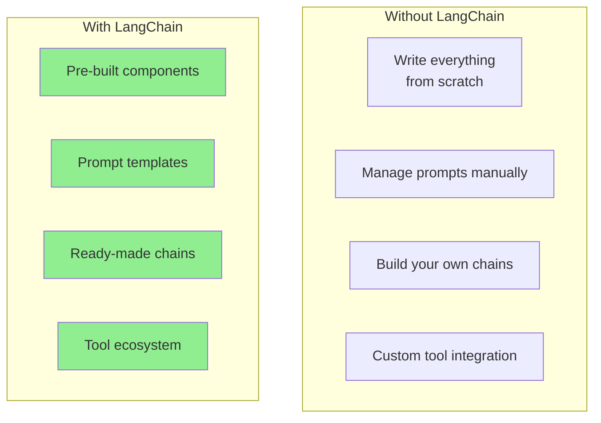
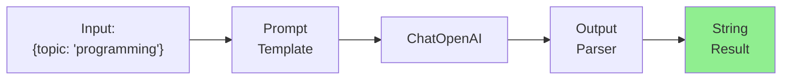
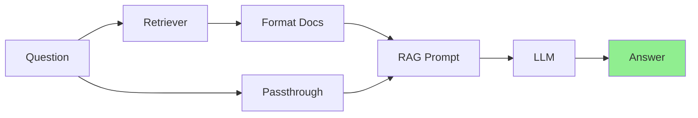
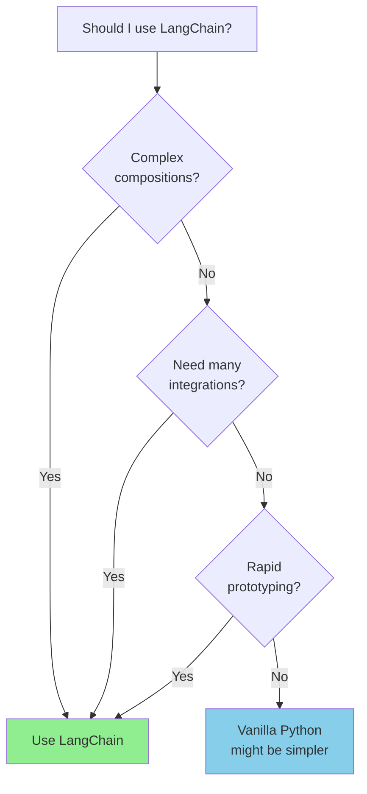
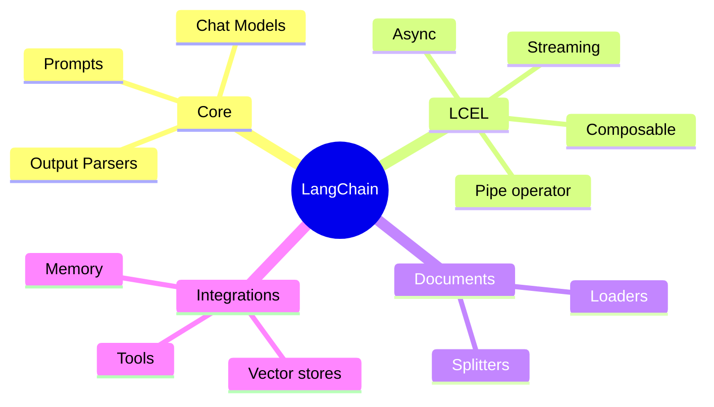

# Introduction to LangChain

You've built agents from scratch - now let's explore **LangChain**, a popular framework that provides pre-built components for LLM applications. It's like having LEGO blocks for AI development!

---

## What is LangChain?



LangChain provides:
- **Models**: Unified interface for different LLM providers
- **Prompts**: Templating and management
- **Chains**: Composable sequences of operations
- **Agents**: Decision-making with tools
- **Memory**: Conversation history management

---

## Installation

```bash
pip install langchain langchain-openai langchain-community
```

---

## Core Concepts

### 1. Chat Models

```python
from langchain_openai import ChatOpenAI
from langchain_core.messages import HumanMessage, SystemMessage

# Initialize the model
llm = ChatOpenAI(model="gpt-3.5-turbo", temperature=0.7)

# Simple invocation
response = llm.invoke([
    SystemMessage(content="You are a helpful assistant."),
    HumanMessage(content="What is Python?")
])

print(response.content)
```

### 2. Prompt Templates

```python
from langchain_core.prompts import ChatPromptTemplate, MessagesPlaceholder

# Simple template
simple_prompt = ChatPromptTemplate.from_template(
    "Explain {topic} in simple terms for a {audience}."
)

# Format the prompt
formatted = simple_prompt.format(topic="machine learning", audience="beginner")
print(formatted)

# Chat prompt with system message
chat_prompt = ChatPromptTemplate.from_messages([
    ("system", "You are a {role}. Be {tone}."),
    ("human", "{input}")
])

messages = chat_prompt.format_messages(
    role="teacher",
    tone="friendly",
    input="Explain recursion"
)
```

### 3. Output Parsers

```python
from langchain_core.output_parsers import StrOutputParser, JsonOutputParser
from langchain_core.pydantic_v1 import BaseModel, Field

# Simple string parser
parser = StrOutputParser()

# JSON parser with schema
class MovieReview(BaseModel):
    title: str = Field(description="Movie title")
    rating: int = Field(description="Rating from 1-10")
    summary: str = Field(description="Brief summary")

json_parser = JsonOutputParser(pydantic_object=MovieReview)

# Get format instructions for the prompt
print(json_parser.get_format_instructions())
```

---

## LangChain Expression Language (LCEL)

LCEL is LangChain's declarative way to compose chains using the pipe (`|`) operator:

```python
from langchain_openai import ChatOpenAI
from langchain_core.prompts import ChatPromptTemplate
from langchain_core.output_parsers import StrOutputParser

# Define components
prompt = ChatPromptTemplate.from_template("Tell me a joke about {topic}")
model = ChatOpenAI(model="gpt-3.5-turbo")
parser = StrOutputParser()

# Compose the chain with LCEL
chain = prompt | model | parser

# Run the chain
result = chain.invoke({"topic": "programming"})
print(result)
```



### Chaining Multiple Steps

```python
from langchain_openai import ChatOpenAI
from langchain_core.prompts import ChatPromptTemplate
from langchain_core.output_parsers import StrOutputParser

model = ChatOpenAI()

# Chain 1: Generate an outline
outline_prompt = ChatPromptTemplate.from_template(
    "Create a brief outline for an article about {topic}. Return just bullet points."
)

# Chain 2: Expand the outline
expand_prompt = ChatPromptTemplate.from_template(
    "Expand this outline into a short article:\n{outline}"
)

# Compose chains
outline_chain = outline_prompt | model | StrOutputParser()
expand_chain = expand_prompt | model | StrOutputParser()

# Full pipeline
full_chain = (
    {"outline": outline_chain, "topic": lambda x: x["topic"]}
    | expand_prompt
    | model
    | StrOutputParser()
)

# Alternative: Using RunnablePassthrough
from langchain_core.runnables import RunnablePassthrough

full_chain = (
    {"outline": outline_chain}
    | expand_chain
)

result = full_chain.invoke({"topic": "AI in healthcare"})
print(result)
```

---

## Working with Documents

### Document Loaders

```python
from langchain_community.document_loaders import (
    TextLoader,
    PyPDFLoader,
    WebBaseLoader,
    DirectoryLoader
)

# Load a text file
text_loader = TextLoader("document.txt")
docs = text_loader.load()

# Load a PDF
pdf_loader = PyPDFLoader("report.pdf")
pdf_docs = pdf_loader.load()

# Load from web
web_loader = WebBaseLoader("https://example.com/article")
web_docs = web_loader.load()

# Load all files from directory
dir_loader = DirectoryLoader("./documents", glob="**/*.txt")
all_docs = dir_loader.load()

# Each document has content and metadata
for doc in docs:
    print(f"Content: {doc.page_content[:100]}...")
    print(f"Metadata: {doc.metadata}")
```

### Text Splitters

```python
from langchain.text_splitter import (
    RecursiveCharacterTextSplitter,
    CharacterTextSplitter,
    TokenTextSplitter
)

# Recursive splitter (recommended)
splitter = RecursiveCharacterTextSplitter(
    chunk_size=1000,
    chunk_overlap=200,
    separators=["\n\n", "\n", ". ", " ", ""]
)

text = "Your long document text here..."
chunks = splitter.split_text(text)

# Or split documents directly
documents = loader.load()
split_docs = splitter.split_documents(documents)

print(f"Original: 1 document")
print(f"After split: {len(split_docs)} chunks")
```

---

## Building a RAG Chain

```python
from langchain_openai import ChatOpenAI, OpenAIEmbeddings
from langchain_community.vectorstores import Chroma
from langchain_core.prompts import ChatPromptTemplate
from langchain_core.runnables import RunnablePassthrough
from langchain_core.output_parsers import StrOutputParser

# Setup components
embeddings = OpenAIEmbeddings()
vectorstore = Chroma(embedding_function=embeddings, persist_directory="./db")
retriever = vectorstore.as_retriever(search_kwargs={"k": 3})
llm = ChatOpenAI(model="gpt-3.5-turbo")

# RAG prompt
rag_prompt = ChatPromptTemplate.from_template("""
Answer the question based on the following context:

Context: {context}

Question: {question}

Answer:""")

# Helper to format documents
def format_docs(docs):
    return "\n\n".join(doc.page_content for doc in docs)

# Build RAG chain with LCEL
rag_chain = (
    {"context": retriever | format_docs, "question": RunnablePassthrough()}
    | rag_prompt
    | llm
    | StrOutputParser()
)

# Use the chain
answer = rag_chain.invoke("What is machine learning?")
print(answer)
```



---

## Streaming with LCEL

```python
from langchain_openai import ChatOpenAI
from langchain_core.prompts import ChatPromptTemplate

prompt = ChatPromptTemplate.from_template("Write a story about {topic}")
model = ChatOpenAI(model="gpt-3.5-turbo", streaming=True)

chain = prompt | model

# Stream the response
for chunk in chain.stream({"topic": "a robot learning to paint"}):
    print(chunk.content, end="", flush=True)
```

---

## Async Support

```python
import asyncio
from langchain_openai import ChatOpenAI
from langchain_core.prompts import ChatPromptTemplate

prompt = ChatPromptTemplate.from_template("Explain {topic} briefly")
model = ChatOpenAI()
chain = prompt | model

async def process_topics(topics: list):
    """Process multiple topics concurrently."""
    tasks = [chain.ainvoke({"topic": t}) for t in topics]
    results = await asyncio.gather(*tasks)
    return results

# Run async
topics = ["Python", "JavaScript", "Rust"]
results = asyncio.run(process_topics(topics))

for topic, result in zip(topics, results):
    print(f"{topic}: {result.content[:100]}...")
```

---

## Comparison: Vanilla Python vs LangChain

```python
# Vanilla Python
from openai import OpenAI
client = OpenAI()

def vanilla_rag(question, docs):
    context = "\n".join(docs)
    response = client.chat.completions.create(
        model="gpt-3.5-turbo",
        messages=[
            {"role": "system", "content": f"Context: {context}"},
            {"role": "user", "content": question}
        ]
    )
    return response.choices[0].message.content

# LangChain
from langchain_openai import ChatOpenAI
from langchain_core.prompts import ChatPromptTemplate
from langchain_core.output_parsers import StrOutputParser

prompt = ChatPromptTemplate.from_template("Context: {context}\n\nQuestion: {question}")
chain = prompt | ChatOpenAI() | StrOutputParser()
result = chain.invoke({"context": docs, "question": question})
```

| Aspect | Vanilla | LangChain |
|--------|---------|-----------|
| Setup | Minimal | More imports |
| Flexibility | Maximum | Structured |
| Composability | Manual | Built-in (LCEL) |
| Ecosystem | DIY | Rich integrations |
| Learning curve | Lower | Higher |

---

## When to Use LangChain



---

## Summary



---

## Quick Reference

```python
# Basic chain
from langchain_openai import ChatOpenAI
from langchain_core.prompts import ChatPromptTemplate
from langchain_core.output_parsers import StrOutputParser

chain = (
    ChatPromptTemplate.from_template("{input}")
    | ChatOpenAI()
    | StrOutputParser()
)
result = chain.invoke({"input": "Hello"})

# With retriever
chain = (
    {"context": retriever | format_docs, "question": RunnablePassthrough()}
    | prompt | model | parser
)
```

---

## Exercises

1. **Template Gallery**: Create 5 different prompt templates for various tasks (summarization, translation, code review)

2. **Multi-Step Chain**: Build a chain that researches a topic, creates an outline, and writes an article

3. **Streaming RAG**: Implement a RAG chain with streaming responses

---

## What's Next?

Now let's explore **LlamaIndex** - another framework with a focus on data ingestion and query engines!
