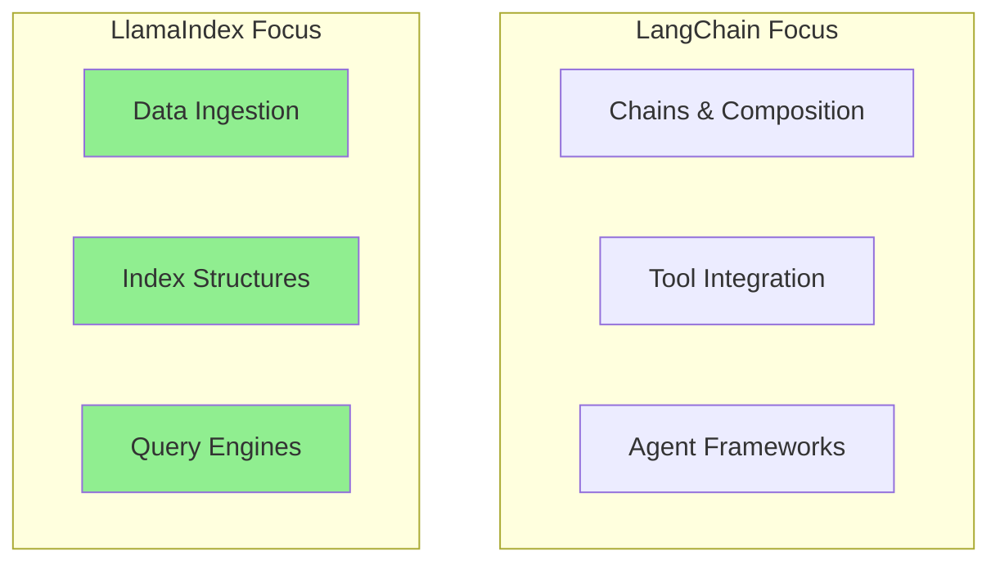
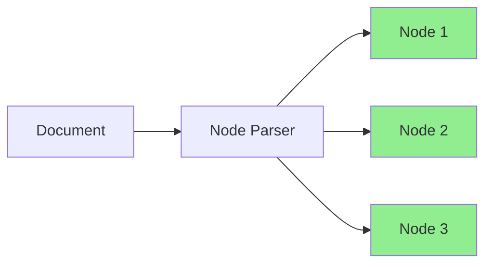
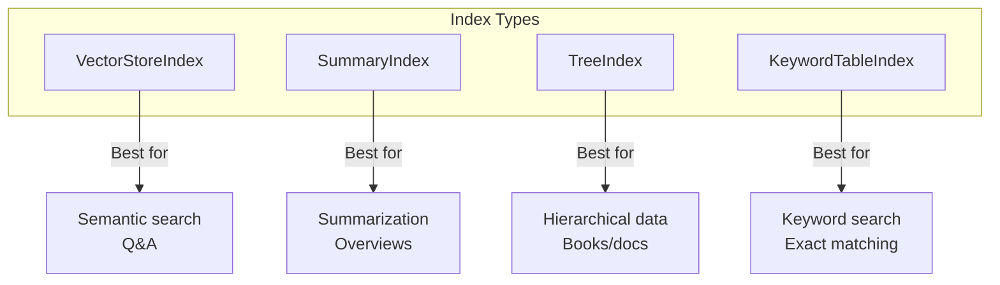
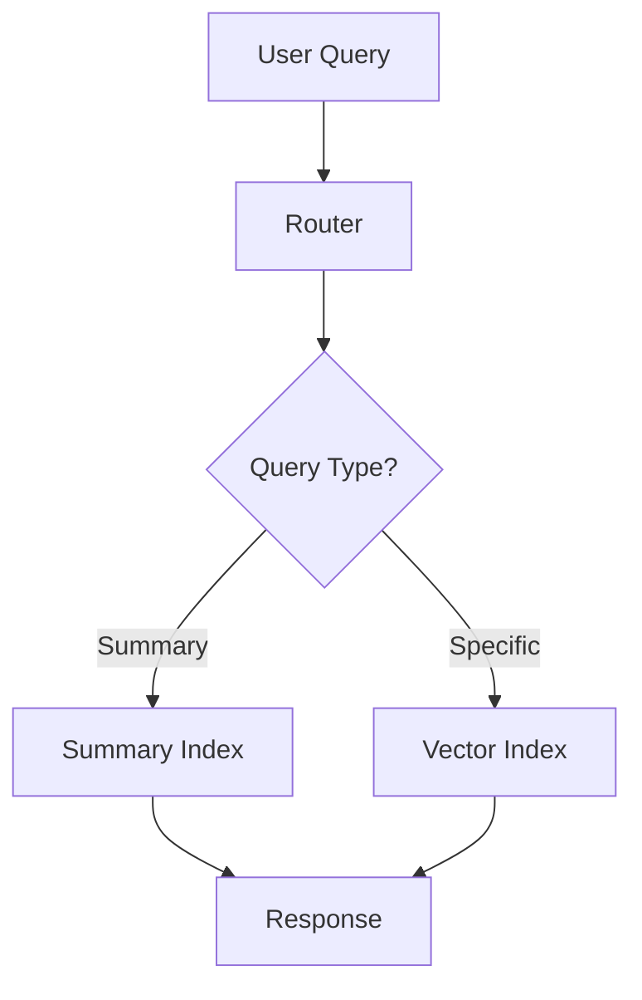
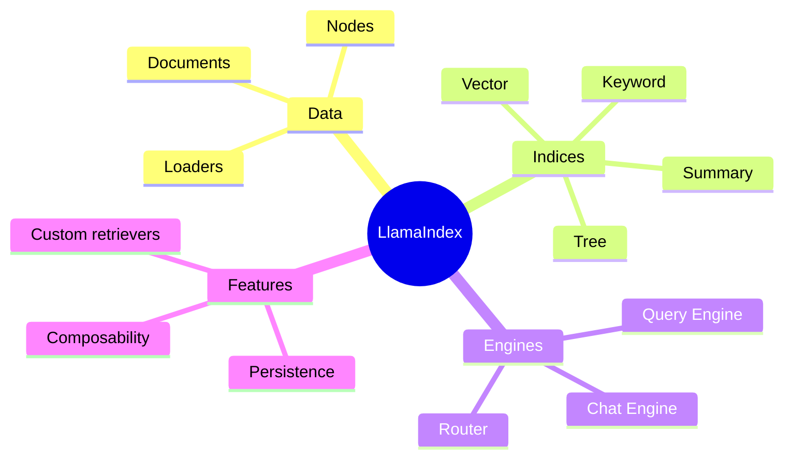

# Introduction to LlamaIndex

While LangChain focuses on composable chains, **LlamaIndex** specializes in connecting LLMs with your data. It excels at data ingestion, indexing, and building powerful query engines.

---

## LlamaIndex vs LangChain



| Aspect | LangChain | LlamaIndex |
|--------|-----------|------------|
| Primary focus | Chains & agents | Data & retrieval |
| Indexing | Basic | Advanced |
| Query types | Simple | Complex (SQL, graphs) |
| Best for | General LLM apps | Knowledge-heavy apps |

---

## Installation

```bash
pip install llama-index llama-index-llms-openai llama-index-embeddings-openai
```

---

## Quick Start

```python
from llama_index.core import VectorStoreIndex, SimpleDirectoryReader

# Load documents from a directory
documents = SimpleDirectoryReader("./data").load_data()

# Create index (automatically chunks, embeds, and stores)
index = VectorStoreIndex.from_documents(documents)

# Query the index
query_engine = index.as_query_engine()
response = query_engine.query("What is this document about?")
print(response)
```

That's it! LlamaIndex handles chunking, embedding, and retrieval automatically.

---

## Core Components

### 1. Documents and Nodes

```python
from llama_index.core import Document
from llama_index.core.node_parser import SentenceSplitter

# Create a document
doc = Document(
    text="LlamaIndex is a data framework for LLM applications...",
    metadata={"source": "manual", "author": "user"}
)

# Parse into nodes (chunks)
parser = SentenceSplitter(chunk_size=256, chunk_overlap=20)
nodes = parser.get_nodes_from_documents([doc])

print(f"Document split into {len(nodes)} nodes")
for node in nodes:
    print(f"  - {node.text[:50]}...")
```



### 2. Data Loaders

```python
from llama_index.core import SimpleDirectoryReader
from llama_index.readers.web import SimpleWebPageReader

# Load from directory
dir_reader = SimpleDirectoryReader(
    input_dir="./documents",
    recursive=True,
    required_exts=[".txt", ".pdf", ".md"]
)
docs = dir_reader.load_data()

# Load from web
web_reader = SimpleWebPageReader()
web_docs = web_reader.load_data(urls=["https://example.com/article"])

# Load from various sources using LlamaHub
# pip install llama-hub
from llama_index.readers.github import GithubRepositoryReader
from llama_index.readers.notion import NotionPageReader

# Over 100+ loaders available on LlamaHub!
```

### 3. Index Types

```python
from llama_index.core import (
    VectorStoreIndex,
    SummaryIndex,
    TreeIndex,
    KeywordTableIndex
)

# Vector Index - semantic search (most common)
vector_index = VectorStoreIndex.from_documents(documents)

# Summary Index - for summarization tasks
summary_index = SummaryIndex.from_documents(documents)

# Tree Index - hierarchical structure
tree_index = TreeIndex.from_documents(documents)

# Keyword Index - keyword-based retrieval
keyword_index = KeywordTableIndex.from_documents(documents)
```



---

## Query Engines

### Basic Query Engine

```python
from llama_index.core import VectorStoreIndex, SimpleDirectoryReader

# Load and index
documents = SimpleDirectoryReader("./data").load_data()
index = VectorStoreIndex.from_documents(documents)

# Create query engine
query_engine = index.as_query_engine(
    similarity_top_k=3,  # Retrieve top 3 chunks
    response_mode="compact"  # Compact response synthesis
)

response = query_engine.query("Explain the main concepts")
print(response)
print(f"\nSources: {len(response.source_nodes)}")
```

### Response Modes

```python
# Different ways to synthesize responses
query_engine = index.as_query_engine(
    response_mode="refine"  # Iteratively refine answer
)

query_engine = index.as_query_engine(
    response_mode="compact"  # Compact all chunks, answer once
)

query_engine = index.as_query_engine(
    response_mode="tree_summarize"  # Build summary tree
)

query_engine = index.as_query_engine(
    response_mode="simple_summarize"  # Simple concatenation
)
```

### Customizing Retrieval

```python
from llama_index.core import VectorStoreIndex
from llama_index.core.retrievers import VectorIndexRetriever
from llama_index.core.query_engine import RetrieverQueryEngine
from llama_index.core.postprocessor import SimilarityPostprocessor

# Create custom retriever
retriever = VectorIndexRetriever(
    index=index,
    similarity_top_k=10
)

# Add post-processing
postprocessor = SimilarityPostprocessor(similarity_cutoff=0.7)

# Build custom query engine
query_engine = RetrieverQueryEngine(
    retriever=retriever,
    node_postprocessors=[postprocessor]
)

response = query_engine.query("Your question here")
```

---

## Chat Engines

For conversational interactions with memory:

```python
from llama_index.core import VectorStoreIndex, SimpleDirectoryReader

documents = SimpleDirectoryReader("./data").load_data()
index = VectorStoreIndex.from_documents(documents)

# Create chat engine
chat_engine = index.as_chat_engine(
    chat_mode="condense_question",  # Reformulates questions with context
    verbose=True
)

# Have a conversation
response1 = chat_engine.chat("What is this document about?")
print(response1)

response2 = chat_engine.chat("Can you tell me more about that?")
print(response2)

response3 = chat_engine.chat("How does it compare to alternatives?")
print(response3)

# Reset conversation
chat_engine.reset()
```

### Chat Modes

```python
# Different chat modes
chat_engine = index.as_chat_engine(chat_mode="simple")  # Basic
chat_engine = index.as_chat_engine(chat_mode="condense_question")  # Reformulates
chat_engine = index.as_chat_engine(chat_mode="context")  # Always uses context
chat_engine = index.as_chat_engine(chat_mode="condense_plus_context")  # Best of both
```

---

## Persistence

```python
from llama_index.core import VectorStoreIndex, StorageContext, load_index_from_storage

# Create and persist index
index = VectorStoreIndex.from_documents(documents)
index.storage_context.persist(persist_dir="./storage")

# Load existing index
storage_context = StorageContext.from_defaults(persist_dir="./storage")
loaded_index = load_index_from_storage(storage_context)

query_engine = loaded_index.as_query_engine()
```

---

## Using Different Vector Stores

```python
# ChromaDB
from llama_index.vector_stores.chroma import ChromaVectorStore
import chromadb

chroma_client = chromadb.PersistentClient(path="./chroma_db")
chroma_collection = chroma_client.get_or_create_collection("my_collection")
vector_store = ChromaVectorStore(chroma_collection=chroma_collection)

# Create index with custom vector store
from llama_index.core import StorageContext

storage_context = StorageContext.from_defaults(vector_store=vector_store)
index = VectorStoreIndex.from_documents(documents, storage_context=storage_context)
```

---

## Advanced: Composable Indices

Combine multiple indices:

```python
from llama_index.core import (
    VectorStoreIndex,
    SummaryIndex,
    SimpleDirectoryReader
)
from llama_index.core.tools import QueryEngineTool, ToolMetadata
from llama_index.core.query_engine import RouterQueryEngine
from llama_index.core.selectors import LLMSingleSelector

# Create different indices for different purposes
docs = SimpleDirectoryReader("./data").load_data()

vector_index = VectorStoreIndex.from_documents(docs)
summary_index = SummaryIndex.from_documents(docs)

# Create tools from query engines
vector_tool = QueryEngineTool(
    query_engine=vector_index.as_query_engine(),
    metadata=ToolMetadata(
        name="vector_search",
        description="Useful for specific questions about details"
    )
)

summary_tool = QueryEngineTool(
    query_engine=summary_index.as_query_engine(),
    metadata=ToolMetadata(
        name="summary",
        description="Useful for summarization questions"
    )
)

# Router automatically selects the right tool
router_engine = RouterQueryEngine(
    selector=LLMSingleSelector.from_defaults(),
    query_engine_tools=[vector_tool, summary_tool]
)

# Ask questions - router picks the right index!
response = router_engine.query("Give me a summary")  # Uses summary_index
response = router_engine.query("What is the exact definition of X?")  # Uses vector_index
```



---

## Complete Example: Knowledge Base

```python
from llama_index.core import (
    VectorStoreIndex,
    SimpleDirectoryReader,
    StorageContext,
    load_index_from_storage
)
from llama_index.llms.openai import OpenAI
from llama_index.embeddings.openai import OpenAIEmbedding
from llama_index.core import Settings
import os

class KnowledgeBase:
    """A complete knowledge base using LlamaIndex."""

    def __init__(self, data_dir: str, persist_dir: str = "./kb_storage"):
        self.data_dir = data_dir
        self.persist_dir = persist_dir

        # Configure settings
        Settings.llm = OpenAI(model="gpt-3.5-turbo", temperature=0)
        Settings.embed_model = OpenAIEmbedding()

        # Load or create index
        self.index = self._load_or_create_index()
        self.query_engine = self.index.as_query_engine(similarity_top_k=5)
        self.chat_engine = self.index.as_chat_engine(chat_mode="condense_plus_context")

    def _load_or_create_index(self):
        """Load existing index or create new one."""
        if os.path.exists(self.persist_dir):
            print("Loading existing index...")
            storage_context = StorageContext.from_defaults(persist_dir=self.persist_dir)
            return load_index_from_storage(storage_context)
        else:
            print("Creating new index...")
            documents = SimpleDirectoryReader(self.data_dir).load_data()
            index = VectorStoreIndex.from_documents(documents)
            index.storage_context.persist(persist_dir=self.persist_dir)
            return index

    def query(self, question: str) -> str:
        """One-off query."""
        response = self.query_engine.query(question)
        return str(response)

    def chat(self, message: str) -> str:
        """Conversational query."""
        response = self.chat_engine.chat(message)
        return str(response)

    def add_document(self, text: str, metadata: dict = None):
        """Add a new document to the index."""
        from llama_index.core import Document
        doc = Document(text=text, metadata=metadata or {})
        self.index.insert(doc)
        self.index.storage_context.persist(persist_dir=self.persist_dir)

    def get_sources(self, question: str) -> list:
        """Get source nodes for a query."""
        response = self.query_engine.query(question)
        return [
            {
                "text": node.node.text[:200],
                "score": node.score,
                "metadata": node.node.metadata
            }
            for node in response.source_nodes
        ]

# Usage
kb = KnowledgeBase(data_dir="./documents")

# Query
answer = kb.query("What are the main topics covered?")
print(answer)

# Chat
response1 = kb.chat("Tell me about the first topic")
response2 = kb.chat("How does that relate to the second one?")

# Get sources
sources = kb.get_sources("What is machine learning?")
for source in sources:
    print(f"Score: {source['score']:.3f} - {source['text'][:50]}...")
```

---

## Summary



---

## Quick Reference

```python
# Quick start
from llama_index.core import VectorStoreIndex, SimpleDirectoryReader

docs = SimpleDirectoryReader("./data").load_data()
index = VectorStoreIndex.from_documents(docs)
response = index.as_query_engine().query("Question?")

# Persistence
index.storage_context.persist("./storage")
index = load_index_from_storage(StorageContext.from_defaults("./storage"))

# Chat
chat = index.as_chat_engine()
chat.chat("First message")
chat.chat("Follow-up")
```

---

## What's Next?

You've learned both LangChain and LlamaIndex! Next, we'll explore **LangGraph** for building stateful agent workflows.
