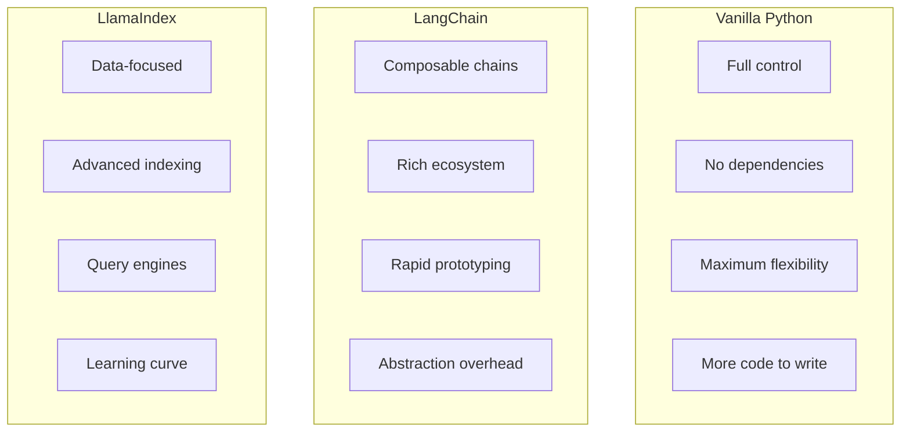
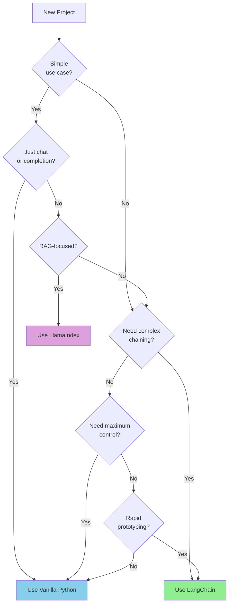
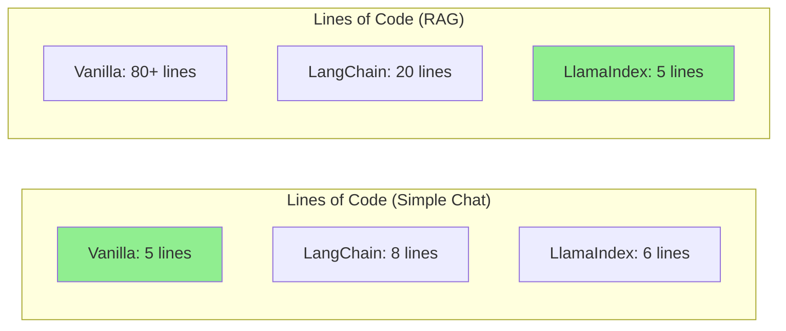
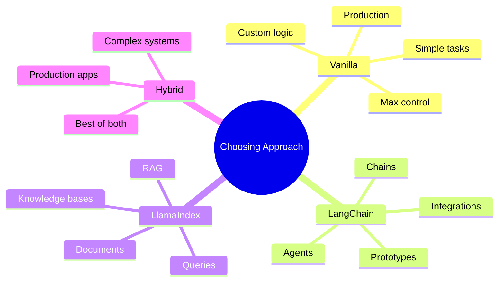

# When to Use a Framework vs. Vanilla Python

You've learned LangChain, LlamaIndex, and built agents from scratch. Now the important question: **when should you use each approach?**

---

## The Trade-offs



---

## Decision Matrix

| Factor | Vanilla | LangChain | LlamaIndex |
|--------|---------|-----------|------------|
| Simple chat app | ✅ Best | Overkill | Overkill |
| Complex chains | More work | ✅ Best | Possible |
| RAG application | More work | Good | ✅ Best |
| Agent with tools | More work | ✅ Best | Possible |
| Custom logic | ✅ Best | Harder | Harder |
| Speed to prototype | Slower | ✅ Fast | ✅ Fast |
| Production control | ✅ Best | Less | Less |
| Team knowledge | Universal | Specialized | Specialized |

---

## Decision Flowchart



---

## Code Comparison

### Simple Chat

```python
# Vanilla Python - Simple and clear
from openai import OpenAI
client = OpenAI()

response = client.chat.completions.create(
    model="gpt-3.5-turbo",
    messages=[{"role": "user", "content": "Hello!"}]
)
print(response.choices[0].message.content)

# LangChain - More setup for simple task
from langchain_openai import ChatOpenAI
from langchain_core.messages import HumanMessage

llm = ChatOpenAI()
response = llm.invoke([HumanMessage(content="Hello!")])
print(response.content)

# Verdict: Vanilla wins for simplicity
```

### RAG Application

```python
# Vanilla Python - Lots of code
from openai import OpenAI
import chromadb

client = OpenAI()
chroma = chromadb.Client()
collection = chroma.create_collection("docs")

# Load documents
docs = load_documents()  # You implement this

# Chunk documents
chunks = chunk_documents(docs)  # You implement this

# Embed and store
for chunk in chunks:
    embedding = client.embeddings.create(
        model="text-embedding-3-small",
        input=chunk
    ).data[0].embedding
    collection.add(ids=[...], embeddings=[embedding], documents=[chunk])

# Query
query_emb = client.embeddings.create(...).data[0].embedding
results = collection.query(query_embeddings=[query_emb])
# Build prompt, call LLM...

# LlamaIndex - Few lines
from llama_index.core import VectorStoreIndex, SimpleDirectoryReader

index = VectorStoreIndex.from_documents(
    SimpleDirectoryReader("./data").load_data()
)
response = index.as_query_engine().query("Question?")

# Verdict: LlamaIndex wins for RAG
```

### Complex Agent

```python
# Vanilla Python - Full control, more code
class Agent:
    def __init__(self):
        self.tools = {}

    def add_tool(self, name, func):
        self.tools[name] = func

    def run(self, task):
        # Implement ReAct loop
        # Parse responses
        # Execute tools
        # Manage state
        pass  # 50+ lines of code

# LangChain - Pre-built components
from langchain.agents import create_react_agent, AgentExecutor
from langchain_openai import ChatOpenAI
from langchain.tools import Tool

tools = [Tool(name="search", func=search_fn, description="...")]
agent = create_react_agent(ChatOpenAI(), tools, prompt)
executor = AgentExecutor(agent=agent, tools=tools)
result = executor.invoke({"input": "task"})

# Verdict: LangChain wins for standard agents
# But vanilla wins if you need custom behavior
```

---

## Hybrid Approach

Often the best solution combines approaches:

```python
# Use LlamaIndex for data, vanilla for control

from llama_index.core import VectorStoreIndex, SimpleDirectoryReader
from openai import OpenAI

# LlamaIndex for the heavy lifting
index = VectorStoreIndex.from_documents(
    SimpleDirectoryReader("./data").load_data()
)
retriever = index.as_retriever(similarity_top_k=5)

# Vanilla Python for custom logic
client = OpenAI()

def custom_rag(question: str) -> str:
    # Retrieve with LlamaIndex
    nodes = retriever.retrieve(question)
    context = "\n".join([n.text for n in nodes])

    # Custom prompt logic
    if len(context) < 100:
        return "Not enough information found."

    # Custom LLM call
    response = client.chat.completions.create(
        model="gpt-4",
        messages=[
            {"role": "system", "content": f"Context: {context}"},
            {"role": "user", "content": question}
        ],
        temperature=0.2  # Custom setting
    )

    # Custom post-processing
    answer = response.choices[0].message.content
    if "I don't know" in answer:
        return fallback_response(question)

    return answer
```

---

## Framework Overhead



---

## Production Considerations

| Consideration | Vanilla | Frameworks |
|---------------|---------|------------|
| Debugging | Easy - your code | Harder - framework internals |
| Upgrades | You control | Breaking changes possible |
| Performance | Optimized by you | May have overhead |
| Hiring | Any Python dev | Need framework knowledge |
| Documentation | Self-documenting | Depends on framework |

---

## Recommendations

### Use Vanilla Python When:
- Building simple chat applications
- Need maximum control over behavior
- Want minimal dependencies
- Team doesn't know frameworks
- Building for long-term maintenance

### Use LangChain When:
- Building agents with tools
- Need complex chain compositions
- Want rapid prototyping
- Using many third-party integrations
- Building standard patterns

### Use LlamaIndex When:
- Building RAG applications
- Working with lots of documents
- Need advanced retrieval strategies
- Building knowledge bases
- Want quick data-to-query setup

### Use Hybrid When:
- Need best of both worlds
- Want framework convenience with custom control
- Building production systems that will evolve

---

## Summary



---

## Quick Decision Guide

```
Simple chat? → Vanilla
RAG app? → LlamaIndex
Agent with tools? → LangChain
Need control? → Vanilla
Quick prototype? → Framework
Production + maintenance? → Consider vanilla or hybrid
```

The best developers know when to use frameworks and when to write custom code. **Master all approaches, then choose wisely!**
