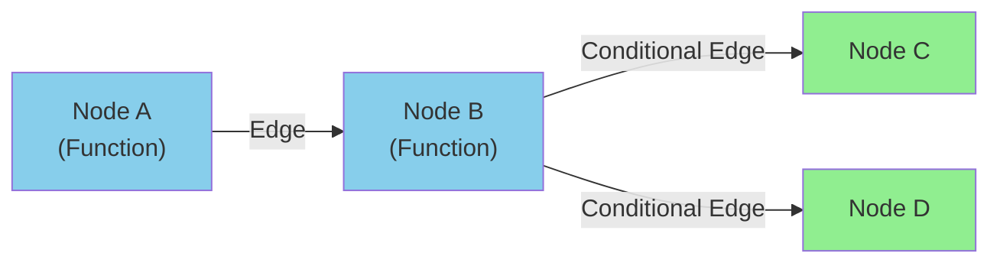
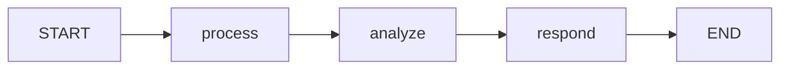
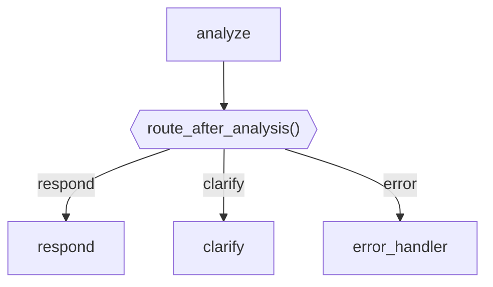
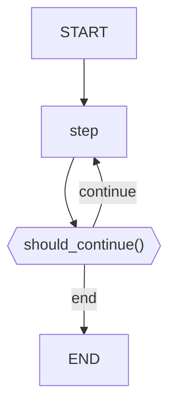
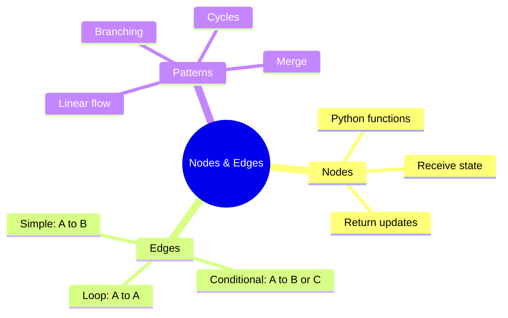

# Defining Nodes and Edges in LangGraph

LangGraph models agents as graphs. **Nodes** are the actions your agent can take, and **Edges** define how it moves between them. This guide teaches you to build these components.

---

## Graph Anatomy



- **Nodes**: Python functions that process state
- **Edges**: Connections between nodes
- **Conditional Edges**: Choose next node based on state

---

## Creating Nodes

Nodes are Python functions that receive and return state:

```python
from langgraph.graph import StateGraph, END
from typing import TypedDict, Annotated
from operator import add

# Define the state schema
class AgentState(TypedDict):
    messages: Annotated[list, add]  # Messages accumulate
    current_step: str
    result: str

# Node 1: Process input
def process_input(state: AgentState) -> dict:
    """First node - process the user input."""
    messages = state["messages"]
    user_input = messages[-1] if messages else ""

    return {
        "current_step": "processed",
        "messages": [f"Processing: {user_input}"]
    }

# Node 2: Analyze
def analyze(state: AgentState) -> dict:
    """Second node - analyze the processed input."""
    return {
        "current_step": "analyzed",
        "messages": ["Analysis complete"]
    }

# Node 3: Generate response
def generate_response(state: AgentState) -> dict:
    """Third node - generate final response."""
    return {
        "current_step": "complete",
        "result": "Here is your answer!",
        "messages": ["Response generated"]
    }
```

---

## Adding Nodes to the Graph

```python
from langgraph.graph import StateGraph, END

# Create the graph
workflow = StateGraph(AgentState)

# Add nodes
workflow.add_node("process", process_input)
workflow.add_node("analyze", analyze)
workflow.add_node("respond", generate_response)

# Set the starting point
workflow.set_entry_point("process")
```

---

## Simple Edges

Connect nodes in sequence:

```python
# Linear flow: process -> analyze -> respond -> END
workflow.add_edge("process", "analyze")
workflow.add_edge("analyze", "respond")
workflow.add_edge("respond", END)
```



---

## Conditional Edges

Choose the next node based on state:

```python
from typing import Literal

def route_after_analysis(state: AgentState) -> Literal["respond", "clarify", "error"]:
    """Decide where to go after analysis."""

    # Check state to decide routing
    if "error" in state.get("current_step", ""):
        return "error"
    elif "unclear" in str(state.get("messages", [])):
        return "clarify"
    else:
        return "respond"

# Add conditional edge
workflow.add_conditional_edges(
    "analyze",  # From this node
    route_after_analysis,  # Use this function to decide
    {
        "respond": "respond",  # If function returns "respond", go to respond node
        "clarify": "clarify",  # If "clarify", go to clarify node
        "error": "error_handler"  # If "error", go to error_handler
    }
)
```



---

## Complete Routing Example

```python
from langgraph.graph import StateGraph, END
from typing import TypedDict, Annotated, Literal
from operator import add

class AgentState(TypedDict):
    messages: Annotated[list, add]
    intent: str
    response: str

# Nodes
def classify_intent(state: AgentState) -> dict:
    """Classify user intent."""
    user_message = state["messages"][-1] if state["messages"] else ""

    # Simple intent classification
    if "weather" in user_message.lower():
        intent = "weather"
    elif "calculate" in user_message.lower() or any(c.isdigit() for c in user_message):
        intent = "math"
    else:
        intent = "general"

    return {"intent": intent, "messages": [f"Intent: {intent}"]}

def handle_weather(state: AgentState) -> dict:
    """Handle weather queries."""
    return {"response": "The weather is sunny!", "messages": ["Weather handled"]}

def handle_math(state: AgentState) -> dict:
    """Handle math queries."""
    return {"response": "The answer is 42!", "messages": ["Math handled"]}

def handle_general(state: AgentState) -> dict:
    """Handle general queries."""
    return {"response": "I can help with that!", "messages": ["General handled"]}

# Router function
def route_by_intent(state: AgentState) -> Literal["weather", "math", "general"]:
    """Route based on classified intent."""
    return state.get("intent", "general")

# Build graph
workflow = StateGraph(AgentState)

# Add all nodes
workflow.add_node("classify", classify_intent)
workflow.add_node("weather", handle_weather)
workflow.add_node("math", handle_math)
workflow.add_node("general", handle_general)

# Set entry point
workflow.set_entry_point("classify")

# Add conditional routing
workflow.add_conditional_edges(
    "classify",
    route_by_intent,
    {
        "weather": "weather",
        "math": "math",
        "general": "general"
    }
)

# All handlers go to END
workflow.add_edge("weather", END)
workflow.add_edge("math", END)
workflow.add_edge("general", END)

# Compile
app = workflow.compile()

# Test
result = app.invoke({"messages": ["What's the weather?"], "intent": "", "response": ""})
print(result["response"])  # "The weather is sunny!"
```

---

## Loops and Cycles

Create agents that can loop back:

```python
def should_continue(state: AgentState) -> Literal["continue", "end"]:
    """Decide whether to continue or end."""
    iterations = state.get("iterations", 0)

    if iterations >= 3:
        return "end"
    if state.get("task_complete", False):
        return "end"

    return "continue"

def agent_step(state: AgentState) -> dict:
    """One step of the agent loop."""
    iterations = state.get("iterations", 0)
    return {
        "iterations": iterations + 1,
        "messages": [f"Step {iterations + 1} complete"]
    }

# Build looping graph
workflow = StateGraph(AgentState)

workflow.add_node("step", agent_step)
workflow.set_entry_point("step")

workflow.add_conditional_edges(
    "step",
    should_continue,
    {
        "continue": "step",  # Loop back!
        "end": END
    }
)
```



---

## Branching and Merging

Handle parallel branches that merge:

```python
from langgraph.graph import StateGraph, END

class ParallelState(TypedDict):
    input: str
    branch_a_result: str
    branch_b_result: str
    final_result: str

def start_node(state: ParallelState) -> dict:
    return {"input": state["input"]}

def branch_a(state: ParallelState) -> dict:
    return {"branch_a_result": f"A processed: {state['input']}"}

def branch_b(state: ParallelState) -> dict:
    return {"branch_b_result": f"B processed: {state['input']}"}

def merge_results(state: ParallelState) -> dict:
    combined = f"{state['branch_a_result']} | {state['branch_b_result']}"
    return {"final_result": combined}

# Note: True parallel execution requires specific LangGraph setup
# This shows the logical structure
workflow = StateGraph(ParallelState)

workflow.add_node("start", start_node)
workflow.add_node("branch_a", branch_a)
workflow.add_node("branch_b", branch_b)
workflow.add_node("merge", merge_results)

workflow.set_entry_point("start")

# Branch out
workflow.add_edge("start", "branch_a")
workflow.add_edge("start", "branch_b")

# Merge back
workflow.add_edge("branch_a", "merge")
workflow.add_edge("branch_b", "merge")

workflow.add_edge("merge", END)
```

---

## Edge Types Summary

| Edge Type | Use Case | Example |
|-----------|----------|---------|
| Simple | Linear flow | `add_edge("A", "B")` |
| Conditional | Dynamic routing | `add_conditional_edges("A", router_fn, {...})` |
| To END | Terminate | `add_edge("A", END)` |
| Self-loop | Iteration | Route back to same node |

---

## Best Practices

### 1. Keep Nodes Focused

```python
# Good: Single responsibility
def extract_entities(state):
    """Only extracts entities."""
    return {"entities": extract(state["text"])}

def classify_entities(state):
    """Only classifies entities."""
    return {"classifications": classify(state["entities"])}

# Bad: Multiple responsibilities
def process_everything(state):
    """Does too many things."""
    entities = extract(state["text"])
    classifications = classify(entities)
    summary = summarize(classifications)
    return {...}
```

### 2. Clear Routing Logic

```python
# Good: Clear routing function
def route_by_status(state) -> Literal["success", "retry", "fail"]:
    if state["status"] == "ok":
        return "success"
    elif state["retries"] < 3:
        return "retry"
    else:
        return "fail"

# Bad: Complex inline logic
workflow.add_conditional_edges(
    "check",
    lambda s: "success" if s["status"] == "ok" else ("retry" if s["retries"] < 3 else "fail"),
    {...}
)
```

### 3. Document Your Graph

```python
# Add docstrings to nodes
def validate_input(state: AgentState) -> dict:
    """
    Validate user input before processing.

    Input state:
        - messages: List of conversation messages

    Output state:
        - is_valid: Boolean indicating validity
        - validation_errors: List of any errors found
    """
    ...
```

---

## Summary



---

## Quick Reference

```python
# Create graph
workflow = StateGraph(MyState)

# Add node
workflow.add_node("name", my_function)

# Set entry point
workflow.set_entry_point("first_node")

# Simple edge
workflow.add_edge("from", "to")

# Conditional edge
workflow.add_conditional_edges(
    "from_node",
    routing_function,
    {"option1": "node1", "option2": "node2"}
)

# End the graph
workflow.add_edge("last_node", END)

# Compile
app = workflow.compile()
```

---

## What's Next?

Now let's learn how to **compile and run your graph** as a working agent!
