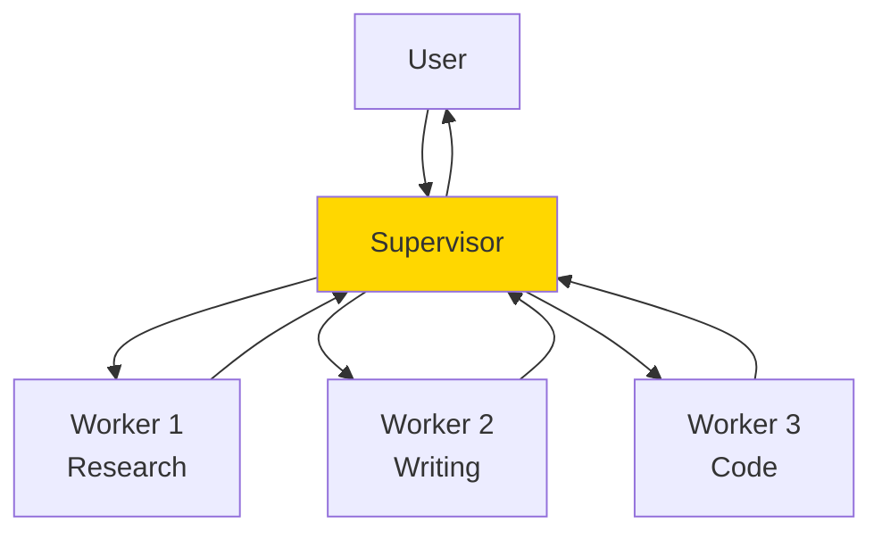
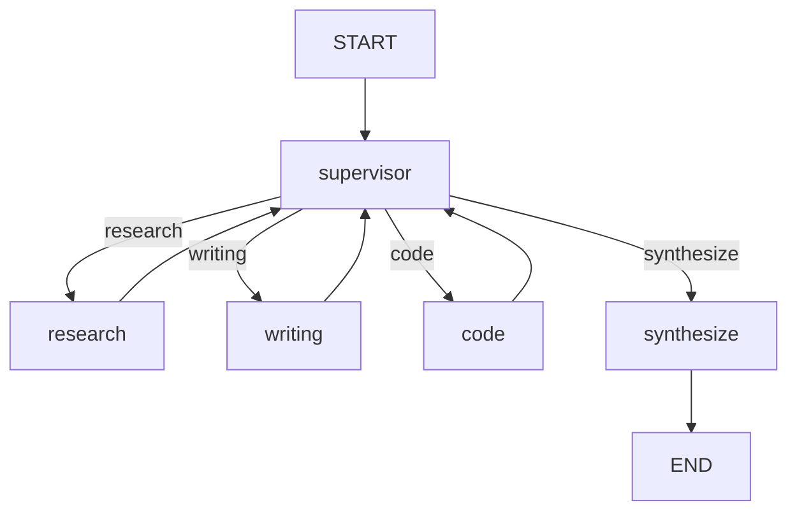
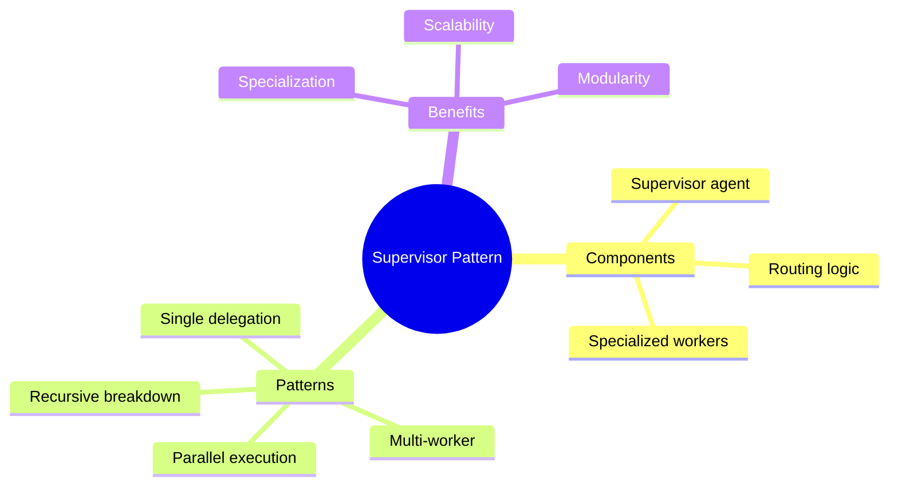

# Supervisor/Worker (Hierarchical) Routing

The most common multi-agent pattern: one agent delegates tasks to specialized workers. This guide shows you how to build hierarchical agent systems.

---

## The Supervisor Pattern



The supervisor:
- Receives the user's request
- Decides which worker(s) to use
- Delegates tasks to workers
- Combines results
- Returns final answer

---

## Basic Supervisor Implementation

```python
from openai import OpenAI
import json
from typing import Literal

client = OpenAI()

# Define workers
def research_worker(query: str) -> str:
    """Worker that does research."""
    response = client.chat.completions.create(
        model="gpt-3.5-turbo",
        messages=[
            {"role": "system", "content": "You are a research specialist. Provide factual, well-researched information."},
            {"role": "user", "content": query}
        ]
    )
    return response.choices[0].message.content

def writing_worker(task: str) -> str:
    """Worker that writes content."""
    response = client.chat.completions.create(
        model="gpt-3.5-turbo",
        messages=[
            {"role": "system", "content": "You are a professional writer. Create engaging, well-structured content."},
            {"role": "user", "content": task}
        ]
    )
    return response.choices[0].message.content

def code_worker(task: str) -> str:
    """Worker that writes code."""
    response = client.chat.completions.create(
        model="gpt-3.5-turbo",
        messages=[
            {"role": "system", "content": "You are an expert programmer. Write clean, efficient code."},
            {"role": "user", "content": task}
        ]
    )
    return response.choices[0].message.content

# Supervisor
def supervisor(user_request: str) -> str:
    """Supervisor that routes to appropriate workers."""

    # Decide which worker to use
    routing_response = client.chat.completions.create(
        model="gpt-4",
        messages=[
            {"role": "system", "content": """You are a task router. Analyze the user's request and decide which worker should handle it.

Workers available:
- research: For factual questions, information gathering
- writing: For content creation, essays, articles
- code: For programming tasks, code writing

Respond with JSON: {"worker": "research|writing|code", "task": "specific task for worker"}"""},
            {"role": "user", "content": user_request}
        ],
        response_format={"type": "json_object"}
    )

    routing = json.loads(routing_response.choices[0].message.content)
    worker_name = routing["worker"]
    task = routing["task"]

    print(f"Supervisor delegating to: {worker_name}")
    print(f"Task: {task}")

    # Execute worker
    workers = {
        "research": research_worker,
        "writing": writing_worker,
        "code": code_worker
    }

    result = workers[worker_name](task)

    return result

# Usage
result = supervisor("Write a Python function to calculate prime numbers")
print(result)
```

---

## Multi-Worker Delegation

Sometimes a task needs multiple workers:

```python
def supervisor_multi(user_request: str) -> str:
    """Supervisor that can delegate to multiple workers."""

    # Analyze and create execution plan
    plan_response = client.chat.completions.create(
        model="gpt-4",
        messages=[
            {"role": "system", "content": """Analyze this request and create an execution plan.

Workers available:
- research: Information gathering
- writing: Content creation
- code: Programming

Return JSON:
{
    "steps": [
        {"worker": "...", "task": "...", "depends_on": null},
        {"worker": "...", "task": "...", "depends_on": 0}
    ]
}

Steps can depend on previous steps (by index)."""},
            {"role": "user", "content": user_request}
        ],
        response_format={"type": "json_object"}
    )

    plan = json.loads(plan_response.choices[0].message.content)
    results = []

    # Execute plan
    for i, step in enumerate(plan["steps"]):
        print(f"\nStep {i + 1}: {step['worker']} - {step['task'][:50]}...")

        # Include previous results if this step depends on them
        task = step["task"]
        if step.get("depends_on") is not None:
            prev_result = results[step["depends_on"]]
            task = f"{task}\n\nContext from previous step:\n{prev_result}"

        # Execute worker
        workers = {"research": research_worker, "writing": writing_worker, "code": code_worker}
        result = workers[step["worker"]](task)
        results.append(result)

    # Combine results
    final_response = client.chat.completions.create(
        model="gpt-4",
        messages=[
            {"role": "system", "content": "Combine these worker results into a coherent final response."},
            {"role": "user", "content": f"Original request: {user_request}\n\nResults:\n" + "\n---\n".join(results)}
        ]
    )

    return final_response.choices[0].message.content

# Usage
result = supervisor_multi("Research the latest AI trends and write a blog post with code examples")
print(result)
```

---

## LangGraph Supervisor Implementation

```python
from langgraph.graph import StateGraph, END
from typing import TypedDict, Annotated, Literal, List
from operator import add

class SupervisorState(TypedDict):
    messages: Annotated[List, add]
    task: str
    next_worker: str
    worker_results: Annotated[List, add]
    final_result: str

def supervisor_node(state: SupervisorState) -> dict:
    """Supervisor decides next action."""

    task = state["task"]
    results = state.get("worker_results", [])

    # Check if we have enough results
    if len(results) >= 2:  # Example: after 2 workers
        return {"next_worker": "synthesize"}

    # Decide next worker
    response = client.chat.completions.create(
        model="gpt-4",
        messages=[
            {"role": "system", "content": "Decide the next worker: research, writing, code, or synthesize if done."},
            {"role": "user", "content": f"Task: {task}\nCompleted: {len(results)} steps"}
        ]
    )

    next_worker = response.choices[0].message.content.strip().lower()
    return {"next_worker": next_worker, "messages": [f"Routing to: {next_worker}"]}

def research_node(state: SupervisorState) -> dict:
    result = research_worker(state["task"])
    return {"worker_results": [f"Research: {result}"], "messages": ["Research complete"]}

def writing_node(state: SupervisorState) -> dict:
    result = writing_worker(state["task"])
    return {"worker_results": [f"Writing: {result}"], "messages": ["Writing complete"]}

def code_node(state: SupervisorState) -> dict:
    result = code_worker(state["task"])
    return {"worker_results": [f"Code: {result}"], "messages": ["Code complete"]}

def synthesize_node(state: SupervisorState) -> dict:
    """Combine all results."""
    results = state["worker_results"]
    combined = "\n\n".join(results)
    return {"final_result": combined, "messages": ["Synthesis complete"]}

def route_to_worker(state: SupervisorState) -> Literal["research", "writing", "code", "synthesize"]:
    return state["next_worker"]

# Build graph
workflow = StateGraph(SupervisorState)

workflow.add_node("supervisor", supervisor_node)
workflow.add_node("research", research_node)
workflow.add_node("writing", writing_node)
workflow.add_node("code", code_node)
workflow.add_node("synthesize", synthesize_node)

workflow.set_entry_point("supervisor")

workflow.add_conditional_edges(
    "supervisor",
    route_to_worker,
    {
        "research": "research",
        "writing": "writing",
        "code": "code",
        "synthesize": "synthesize"
    }
)

# Workers return to supervisor
workflow.add_edge("research", "supervisor")
workflow.add_edge("writing", "supervisor")
workflow.add_edge("code", "supervisor")
workflow.add_edge("synthesize", END)

app = workflow.compile()
```



---

## Parallel Worker Execution

Run workers in parallel for speed:

```python
import asyncio
from typing import List, Dict

async def async_research_worker(query: str) -> str:
    """Async research worker."""
    # In real code, use async OpenAI client
    return f"Research result for: {query}"

async def async_writing_worker(task: str) -> str:
    """Async writing worker."""
    return f"Writing result for: {task}"

async def parallel_supervisor(request: str) -> Dict:
    """Execute multiple workers in parallel."""

    # Determine which workers to use
    plan = [
        {"worker": "research", "task": f"Research: {request}"},
        {"worker": "writing", "task": f"Write about: {request}"}
    ]

    # Create tasks
    tasks = []
    for step in plan:
        if step["worker"] == "research":
            tasks.append(async_research_worker(step["task"]))
        elif step["worker"] == "writing":
            tasks.append(async_writing_worker(step["task"]))

    # Execute in parallel
    results = await asyncio.gather(*tasks)

    return {
        "workers_used": [p["worker"] for p in plan],
        "results": list(results)
    }

# Usage
result = asyncio.run(parallel_supervisor("AI trends"))
print(result)
```

---

## Specialized Supervisor Patterns

### Expert Router

Route to domain-specific experts:

```python
EXPERTS = {
    "legal": "You are a legal expert. Provide legally-sound advice.",
    "medical": "You are a medical professional. Provide health information.",
    "technical": "You are a tech expert. Explain technical concepts.",
    "financial": "You are a financial advisor. Provide financial guidance."
}

def expert_router(query: str) -> str:
    """Route to appropriate expert."""

    # Classify query
    classification = client.chat.completions.create(
        model="gpt-4",
        messages=[
            {"role": "system", "content": f"Classify this query into one of: {list(EXPERTS.keys())}. Respond with just the category."},
            {"role": "user", "content": query}
        ]
    )

    expert_type = classification.choices[0].message.content.strip().lower()
    expert_prompt = EXPERTS.get(expert_type, EXPERTS["technical"])

    # Get expert response
    response = client.chat.completions.create(
        model="gpt-4",
        messages=[
            {"role": "system", "content": expert_prompt},
            {"role": "user", "content": query}
        ]
    )

    return f"[{expert_type.upper()} EXPERT]\n{response.choices[0].message.content}"
```

### Recursive Supervisor

Handle complex tasks by breaking them down:

```python
def recursive_supervisor(task: str, depth: int = 0, max_depth: int = 3) -> str:
    """Break down complex tasks recursively."""

    if depth >= max_depth:
        return f"[Leaf task] {task}"

    # Check if task needs breakdown
    analysis = client.chat.completions.create(
        model="gpt-4",
        messages=[
            {"role": "system", "content": """Analyze this task.
If it's simple, respond: {"simple": true, "response": "direct answer"}
If complex, respond: {"simple": false, "subtasks": ["subtask1", "subtask2"]}"""},
            {"role": "user", "content": task}
        ],
        response_format={"type": "json_object"}
    )

    result = json.loads(analysis.choices[0].message.content)

    if result.get("simple"):
        return result["response"]

    # Recursively handle subtasks
    subtask_results = []
    for subtask in result.get("subtasks", []):
        sub_result = recursive_supervisor(subtask, depth + 1, max_depth)
        subtask_results.append(sub_result)

    # Combine results
    return f"Task: {task}\nSubtasks completed:\n" + "\n".join(subtask_results)
```

---

## Best Practices

### 1. Clear Worker Responsibilities

```python
# Good: Specific, focused workers
research_worker = "Find factual information from reliable sources"
writing_worker = "Create engaging written content"
code_worker = "Write clean, tested code"

# Bad: Overlapping responsibilities
helper1 = "Help with stuff"
helper2 = "Also help with things"
```

### 2. Supervisor Context

```python
# Include context in supervisor decisions
supervisor_prompt = f"""
Current task: {task}
Workers used so far: {workers_used}
Results so far: {summary_of_results}
Remaining workers: {available_workers}

Decide next action...
"""
```

### 3. Error Handling

```python
def safe_worker_call(worker_fn, task: str, max_retries: int = 2) -> str:
    """Call worker with retry logic."""
    for attempt in range(max_retries + 1):
        try:
            return worker_fn(task)
        except Exception as e:
            if attempt == max_retries:
                return f"Worker failed after {max_retries} retries: {e}"
            print(f"Retry {attempt + 1}...")
```

---

## Summary



---

## Quick Reference

```python
# Basic supervisor
def supervisor(task):
    worker = decide_worker(task)
    return workers[worker](task)

# Multi-worker
results = []
for step in plan:
    results.append(workers[step.worker](step.task))
return combine(results)

# Parallel
results = await asyncio.gather(*[worker(task) for worker, task in assignments])
```

---

## What's Next?

Now let's explore **Adversarial Debate** - where agents critique each other's work to find better solutions!
