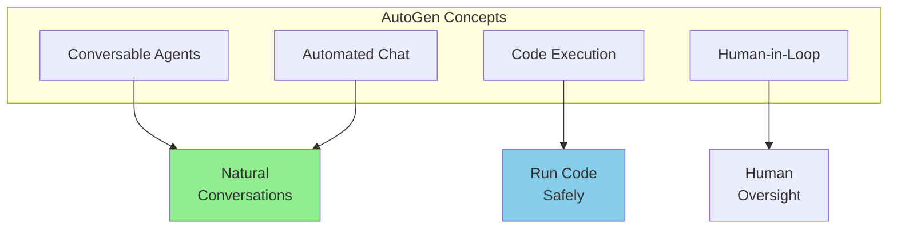
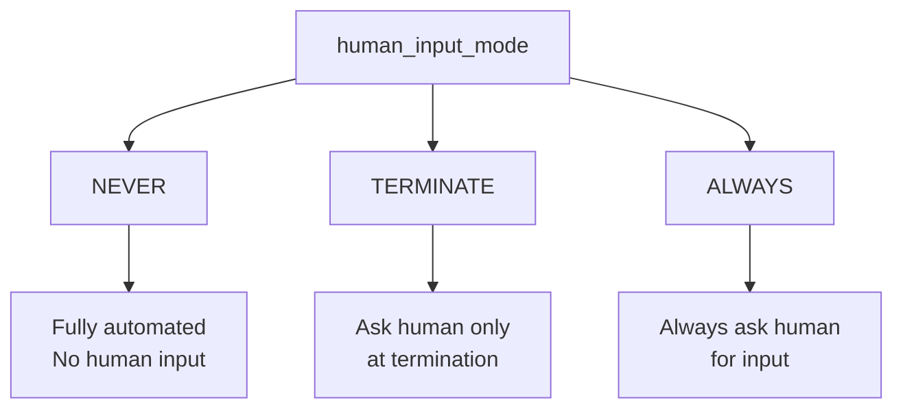
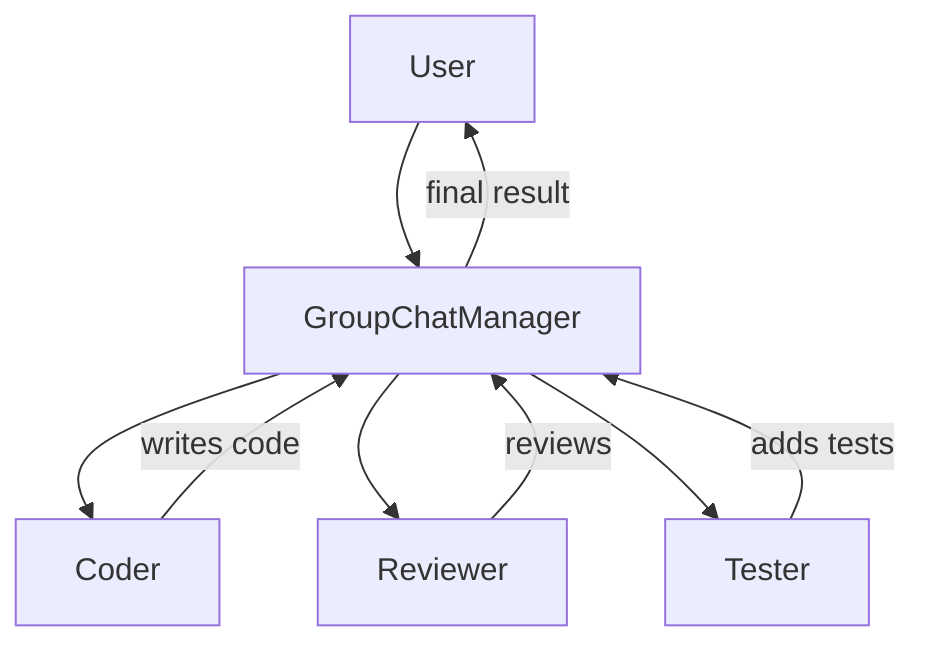
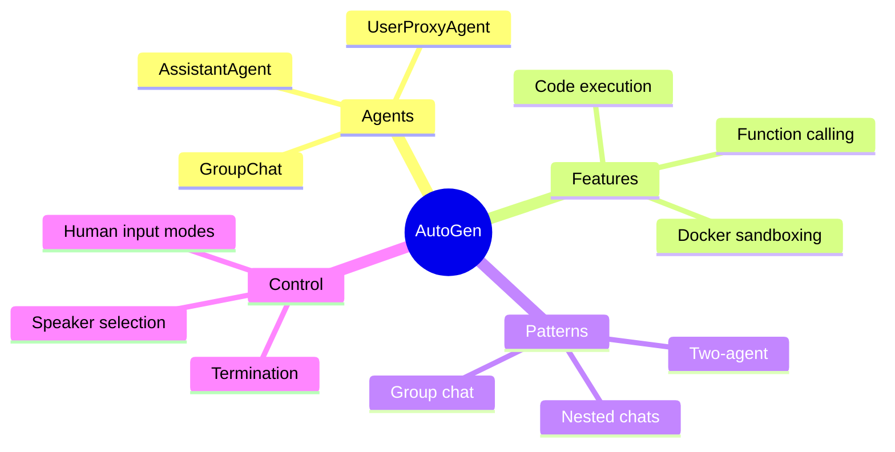

# Code-Execution Frameworks: Microsoft AutoGen

AutoGen is Microsoft's framework for building **conversational AI agents** that can write and execute code. It excels at programming tasks and collaborative problem-solving.

---

## What is AutoGen?



Key features:
- **Conversational agents** that chat naturally
- **Built-in code execution** with sandboxing
- **Flexible human involvement**
- **Multi-agent orchestration**

---

## Installation

```bash
pip install pyautogen
```

---

## Core Concepts

### 1. AssistantAgent

The AI agent that generates responses and code:

```python
from autogen import AssistantAgent

assistant = AssistantAgent(
    name="assistant",
    llm_config={
        "model": "gpt-4",
        "temperature": 0,
        "config_list": [{"model": "gpt-4", "api_key": "your-key"}]
    },
    system_message="""You are a helpful AI assistant.
    When asked to write code, provide complete, working solutions.
    Explain your reasoning clearly."""
)
```

### 2. UserProxyAgent

Represents the user and can execute code:

```python
from autogen import UserProxyAgent

user_proxy = UserProxyAgent(
    name="user_proxy",
    human_input_mode="TERMINATE",  # Ask for input when terminating
    max_consecutive_auto_reply=10,
    is_termination_msg=lambda x: x.get("content", "").rstrip().endswith("TERMINATE"),
    code_execution_config={
        "work_dir": "coding",
        "use_docker": False  # Set True for sandboxed execution
    }
)
```

### 3. Starting a Conversation

```python
# Start the conversation
user_proxy.initiate_chat(
    assistant,
    message="Write a Python function to calculate fibonacci numbers"
)
```

---

## Human Input Modes



```python
# Never ask for human input
user_proxy = UserProxyAgent(
    name="user",
    human_input_mode="NEVER",
    code_execution_config={"work_dir": "coding"}
)

# Ask only when ending
user_proxy = UserProxyAgent(
    name="user",
    human_input_mode="TERMINATE"
)

# Always ask for approval
user_proxy = UserProxyAgent(
    name="user",
    human_input_mode="ALWAYS"
)
```

---

## Code Execution

AutoGen can execute generated code safely:

```python
from autogen import AssistantAgent, UserProxyAgent

assistant = AssistantAgent(
    name="assistant",
    llm_config={"model": "gpt-4", "config_list": config_list}
)

user_proxy = UserProxyAgent(
    name="user_proxy",
    human_input_mode="NEVER",
    max_consecutive_auto_reply=5,
    code_execution_config={
        "work_dir": "output",
        "use_docker": True,  # Sandboxed execution
    }
)

# The assistant writes code, user_proxy executes it
user_proxy.initiate_chat(
    assistant,
    message="""Create a Python script that:
    1. Generates 100 random numbers
    2. Calculates mean and standard deviation
    3. Creates a histogram and saves it as 'histogram.png'
    """
)
# The code will be written, executed, and you'll see the results!
```

### Docker Sandboxing

```python
# Secure code execution with Docker
user_proxy = UserProxyAgent(
    name="user",
    code_execution_config={
        "work_dir": "workspace",
        "use_docker": True,
        "docker_image": "python:3.10-slim",
        "timeout": 60  # Timeout in seconds
    }
)
```

---

## Multi-Agent Conversations

### Group Chat

```python
from autogen import AssistantAgent, UserProxyAgent, GroupChat, GroupChatManager

# Define agents
coder = AssistantAgent(
    name="coder",
    llm_config=llm_config,
    system_message="You are a Python developer. Write clean, efficient code."
)

reviewer = AssistantAgent(
    name="reviewer",
    llm_config=llm_config,
    system_message="You are a code reviewer. Review code for bugs and improvements."
)

tester = AssistantAgent(
    name="tester",
    llm_config=llm_config,
    system_message="You are a QA engineer. Write tests for the code."
)

user = UserProxyAgent(
    name="user",
    human_input_mode="TERMINATE",
    code_execution_config={"work_dir": "project"}
)

# Create group chat
groupchat = GroupChat(
    agents=[user, coder, reviewer, tester],
    messages=[],
    max_round=20
)

manager = GroupChatManager(groupchat=groupchat, llm_config=llm_config)

# Start the group conversation
user.initiate_chat(
    manager,
    message="Create a function to validate email addresses with tests"
)
```



### Agent Selection

```python
from autogen import GroupChat

# Custom speaker selection
def custom_speaker_selection(last_speaker, groupchat):
    """Custom logic to select next speaker."""
    messages = groupchat.messages

    if last_speaker.name == "coder":
        return reviewer  # After coding, review
    elif last_speaker.name == "reviewer":
        return tester  # After review, test
    elif last_speaker.name == "tester":
        return coder  # After testing, back to coding if needed

    return coder  # Default to coder

groupchat = GroupChat(
    agents=[user, coder, reviewer, tester],
    messages=[],
    max_round=20,
    speaker_selection_method=custom_speaker_selection
)
```

---

## Function Calling

Register functions that agents can call:

```python
from autogen import AssistantAgent, UserProxyAgent

# Define functions
def get_weather(city: str) -> str:
    """Get weather for a city."""
    return f"Weather in {city}: 72°F, Sunny"

def search_web(query: str) -> str:
    """Search the web."""
    return f"Search results for '{query}': [relevant results]"

assistant = AssistantAgent(
    name="assistant",
    llm_config={
        "model": "gpt-4",
        "functions": [
            {
                "name": "get_weather",
                "description": "Get current weather for a city",
                "parameters": {
                    "type": "object",
                    "properties": {
                        "city": {"type": "string", "description": "City name"}
                    },
                    "required": ["city"]
                }
            },
            {
                "name": "search_web",
                "description": "Search the web for information",
                "parameters": {
                    "type": "object",
                    "properties": {
                        "query": {"type": "string", "description": "Search query"}
                    },
                    "required": ["query"]
                }
            }
        ]
    }
)

user = UserProxyAgent(
    name="user",
    human_input_mode="NEVER",
    function_map={
        "get_weather": get_weather,
        "search_web": search_web
    }
)

user.initiate_chat(assistant, message="What's the weather in Tokyo?")
```

---

## Conversation Patterns

### Two-Agent Chat

```python
# Simple back-and-forth
user_proxy.initiate_chat(assistant, message="Hello!")
```

### Sequential Chats

```python
# Chain of conversations
results = []

# First conversation
result1 = user_proxy.initiate_chat(
    researcher,
    message="Research topic X"
)
results.append(result1)

# Second conversation using first result
result2 = user_proxy.initiate_chat(
    writer,
    message=f"Write about this: {result1.summary}"
)
results.append(result2)
```

### Nested Chats

```python
from autogen import AssistantAgent, UserProxyAgent

# Register a nested chat
assistant.register_nested_chats(
    [
        {
            "recipient": code_reviewer,
            "message": lambda x: f"Review this code: {x}",
            "summary_method": "last_msg"
        }
    ],
    trigger=lambda sender: "code" in sender.last_message()
)
```

---

## Complete Example: Coding Assistant

```python
from autogen import AssistantAgent, UserProxyAgent

# Configuration
config_list = [
    {"model": "gpt-4", "api_key": "your-api-key"}
]

llm_config = {
    "config_list": config_list,
    "temperature": 0
}

# Create coding assistant
coder = AssistantAgent(
    name="coder",
    llm_config=llm_config,
    system_message="""You are a senior Python developer.
    When writing code:
    1. Include detailed comments
    2. Handle edge cases
    3. Write clean, readable code
    4. Suggest improvements

    After completing code, say TERMINATE."""
)

# Create executor
executor = UserProxyAgent(
    name="executor",
    human_input_mode="NEVER",
    max_consecutive_auto_reply=10,
    is_termination_msg=lambda x: "TERMINATE" in x.get("content", ""),
    code_execution_config={
        "work_dir": "coding_output",
        "use_docker": False
    }
)

# Run the coding task
executor.initiate_chat(
    coder,
    message="""Create a Python class for a simple todo list that:
    1. Can add tasks with priority (1-5)
    2. Can mark tasks as complete
    3. Can list tasks sorted by priority
    4. Can save/load from JSON file

    Include example usage at the end.
    """
)

print("Code has been generated and saved in coding_output/")
```

---

## Summary



---

## Quick Reference

```python
from autogen import AssistantAgent, UserProxyAgent

# Basic setup
assistant = AssistantAgent(name="assistant", llm_config=llm_config)
user = UserProxyAgent(
    name="user",
    human_input_mode="TERMINATE",
    code_execution_config={"work_dir": "output"}
)

# Start chat
user.initiate_chat(assistant, message="Your task here")

# Group chat
from autogen import GroupChat, GroupChatManager
groupchat = GroupChat(agents=[user, agent1, agent2], messages=[])
manager = GroupChatManager(groupchat=groupchat, llm_config=llm_config)
user.initiate_chat(manager, message="Task for the group")
```

---

## What's Next?

Now let's learn about **Human-in-the-Loop (HITL)** - keeping humans in control of agent decisions!
