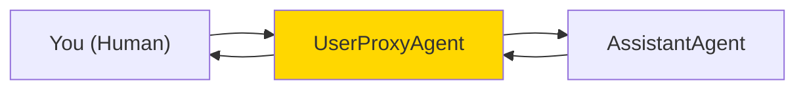
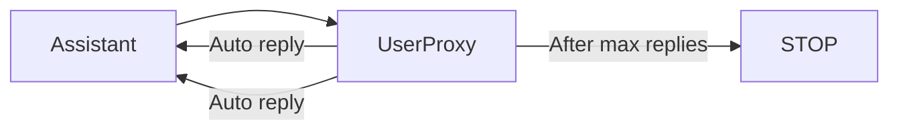
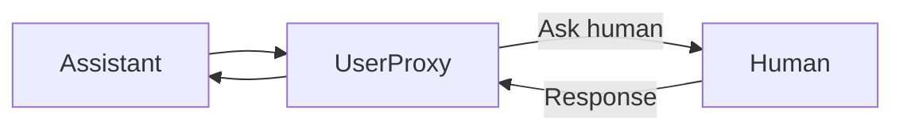
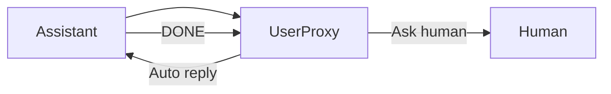
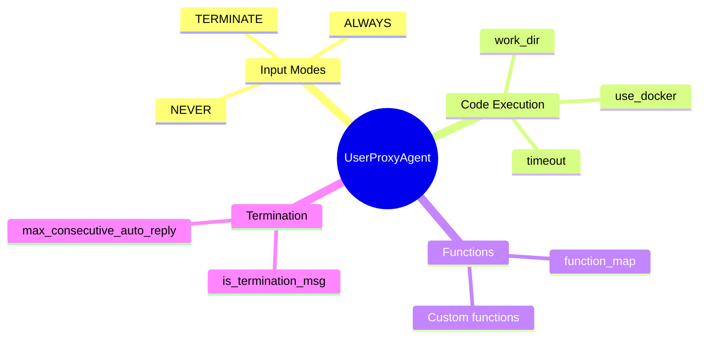

# User Proxy Agents in AutoGen

The UserProxyAgent is your representative in the conversation - it can execute code, ask for your input, and interact with AI agents on your behalf.

---

## What is a UserProxyAgent?



The UserProxyAgent:
- Represents you in the conversation
- Can execute code that AI writes
- Can ask for your input
- Can automatically reply or wait for you

---

## Basic UserProxyAgent

```python
from autogen import UserProxyAgent, AssistantAgent

# Create assistant
assistant = AssistantAgent(
    name="assistant",
    llm_config={
        "model": "gpt-4",
        "config_list": [{"model": "gpt-4", "api_key": "your-key"}]
    }
)

# Create user proxy
user_proxy = UserProxyAgent(
    name="user_proxy",
    human_input_mode="NEVER",  # Fully automated
    max_consecutive_auto_reply=10,
    code_execution_config={
        "work_dir": "coding",
        "use_docker": False
    }
)

# Start conversation
user_proxy.initiate_chat(
    assistant,
    message="Write a Python function to check if a number is prime"
)
```

---

## Human Input Modes

Control when the user proxy asks for your input:

### NEVER - Fully Automated

```python
user_proxy = UserProxyAgent(
    name="auto_user",
    human_input_mode="NEVER",
    max_consecutive_auto_reply=10  # Stop after 10 auto-replies
)
```



### ALWAYS - Always Ask

```python
user_proxy = UserProxyAgent(
    name="interactive_user",
    human_input_mode="ALWAYS"  # Always ask for input
)
```



### TERMINATE - Ask at End

```python
user_proxy = UserProxyAgent(
    name="terminate_user",
    human_input_mode="TERMINATE",
    is_termination_msg=lambda x: "DONE" in x.get("content", "").upper()
)
```



---

## Code Execution Configuration

Enable the proxy to execute code:

```python
# Basic code execution
user_proxy = UserProxyAgent(
    name="coder",
    code_execution_config={
        "work_dir": "workspace",    # Working directory
        "use_docker": False         # Run locally
    }
)

# With Docker (safer)
user_proxy = UserProxyAgent(
    name="safe_coder",
    code_execution_config={
        "work_dir": "workspace",
        "use_docker": True,
        "docker_image": "python:3.10-slim",
        "timeout": 60  # Max execution time
    }
)

# Disable code execution
user_proxy = UserProxyAgent(
    name="no_code",
    code_execution_config=False  # No code execution
)
```

---

## Termination Conditions

Control when conversations end:

```python
# Terminate on specific message
user_proxy = UserProxyAgent(
    name="user",
    is_termination_msg=lambda x: x.get("content", "").rstrip().endswith("TERMINATE")
)

# Custom termination logic
def should_terminate(message):
    content = message.get("content", "")
    # Terminate if task complete or max iterations
    if "TASK COMPLETE" in content:
        return True
    if "ERROR" in content and "cannot proceed" in content:
        return True
    return False

user_proxy = UserProxyAgent(
    name="user",
    is_termination_msg=should_terminate
)
```

---

## Auto-Reply Customization

Customize how the proxy automatically replies:

```python
class CustomUserProxy(UserProxyAgent):
    """UserProxy with custom auto-reply logic."""

    def generate_reply(self, messages, sender, **kwargs):
        """Override to customize auto-replies."""

        last_message = messages[-1].get("content", "")

        # Custom logic based on message content
        if "need more information" in last_message.lower():
            return "Here's additional context: [provide context]"

        if "which option" in last_message.lower():
            return "Let's go with option A"

        # Default behavior
        return super().generate_reply(messages, sender, **kwargs)

user_proxy = CustomUserProxy(
    name="smart_user",
    human_input_mode="NEVER"
)
```

---

## Function Calling with UserProxy

Register functions the proxy can execute:

```python
from autogen import UserProxyAgent, AssistantAgent

# Define functions
def get_weather(city: str) -> str:
    """Get weather for a city."""
    return f"Weather in {city}: 72°F, sunny"

def calculate(expression: str) -> str:
    """Calculate a math expression."""
    try:
        return str(eval(expression))
    except:
        return "Error in calculation"

# Create assistant with function definitions
assistant = AssistantAgent(
    name="assistant",
    llm_config={
        "model": "gpt-4",
        "config_list": [{"model": "gpt-4", "api_key": "key"}],
        "functions": [
            {
                "name": "get_weather",
                "description": "Get weather for a city",
                "parameters": {
                    "type": "object",
                    "properties": {
                        "city": {"type": "string"}
                    },
                    "required": ["city"]
                }
            },
            {
                "name": "calculate",
                "description": "Calculate math expression",
                "parameters": {
                    "type": "object",
                    "properties": {
                        "expression": {"type": "string"}
                    },
                    "required": ["expression"]
                }
            }
        ]
    }
)

# Create user proxy with function map
user_proxy = UserProxyAgent(
    name="user",
    human_input_mode="NEVER",
    function_map={
        "get_weather": get_weather,
        "calculate": calculate
    }
)

# Now assistant can call these functions
user_proxy.initiate_chat(
    assistant,
    message="What's the weather in Tokyo and what's 15% of 230?"
)
```

---

## Complete Example: Interactive Coding Assistant

```python
from autogen import AssistantAgent, UserProxyAgent

# Configuration
config_list = [{"model": "gpt-4", "api_key": "your-key"}]

# Create coding assistant
coder = AssistantAgent(
    name="coder",
    llm_config={"config_list": config_list},
    system_message="""You are a helpful coding assistant.
    Write clean, well-commented Python code.
    Always explain your code.
    When you're done, say 'TERMINATE'."""
)

# Create interactive user proxy
user = UserProxyAgent(
    name="user",
    human_input_mode="TERMINATE",  # Ask when done
    max_consecutive_auto_reply=5,
    code_execution_config={
        "work_dir": "code_output",
        "use_docker": False
    },
    is_termination_msg=lambda x: "TERMINATE" in x.get("content", "")
)

# Interactive session
print("Starting coding session. The assistant will write and execute code.")
print("You'll be asked for input when the task is complete.")
print("-" * 50)

user.initiate_chat(
    coder,
    message="""Create a Python script that:
    1. Generates 50 random numbers between 1 and 100
    2. Calculates mean, median, and standard deviation
    3. Creates a histogram and saves it as 'histogram.png'
    4. Prints a summary of the statistics"""
)
```

---

## Multiple User Proxies

Different proxies for different roles:

```python
# Technical user - executes code
tech_user = UserProxyAgent(
    name="tech_user",
    human_input_mode="NEVER",
    code_execution_config={"work_dir": "tech_work"}
)

# Review user - requires human approval
review_user = UserProxyAgent(
    name="reviewer",
    human_input_mode="ALWAYS",
    code_execution_config=False
)

# Admin user - can terminate
admin_user = UserProxyAgent(
    name="admin",
    human_input_mode="TERMINATE",
    is_termination_msg=lambda x: "APPROVED" in x.get("content", "")
)
```

---

## Summary



---

## Quick Reference

```python
# Basic user proxy
user = UserProxyAgent(
    name="user",
    human_input_mode="NEVER",  # NEVER, ALWAYS, TERMINATE
    max_consecutive_auto_reply=10
)

# With code execution
user = UserProxyAgent(
    name="user",
    code_execution_config={
        "work_dir": "workspace",
        "use_docker": True
    }
)

# With functions
user = UserProxyAgent(
    name="user",
    function_map={"func_name": func}
)

# Custom termination
user = UserProxyAgent(
    name="user",
    is_termination_msg=lambda x: "DONE" in x.get("content", "")
)
```

---

## What's Next?

Now let's learn about **Code Execution Environments** - setting up safe places for agents to run code!
