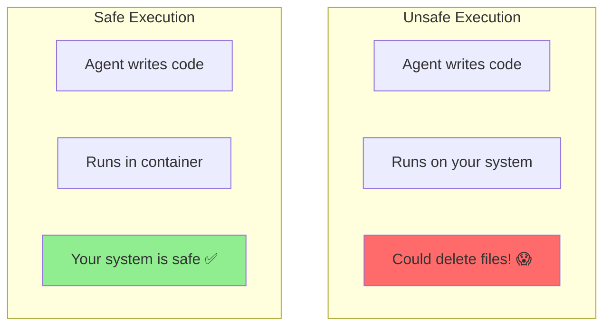
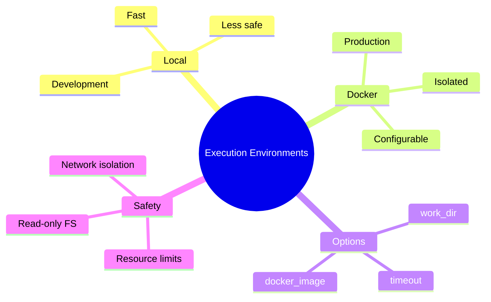

# Code Execution Environments in AutoGen

When agents write code, they need somewhere safe to run it. This guide shows you how to set up local and containerized execution environments.

---

## Why Execution Environments Matter



Risks of uncontrolled execution:
- File system damage
- Resource exhaustion
- Network abuse
- Security vulnerabilities

---

## Local Execution (Development)

For development and trusted code:

```python
from autogen import UserProxyAgent

# Basic local execution
user_proxy = UserProxyAgent(
    name="user",
    code_execution_config={
        "work_dir": "workspace",  # All files go here
        "use_docker": False,       # Run directly on host
        "timeout": 60,             # Max 60 seconds per execution
        "last_n_messages": 3       # Context for code execution
    }
)
```

### Work Directory Setup

```python
import os

# Create dedicated workspace
workspace = "agent_workspace"
os.makedirs(workspace, exist_ok=True)

user_proxy = UserProxyAgent(
    name="user",
    code_execution_config={
        "work_dir": workspace,
        "use_docker": False
    }
)

# Files created by agent will be in ./agent_workspace/
```

---

## Docker Execution (Production)

Isolated container for safety:

```python
from autogen import UserProxyAgent

# Docker-based execution
user_proxy = UserProxyAgent(
    name="user",
    code_execution_config={
        "work_dir": "workspace",
        "use_docker": True,
        "docker_image": "python:3.10-slim",
        "timeout": 120
    }
)
```

### Custom Docker Image

Create a Dockerfile for your needs:

```dockerfile
# Dockerfile.autogen
FROM python:3.10-slim

# Install common packages
RUN pip install --no-cache-dir \
    numpy \
    pandas \
    matplotlib \
    requests \
    scikit-learn

# Create non-root user
RUN useradd -m -s /bin/bash agent
USER agent

WORKDIR /workspace
```

Build and use:

```bash
docker build -t autogen-executor:latest -f Dockerfile.autogen .
```

```python
user_proxy = UserProxyAgent(
    name="user",
    code_execution_config={
        "work_dir": "workspace",
        "use_docker": True,
        "docker_image": "autogen-executor:latest"
    }
)
```

---

## Execution Configuration Options

```python
from autogen import UserProxyAgent

user_proxy = UserProxyAgent(
    name="user",
    code_execution_config={
        # Where to run code
        "work_dir": "workspace",

        # Container settings
        "use_docker": True,
        "docker_image": "python:3.10-slim",

        # Execution limits
        "timeout": 60,  # Seconds before timeout

        # Context
        "last_n_messages": 3,  # Messages to include for context

        # Advanced Docker options
        # "extra_docker_args": ["--memory=512m", "--cpus=1"]
    }
)
```

---

## Handling Execution Results

```python
from autogen import AssistantAgent, UserProxyAgent

assistant = AssistantAgent(
    name="coder",
    llm_config={"config_list": [{"model": "gpt-4", "api_key": "key"}]},
    system_message="You are a Python expert. Write code and explain it."
)

user_proxy = UserProxyAgent(
    name="executor",
    human_input_mode="NEVER",
    max_consecutive_auto_reply=5,
    code_execution_config={"work_dir": "workspace", "use_docker": False}
)

# The conversation handles execution results automatically
# Assistant sees:
# - Code execution output
# - Error messages
# - File creation confirmations

user_proxy.initiate_chat(
    assistant,
    message="Write a script that creates a CSV file with sample data"
)

# Check workspace for created files
import os
print("Created files:", os.listdir("workspace"))
```

---

## Language Support

AutoGen can execute multiple languages:

```python
# Python (default)
user_proxy = UserProxyAgent(
    name="python_executor",
    code_execution_config={
        "work_dir": "workspace",
        "use_docker": True,
        "docker_image": "python:3.10"
    }
)

# Multiple languages with appropriate image
user_proxy = UserProxyAgent(
    name="multi_executor",
    code_execution_config={
        "work_dir": "workspace",
        "use_docker": True,
        "docker_image": "jupyter/datascience-notebook"  # Python, R, Julia
    }
)
```

---

## Persistent State Between Executions

Files persist within a conversation:

```python
from autogen import AssistantAgent, UserProxyAgent

assistant = AssistantAgent(
    name="assistant",
    llm_config={"config_list": [{"model": "gpt-4", "api_key": "key"}]}
)

user_proxy = UserProxyAgent(
    name="user",
    code_execution_config={"work_dir": "stateful_workspace"}
)

# First execution - create file
user_proxy.initiate_chat(
    assistant,
    message="Create a file called 'data.txt' with the text 'Hello World'"
)

# Second execution - read file (file persists!)
user_proxy.initiate_chat(
    assistant,
    message="Read the contents of 'data.txt' and print them"
)
```

---

## Error Handling in Execution

```python
from autogen import AssistantAgent, UserProxyAgent

assistant = AssistantAgent(
    name="coder",
    llm_config={"config_list": [{"model": "gpt-4", "api_key": "key"}]},
    system_message="""You are a Python coder.
    If code fails, analyze the error and fix it.
    Try up to 3 times to fix errors before giving up."""
)

user_proxy = UserProxyAgent(
    name="executor",
    human_input_mode="NEVER",
    max_consecutive_auto_reply=6,  # Allow retries
    code_execution_config={"work_dir": "workspace", "timeout": 30}
)

# If code errors, assistant sees the error and can retry
user_proxy.initiate_chat(
    assistant,
    message="Write code to connect to a database (it might fail, handle errors)"
)
```

---

## Resource Limits with Docker

Control CPU, memory, and more:

```python
user_proxy = UserProxyAgent(
    name="limited_executor",
    code_execution_config={
        "work_dir": "workspace",
        "use_docker": True,
        "docker_image": "python:3.10-slim",
        "timeout": 60
    }
)

# For more control, use a docker-compose setup or custom executor
```

### Using Docker Compose

```yaml
# docker-compose.yml
version: '3.8'
services:
  executor:
    image: python:3.10-slim
    volumes:
      - ./workspace:/workspace
    working_dir: /workspace
    mem_limit: 512m
    cpus: 1.0
    network_mode: none  # No network access
    read_only: true
    tmpfs:
      - /tmp:size=50M
```

---

## Custom Executor

Build your own execution environment:

```python
import subprocess
import tempfile
import os

class CustomExecutor:
    """Custom code executor with specific requirements."""

    def __init__(self, work_dir: str, timeout: int = 60):
        self.work_dir = work_dir
        self.timeout = timeout
        os.makedirs(work_dir, exist_ok=True)

    def execute(self, code: str, language: str = "python") -> dict:
        """Execute code and return results."""

        # Write code to temp file
        suffix = ".py" if language == "python" else ".sh"
        with tempfile.NamedTemporaryFile(
            mode='w',
            suffix=suffix,
            dir=self.work_dir,
            delete=False
        ) as f:
            f.write(code)
            code_file = f.name

        try:
            # Execute with timeout
            if language == "python":
                cmd = ["python", code_file]
            else:
                cmd = ["bash", code_file]

            result = subprocess.run(
                cmd,
                capture_output=True,
                text=True,
                timeout=self.timeout,
                cwd=self.work_dir
            )

            return {
                "success": result.returncode == 0,
                "stdout": result.stdout,
                "stderr": result.stderr,
                "return_code": result.returncode
            }

        except subprocess.TimeoutExpired:
            return {
                "success": False,
                "error": f"Execution timed out after {self.timeout}s"
            }
        finally:
            os.unlink(code_file)

# Usage
executor = CustomExecutor("my_workspace", timeout=30)
result = executor.execute("""
print("Hello from custom executor!")
print(2 + 2)
""")
print(result)
```

---

## Security Best Practices

### 1. Always Use Docker in Production

```python
# Development only
code_execution_config={"use_docker": False}

# Production
code_execution_config={"use_docker": True}
```

### 2. Limit Resources

```python
code_execution_config={
    "use_docker": True,
    "timeout": 60,  # Prevent infinite loops
    # Use resource-limited Docker image
}
```

### 3. Isolate Network

```python
# Docker run with no network
# docker run --network none ...
```

### 4. Read-Only File System

```python
# Mount as read-only where possible
# docker run --read-only ...
```

---

## Summary



---

## Quick Reference

```python
# Local execution
code_execution_config={
    "work_dir": "workspace",
    "use_docker": False,
    "timeout": 60
}

# Docker execution
code_execution_config={
    "work_dir": "workspace",
    "use_docker": True,
    "docker_image": "python:3.10-slim",
    "timeout": 60
}

# Disable execution
code_execution_config=False
```

---

## What's Next?

Now let's explore **Human-in-the-Loop (HITL)** patterns - keeping humans in control of agent decisions!
