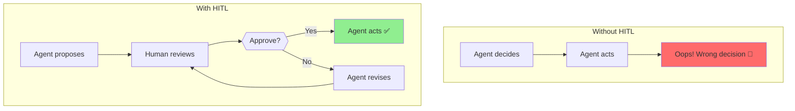
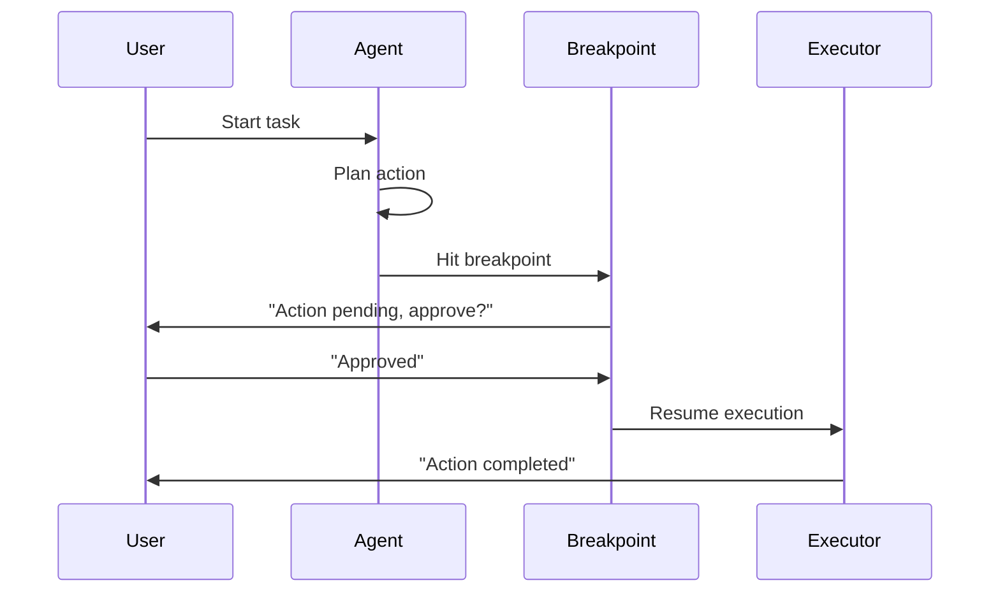
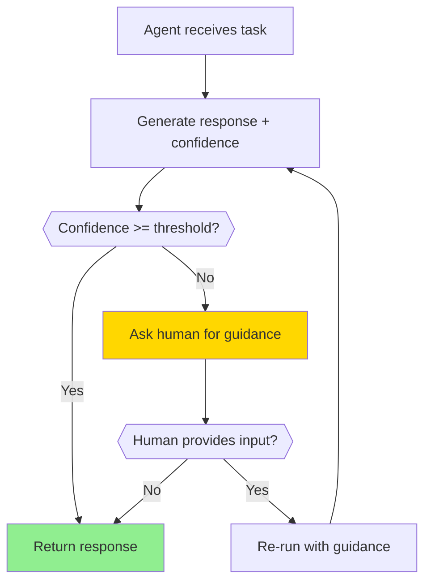
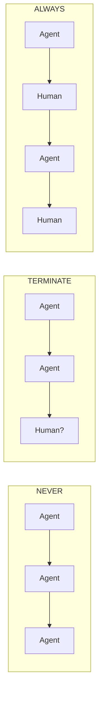
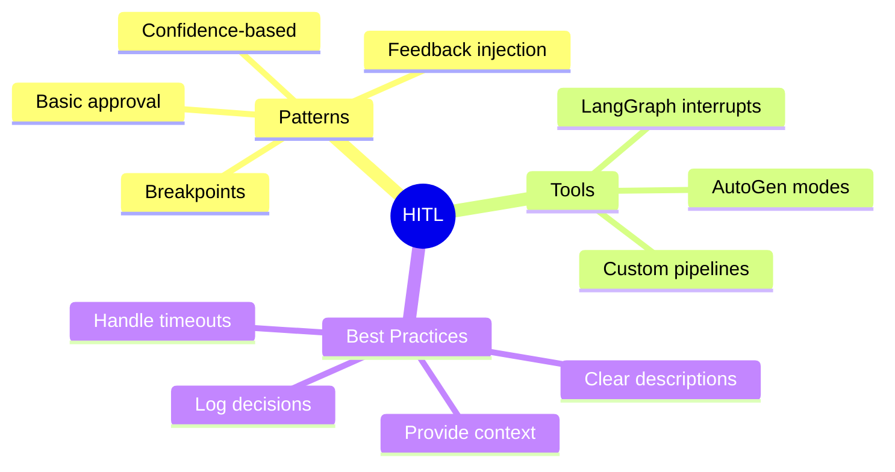

# Human-in-the-Loop (HITL) Patterns

Agents are powerful, but sometimes you need a human to make critical decisions. Human-in-the-Loop (HITL) patterns let you pause agents, get human input, and resume execution.

---

## Why Human-in-the-Loop?



Use cases for HITL:
- **High-stakes decisions** (financial transactions, emails)
- **Uncertain situations** (agent isn't confident)
- **Learning** (human teaches agent what's right)
- **Compliance** (legal/regulatory requirements)

---

## Basic Approval Pattern

The simplest HITL: ask before acting.

```python
from openai import OpenAI

client = OpenAI()

def get_human_approval(action: str, details: str) -> bool:
    """Ask human to approve an action."""
    print("\n" + "="*50)
    print("🤖 AGENT WANTS TO TAKE AN ACTION")
    print("="*50)
    print(f"Action: {action}")
    print(f"Details: {details}")
    print("="*50)

    while True:
        response = input("Approve? (yes/no): ").strip().lower()
        if response in ["yes", "y"]:
            return True
        elif response in ["no", "n"]:
            return False
        print("Please enter 'yes' or 'no'")

def agent_with_approval(task: str):
    """Agent that asks for approval before critical actions."""

    # Agent generates a plan
    response = client.chat.completions.create(
        model="gpt-4",
        messages=[
            {"role": "system", "content": """You are a helpful assistant.
            When you want to take an action, describe it clearly.
            Format critical actions as: ACTION: [action name] | DETAILS: [details]"""},
            {"role": "user", "content": task}
        ]
    )

    agent_response = response.choices[0].message.content
    print(f"\n🤖 Agent: {agent_response}")

    # Check if agent wants to take an action
    if "ACTION:" in agent_response:
        # Parse the action
        parts = agent_response.split("ACTION:")[1].split("|")
        action = parts[0].strip()
        details = parts[1].replace("DETAILS:", "").strip() if len(parts) > 1 else ""

        # Get human approval
        if get_human_approval(action, details):
            print("✅ Action approved! Executing...")
            # Execute the action here
            return execute_action(action, details)
        else:
            print("❌ Action rejected. Agent will not proceed.")
            return None

    return agent_response

def execute_action(action: str, details: str):
    """Execute an approved action."""
    print(f"Executing: {action}")
    # Your action execution logic here
    return f"Completed: {action}"

# Example usage
result = agent_with_approval("Send an email to john@example.com saying the meeting is confirmed")
```

---

## LangGraph Breakpoints

LangGraph has built-in support for breakpoints - points where execution pauses for human input.

```python
from langgraph.graph import StateGraph, END
from langgraph.checkpoint.sqlite import SqliteSaver
from typing import TypedDict, Annotated, Literal
from operator import add

# Define state
class AgentState(TypedDict):
    messages: Annotated[list, add]
    pending_action: str
    human_feedback: str

# Create checkpointer for persistence
checkpointer = SqliteSaver.from_conn_string("breakpoints.db")

def plan_action(state: AgentState) -> dict:
    """Agent plans an action."""
    # In real code, call LLM here
    return {
        "messages": ["Planning to send email..."],
        "pending_action": "send_email:john@example.com:Meeting confirmed"
    }

def execute_action(state: AgentState) -> dict:
    """Execute the approved action."""
    action = state["pending_action"]
    # Execute the action
    return {
        "messages": [f"Executed: {action}"],
        "pending_action": ""
    }

def should_continue(state: AgentState) -> Literal["execute", "end"]:
    """Check if we should continue after human review."""
    if state.get("human_feedback") == "approved":
        return "execute"
    return "end"

# Build graph
workflow = StateGraph(AgentState)

workflow.add_node("plan", plan_action)
workflow.add_node("execute", execute_action)

workflow.set_entry_point("plan")

# Add edge with interrupt_before - this creates a breakpoint!
workflow.add_conditional_edges(
    "plan",
    should_continue,
    {"execute": "execute", "end": END}
)
workflow.add_edge("execute", END)

# Compile with checkpointer and interrupt points
app = workflow.compile(
    checkpointer=checkpointer,
    interrupt_before=["execute"]  # Pause before execute!
)
```

### Using the Breakpoint

```python
# Start execution
config = {"configurable": {"thread_id": "session-123"}}

# Run until breakpoint
result = app.invoke(
    {"messages": [], "pending_action": "", "human_feedback": ""},
    config=config
)

print("Paused at breakpoint!")
print(f"Pending action: {result['pending_action']}")

# Human reviews and provides feedback
human_decision = input("Approve this action? (yes/no): ")

# Resume with human feedback
if human_decision.lower() == "yes":
    final_result = app.invoke(
        {"human_feedback": "approved"},
        config=config
    )
    print("Action executed!")
else:
    print("Action cancelled by human.")
```



---

## Feedback Injection

Sometimes you want to inject guidance mid-execution, not just approve/reject.

```python
from openai import OpenAI
from typing import Optional

client = OpenAI()

class FeedbackAgent:
    """Agent that accepts feedback and adjusts its behavior."""

    def __init__(self):
        self.messages = []
        self.feedback_points = []

    def add_system_message(self, content: str):
        self.messages.append({"role": "system", "content": content})

    def run_with_feedback(self, task: str, check_every: int = 1) -> str:
        """
        Run agent with periodic feedback opportunities.

        Args:
            task: The task to complete
            check_every: Ask for feedback every N steps
        """
        self.add_system_message("""You are a helpful assistant working on a task.
        After each step, describe what you did and what you plan to do next.
        End your response with 'STEP COMPLETE' after each step.
        When fully done, end with 'TASK COMPLETE'.""")

        self.messages.append({"role": "user", "content": task})

        step = 0
        while True:
            # Get agent's next step
            response = client.chat.completions.create(
                model="gpt-4",
                messages=self.messages
            )

            agent_response = response.choices[0].message.content
            self.messages.append({"role": "assistant", "content": agent_response})

            print(f"\n📍 Step {step + 1}:")
            print(agent_response)

            # Check if task is complete
            if "TASK COMPLETE" in agent_response:
                print("\n✅ Task completed!")
                return agent_response

            step += 1

            # Ask for feedback periodically
            if step % check_every == 0:
                feedback = self._get_feedback()
                if feedback:
                    self.messages.append({
                        "role": "user",
                        "content": f"Human feedback: {feedback}"
                    })
                    print(f"💬 Feedback injected: {feedback}")

    def _get_feedback(self) -> Optional[str]:
        """Get optional feedback from human."""
        print("\n" + "-"*40)
        print("💭 Would you like to provide feedback?")
        print("(Press Enter to skip, or type your feedback)")
        print("-"*40)

        feedback = input("Feedback: ").strip()
        return feedback if feedback else None

# Usage
agent = FeedbackAgent()
result = agent.run_with_feedback(
    "Write a short story about a robot learning to paint",
    check_every=1  # Ask for feedback after each step
)
```

---

## Confidence-Based HITL

Only ask for human input when the agent is uncertain:

```python
from openai import OpenAI
import json

client = OpenAI()

def agent_with_confidence(task: str, confidence_threshold: float = 0.7):
    """
    Agent that asks for help when confidence is low.

    Args:
        task: The task to complete
        confidence_threshold: Ask human if confidence below this (0-1)
    """

    response = client.chat.completions.create(
        model="gpt-4",
        messages=[
            {"role": "system", "content": """You are a helpful assistant.
            For each response, also provide a confidence score (0-1).

            Return JSON format:
            {
                "response": "your response here",
                "confidence": 0.85,
                "reasoning": "why you're confident or uncertain"
            }

            Be honest about uncertainty!"""},
            {"role": "user", "content": task}
        ],
        response_format={"type": "json_object"}
    )

    result = json.loads(response.choices[0].message.content)

    print(f"🤖 Agent response: {result['response']}")
    print(f"📊 Confidence: {result['confidence']:.0%}")
    print(f"💭 Reasoning: {result['reasoning']}")

    # Check confidence
    if result['confidence'] < confidence_threshold:
        print("\n⚠️ Low confidence! Requesting human input...")
        print("-" * 40)

        human_input = input("Please provide guidance or press Enter to accept: ").strip()

        if human_input:
            # Re-run with human guidance
            return agent_with_confidence(
                f"{task}\n\nHuman guidance: {human_input}",
                confidence_threshold
            )

    return result['response']

# Examples
print("High confidence task:")
agent_with_confidence("What is 2 + 2?")

print("\n" + "="*50 + "\n")

print("Low confidence task:")
agent_with_confidence("What will the stock market do tomorrow?")
```



---

## Multi-Stage Approval Pipeline

For critical workflows, require approval at multiple stages:

```python
from typing import Callable, List, Dict, Any
from dataclasses import dataclass
from enum import Enum

class ApprovalStatus(Enum):
    PENDING = "pending"
    APPROVED = "approved"
    REJECTED = "rejected"
    NEEDS_REVISION = "needs_revision"

@dataclass
class Stage:
    name: str
    action: Callable
    requires_approval: bool = True
    approvers: List[str] = None

class ApprovalPipeline:
    """Multi-stage pipeline with human approvals."""

    def __init__(self, stages: List[Stage]):
        self.stages = stages
        self.results = {}
        self.current_stage = 0

    def run(self, initial_input: Any) -> Dict:
        """Run the pipeline with approval gates."""
        current_input = initial_input

        for i, stage in enumerate(self.stages):
            self.current_stage = i
            print(f"\n{'='*50}")
            print(f"📍 Stage {i+1}: {stage.name}")
            print('='*50)

            # Execute stage action
            result = stage.action(current_input)
            print(f"\n📋 Output: {result}")

            # Check if approval needed
            if stage.requires_approval:
                status = self._get_approval(stage, result)

                if status == ApprovalStatus.REJECTED:
                    print(f"❌ Stage '{stage.name}' rejected. Pipeline stopped.")
                    return {"status": "rejected", "stage": stage.name, "results": self.results}

                elif status == ApprovalStatus.NEEDS_REVISION:
                    revision = input("Enter revision instructions: ")
                    result = stage.action(f"{current_input}\nRevision: {revision}")
                    print(f"📋 Revised output: {result}")

            self.results[stage.name] = result
            current_input = result

        print(f"\n✅ Pipeline completed successfully!")
        return {"status": "completed", "results": self.results}

    def _get_approval(self, stage: Stage, result: Any) -> ApprovalStatus:
        """Get human approval for a stage."""
        print(f"\n🔍 Review required for: {stage.name}")
        if stage.approvers:
            print(f"   Approvers: {', '.join(stage.approvers)}")

        print("\nOptions:")
        print("  [a] Approve")
        print("  [r] Reject")
        print("  [v] Request revision")

        while True:
            choice = input("\nYour choice: ").strip().lower()
            if choice == 'a':
                return ApprovalStatus.APPROVED
            elif choice == 'r':
                return ApprovalStatus.REJECTED
            elif choice == 'v':
                return ApprovalStatus.NEEDS_REVISION
            print("Invalid choice. Enter 'a', 'r', or 'v'")

# Example: Email drafting pipeline
def draft_email(task):
    return f"Draft email about: {task}"

def review_tone(draft):
    return f"Reviewed: {draft} [Tone: Professional]"

def add_signature(content):
    return f"{content}\n\nBest regards,\nThe Team"

pipeline = ApprovalPipeline([
    Stage("Draft", draft_email, requires_approval=True),
    Stage("Tone Review", review_tone, requires_approval=True, approvers=["manager"]),
    Stage("Finalize", add_signature, requires_approval=False)
])

# Run pipeline
result = pipeline.run("Project update for stakeholders")
```

---

## AutoGen Human-in-the-Loop

AutoGen has built-in HITL support through `UserProxyAgent`:

```python
from autogen import AssistantAgent, UserProxyAgent

# Configuration
config_list = [{"model": "gpt-4", "api_key": "your-key"}]
llm_config = {"config_list": config_list}

# Create assistant
assistant = AssistantAgent(
    name="assistant",
    llm_config=llm_config,
    system_message="You are a helpful assistant. Propose actions clearly."
)

# Create user proxy with ALWAYS mode - always asks human
user_proxy = UserProxyAgent(
    name="user",
    human_input_mode="ALWAYS",  # Always ask for human input
    max_consecutive_auto_reply=0,
    code_execution_config=False
)

# Every response will pause for human review
user_proxy.initiate_chat(
    assistant,
    message="Help me plan a marketing campaign"
)
```

### Different Human Input Modes

```python
# NEVER - fully automated
auto_user = UserProxyAgent(
    name="auto_user",
    human_input_mode="NEVER",
    max_consecutive_auto_reply=10
)

# TERMINATE - ask only when ending
terminate_user = UserProxyAgent(
    name="terminate_user",
    human_input_mode="TERMINATE",
    is_termination_msg=lambda x: "DONE" in x.get("content", "")
)

# ALWAYS - ask after every message
always_user = UserProxyAgent(
    name="always_user",
    human_input_mode="ALWAYS"
)
```



---

## Best Practices

### 1. Clear Action Descriptions

```python
# Bad - vague
action = "do the thing"

# Good - specific and clear
action = {
    "type": "send_email",
    "recipient": "john@example.com",
    "subject": "Meeting Confirmation",
    "body": "Your meeting is confirmed for tomorrow at 2pm.",
    "impact": "Email will be sent immediately and cannot be unsent"
}
```

### 2. Provide Context

```python
def format_approval_request(action: dict, context: dict) -> str:
    """Format a clear approval request."""
    return f"""
    🤖 ACTION APPROVAL REQUEST
    ========================

    What: {action['type']}
    Details: {action['details']}

    Context:
    - Task: {context['task']}
    - Step: {context['step']} of {context['total_steps']}
    - Previous actions: {context['history']}

    Impact: {action['impact']}
    Reversible: {action['reversible']}

    ========================
    """
```

### 3. Timeout Handling

```python
import threading

def get_approval_with_timeout(action: str, timeout: int = 300) -> bool:
    """Get approval with timeout."""
    result = {"approved": None}

    def ask_human():
        response = input(f"Approve '{action}'? (yes/no): ")
        result["approved"] = response.lower() in ["yes", "y"]

    thread = threading.Thread(target=ask_human)
    thread.start()
    thread.join(timeout=timeout)

    if thread.is_alive():
        print(f"\n⏰ Timeout! No response in {timeout}s. Defaulting to reject.")
        return False

    return result["approved"]
```

---

## Summary



---

## Quick Reference

```python
# LangGraph Breakpoint
app = workflow.compile(
    checkpointer=checkpointer,
    interrupt_before=["critical_node"]
)

# AutoGen Human Input Modes
user = UserProxyAgent(
    human_input_mode="ALWAYS"  # NEVER, TERMINATE, ALWAYS
)

# Confidence-based HITL
if agent_confidence < threshold:
    human_feedback = get_human_input()
```

---

## What's Next?

You've mastered multi-agent systems! Next month, we'll explore **Evaluation & Observability** - measuring how well your agents perform!
