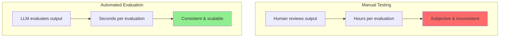
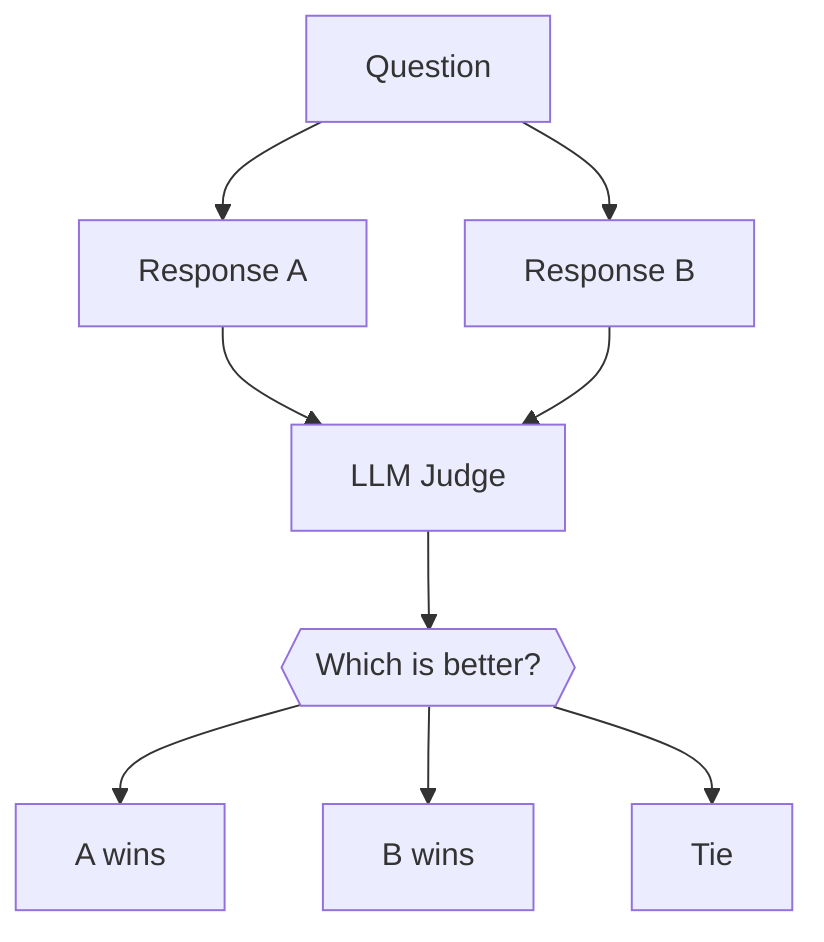
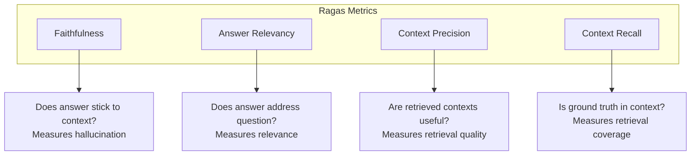
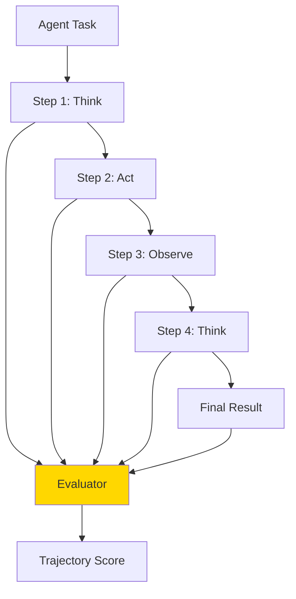
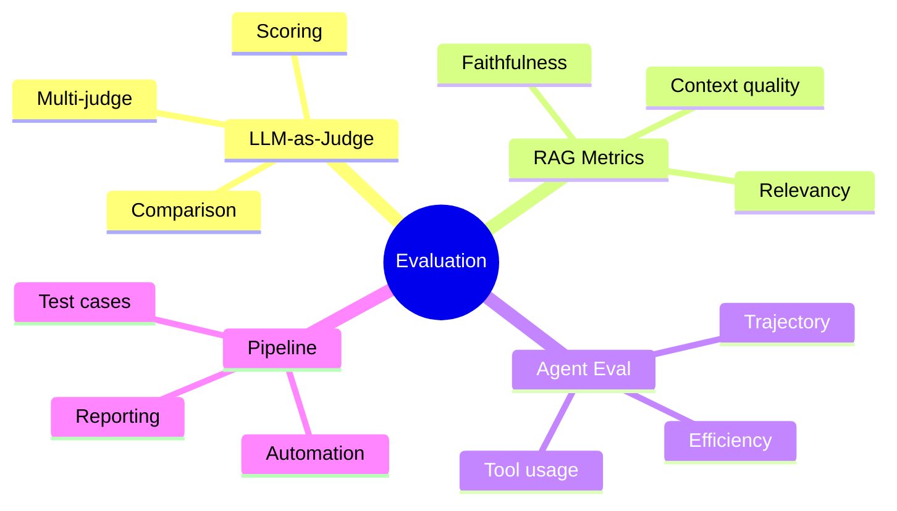

# Automated Evaluation: LLM-as-Judge & Ragas

How do you know if your agent is actually good? Manual testing doesn't scale. In this guide, you'll learn to use LLMs to automatically evaluate agent responses and RAG systems.

---

## Why Automated Evaluation?



Benefits of automated evaluation:
- **Scale**: Evaluate thousands of responses
- **Consistency**: Same criteria every time
- **Speed**: Seconds vs. hours
- **Iteration**: Test changes quickly

---

## LLM-as-Judge: The Basics

Use one LLM to evaluate another's output:

```python
from openai import OpenAI

client = OpenAI()

def evaluate_response(question: str, response: str, criteria: list[str]) -> dict:
    """
    Use an LLM to evaluate a response.

    Args:
        question: The original question
        response: The response to evaluate
        criteria: List of criteria to judge

    Returns:
        Evaluation scores and reasoning
    """

    criteria_text = "\n".join([f"- {c}" for c in criteria])

    eval_prompt = f"""You are an expert evaluator. Evaluate the following response.

QUESTION: {question}

RESPONSE: {response}

CRITERIA:
{criteria_text}

For each criterion, provide:
1. A score from 1-5 (1=poor, 5=excellent)
2. Brief reasoning

Format your response as:
CRITERION: [name]
SCORE: [1-5]
REASONING: [your reasoning]

Then provide an OVERALL score (1-5) and summary."""

    evaluation = client.chat.completions.create(
        model="gpt-4",
        messages=[{"role": "user", "content": eval_prompt}],
        temperature=0  # Consistent evaluations
    )

    return evaluation.choices[0].message.content

# Example usage
question = "What is machine learning?"
response = "Machine learning is a subset of AI where computers learn from data without being explicitly programmed."

criteria = [
    "Accuracy: Is the information correct?",
    "Completeness: Does it cover the key points?",
    "Clarity: Is it easy to understand?"
]

evaluation = evaluate_response(question, response, criteria)
print(evaluation)
```

---

## Structured Evaluation with Scores

Get numerical scores for easy comparison:

```python
from openai import OpenAI
import json

client = OpenAI()

def evaluate_with_scores(question: str, response: str) -> dict:
    """Get structured evaluation scores."""

    eval_prompt = f"""Evaluate this response on a scale of 1-5 for each criterion.

Question: {question}
Response: {response}

Return a JSON object with these scores:
- accuracy: How factually correct is the response?
- completeness: How thoroughly does it answer the question?
- clarity: How clear and understandable is it?
- relevance: How relevant is it to the question?
- conciseness: Is it appropriately concise (not too verbose)?

Also include:
- overall: Overall quality score (1-5)
- feedback: Brief constructive feedback

Return ONLY valid JSON."""

    result = client.chat.completions.create(
        model="gpt-4",
        messages=[{"role": "user", "content": eval_prompt}],
        response_format={"type": "json_object"},
        temperature=0
    )

    return json.loads(result.choices[0].message.content)

# Example
scores = evaluate_with_scores(
    "Explain photosynthesis",
    "Photosynthesis is when plants make food from sunlight."
)

print(f"Accuracy: {scores['accuracy']}/5")
print(f"Completeness: {scores['completeness']}/5")
print(f"Clarity: {scores['clarity']}/5")
print(f"Overall: {scores['overall']}/5")
print(f"Feedback: {scores['feedback']}")
```

---

## Pairwise Comparison

Compare two responses to find the better one:

```python
from openai import OpenAI
import json

client = OpenAI()

def compare_responses(question: str, response_a: str, response_b: str) -> dict:
    """
    Compare two responses and determine which is better.

    This is often more reliable than absolute scoring!
    """

    comparison_prompt = f"""Compare these two responses to the same question.

QUESTION: {question}

RESPONSE A:
{response_a}

RESPONSE B:
{response_b}

Evaluate which response is better and why. Consider:
- Accuracy
- Completeness
- Clarity
- Helpfulness

Return JSON with:
- winner: "A" or "B" or "tie"
- confidence: "high", "medium", or "low"
- reasoning: Brief explanation of your choice
- a_strengths: List of response A's strengths
- b_strengths: List of response B's strengths"""

    result = client.chat.completions.create(
        model="gpt-4",
        messages=[{"role": "user", "content": comparison_prompt}],
        response_format={"type": "json_object"},
        temperature=0
    )

    return json.loads(result.choices[0].message.content)

# Example
result = compare_responses(
    "What is a neural network?",
    "A neural network is a computer system inspired by the brain.",
    "A neural network is a machine learning model consisting of layers of interconnected nodes (neurons) that process information. Each connection has a weight that adjusts during training. Neural networks excel at pattern recognition tasks like image classification and natural language processing."
)

print(f"Winner: Response {result['winner']}")
print(f"Confidence: {result['confidence']}")
print(f"Reasoning: {result['reasoning']}")
```



---

## RAG Evaluation with Ragas

Ragas is a framework specifically designed to evaluate RAG pipelines:

```bash
pip install ragas
```

### Key Ragas Metrics

```python
from ragas import evaluate
from ragas.metrics import (
    faithfulness,
    answer_relevancy,
    context_precision,
    context_recall
)
from datasets import Dataset

# Prepare evaluation data
eval_data = {
    "question": [
        "What is the capital of France?",
        "Who wrote Romeo and Juliet?"
    ],
    "answer": [
        "The capital of France is Paris.",
        "Romeo and Juliet was written by William Shakespeare."
    ],
    "contexts": [
        ["Paris is the capital and largest city of France."],
        ["William Shakespeare wrote many plays including Romeo and Juliet, Hamlet, and Macbeth."]
    ],
    "ground_truth": [
        "Paris",
        "William Shakespeare"
    ]
}

dataset = Dataset.from_dict(eval_data)

# Run evaluation
results = evaluate(
    dataset,
    metrics=[
        faithfulness,        # Is answer grounded in context?
        answer_relevancy,    # Is answer relevant to question?
        context_precision,   # Are contexts relevant?
        context_recall       # Do contexts contain ground truth?
    ]
)

print(results)
```

### Understanding Ragas Metrics



### Custom RAG Evaluator

```python
from openai import OpenAI
import json

client = OpenAI()

class RAGEvaluator:
    """Evaluate RAG system responses."""

    def __init__(self):
        self.metrics = {}

    def evaluate_faithfulness(self, answer: str, contexts: list[str]) -> float:
        """Check if answer is grounded in the provided contexts."""

        context_text = "\n".join(contexts)

        prompt = f"""Evaluate if this answer is faithful to (grounded in) the given contexts.

CONTEXTS:
{context_text}

ANSWER:
{answer}

For each claim in the answer, check if it's supported by the contexts.
Return JSON:
{{
    "claims": ["claim1", "claim2", ...],
    "supported_claims": ["claim1", ...],
    "unsupported_claims": ["claim2", ...],
    "faithfulness_score": 0.0-1.0
}}"""

        result = client.chat.completions.create(
            model="gpt-4",
            messages=[{"role": "user", "content": prompt}],
            response_format={"type": "json_object"}
        )

        data = json.loads(result.choices[0].message.content)
        return data["faithfulness_score"]

    def evaluate_relevancy(self, question: str, answer: str) -> float:
        """Check if answer is relevant to the question."""

        prompt = f"""Evaluate if this answer is relevant to the question.

QUESTION: {question}

ANSWER: {answer}

Consider:
- Does it address what was asked?
- Is it on-topic?
- Does it provide useful information?

Return JSON:
{{
    "addresses_question": true/false,
    "on_topic": true/false,
    "provides_value": true/false,
    "relevancy_score": 0.0-1.0,
    "reasoning": "..."
}}"""

        result = client.chat.completions.create(
            model="gpt-4",
            messages=[{"role": "user", "content": prompt}],
            response_format={"type": "json_object"}
        )

        data = json.loads(result.choices[0].message.content)
        return data["relevancy_score"]

    def evaluate_context_quality(self, question: str, contexts: list[str]) -> float:
        """Check if retrieved contexts are relevant to the question."""

        context_text = "\n---\n".join([f"Context {i+1}: {c}" for i, c in enumerate(contexts)])

        prompt = f"""Evaluate the quality of these retrieved contexts for answering the question.

QUESTION: {question}

CONTEXTS:
{context_text}

For each context, rate its relevance to the question.
Return JSON:
{{
    "context_ratings": [
        {{"context_num": 1, "relevance": "high/medium/low", "useful_for_answer": true/false}},
        ...
    ],
    "overall_context_quality": 0.0-1.0,
    "reasoning": "..."
}}"""

        result = client.chat.completions.create(
            model="gpt-4",
            messages=[{"role": "user", "content": prompt}],
            response_format={"type": "json_object"}
        )

        data = json.loads(result.choices[0].message.content)
        return data["overall_context_quality"]

    def full_evaluation(self, question: str, answer: str, contexts: list[str]) -> dict:
        """Run full RAG evaluation."""

        return {
            "faithfulness": self.evaluate_faithfulness(answer, contexts),
            "relevancy": self.evaluate_relevancy(question, answer),
            "context_quality": self.evaluate_context_quality(question, contexts)
        }

# Usage
evaluator = RAGEvaluator()

result = evaluator.full_evaluation(
    question="What are the benefits of exercise?",
    answer="Exercise improves cardiovascular health, builds muscle, and boosts mood through endorphin release.",
    contexts=[
        "Regular exercise strengthens the heart and improves blood circulation.",
        "Physical activity releases endorphins, which are natural mood elevators.",
        "Strength training helps build and maintain muscle mass."
    ]
)

print(f"Faithfulness: {result['faithfulness']:.2%}")
print(f"Relevancy: {result['relevancy']:.2%}")
print(f"Context Quality: {result['context_quality']:.2%}")
```

---

## Agent Trajectory Evaluation

Evaluate not just the final answer, but the steps an agent took:

```python
from openai import OpenAI
import json

client = OpenAI()

def evaluate_agent_trajectory(task: str, trajectory: list[dict], final_result: str) -> dict:
    """
    Evaluate an agent's reasoning trajectory.

    Args:
        task: The original task
        trajectory: List of steps taken (thought, action, observation)
        final_result: The final output
    """

    trajectory_text = ""
    for i, step in enumerate(trajectory):
        trajectory_text += f"\nStep {i+1}:\n"
        trajectory_text += f"  Thought: {step.get('thought', 'N/A')}\n"
        trajectory_text += f"  Action: {step.get('action', 'N/A')}\n"
        trajectory_text += f"  Result: {step.get('result', 'N/A')}\n"

    prompt = f"""Evaluate this agent's problem-solving trajectory.

TASK: {task}

TRAJECTORY:
{trajectory_text}

FINAL RESULT: {final_result}

Evaluate:
1. Efficiency: Did it take a reasonable path? (1-5)
2. Correctness: Were the reasoning steps valid? (1-5)
3. Tool Usage: Were tools used appropriately? (1-5)
4. Goal Achievement: Did it accomplish the task? (1-5)

Return JSON:
{{
    "efficiency": {{"score": 1-5, "feedback": "..."}},
    "correctness": {{"score": 1-5, "feedback": "..."}},
    "tool_usage": {{"score": 1-5, "feedback": "..."}},
    "goal_achievement": {{"score": 1-5, "feedback": "..."}},
    "overall_score": 1-5,
    "improvements": ["suggestion1", "suggestion2"]
}}"""

    result = client.chat.completions.create(
        model="gpt-4",
        messages=[{"role": "user", "content": prompt}],
        response_format={"type": "json_object"},
        temperature=0
    )

    return json.loads(result.choices[0].message.content)

# Example trajectory
trajectory = [
    {
        "thought": "I need to find the weather in Tokyo",
        "action": "search('Tokyo weather')",
        "result": "Current weather: 72°F, sunny"
    },
    {
        "thought": "Now I should convert to Celsius for the user",
        "action": "calculate('(72-32)*5/9')",
        "result": "22.2°C"
    },
    {
        "thought": "I have all the information needed",
        "action": "respond",
        "result": "The weather in Tokyo is 22°C and sunny"
    }
]

evaluation = evaluate_agent_trajectory(
    task="What's the weather in Tokyo in Celsius?",
    trajectory=trajectory,
    final_result="The weather in Tokyo is 22°C and sunny"
)

print(f"Overall Score: {evaluation['overall_score']}/5")
print(f"Efficiency: {evaluation['efficiency']['score']}/5")
print(f"Improvements: {evaluation['improvements']}")
```



---

## Building an Evaluation Pipeline

Run evaluations automatically on your test set:

```python
from dataclasses import dataclass
from typing import List, Callable
import json
import time

@dataclass
class TestCase:
    question: str
    expected_answer: str = None
    context: List[str] = None
    metadata: dict = None

@dataclass
class EvalResult:
    test_case: TestCase
    response: str
    scores: dict
    passed: bool
    duration: float

class EvaluationPipeline:
    """Automated evaluation pipeline for agents."""

    def __init__(self, agent_fn: Callable, evaluator: Callable):
        """
        Args:
            agent_fn: Function that takes question, returns response
            evaluator: Function that takes (question, response), returns scores
        """
        self.agent_fn = agent_fn
        self.evaluator = evaluator
        self.results: List[EvalResult] = []

    def run(self, test_cases: List[TestCase], pass_threshold: float = 0.7) -> dict:
        """Run evaluation on all test cases."""

        print(f"Running evaluation on {len(test_cases)} test cases...")

        for i, test_case in enumerate(test_cases):
            print(f"\n[{i+1}/{len(test_cases)}] Evaluating: {test_case.question[:50]}...")

            # Time the agent
            start = time.time()
            response = self.agent_fn(test_case.question)
            duration = time.time() - start

            # Evaluate
            scores = self.evaluator(test_case.question, response)

            # Determine if passed
            avg_score = sum(scores.values()) / len(scores) if scores else 0
            passed = avg_score >= pass_threshold

            result = EvalResult(
                test_case=test_case,
                response=response,
                scores=scores,
                passed=passed,
                duration=duration
            )
            self.results.append(result)

            print(f"   Score: {avg_score:.2f} | {'✅ PASS' if passed else '❌ FAIL'}")

        return self.get_summary()

    def get_summary(self) -> dict:
        """Get evaluation summary."""

        total = len(self.results)
        passed = sum(1 for r in self.results if r.passed)

        # Aggregate scores
        all_scores = {}
        for result in self.results:
            for metric, score in result.scores.items():
                if metric not in all_scores:
                    all_scores[metric] = []
                all_scores[metric].append(score)

        avg_scores = {metric: sum(scores)/len(scores) for metric, scores in all_scores.items()}

        return {
            "total_tests": total,
            "passed": passed,
            "failed": total - passed,
            "pass_rate": passed / total if total > 0 else 0,
            "average_scores": avg_scores,
            "average_duration": sum(r.duration for r in self.results) / total if total > 0 else 0
        }

# Example usage
def my_agent(question: str) -> str:
    """Your agent implementation."""
    # Simplified for example
    return f"Answer to: {question}"

def my_evaluator(question: str, response: str) -> dict:
    """Your evaluation logic."""
    # Use LLM-as-judge here
    return {
        "relevancy": 0.8,
        "accuracy": 0.7,
        "clarity": 0.9
    }

# Create and run pipeline
pipeline = EvaluationPipeline(my_agent, my_evaluator)

test_cases = [
    TestCase(question="What is Python?", expected_answer="A programming language"),
    TestCase(question="What is 2+2?", expected_answer="4"),
    TestCase(question="Explain machine learning", expected_answer="...")
]

summary = pipeline.run(test_cases, pass_threshold=0.75)

print(f"\n{'='*50}")
print(f"EVALUATION SUMMARY")
print(f"{'='*50}")
print(f"Pass Rate: {summary['pass_rate']:.1%}")
print(f"Average Scores: {summary['average_scores']}")
print(f"Average Duration: {summary['average_duration']:.2f}s")
```

---

## Best Practices

### 1. Use Multiple Judges

```python
def multi_judge_evaluation(question: str, response: str) -> dict:
    """Use multiple LLM judges for more reliable evaluation."""

    judges = ["gpt-4", "gpt-4-turbo", "claude-3-opus"]
    all_scores = []

    for judge in judges:
        scores = evaluate_with_model(question, response, model=judge)
        all_scores.append(scores)

    # Average across judges
    final_scores = {}
    for key in all_scores[0].keys():
        final_scores[key] = sum(s[key] for s in all_scores) / len(all_scores)

    return final_scores
```

### 2. Calibrate Your Evaluator

```python
# Create calibration set with known scores
calibration_set = [
    {"question": "...", "response": "...", "expected_score": 5},  # Perfect
    {"question": "...", "response": "...", "expected_score": 3},  # Average
    {"question": "...", "response": "...", "expected_score": 1},  # Poor
]

# Test that your evaluator gives similar scores
for item in calibration_set:
    actual_score = evaluate(item["question"], item["response"])
    expected = item["expected_score"]
    print(f"Expected: {expected}, Got: {actual_score}")
```

### 3. Include Edge Cases

```python
edge_case_tests = [
    TestCase("", expected_answer="Should handle empty input"),
    TestCase("a" * 10000, expected_answer="Should handle very long input"),
    TestCase("🚀 emoji test 🎉", expected_answer="Should handle special characters"),
    TestCase("What is asdfghjkl?", expected_answer="Should handle unknown topics"),
]
```

---

## Summary



---

## Quick Reference

```python
# Simple LLM-as-Judge
scores = evaluate_with_scores(question, response)

# Pairwise comparison
result = compare_responses(question, response_a, response_b)

# Ragas evaluation
from ragas import evaluate
results = evaluate(dataset, metrics=[faithfulness, answer_relevancy])

# Full pipeline
pipeline = EvaluationPipeline(agent_fn, evaluator_fn)
summary = pipeline.run(test_cases)
```

---

## What's Next?

Now you can measure agent quality! Next, we'll explore **Security & Guardrails** - protecting your agents from attacks and ensuring safe behavior.
