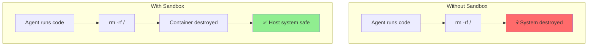
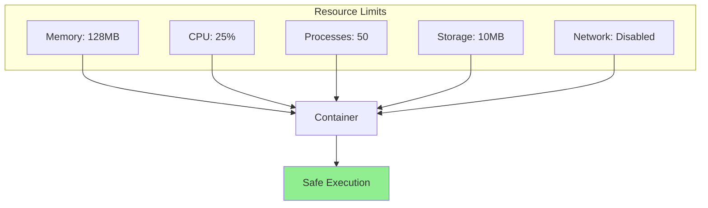
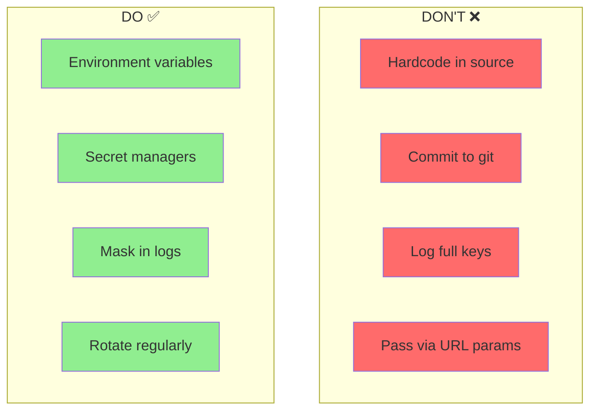
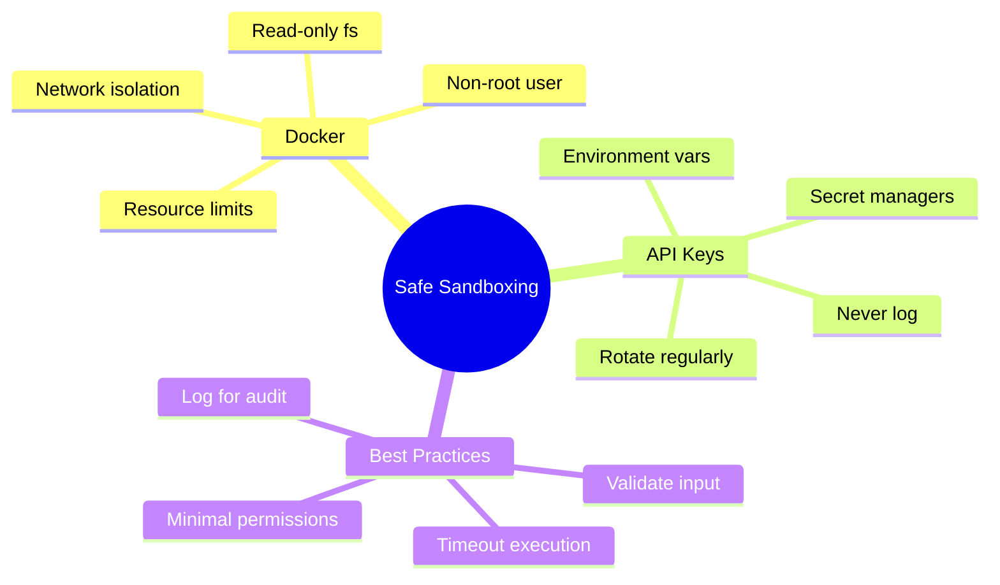

# Safe Sandboxing: Docker & API Key Security

When agents execute code, they need a safe environment. In this guide, you'll learn to sandbox agent execution with Docker and protect your API keys from exposure.

---

## Why Sandboxing Matters



Risks of unsandboxed code execution:
- **File system access** - Delete or modify important files
- **Network access** - Make unauthorized requests
- **Resource exhaustion** - Infinite loops, memory bombs
- **Data exfiltration** - Steal sensitive information
- **Privilege escalation** - Gain system access

---

## Docker Basics for Sandboxing

Docker creates isolated containers that protect your host system:

```bash
# Install Docker (if not installed)
# macOS: brew install docker
# Ubuntu: apt install docker.io
# Windows: Download Docker Desktop

# Verify installation
docker --version
```

### Your First Sandbox

```python
import docker
import tempfile
import os

def run_code_in_sandbox(code: str, timeout: int = 30) -> dict:
    """
    Run Python code safely in a Docker container.

    Args:
        code: Python code to execute
        timeout: Maximum execution time in seconds

    Returns:
        dict with stdout, stderr, and exit code
    """

    # Initialize Docker client
    client = docker.from_env()

    # Create temp file with the code
    with tempfile.NamedTemporaryFile(mode='w', suffix='.py', delete=False) as f:
        f.write(code)
        code_file = f.name

    try:
        # Run in container
        result = client.containers.run(
            image="python:3.11-slim",
            command=f"python /code/script.py",
            volumes={
                os.path.dirname(code_file): {'bind': '/code', 'mode': 'ro'}
            },
            working_dir="/code",
            remove=True,  # Auto-remove container after execution
            timeout=timeout,
            mem_limit="256m",  # Limit memory
            network_disabled=True,  # No network access
            read_only=True,  # Read-only filesystem
        )

        return {
            "stdout": result.decode('utf-8'),
            "stderr": "",
            "exit_code": 0
        }

    except docker.errors.ContainerError as e:
        return {
            "stdout": "",
            "stderr": e.stderr.decode('utf-8') if e.stderr else str(e),
            "exit_code": e.exit_status
        }
    except docker.errors.APIError as e:
        return {
            "stdout": "",
            "stderr": str(e),
            "exit_code": -1
        }
    finally:
        os.unlink(code_file)

# Example usage
code = """
print("Hello from sandbox!")
print(2 + 2)
"""

result = run_code_in_sandbox(code)
print(f"Output: {result['stdout']}")
print(f"Exit code: {result['exit_code']}")
```

---

## Building a Secure Sandbox Image

Create a custom Docker image with security restrictions:

```dockerfile
# Dockerfile.sandbox
FROM python:3.11-slim

# Create non-root user
RUN useradd -m -s /bin/bash sandbox

# Install common packages
RUN pip install --no-cache-dir \
    numpy \
    pandas \
    matplotlib \
    requests

# Remove dangerous packages
RUN pip uninstall -y pip setuptools wheel

# Set working directory
WORKDIR /sandbox

# Switch to non-root user
USER sandbox

# Default command
CMD ["python"]
```

Build and use the image:

```bash
docker build -t sandbox:latest -f Dockerfile.sandbox .
```

```python
def run_in_secure_sandbox(code: str, timeout: int = 30) -> dict:
    """Run code in a custom secure sandbox."""

    client = docker.from_env()

    # Write code to temp file
    with tempfile.NamedTemporaryFile(mode='w', suffix='.py', delete=False) as f:
        f.write(code)
        code_file = f.name

    try:
        container = client.containers.run(
            image="sandbox:latest",  # Our custom image
            command=f"python /sandbox/script.py",
            volumes={
                os.path.dirname(code_file): {'bind': '/sandbox', 'mode': 'ro'}
            },
            detach=True,
            mem_limit="512m",
            memswap_limit="512m",  # No swap
            cpu_period=100000,
            cpu_quota=50000,  # 50% of one CPU
            network_disabled=True,
            read_only=True,
            security_opt=["no-new-privileges"],
            cap_drop=["ALL"],  # Drop all capabilities
        )

        # Wait for completion with timeout
        result = container.wait(timeout=timeout)
        logs = container.logs()

        container.remove()

        return {
            "stdout": logs.decode('utf-8'),
            "exit_code": result['StatusCode']
        }

    except Exception as e:
        return {"error": str(e)}
    finally:
        os.unlink(code_file)
```

---

## Container Resource Limits

Prevent resource exhaustion attacks:

```python
def create_limited_container(code: str) -> dict:
    """Create container with strict resource limits."""

    client = docker.from_env()

    container_config = {
        "image": "python:3.11-slim",
        "command": ["python", "-c", code],

        # Memory limits
        "mem_limit": "128m",       # Max 128MB RAM
        "memswap_limit": "128m",   # No swap

        # CPU limits
        "cpu_period": 100000,
        "cpu_quota": 25000,        # 25% of one CPU
        "cpu_shares": 256,         # Low priority

        # Process limits
        "pids_limit": 50,          # Max 50 processes

        # Storage limits
        "read_only": True,
        "tmpfs": {"/tmp": "size=10m"},  # 10MB temp space

        # Network
        "network_disabled": True,

        # Security
        "security_opt": ["no-new-privileges"],
        "cap_drop": ["ALL"],

        # Auto cleanup
        "remove": True,
    }

    try:
        result = client.containers.run(**container_config)
        return {"output": result.decode('utf-8')}
    except docker.errors.ContainerError as e:
        return {"error": str(e)}
```



---

## Input/Output Handling

Safely pass data to and from sandboxed code:

```python
import json
import base64

class SandboxIO:
    """Handle input/output with sandboxed code."""

    def __init__(self):
        self.client = docker.from_env()

    def run_with_data(self, code: str, input_data: dict) -> dict:
        """
        Run code with input data and capture structured output.

        Args:
            code: Python code to execute
            input_data: Data to pass to the code

        Returns:
            Output data from the code
        """

        # Wrap code to handle I/O
        wrapped_code = f'''
import json
import sys

# Input data (passed from host)
INPUT_DATA = {json.dumps(input_data)}

# User code
{code}

# Capture output if 'result' variable exists
if 'result' in dir():
    print("__OUTPUT_START__")
    print(json.dumps(result))
    print("__OUTPUT_END__")
'''

        result = self._execute(wrapped_code)

        # Parse output
        if "__OUTPUT_START__" in result.get("stdout", ""):
            output_section = result["stdout"].split("__OUTPUT_START__")[1]
            output_section = output_section.split("__OUTPUT_END__")[0].strip()
            try:
                result["data"] = json.loads(output_section)
            except json.JSONDecodeError:
                result["data"] = None

        return result

    def _execute(self, code: str) -> dict:
        """Execute code in container."""

        with tempfile.NamedTemporaryFile(mode='w', suffix='.py', delete=False) as f:
            f.write(code)
            code_path = f.name

        try:
            output = self.client.containers.run(
                image="python:3.11-slim",
                command=["python", "/code/script.py"],
                volumes={os.path.dirname(code_path): {'bind': '/code', 'mode': 'ro'}},
                remove=True,
                network_disabled=True,
                mem_limit="128m"
            )
            return {"stdout": output.decode('utf-8'), "exit_code": 0}
        except docker.errors.ContainerError as e:
            return {"stderr": str(e), "exit_code": e.exit_status}
        finally:
            os.unlink(code_path)

# Example usage
sandbox = SandboxIO()

code = """
# Access input data
numbers = INPUT_DATA['numbers']

# Process
result = {
    'sum': sum(numbers),
    'average': sum(numbers) / len(numbers),
    'count': len(numbers)
}
"""

output = sandbox.run_with_data(code, {"numbers": [1, 2, 3, 4, 5]})
print(f"Result: {output.get('data')}")
# Result: {'sum': 15, 'average': 3.0, 'count': 5}
```

---

## API Key Security

Never expose API keys in agent code or logs!

### Environment Variable Pattern

```python
import os
from typing import Optional

class SecureAPIClient:
    """API client that securely handles credentials."""

    def __init__(self):
        self.api_key = self._load_api_key()

    def _load_api_key(self) -> str:
        """Load API key from secure source."""

        # Priority: Environment variable > Secret file > Error
        api_key = os.environ.get("OPENAI_API_KEY")

        if not api_key:
            secret_path = os.path.expanduser("~/.secrets/openai_key")
            if os.path.exists(secret_path):
                with open(secret_path, 'r') as f:
                    api_key = f.read().strip()

        if not api_key:
            raise ValueError(
                "API key not found! Set OPENAI_API_KEY environment variable "
                "or create ~/.secrets/openai_key"
            )

        return api_key

    def get_masked_key(self) -> str:
        """Return masked version for logging."""
        if len(self.api_key) > 8:
            return self.api_key[:4] + "****" + self.api_key[-4:]
        return "****"

# Usage
client = SecureAPIClient()
print(f"Using API key: {client.get_masked_key()}")  # sk-ab****wxyz
```

### Secret Injection for Containers

```python
import docker
import tempfile

def run_with_secrets(code: str, secrets: dict) -> dict:
    """
    Run code with secrets injected as environment variables.

    Secrets are NEVER written to disk or logs!
    """

    client = docker.from_env()

    with tempfile.NamedTemporaryFile(mode='w', suffix='.py', delete=False) as f:
        f.write(code)
        code_path = f.name

    try:
        # Inject secrets as environment variables
        result = client.containers.run(
            image="python:3.11-slim",
            command=["python", "/code/script.py"],
            volumes={os.path.dirname(code_path): {'bind': '/code', 'mode': 'ro'}},
            environment=secrets,  # Secrets passed here
            remove=True,
            mem_limit="128m"
        )
        return {"output": result.decode('utf-8')}
    except docker.errors.ContainerError as e:
        return {"error": str(e)}
    finally:
        os.unlink(code_path)

# Usage - secrets never touch disk!
code = """
import os
api_key = os.environ.get('API_KEY')
print(f"API key loaded: {'Yes' if api_key else 'No'}")
# Do something with API key...
"""

result = run_with_secrets(code, {"API_KEY": "sk-secret-key-here"})
```

### Secrets Management Best Practices



---

## Using Secret Managers

For production, use dedicated secret management:

### AWS Secrets Manager

```python
import boto3
import json

def get_secret(secret_name: str, region: str = "us-east-1") -> dict:
    """Retrieve secret from AWS Secrets Manager."""

    client = boto3.client('secretsmanager', region_name=region)

    try:
        response = client.get_secret_value(SecretId=secret_name)
        return json.loads(response['SecretString'])
    except Exception as e:
        raise ValueError(f"Failed to retrieve secret: {e}")

# Usage
secrets = get_secret("my-app/api-keys")
openai_key = secrets["OPENAI_API_KEY"]
```

### HashiCorp Vault

```python
import hvac

def get_vault_secret(path: str, vault_url: str = "http://localhost:8200") -> dict:
    """Retrieve secret from HashiCorp Vault."""

    client = hvac.Client(url=vault_url)
    client.token = os.environ.get("VAULT_TOKEN")

    secret = client.secrets.kv.v2.read_secret_version(path=path)
    return secret['data']['data']

# Usage
secrets = get_vault_secret("secret/my-app")
api_key = secrets["api_key"]
```

### Local Development with .env

```python
# .env file (add to .gitignore!)
# OPENAI_API_KEY=sk-your-key-here

from dotenv import load_dotenv
import os

# Load environment variables from .env
load_dotenv()

# Now access normally
api_key = os.environ.get("OPENAI_API_KEY")
```

---

## Complete Secure Sandbox System

Putting it all together:

```python
import docker
import tempfile
import os
import json
import hashlib
from datetime import datetime
from typing import Optional

class SecureSandbox:
    """Production-ready secure code execution sandbox."""

    def __init__(self,
                 image: str = "python:3.11-slim",
                 max_memory: str = "256m",
                 max_cpu: float = 0.5,
                 timeout: int = 30):

        self.client = docker.from_env()
        self.image = image
        self.max_memory = max_memory
        self.max_cpu = max_cpu
        self.timeout = timeout
        self.execution_log = []

    def execute(self,
                code: str,
                input_data: Optional[dict] = None,
                allowed_packages: list = None) -> dict:
        """
        Execute code safely in a sandboxed container.

        Args:
            code: Python code to execute
            input_data: Data to pass to the code
            allowed_packages: List of allowed import statements

        Returns:
            Execution result with output, errors, and metadata
        """

        # Validate code (basic checks)
        validation = self._validate_code(code, allowed_packages)
        if not validation["valid"]:
            return {"error": validation["reason"], "executed": False}

        # Prepare execution
        execution_id = self._generate_execution_id(code)
        wrapped_code = self._wrap_code(code, input_data)

        # Create temp file
        with tempfile.NamedTemporaryFile(mode='w', suffix='.py', delete=False) as f:
            f.write(wrapped_code)
            code_path = f.name

        start_time = datetime.now()

        try:
            container = self.client.containers.run(
                image=self.image,
                command=["python", "/sandbox/script.py"],
                volumes={
                    os.path.dirname(code_path): {'bind': '/sandbox', 'mode': 'ro'}
                },
                detach=True,
                mem_limit=self.max_memory,
                memswap_limit=self.max_memory,
                cpu_period=100000,
                cpu_quota=int(self.max_cpu * 100000),
                network_disabled=True,
                read_only=True,
                tmpfs={"/tmp": "size=10m,mode=1777"},
                security_opt=["no-new-privileges"],
                cap_drop=["ALL"],
            )

            # Wait with timeout
            result = container.wait(timeout=self.timeout)
            logs = container.logs().decode('utf-8')
            exit_code = result['StatusCode']

            # Cleanup
            container.remove()

            execution_time = (datetime.now() - start_time).total_seconds()

            # Parse output
            output = self._parse_output(logs)

            result = {
                "execution_id": execution_id,
                "executed": True,
                "exit_code": exit_code,
                "stdout": output.get("stdout", ""),
                "data": output.get("data"),
                "execution_time": execution_time,
                "success": exit_code == 0
            }

        except docker.errors.ContainerError as e:
            result = {
                "execution_id": execution_id,
                "executed": True,
                "exit_code": e.exit_status,
                "error": str(e),
                "success": False
            }
        except Exception as e:
            result = {
                "execution_id": execution_id,
                "executed": False,
                "error": str(e),
                "success": False
            }
        finally:
            os.unlink(code_path)

        # Log execution
        self._log_execution(result)

        return result

    def _validate_code(self, code: str, allowed_packages: list = None) -> dict:
        """Basic code validation."""

        dangerous_patterns = [
            "subprocess",
            "os.system",
            "eval(",
            "exec(",
            "__import__",
            "open(",  # Can be allowed selectively
        ]

        for pattern in dangerous_patterns:
            if pattern in code:
                return {"valid": False, "reason": f"Forbidden pattern: {pattern}"}

        return {"valid": True}

    def _wrap_code(self, code: str, input_data: Optional[dict]) -> str:
        """Wrap user code with I/O handling."""

        return f'''
import json
import sys

# Input data
INPUT_DATA = {json.dumps(input_data or {})}

# Capture print output
_original_print = print
_output_lines = []

def print(*args, **kwargs):
    import io
    output = io.StringIO()
    _original_print(*args, file=output, **kwargs)
    _output_lines.append(output.getvalue())
    _original_print(*args, **kwargs)

# User code
try:
{self._indent_code(code)}
except Exception as e:
    print(f"Error: {{e}}")
    sys.exit(1)

# Output result
if 'result' in dir():
    print("__RESULT_JSON__")
    print(json.dumps(result))
'''

    def _indent_code(self, code: str) -> str:
        """Indent code for wrapping."""
        return '\n'.join('    ' + line for line in code.split('\n'))

    def _parse_output(self, logs: str) -> dict:
        """Parse container output."""

        output = {"stdout": logs}

        if "__RESULT_JSON__" in logs:
            parts = logs.split("__RESULT_JSON__")
            output["stdout"] = parts[0].strip()
            try:
                output["data"] = json.loads(parts[1].strip())
            except:
                pass

        return output

    def _generate_execution_id(self, code: str) -> str:
        """Generate unique execution ID."""
        timestamp = datetime.now().isoformat()
        content = f"{timestamp}:{code}"
        return hashlib.sha256(content.encode()).hexdigest()[:12]

    def _log_execution(self, result: dict):
        """Log execution for auditing."""
        self.execution_log.append({
            "timestamp": datetime.now().isoformat(),
            **result
        })

# Usage
sandbox = SecureSandbox(
    max_memory="128m",
    max_cpu=0.25,
    timeout=10
)

code = """
numbers = INPUT_DATA.get('numbers', [])
result = {
    'sum': sum(numbers),
    'product': 1
}
for n in numbers:
    result['product'] *= n
print(f"Processed {len(numbers)} numbers")
"""

output = sandbox.execute(code, input_data={"numbers": [1, 2, 3, 4, 5]})
print(f"Success: {output['success']}")
print(f"Output: {output.get('stdout')}")
print(f"Result: {output.get('data')}")
```

---

## Summary



---

## Quick Reference

```python
# Basic Docker sandbox
result = client.containers.run(
    image="python:3.11-slim",
    command=["python", "-c", code],
    mem_limit="128m",
    network_disabled=True,
    read_only=True,
    remove=True
)

# Load API key safely
api_key = os.environ.get("API_KEY")

# Mask for logging
masked = key[:4] + "****" + key[-4:]

# Inject secrets to container
client.containers.run(
    environment={"API_KEY": secret_key},
    ...
)
```

---

## Security Checklist

Before deploying sandboxed execution:

- [ ] Memory limits set
- [ ] CPU limits set
- [ ] Network disabled
- [ ] Filesystem read-only
- [ ] Non-root user
- [ ] Capabilities dropped
- [ ] Timeout configured
- [ ] Input validation enabled
- [ ] API keys in environment variables
- [ ] Secrets never logged
- [ ] Execution auditing enabled

---

## What's Next?

You've learned to secure your agents! In Month 6, we'll explore **Production Deployment** - taking your agents from development to the real world!
