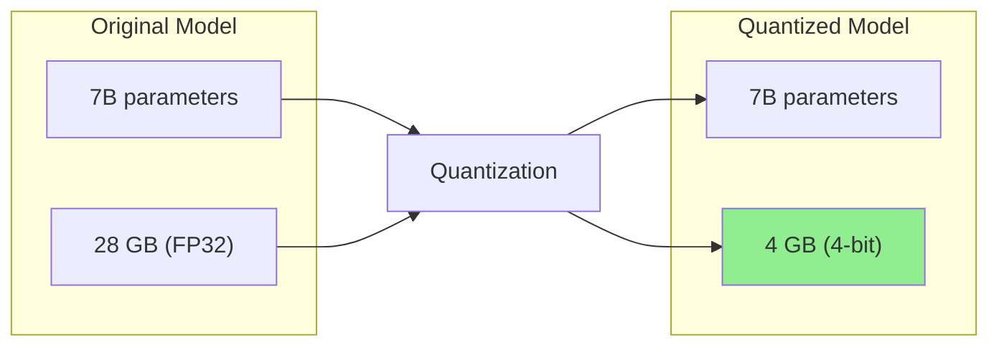
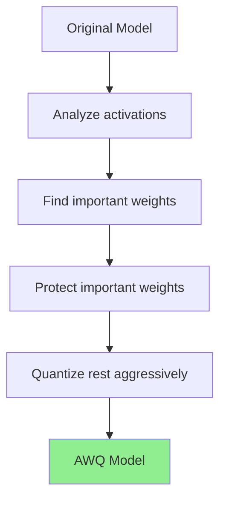
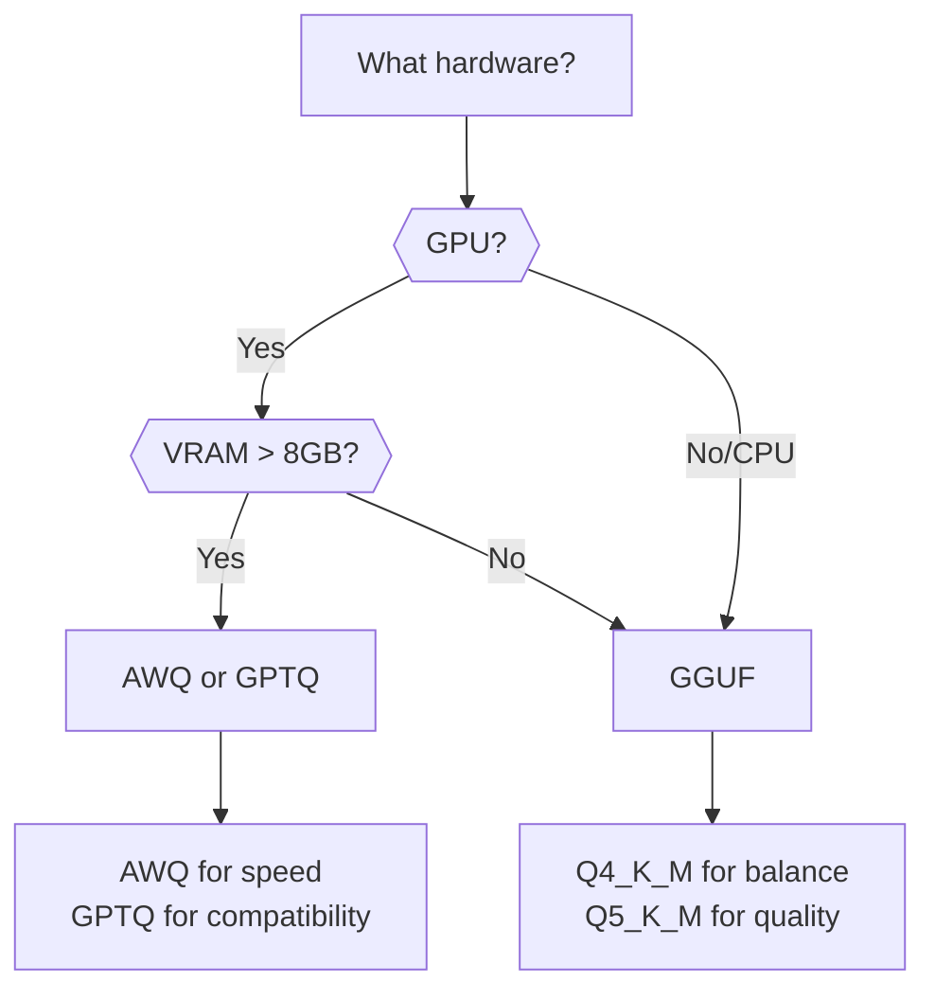
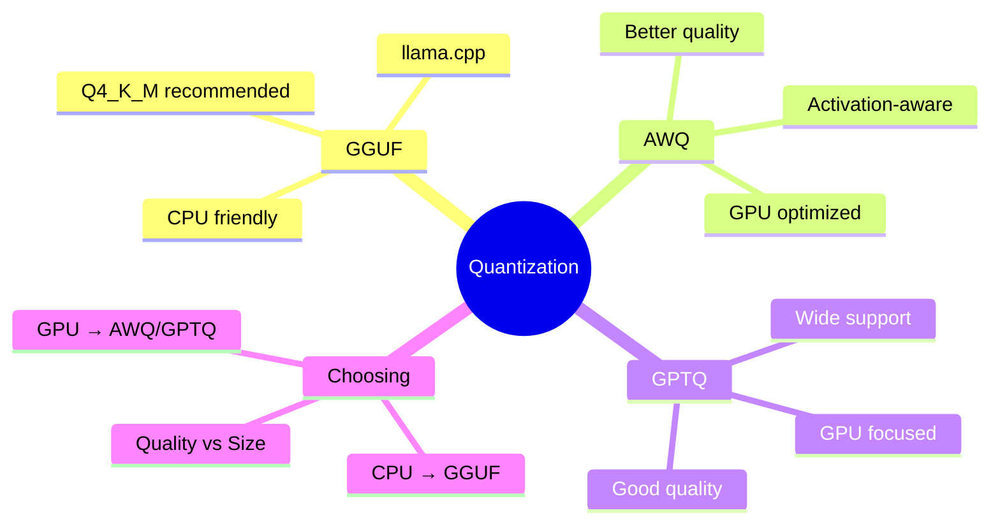

# Understanding Quantization: GGUF & AWQ

Want to run large models on your laptop? Quantization makes models smaller and faster while keeping quality. This guide explains how.

---

## What is Quantization?



Quantization reduces precision of model weights:
- **FP32**: 32 bits per parameter (full precision)
- **FP16**: 16 bits per parameter (half precision)
- **INT8**: 8 bits per parameter (1/4 size)
- **INT4**: 4 bits per parameter (1/8 size)

---

## Why Quantize?

| Aspect | Original (FP32) | Quantized (4-bit) |
|--------|-----------------|-------------------|
| Size | 28 GB | 4 GB |
| RAM needed | 32+ GB | 6 GB |
| Speed | Slow | Fast |
| Quality | Best | ~95% of original |

Trade-offs:
- **Smaller** = fits on consumer hardware
- **Faster** = better inference speed
- **Slight quality loss** = usually acceptable

---

## GGUF Format

GGUF (GPT-Generated Unified Format) is the standard for llama.cpp:

### Understanding GGUF Naming

```
llama-2-7b-chat.Q4_K_M.gguf
         │         │  │
         │         │  └─ M = Medium (size variant)
         │         └──── K = K-quant method
         └────────────── Q4 = 4-bit quantization
```

### Quantization Levels

| Name | Bits | Size (7B) | Quality | Use Case |
|------|------|-----------|---------|----------|
| Q2_K | 2-bit | ~2.5 GB | Low | Extreme constraints |
| Q3_K_S | 3-bit | ~3 GB | Fair | Very limited RAM |
| Q4_K_S | 4-bit | ~4 GB | Good | Balanced |
| Q4_K_M | 4-bit | ~4.5 GB | Better | **Recommended** |
| Q5_K_S | 5-bit | ~5 GB | Great | Quality focus |
| Q5_K_M | 5-bit | ~5.5 GB | Excellent | Best balance |
| Q6_K | 6-bit | ~6 GB | Near FP16 | Quality priority |
| Q8_0 | 8-bit | ~7.5 GB | ~FP16 | Maximum quality |

### Using GGUF with Ollama

```bash
# Ollama automatically uses GGUF
ollama pull llama2:7b-q4_K_M

# Or specify quantization
ollama run llama2:7b-chat-q5_K_M
```

### Using GGUF with llama.cpp

```bash
# Install llama.cpp
git clone https://github.com/ggerganov/llama.cpp
cd llama.cpp && make

# Download GGUF model
wget https://huggingface.co/TheBloke/Llama-2-7B-Chat-GGUF/resolve/main/llama-2-7b-chat.Q4_K_M.gguf

# Run inference
./main -m llama-2-7b-chat.Q4_K_M.gguf -p "Hello, how are you?"
```

### Using with Python

```python
from llama_cpp import Llama

# Load quantized model
llm = Llama(
    model_path="./models/llama-2-7b-chat.Q4_K_M.gguf",
    n_ctx=2048,  # Context window
    n_threads=4  # CPU threads
)

# Generate
output = llm(
    "What is machine learning?",
    max_tokens=256,
    temperature=0.7
)

print(output["choices"][0]["text"])
```

---

## AWQ Quantization

AWQ (Activation-aware Weight Quantization) preserves important weights:



### Why AWQ?

- **Smarter** quantization than uniform methods
- **Better quality** at same bit-width
- **GPU optimized** (faster than GGUF on GPU)

### Using AWQ Models

```bash
# Install dependencies
pip install autoawq transformers

# Or with vLLM
pip install vllm
```

```python
from awq import AutoAWQForCausalLM
from transformers import AutoTokenizer

# Load AWQ model
model_path = "TheBloke/Llama-2-7B-Chat-AWQ"

model = AutoAWQForCausalLM.from_quantized(
    model_path,
    fuse_layers=True,
    trust_remote_code=True
)
tokenizer = AutoTokenizer.from_pretrained(model_path)

# Generate
prompt = "What is quantum computing?"
inputs = tokenizer(prompt, return_tensors="pt").to("cuda")

outputs = model.generate(
    **inputs,
    max_new_tokens=256,
    temperature=0.7
)

print(tokenizer.decode(outputs[0]))
```

### AWQ with vLLM

```python
from vllm import LLM, SamplingParams

# Load AWQ model with vLLM
llm = LLM(
    model="TheBloke/Llama-2-7B-Chat-AWQ",
    quantization="awq",
    dtype="half"
)

# Generate
sampling_params = SamplingParams(
    temperature=0.7,
    max_tokens=256
)

outputs = llm.generate(["What is AI?"], sampling_params)
print(outputs[0].outputs[0].text)
```

---

## GPTQ Quantization

Another popular GPU-focused quantization:

```python
from transformers import AutoModelForCausalLM, AutoTokenizer

# Load GPTQ model
model_name = "TheBloke/Llama-2-7B-Chat-GPTQ"

model = AutoModelForCausalLM.from_pretrained(
    model_name,
    device_map="auto",
    trust_remote_code=True
)
tokenizer = AutoTokenizer.from_pretrained(model_name)

# Generate
inputs = tokenizer("Hello!", return_tensors="pt").to("cuda")
outputs = model.generate(**inputs, max_new_tokens=100)
print(tokenizer.decode(outputs[0]))
```

---

## Choosing the Right Format



| Format | Best For | Hardware |
|--------|----------|----------|
| GGUF | CPU or mixed | Any |
| AWQ | GPU inference | NVIDIA GPU |
| GPTQ | GPU inference | NVIDIA GPU |

---

## Quantizing Your Own Models

### Convert to GGUF

```bash
# Clone llama.cpp
git clone https://github.com/ggerganov/llama.cpp
cd llama.cpp

# Convert HuggingFace model to GGUF
python convert.py /path/to/model --outfile model-f16.gguf

# Quantize to desired level
./quantize model-f16.gguf model-q4_K_M.gguf Q4_K_M
```

### Create AWQ Model

```python
from awq import AutoAWQForCausalLM
from transformers import AutoTokenizer

model_path = "meta-llama/Llama-2-7b-hf"
quant_path = "llama-2-7b-awq"

# Load model
model = AutoAWQForCausalLM.from_pretrained(model_path)
tokenizer = AutoTokenizer.from_pretrained(model_path)

# Quantize
quant_config = {
    "zero_point": True,
    "q_group_size": 128,
    "w_bit": 4
}

model.quantize(tokenizer, quant_config=quant_config)

# Save
model.save_quantized(quant_path)
tokenizer.save_pretrained(quant_path)
```

---

## Quality Comparison

```python
def compare_quantizations(prompt: str, original_model, quantized_model):
    """Compare output quality between models."""

    # Original
    original_output = original_model.generate(prompt)

    # Quantized
    quantized_output = quantized_model.generate(prompt)

    print("Original:", original_output[:200])
    print("Quantized:", quantized_output[:200])

    # Simple similarity check
    from difflib import SequenceMatcher
    similarity = SequenceMatcher(None, original_output, quantized_output).ratio()
    print(f"Similarity: {similarity:.2%}")
```

---

## Summary



---

## Quick Reference

```bash
# Ollama with quantization
ollama pull llama2:7b-q4_K_M

# GGUF quantization levels
Q4_K_M  # Balanced (recommended)
Q5_K_M  # Better quality
Q8_0    # Maximum quality
```

```python
# GGUF with llama-cpp-python
llm = Llama(model_path="model.Q4_K_M.gguf")

# AWQ with AutoAWQ
model = AutoAWQForCausalLM.from_quantized("model-awq")

# GPTQ with transformers
model = AutoModelForCausalLM.from_pretrained("model-gptq")
```

---

## What's Next?

Now let's learn how to **swap OpenAI for local models** in your existing code!
