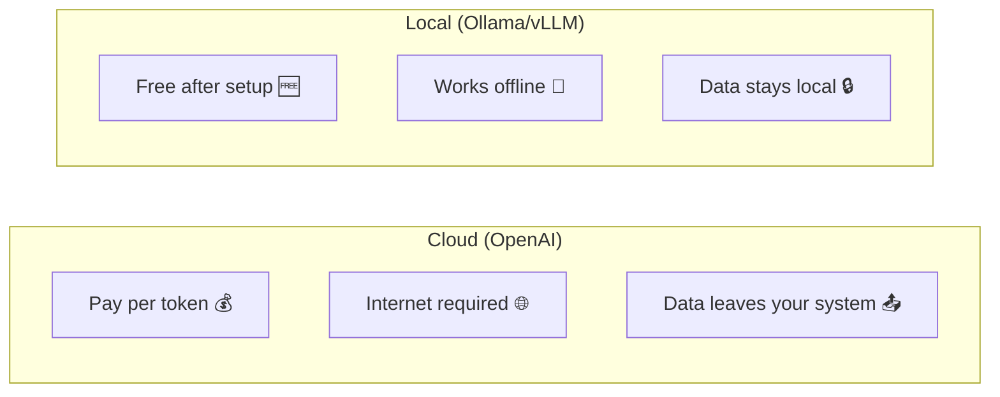
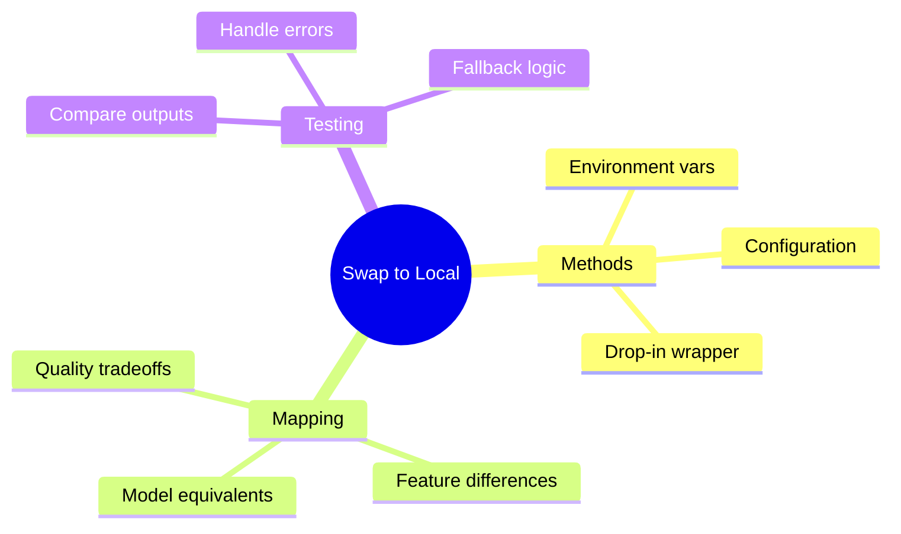

# Swapping OpenAI for Local Models

You've built with OpenAI. Now run locally for free! This guide shows you how to swap in local models with minimal code changes.

---

## Why Swap to Local?



Benefits:
- **Cost savings**: No per-token charges
- **Privacy**: Data never leaves your machine
- **Offline**: Works without internet
- **Speed**: No network latency

---

## The OpenAI-Compatible Interface

Most local tools support OpenAI's API format:

```python
# OpenAI original
from openai import OpenAI
client = OpenAI()

# Ollama (same interface!)
from openai import OpenAI
client = OpenAI(
    base_url="http://localhost:11434/v1",
    api_key="ollama"  # Required but not used
)

# The rest of your code stays the same!
response = client.chat.completions.create(
    model="llama2",
    messages=[{"role": "user", "content": "Hello!"}]
)
```

---

## Method 1: Environment Variable Switch

```python
import os
from openai import OpenAI

def get_client():
    """Get appropriate client based on environment."""

    provider = os.environ.get("LLM_PROVIDER", "openai")

    if provider == "ollama":
        return OpenAI(
            base_url="http://localhost:11434/v1",
            api_key="ollama"
        )
    elif provider == "local":
        return OpenAI(
            base_url="http://localhost:8000/v1",
            api_key="local"
        )
    else:
        return OpenAI()  # Default to OpenAI

# Usage
client = get_client()
```

Set environment:
```bash
# Use OpenAI
export LLM_PROVIDER=openai

# Use Ollama
export LLM_PROVIDER=ollama

# Use local vLLM
export LLM_PROVIDER=local
```

---

## Method 2: Configuration-Based

```python
from dataclasses import dataclass
from openai import OpenAI
from typing import Optional

@dataclass
class LLMConfig:
    provider: str = "openai"
    model: str = "gpt-3.5-turbo"
    base_url: Optional[str] = None
    api_key: Optional[str] = None

# Preset configurations
CONFIGS = {
    "openai": LLMConfig(
        provider="openai",
        model="gpt-3.5-turbo"
    ),
    "ollama-llama2": LLMConfig(
        provider="ollama",
        model="llama2",
        base_url="http://localhost:11434/v1",
        api_key="ollama"
    ),
    "ollama-mistral": LLMConfig(
        provider="ollama",
        model="mistral",
        base_url="http://localhost:11434/v1",
        api_key="ollama"
    ),
    "local-vllm": LLMConfig(
        provider="vllm",
        model="meta-llama/Llama-2-7b-chat-hf",
        base_url="http://localhost:8000/v1",
        api_key="token"
    )
}

class LLMClient:
    """Unified LLM client supporting multiple providers."""

    def __init__(self, config_name: str = "openai"):
        self.config = CONFIGS[config_name]
        self._setup_client()

    def _setup_client(self):
        if self.config.base_url:
            self.client = OpenAI(
                base_url=self.config.base_url,
                api_key=self.config.api_key
            )
        else:
            self.client = OpenAI()

    def chat(self, messages: list, **kwargs) -> str:
        response = self.client.chat.completions.create(
            model=self.config.model,
            messages=messages,
            **kwargs
        )
        return response.choices[0].message.content

# Usage
# Easy to switch!
client = LLMClient("ollama-llama2")
response = client.chat([{"role": "user", "content": "Hello!"}])
```

---

## Method 3: Drop-In Replacement

Create a wrapper that works like OpenAI:

```python
from openai import OpenAI
import os

class UniversalLLM:
    """Drop-in replacement for OpenAI client."""

    def __init__(self, provider: str = None):
        provider = provider or os.environ.get("LLM_PROVIDER", "openai")

        self.provider = provider
        self.client = self._create_client()
        self.model_map = self._get_model_map()

    def _create_client(self) -> OpenAI:
        configs = {
            "openai": {"base_url": None, "api_key": None},
            "ollama": {"base_url": "http://localhost:11434/v1", "api_key": "ollama"},
            "vllm": {"base_url": "http://localhost:8000/v1", "api_key": "token"},
        }

        config = configs.get(self.provider, configs["openai"])

        if config["base_url"]:
            return OpenAI(base_url=config["base_url"], api_key=config["api_key"])
        return OpenAI()

    def _get_model_map(self) -> dict:
        """Map OpenAI model names to local equivalents."""
        return {
            "openai": {
                "gpt-3.5-turbo": "gpt-3.5-turbo",
                "gpt-4": "gpt-4",
            },
            "ollama": {
                "gpt-3.5-turbo": "llama2",
                "gpt-4": "mixtral",
            },
            "vllm": {
                "gpt-3.5-turbo": "meta-llama/Llama-2-7b-chat-hf",
                "gpt-4": "meta-llama/Llama-2-70b-chat-hf",
            }
        }

    def _map_model(self, model: str) -> str:
        """Map requested model to provider's model."""
        return self.model_map.get(self.provider, {}).get(model, model)

    def chat_completion(self, model: str, messages: list, **kwargs) -> str:
        """Create chat completion - same interface as OpenAI."""
        actual_model = self._map_model(model)

        response = self.client.chat.completions.create(
            model=actual_model,
            messages=messages,
            **kwargs
        )

        return response.choices[0].message.content

# Usage - exactly like OpenAI!
llm = UniversalLLM("ollama")

# This works regardless of provider
response = llm.chat_completion(
    model="gpt-3.5-turbo",  # Automatically mapped to llama2
    messages=[{"role": "user", "content": "Hello!"}]
)
```

---

## LangChain Provider Swapping

```python
from langchain_openai import ChatOpenAI
from langchain_community.chat_models import ChatOllama

def get_langchain_llm(provider: str = "openai"):
    """Get LangChain LLM based on provider."""

    if provider == "ollama":
        return ChatOllama(model="llama2")
    elif provider == "local":
        return ChatOpenAI(
            base_url="http://localhost:8000/v1",
            api_key="not-needed",
            model="local-model"
        )
    else:
        return ChatOpenAI()

# Usage
llm = get_langchain_llm("ollama")
response = llm.invoke("Hello!")
```

---

## Model Quality Mapping

Choose appropriate local models:

```python
MODEL_QUALITY_MAP = {
    # OpenAI -> Local equivalents by capability
    "gpt-3.5-turbo": {
        "ollama": "llama2:7b",
        "alternatives": ["mistral:7b", "neural-chat"],
        "notes": "Good general purpose"
    },
    "gpt-4": {
        "ollama": "mixtral:8x7b",
        "alternatives": ["llama2:70b", "codellama:34b"],
        "notes": "Requires more resources"
    },
    "gpt-4-turbo": {
        "ollama": "mixtral:8x7b",
        "alternatives": ["llama3:70b"],
        "notes": "Best local option"
    }
}

def suggest_local_model(openai_model: str) -> dict:
    """Suggest local model equivalent."""
    return MODEL_QUALITY_MAP.get(openai_model, {
        "ollama": "llama2:7b",
        "notes": "Default fallback"
    })

# Usage
suggestion = suggest_local_model("gpt-3.5-turbo")
print(f"Use: {suggestion['ollama']}")
```

---

## Handling Differences

Local models may behave differently:

```python
class AdaptiveLLM:
    """LLM client that adapts to provider differences."""

    def __init__(self, provider: str):
        self.provider = provider
        self.client = self._create_client()

    def generate(self, prompt: str, **kwargs) -> str:
        # Adapt parameters for local models
        if self.provider in ["ollama", "vllm"]:
            # Local models may need different defaults
            kwargs.setdefault("temperature", 0.7)  # Often need higher temp
            kwargs.setdefault("max_tokens", 512)  # Limit for speed

            # Some features not supported
            kwargs.pop("response_format", None)  # JSON mode may not work
            kwargs.pop("functions", None)  # Function calling limited

        messages = [{"role": "user", "content": prompt}]

        try:
            response = self.client.chat.completions.create(
                model=self._get_model(),
                messages=messages,
                **kwargs
            )
            return response.choices[0].message.content
        except Exception as e:
            # Fallback behavior
            print(f"Error with {self.provider}: {e}")
            return self._fallback_generate(prompt)

    def _fallback_generate(self, prompt: str) -> str:
        """Fallback to simpler generation if features fail."""
        response = self.client.chat.completions.create(
            model=self._get_model(),
            messages=[{"role": "user", "content": prompt}],
            max_tokens=256
        )
        return response.choices[0].message.content
```

---

## Testing Your Swap

```python
def test_provider_swap():
    """Test that local model produces reasonable output."""

    providers = ["openai", "ollama"]
    test_prompt = "What is 2 + 2? Reply with just the number."

    results = {}
    for provider in providers:
        try:
            client = UniversalLLM(provider)
            response = client.chat_completion(
                model="gpt-3.5-turbo",
                messages=[{"role": "user", "content": test_prompt}]
            )
            results[provider] = {
                "success": True,
                "response": response,
                "contains_4": "4" in response
            }
        except Exception as e:
            results[provider] = {
                "success": False,
                "error": str(e)
            }

    # Compare results
    print("Provider Test Results:")
    for provider, result in results.items():
        status = "✅" if result.get("success") else "❌"
        print(f"  {status} {provider}: {result}")

test_provider_swap()
```

---

## Summary



---

## Quick Reference

```python
# Quick swap using base_url
client = OpenAI(
    base_url="http://localhost:11434/v1",  # Ollama
    api_key="ollama"
)

# Model mapping
openai_to_local = {
    "gpt-3.5-turbo": "llama2",
    "gpt-4": "mixtral"
}

# Environment-based
export LLM_PROVIDER=ollama
```

---

## What's Next?

Now let's learn how to **wrap agents in APIs** using FastAPI for production deployment!
