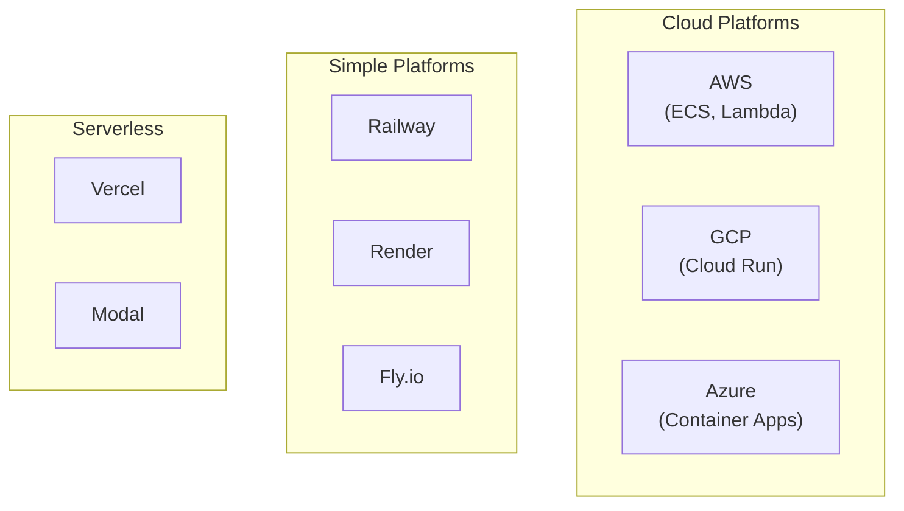
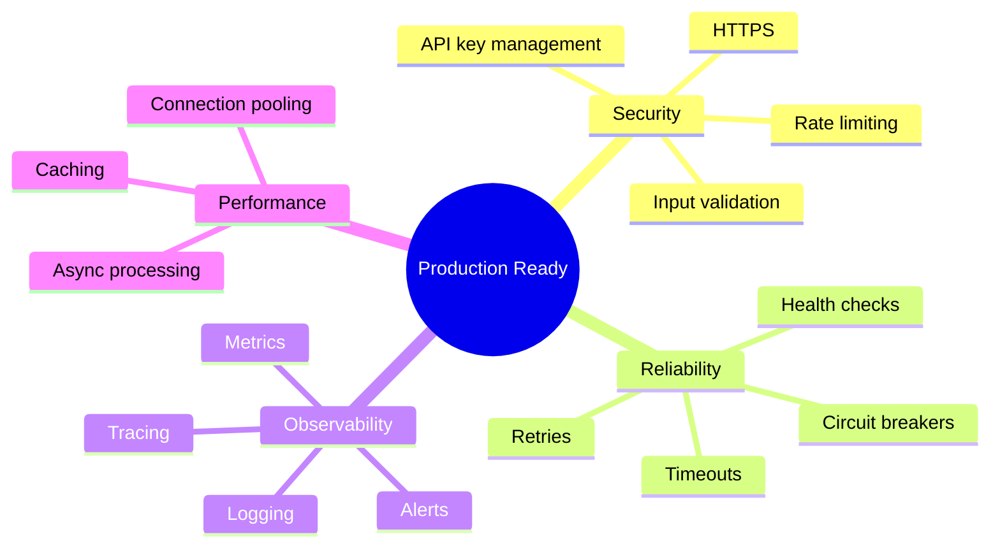
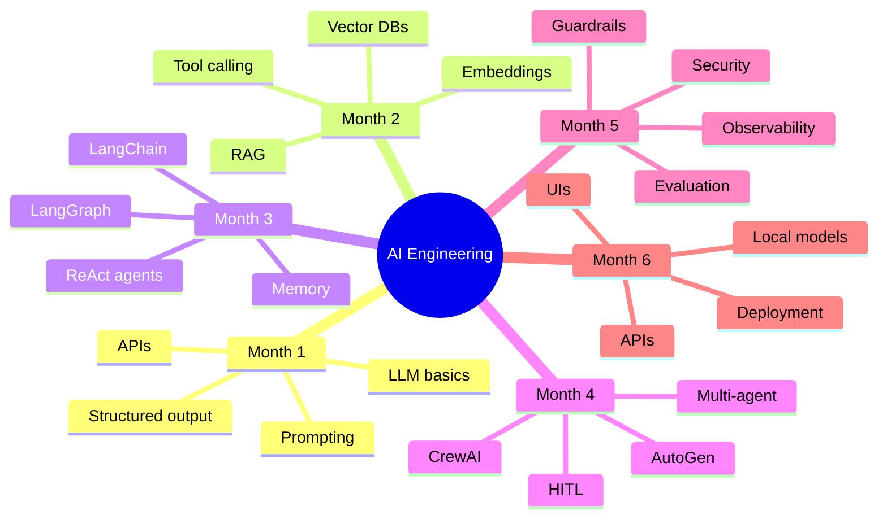

# Cloud Deployment & Reliability

Congratulations! You've reached the final lesson. Let's deploy your AI applications to the cloud and make them production-ready!

---

## Dockerizing Your Application

```dockerfile
# Dockerfile
FROM python:3.11-slim

WORKDIR /app

# Install dependencies
COPY requirements.txt .
RUN pip install --no-cache-dir -r requirements.txt

# Copy application
COPY . .

# Expose port
EXPOSE 8000

# Run the application
CMD ["uvicorn", "main:app", "--host", "0.0.0.0", "--port", "8000"]
```

```bash
# Build and run
docker build -t my-ai-agent .
docker run -p 8000:8000 -e OPENAI_API_KEY=$OPENAI_API_KEY my-ai-agent
```

### Docker Compose for Multiple Services

```yaml
# docker-compose.yml
version: '3.8'

services:
  api:
    build: .
    ports:
      - "8000:8000"
    environment:
      - OPENAI_API_KEY=${OPENAI_API_KEY}
      - REDIS_URL=redis://redis:6379
    depends_on:
      - redis
      - chroma

  redis:
    image: redis:alpine
    ports:
      - "6379:6379"

  chroma:
    image: chromadb/chroma
    ports:
      - "8001:8000"
    volumes:
      - chroma_data:/chroma/chroma

volumes:
  chroma_data:
```

---

## Handling Rate Limits

```python
import time
from functools import wraps
import random

def retry_with_exponential_backoff(
    max_retries: int = 5,
    base_delay: float = 1,
    max_delay: float = 60
):
    """Decorator for exponential backoff retry."""
    def decorator(func):
        @wraps(func)
        def wrapper(*args, **kwargs):
            retries = 0
            while retries < max_retries:
                try:
                    return func(*args, **kwargs)
                except Exception as e:
                    if "rate_limit" in str(e).lower() or "429" in str(e):
                        retries += 1
                        if retries == max_retries:
                            raise

                        delay = min(base_delay * (2 ** retries) + random.uniform(0, 1), max_delay)
                        print(f"Rate limited. Waiting {delay:.2f}s (attempt {retries}/{max_retries})")
                        time.sleep(delay)
                    else:
                        raise
        return wrapper
    return decorator

@retry_with_exponential_backoff(max_retries=5)
def call_openai(messages):
    """OpenAI call with automatic retry."""
    return client.chat.completions.create(
        model="gpt-3.5-turbo",
        messages=messages
    )
```

---

## Circuit Breaker Pattern

```python
from datetime import datetime, timedelta
from enum import Enum

class CircuitState(Enum):
    CLOSED = "closed"      # Normal operation
    OPEN = "open"          # Failing, reject requests
    HALF_OPEN = "half_open"  # Testing if service recovered

class CircuitBreaker:
    """Circuit breaker for external service calls."""

    def __init__(
        self,
        failure_threshold: int = 5,
        recovery_timeout: int = 30,
        half_open_requests: int = 3
    ):
        self.failure_threshold = failure_threshold
        self.recovery_timeout = recovery_timeout
        self.half_open_requests = half_open_requests

        self.state = CircuitState.CLOSED
        self.failures = 0
        self.last_failure_time = None
        self.half_open_successes = 0

    def call(self, func, *args, **kwargs):
        """Execute function through circuit breaker."""
        if self.state == CircuitState.OPEN:
            if self._should_try_reset():
                self.state = CircuitState.HALF_OPEN
                self.half_open_successes = 0
            else:
                raise Exception("Circuit breaker is OPEN")

        try:
            result = func(*args, **kwargs)
            self._on_success()
            return result
        except Exception as e:
            self._on_failure()
            raise

    def _should_try_reset(self) -> bool:
        """Check if we should try resetting the circuit."""
        if self.last_failure_time is None:
            return True
        return datetime.now() - self.last_failure_time > timedelta(seconds=self.recovery_timeout)

    def _on_success(self):
        """Handle successful call."""
        if self.state == CircuitState.HALF_OPEN:
            self.half_open_successes += 1
            if self.half_open_successes >= self.half_open_requests:
                self.state = CircuitState.CLOSED
                self.failures = 0
        else:
            self.failures = 0

    def _on_failure(self):
        """Handle failed call."""
        self.failures += 1
        self.last_failure_time = datetime.now()

        if self.failures >= self.failure_threshold:
            self.state = CircuitState.OPEN

# Usage
circuit_breaker = CircuitBreaker()

def safe_llm_call(messages):
    """LLM call with circuit breaker."""
    return circuit_breaker.call(
        client.chat.completions.create,
        model="gpt-3.5-turbo",
        messages=messages
    )
```

---

## Deployment Options



### Deploy to Railway

```bash
# Install Railway CLI
npm install -g @railway/cli

# Login
railway login

# Initialize project
railway init

# Deploy
railway up
```

### Deploy to Render

```yaml
# render.yaml
services:
  - type: web
    name: ai-agent
    env: docker
    dockerfilePath: ./Dockerfile
    envVars:
      - key: OPENAI_API_KEY
        sync: false
```

### Deploy to AWS (ECS)

```bash
# Build and push to ECR
aws ecr get-login-password | docker login --username AWS --password-stdin $ECR_URL
docker build -t my-agent .
docker tag my-agent:latest $ECR_URL/my-agent:latest
docker push $ECR_URL/my-agent:latest

# Deploy with ECS (use Fargate for serverless)
aws ecs update-service --cluster my-cluster --service my-agent --force-new-deployment
```

---

## Production Checklist



### Complete Production Setup

```python
from fastapi import FastAPI, Request
from fastapi.middleware.cors import CORSMiddleware
import logging
import time
import os

# Configure logging
logging.basicConfig(
    level=logging.INFO,
    format='%(asctime)s - %(name)s - %(levelname)s - %(message)s'
)
logger = logging.getLogger(__name__)

app = FastAPI(title="Production AI Agent")

# CORS
app.add_middleware(
    CORSMiddleware,
    allow_origins=os.getenv("ALLOWED_ORIGINS", "*").split(","),
    allow_methods=["*"],
    allow_headers=["*"],
)

# Request logging middleware
@app.middleware("http")
async def log_requests(request: Request, call_next):
    start_time = time.time()

    response = await call_next(request)

    duration = time.time() - start_time
    logger.info(
        f"{request.method} {request.url.path} "
        f"completed in {duration:.3f}s "
        f"status={response.status_code}"
    )

    return response

# Health check
@app.get("/health")
async def health():
    return {"status": "healthy", "version": os.getenv("VERSION", "1.0.0")}

# Readiness check
@app.get("/ready")
async def ready():
    # Check dependencies
    checks = {
        "openai": check_openai(),
        "database": check_database()
    }
    all_ready = all(checks.values())
    return {"ready": all_ready, "checks": checks}

def check_openai():
    try:
        client.models.list()
        return True
    except:
        return False

def check_database():
    # Check your database connection
    return True
```

---

## Congratulations! 🎉

You've completed the 6-month AI Engineering curriculum!

### What You've Learned



### Next Steps

1. **Build Projects**: Apply what you've learned
2. **Stay Updated**: Follow AI news and papers
3. **Contribute**: Share your knowledge
4. **Experiment**: Try new models and techniques

**You're now an AI Engineer!** 🚀
