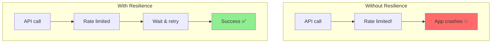
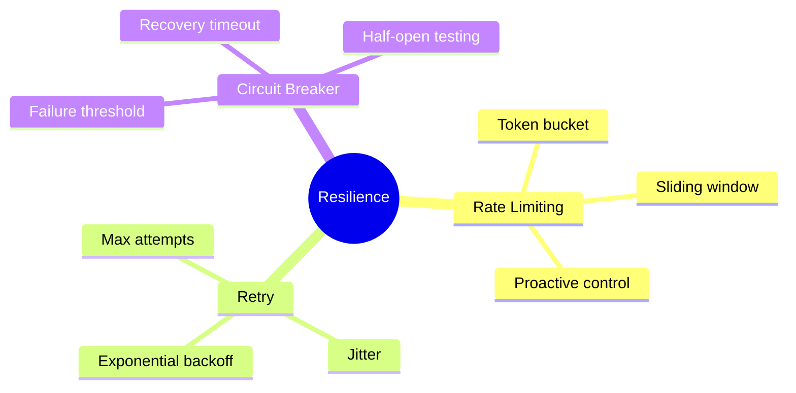

# Rate Limits, Exponential Backoffs & Circuit Breakers

Production systems must handle failures gracefully. This guide shows you how to implement resilient API calls.

---

## Why Resilience Matters



Common issues:
- **Rate limits**: API says "slow down"
- **Transient errors**: Network blips
- **Service unavailable**: Backend overloaded
- **Timeouts**: Response too slow

---

## Basic Retry with Backoff

```python
import time
import random
from typing import Callable, Any

def retry_with_backoff(
    func: Callable,
    max_retries: int = 3,
    base_delay: float = 1.0,
    max_delay: float = 60.0,
    exponential_base: float = 2.0,
    jitter: bool = True
) -> Any:
    """
    Retry a function with exponential backoff.

    Args:
        func: Function to retry
        max_retries: Maximum retry attempts
        base_delay: Initial delay in seconds
        max_delay: Maximum delay between retries
        exponential_base: Multiplier for each retry
        jitter: Add randomness to prevent thundering herd
    """

    last_exception = None

    for attempt in range(max_retries + 1):
        try:
            return func()
        except Exception as e:
            last_exception = e

            if attempt == max_retries:
                break

            # Calculate delay
            delay = min(base_delay * (exponential_base ** attempt), max_delay)

            # Add jitter
            if jitter:
                delay = delay * (0.5 + random.random())

            print(f"Attempt {attempt + 1} failed: {e}. Retrying in {delay:.2f}s...")
            time.sleep(delay)

    raise last_exception

# Usage
def call_api():
    response = openai.chat.completions.create(...)
    return response

result = retry_with_backoff(call_api)
```

---

## Decorator-Based Retry

```python
import functools
import time
import random
from typing import Tuple, Type

def retry(
    max_retries: int = 3,
    base_delay: float = 1.0,
    exceptions: Tuple[Type[Exception], ...] = (Exception,)
):
    """Decorator for retry with exponential backoff."""

    def decorator(func):
        @functools.wraps(func)
        def wrapper(*args, **kwargs):
            last_exception = None

            for attempt in range(max_retries + 1):
                try:
                    return func(*args, **kwargs)
                except exceptions as e:
                    last_exception = e

                    if attempt == max_retries:
                        break

                    delay = base_delay * (2 ** attempt) * (0.5 + random.random())
                    print(f"Retry {attempt + 1}/{max_retries} after {delay:.2f}s")
                    time.sleep(delay)

            raise last_exception
        return wrapper
    return decorator

# Usage
@retry(max_retries=3, exceptions=(RateLimitError, APIError))
def call_openai(prompt: str) -> str:
    response = client.chat.completions.create(
        model="gpt-3.5-turbo",
        messages=[{"role": "user", "content": prompt}]
    )
    return response.choices[0].message.content

result = call_openai("Hello!")
```

---

## Rate Limiter

Proactively limit your request rate:

```python
import time
from collections import deque
from threading import Lock

class RateLimiter:
    """Token bucket rate limiter."""

    def __init__(self, requests_per_minute: int = 60):
        self.rpm = requests_per_minute
        self.interval = 60.0 / requests_per_minute
        self.timestamps = deque()
        self.lock = Lock()

    def acquire(self):
        """Wait until a request slot is available."""
        with self.lock:
            now = time.time()

            # Remove old timestamps
            while self.timestamps and now - self.timestamps[0] > 60:
                self.timestamps.popleft()

            # Check if we're at the limit
            if len(self.timestamps) >= self.rpm:
                # Wait until oldest request expires
                sleep_time = 60 - (now - self.timestamps[0])
                if sleep_time > 0:
                    print(f"Rate limit: waiting {sleep_time:.2f}s")
                    time.sleep(sleep_time)
                    self.timestamps.popleft()

            self.timestamps.append(time.time())

    def __call__(self, func):
        """Use as decorator."""
        @functools.wraps(func)
        def wrapper(*args, **kwargs):
            self.acquire()
            return func(*args, **kwargs)
        return wrapper

# Usage
limiter = RateLimiter(requests_per_minute=20)

@limiter
def call_api():
    return client.chat.completions.create(...)

# Or manual
limiter.acquire()
result = call_api()
```

---

## Circuit Breaker

Stop calling failing services:

```python
import time
from enum import Enum
from threading import Lock

class CircuitState(Enum):
    CLOSED = "closed"      # Normal operation
    OPEN = "open"          # Failing, reject requests
    HALF_OPEN = "half_open"  # Testing if service recovered

class CircuitBreaker:
    """
    Circuit breaker pattern implementation.

    States:
    - CLOSED: Normal operation, requests go through
    - OPEN: Service failing, reject requests immediately
    - HALF_OPEN: Testing recovery, allow limited requests
    """

    def __init__(
        self,
        failure_threshold: int = 5,
        recovery_timeout: float = 30.0,
        expected_exceptions: tuple = (Exception,)
    ):
        self.failure_threshold = failure_threshold
        self.recovery_timeout = recovery_timeout
        self.expected_exceptions = expected_exceptions

        self.state = CircuitState.CLOSED
        self.failure_count = 0
        self.last_failure_time = None
        self.lock = Lock()

    def call(self, func, *args, **kwargs):
        """Execute function through circuit breaker."""

        with self.lock:
            if self.state == CircuitState.OPEN:
                # Check if recovery timeout passed
                if time.time() - self.last_failure_time > self.recovery_timeout:
                    print("Circuit half-open, testing...")
                    self.state = CircuitState.HALF_OPEN
                else:
                    raise CircuitBreakerOpen("Circuit breaker is open")

        try:
            result = func(*args, **kwargs)

            with self.lock:
                # Success - reset failures
                self.failure_count = 0
                if self.state == CircuitState.HALF_OPEN:
                    print("Circuit closed (recovered)")
                    self.state = CircuitState.CLOSED

            return result

        except self.expected_exceptions as e:
            with self.lock:
                self.failure_count += 1
                self.last_failure_time = time.time()

                if self.failure_count >= self.failure_threshold:
                    print(f"Circuit opened after {self.failure_count} failures")
                    self.state = CircuitState.OPEN

            raise

    def __call__(self, func):
        """Use as decorator."""
        @functools.wraps(func)
        def wrapper(*args, **kwargs):
            return self.call(func, *args, **kwargs)
        return wrapper

class CircuitBreakerOpen(Exception):
    pass

# Usage
circuit = CircuitBreaker(failure_threshold=3, recovery_timeout=60)

@circuit
def call_external_api():
    return requests.get("https://api.example.com")

# Manual usage
try:
    result = circuit.call(call_external_api)
except CircuitBreakerOpen:
    print("Service unavailable, using fallback")
    result = fallback_response()
```

---

## Combined Resilience

Put it all together:

```python
from dataclasses import dataclass
from typing import Optional, Callable
import time
import random

@dataclass
class ResilienceConfig:
    max_retries: int = 3
    base_delay: float = 1.0
    max_delay: float = 60.0
    requests_per_minute: int = 60
    circuit_failure_threshold: int = 5
    circuit_recovery_timeout: float = 30.0

class ResilientClient:
    """API client with rate limiting, retries, and circuit breaker."""

    def __init__(self, config: ResilienceConfig = None):
        self.config = config or ResilienceConfig()
        self.rate_limiter = RateLimiter(self.config.requests_per_minute)
        self.circuit_breaker = CircuitBreaker(
            failure_threshold=self.config.circuit_failure_threshold,
            recovery_timeout=self.config.circuit_recovery_timeout
        )

    def call(self, func: Callable, *args, **kwargs):
        """Make a resilient API call."""

        last_exception = None

        for attempt in range(self.config.max_retries + 1):
            try:
                # Rate limiting
                self.rate_limiter.acquire()

                # Circuit breaker
                return self.circuit_breaker.call(func, *args, **kwargs)

            except CircuitBreakerOpen:
                # Don't retry if circuit is open
                raise

            except Exception as e:
                last_exception = e

                if attempt == self.config.max_retries:
                    break

                # Exponential backoff
                delay = min(
                    self.config.base_delay * (2 ** attempt),
                    self.config.max_delay
                )
                delay *= (0.5 + random.random())  # Jitter

                print(f"Attempt {attempt + 1} failed. Retrying in {delay:.2f}s")
                time.sleep(delay)

        raise last_exception

# Usage
client = ResilientClient(ResilienceConfig(
    max_retries=3,
    requests_per_minute=20,
    circuit_failure_threshold=5
))

def make_api_call():
    return openai_client.chat.completions.create(...)

result = client.call(make_api_call)
```

---

## Using Tenacity Library

For production, use the `tenacity` library:

```bash
pip install tenacity
```

```python
from tenacity import (
    retry,
    stop_after_attempt,
    wait_exponential,
    retry_if_exception_type,
    before_sleep_log
)
import logging

logging.basicConfig(level=logging.INFO)
logger = logging.getLogger(__name__)

@retry(
    stop=stop_after_attempt(3),
    wait=wait_exponential(multiplier=1, min=1, max=60),
    retry=retry_if_exception_type((RateLimitError, APIError)),
    before_sleep=before_sleep_log(logger, logging.WARNING)
)
def call_openai(prompt: str) -> str:
    """Call OpenAI with automatic retry."""
    response = client.chat.completions.create(
        model="gpt-3.5-turbo",
        messages=[{"role": "user", "content": prompt}]
    )
    return response.choices[0].message.content

# More complex configuration
from tenacity import retry, RetryError

@retry(
    stop=stop_after_attempt(5),
    wait=wait_exponential(multiplier=1, min=4, max=60),
    retry=retry_if_exception_type(Exception),
    reraise=True
)
async def async_api_call():
    """Async API call with retry."""
    async with aiohttp.ClientSession() as session:
        async with session.get(url) as response:
            return await response.json()
```

---

## Summary



---

## Quick Reference

```python
# Simple retry
@retry(max_retries=3, base_delay=1.0)
def api_call():
    ...

# Rate limiter
limiter = RateLimiter(requests_per_minute=60)
limiter.acquire()

# Circuit breaker
circuit = CircuitBreaker(failure_threshold=5)
result = circuit.call(api_call)

# Tenacity
from tenacity import retry, stop_after_attempt, wait_exponential

@retry(stop=stop_after_attempt(3), wait=wait_exponential())
def resilient_call():
    ...
```

---

## What's Next?

Now let's deploy to the **cloud** with AWS, GCP, or platforms like Render!
