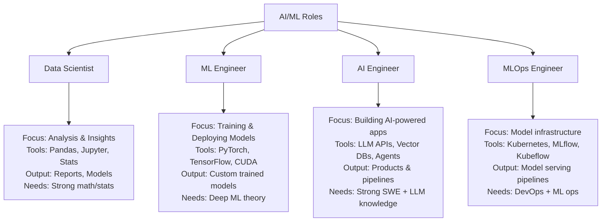
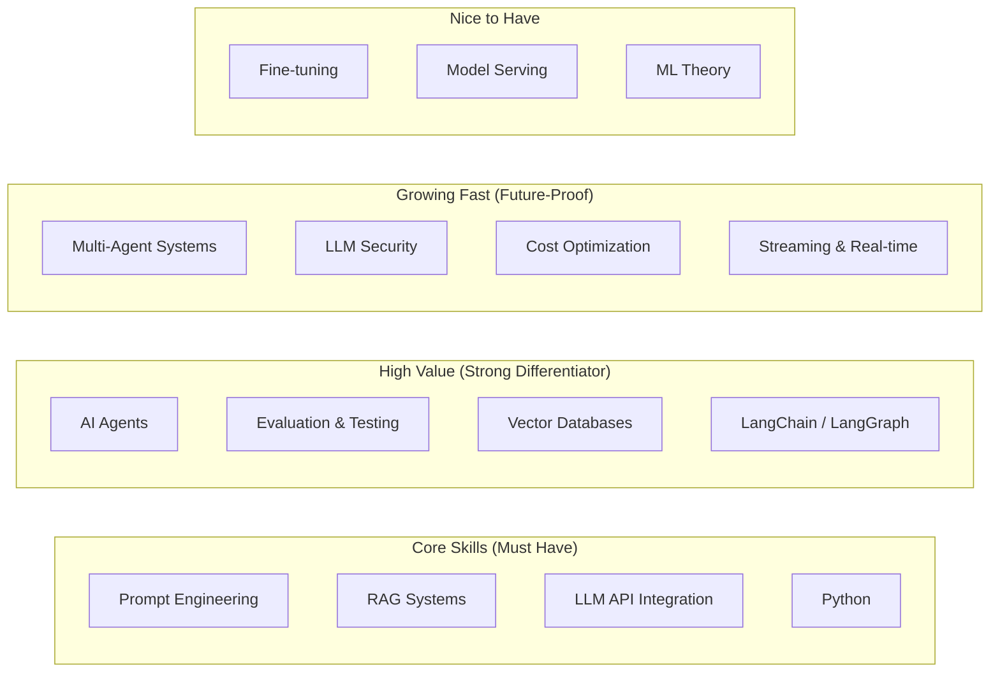
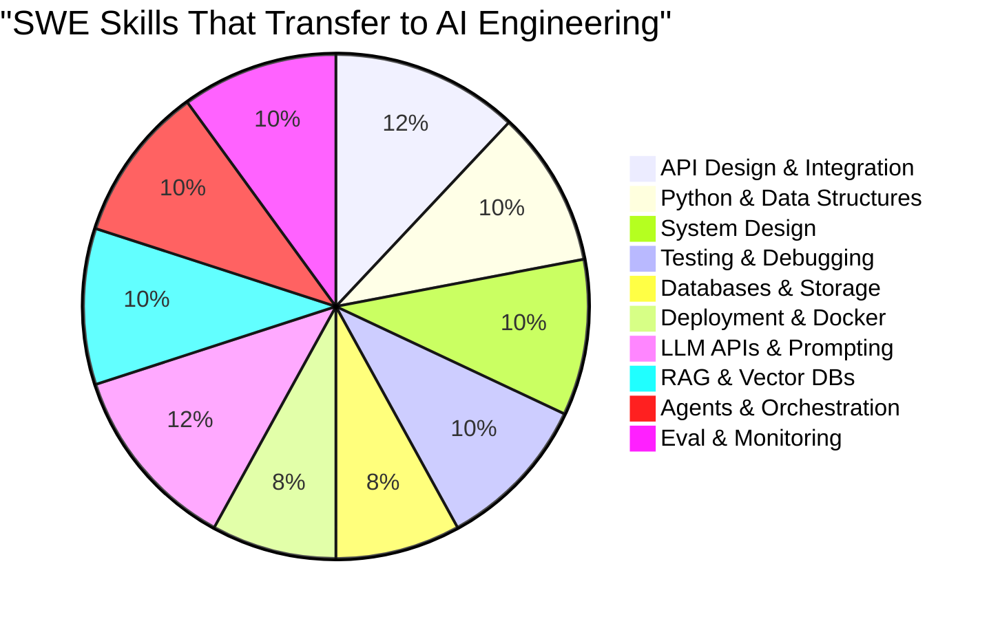
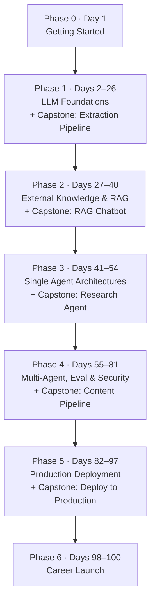

# Day 1: The AI Engineering Career Map

Welcome. You're here because you've been watching the AI space explode and you're wondering: "Is this for me? Can I make this transition?" The answer is yes — and you're closer than you think.

This is Day 1 of a 100-day journey designed specifically for software engineers who want to move into AI engineering. Not ML research. Not data science. AI engineering — the discipline of building real, production-grade AI systems that solve real problems.

Let's start by mapping the territory.

---

## The Roles: Clearing Up the Confusion

When you look at job boards, you'll see a mess of titles: ML Engineer, AI Engineer, Data Scientist, LLM Engineer, Applied AI Engineer. These overlap but they're not the same thing. Here's the clearest breakdown:

**Data Scientist** — Primarily analytical. They explore data, run experiments, build models to generate insights. The output is often a report, a visualization, or a prototype model. Heavy on statistics and domain knowledge.

**ML Engineer** — Closer to engineering, but focused on the full training pipeline. They optimize model architectures, manage distributed training, and handle the complexity of getting a model from research to production. Deep knowledge of PyTorch, CUDA, and ML theory is required.

**MLOps Engineer** — The DevOps of ML. They build the infrastructure for training, versioning, serving, and monitoring models. Think Kubernetes, MLflow, Seldon, and SageMaker pipelines.

**AI Engineer** — This is where you're headed. AI Engineers build *applications* on top of foundation models. You're not training GPT-4 — you're using it (and models like it) to build systems that do something useful: a customer support bot, a document analysis pipeline, a research agent. The primary skills are software engineering, prompt engineering, RAG systems, agent design, evaluation, and deployment.

The key insight: **AI Engineering is software engineering applied to LLMs.** Your existing skills are a massive head start.

---

## What Does an AI Engineer Actually Do Day-to-Day?

This is the question that separates reality from hype. Here's what a typical week looks like for an AI Engineer at a product company:

**Monday morning:** You're debugging why the document extraction pipeline is returning malformed JSON for certain edge-case inputs. You add better output parsing and retry logic.

**Monday afternoon:** Meeting with product to scope a new feature: the RAG chatbot needs to cite its sources. You sketch the architecture changes needed.

**Tuesday:** Implementing the citation feature. You modify the retrieval step to track source metadata and update the prompt template to include citation instructions.

**Wednesday:** Running evals. You have a test set of 50 questions with expected answers. You're measuring whether your latest prompt change improved accuracy or hurt it. You write a script to automate this.

**Thursday:** The agent is making too many API calls and costs are exploding. You implement caching, reduce context window usage, and add cost tracking. You write a postmortem doc.

**Friday:** Code review, documentation, and a deep-dive on a new paper about better chunking strategies for RAG. You prototype a new approach.

Notice what this week doesn't include: training neural networks from scratch, writing CUDA kernels, or deriving backpropagation. That's ML Engineering. AI Engineering is about building reliable, efficient, maintainable systems *using* LLMs as a core component.

---

## The Skills Landscape: What's Actually In Demand

Based on job postings from 2025-2026, here's what companies are actually hiring for:

**1. RAG (Retrieval-Augmented Generation) — Extremely High Demand**
Almost every company with an AI product uses RAG. It's the technique of augmenting LLM responses with retrieved context from a knowledge base. If you can build, evaluate, and optimize RAG systems, you can get a job.

**2. AI Agents — Very High Demand, Growing Fast**
Agents are LLM-powered systems that can take actions: browse the web, execute code, call APIs, read files. The tooling (LangGraph, AutoGen, CrewAI) is maturing fast. This is where the field is heading.

**3. Evaluation & Testing — High Demand, Often Overlooked**
Companies are realizing that "it works in my demo" isn't good enough. Building robust eval pipelines, measuring model quality, and detecting regressions is a critical and underserved skill.

**4. LLM API Integration — Table Stakes**
OpenAI, Anthropic, Google Gemini, open-source models via Ollama or Together.ai. You need to know how to call these APIs efficiently, handle errors, manage rate limits, and understand token economics.

**5. Prompt Engineering — Foundational**
Not just writing prompts — understanding *why* certain prompts work, how to structure few-shot examples, how to use chain-of-thought, and how to make prompts robust to adversarial inputs.

---

## Salary Bands and Job Market (2025-2026)

The market for AI engineers is strong and growing. Here are realistic ranges based on current data:

| Role | Level | US Salary Range | Notes |
|------|-------|-----------------|-------|
| AI Engineer | Junior (0-2 yrs) | $120k - $160k | Rare — most companies want experience |
| AI Engineer | Mid (2-4 yrs) | $160k - $220k | Sweet spot with SWE background |
| AI Engineer | Senior (4+ yrs) | $220k - $320k+ | High demand, low supply |
| LLM Engineer | Mid-Senior | $180k - $280k | Specialized, premium |
| Applied AI Scientist | Senior | $200k - $350k+ | Needs ML depth too |

**For SWE transitions specifically:**

If you have 3-5 years of SWE experience, you're not entering as a junior. Companies will hire you at mid-to-senior level because you bring:
- Production engineering discipline
- System design skills
- Code quality and testing habits
- Ability to ship things that work

The gap you need to close is the LLM-specific knowledge: RAG, agents, evals, prompt engineering. That's exactly what this 100 days covers.

**Remote work:** More common in AI engineering than in many SWE roles. The talent pool is thin enough that companies are willing to hire globally.

**Industries hiring:** Tech companies (obviously), but also: finance, healthcare, legal tech, education, e-commerce, enterprise SaaS. The AI wave is sector-agnostic.

---

## Your SWE Skills Transfer More Than You Think

Here's the thing that surprises most engineers making this transition: **you already know about 60% of what you need.**

**What transfers directly:**

- **API integration** — Calling LLM APIs is just HTTP with JSON. You've done this a thousand times.
- **Python** — The entire AI engineering ecosystem runs on Python. If you've been writing backend code, you're already there.
- **System design** — Designing a RAG pipeline requires the same thinking as designing any data pipeline. You understand queues, caches, databases, services.
- **Testing discipline** — Writing evals for LLM systems is just a different flavor of writing tests. The habit of "how do I know this works?" is the same.
- **Debugging** — Tracking down why an agent is hallucinating is debugging. The tools are different but the mindset is identical.
- **Code quality** — AI systems go to production too. They need error handling, logging, retry logic, graceful degradation. All skills you have.
- **Database knowledge** — Vector databases are a new flavor of a concept you already understand.
- **Deployment** — Docker, environment variables, health checks, logging — you know this. AI services are services.

**What you need to learn:**

- How LLMs actually work (enough to use them well, not to build them)
- Prompt engineering patterns
- Retrieval systems and embeddings
- Agent architectures (ReAct, tool calling, memory)
- LLM-specific evaluation techniques
- Cost management and token optimization

This is learnable. It's not a decade of PhD-level math. It's a focused set of practical skills, and 100 days is enough to get genuinely good at it.

---

## What This 100-Day Journey Covers

Here's the full map of what you'll build and learn:

**Phase 0 (Day 1): Getting Started**
Career map, understanding the ecosystem. This is where you are now.

**Phase 1 (Days 2-26): LLM Foundations**
How LLMs work, calling APIs, prompt engineering, structured output with Pydantic. You'll build your first data extraction pipeline.

**Phase 2 (Days 27-40): External Knowledge**
Embeddings, vector databases, RAG systems. You'll build a chatbot that answers questions from documents.

**Phase 3 (Days 41-54): Single Agents**
Tool calling, ReAct loops, LangGraph state machines, memory and persistence. You'll build an autonomous research agent.

**Phase 4 (Days 55-81): Multi-Agent, Eval, and Security**
Multi-agent architectures, evaluation pipelines, prompt injection defense, human-in-the-loop. You'll build a multi-agent content pipeline.

**Phase 5 (Days 82-97): Production**
FastAPI, streaming, Docker, deployment, monitoring, cost tracking. You'll deploy your capstone to the real internet.

**Phase 6 (Days 98-100): Career Launch**
Portfolio review, resume updating, job search strategy, community engagement.

By the end, you'll have 5 capstone projects in your portfolio and the practical skills to back them up in interviews.

---

## The Skills Audit: Where Are You Right Now?

Before we start, let's get honest about where you are. Rate yourself 1-5 on each area (1 = never heard of it, 5 = could teach a workshop on it). Be honest — this isn't a test, it's a baseline.

**Software Engineering Foundation**
- [ ] Python proficiency: ___/5
- [ ] REST API integration: ___/5
- [ ] Async programming: ___/5
- [ ] Docker & containerization: ___/5
- [ ] SQL / database work: ___/5
- [ ] Testing & debugging: ___/5

**LLM & Prompting**
- [ ] Using ChatGPT/Claude in browser: ___/5
- [ ] Calling LLM APIs programmatically: ___/5
- [ ] Prompt engineering techniques: ___/5
- [ ] Structured output / JSON mode: ___/5
- [ ] Token economics (costs, limits): ___/5

**Retrieval & Knowledge**
- [ ] Embeddings / vector similarity: ___/5
- [ ] Vector databases (Chroma, Pinecone, etc.): ___/5
- [ ] RAG pipeline design: ___/5
- [ ] Document chunking strategies: ___/5

**Agents & Orchestration**
- [ ] Tool/function calling: ___/5
- [ ] ReAct agent pattern: ___/5
- [ ] LangChain / LangGraph: ___/5
- [ ] Multi-agent coordination: ___/5

**Evaluation & Production**
- [ ] LLM evaluation methods: ___/5
- [ ] Prompt injection / security: ___/5
- [ ] Deploying ML/AI services: ___/5
- [ ] Monitoring & observability: ___/5

**Scoring:**
- **0-40:** You're starting fresh on the AI side. That's fine — your SWE skills will accelerate everything.
- **41-70:** You've dabbled. This journey will fill in the gaps and add depth.
- **71-100:** You have real experience. Use this journey to fill blind spots and build portfolio projects.

Write down your scores somewhere. You'll revisit this on Day 54 (the career checkpoint) and Day 100. The progress will surprise you.

---

## The Mindset Shift

One last thing before we dive in. There's a mindset shift that separates engineers who struggle with this transition from those who thrive.

**Old mindset:** "I need to understand everything before I build anything."

**New mindset:** "I'll build something imperfect, understand it through use, and improve it."

LLM systems are probabilistic. They don't always behave deterministically. You can't read the source code of GPT-4. You can't fully predict what a prompt will do in every case. This is uncomfortable for engineers trained on deterministic systems.

The solution is not to wait until you understand everything — it's to build evaluation systems that tell you when things go wrong, and to treat prompt engineering like an empirical science: hypothesis, experiment, measure, iterate.

**The other mindset shift:** This field moves fast. What's cutting-edge today is standard practice in 18 months. Don't try to master every tool. Instead, develop the ability to pick up new tools quickly, understand the underlying patterns, and evaluate what's worth learning vs. what's hype.

You already have this skill. It's the same skill that lets you learn a new programming language or framework. You're not starting from zero.

---

## Today's Action Items

1. Complete the skills audit above. Save it somewhere you can find it later.
2. Set up your environment (we'll cover this in detail in Day 2, but if you're eager: Python 3.11+, an OpenAI API key, and a code editor).
3. Read the OpenAI pricing page. Understand what tokens are and roughly what API calls cost. This will inform every decision you make.
4. Optional but recommended: Browse LinkedIn and look at 10-15 "AI Engineer" job postings. Read the requirements. Notice what comes up repeatedly. Notice what you already know.

See you on Day 2.

---

*Next up: Day 2 — Setting Up Your AI Engineering Environment (API keys, SDKs, local models, and your first API call)*
