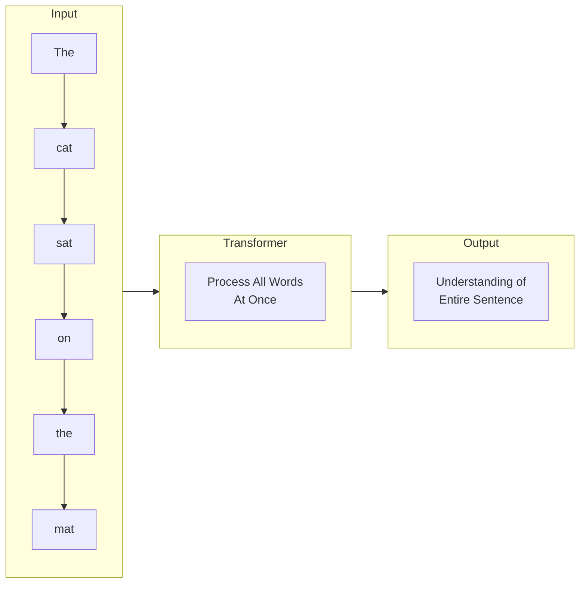
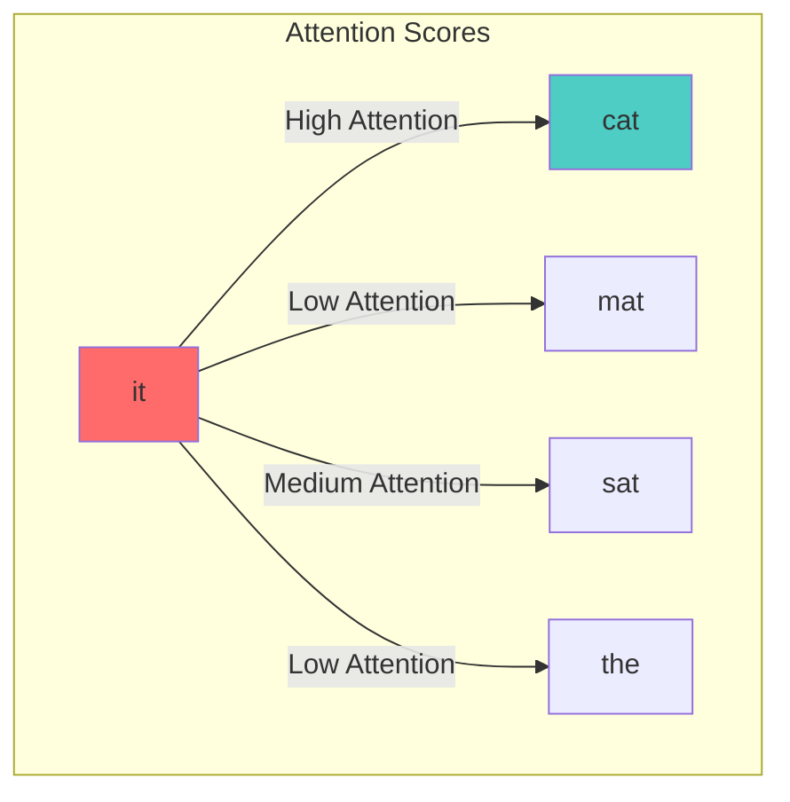
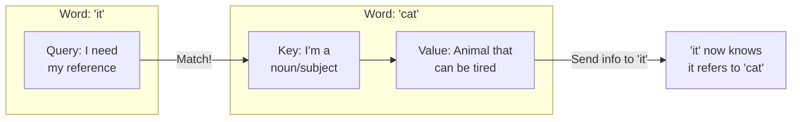
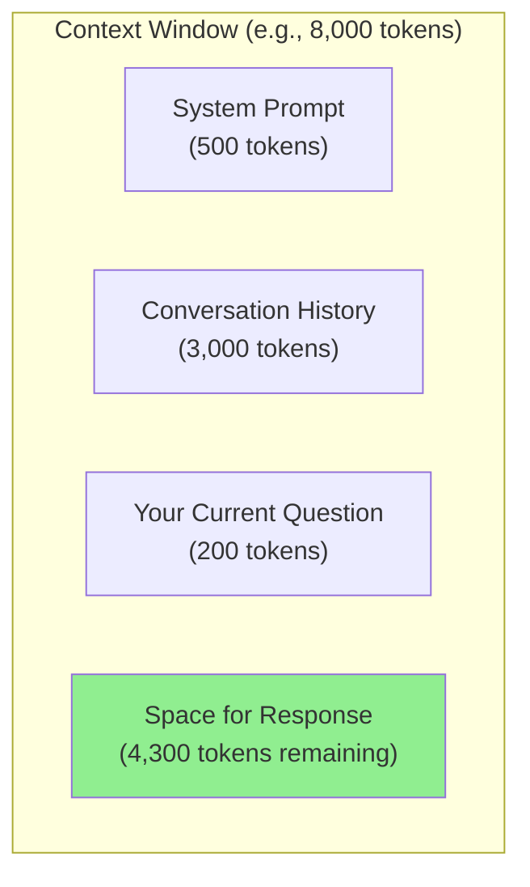
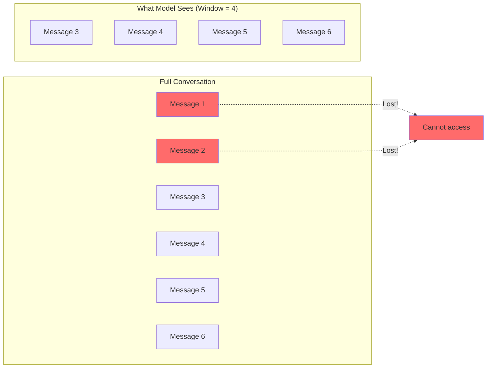
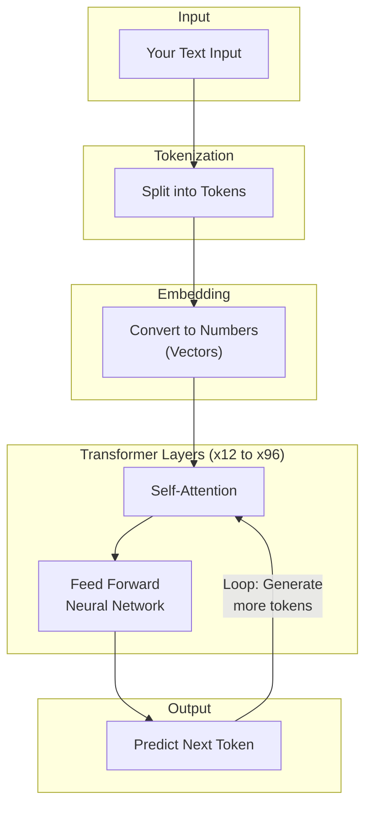
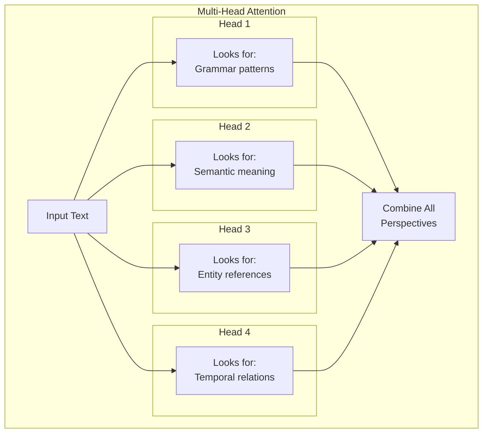
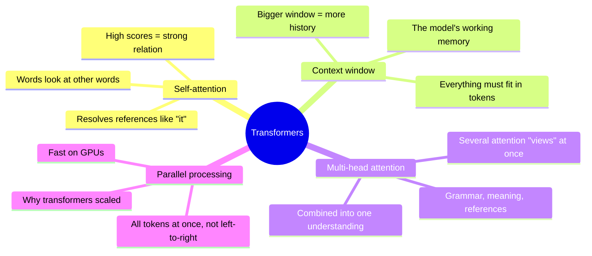

# Understanding Transformers: The Brain Behind LLMs

Welcome to your AI journey! In this guide, we'll demystify the Transformer architecture - the revolutionary technology powering ChatGPT, Claude, and other Large Language Models (LLMs).

Don't worry - we're keeping the math minimal and focusing on building solid intuition.

> **Coming from Software Engineering?** Think of Transformers like a highly optimized search algorithm — instead of querying a database, they query their own training data using attention patterns. If you've built search engines or worked with information retrieval, the attention mechanism will feel intuitive: it's essentially a weighted lookup where every word 'queries' every other word.

---

## What is a Transformer?

Think of a Transformer as a super-smart reading machine. When you give it text, it doesn't just read word by word like we do. Instead, it looks at ALL words simultaneously and figures out how they relate to each other.



### Before Transformers: The Old Way

Before Transformers (2017), we used models called RNNs (Recurrent Neural Networks) that processed text one word at a time - like reading a book character by character. This was:

- **Slow**: Had to wait for each word to be processed
- **Forgetful**: By the time it reached word 100, it might forget word 1
- **Sequential**: Couldn't use modern parallel computing effectively

### The Transformer Revolution

Transformers changed everything by introducing **parallel processing** - reading the entire text at once, like seeing a whole page in one glance.

---

## The Secret Sauce: Self-Attention

Here's where the magic happens. Self-attention is how the model figures out which words are important for understanding other words.

### A Simple Example

Consider the sentence: *"The cat sat on the mat because it was tired."*

What does "it" refer to? You instantly know it's "the cat" - but how?

Your brain automatically connected "it" with "cat" because:
1. "it" is a pronoun that needs a reference
2. "cat" is the most logical subject
3. "mat" doesn't get tired

**Self-attention does exactly this!** It calculates a "relevance score" between every pair of words.



### How Self-Attention Works (Simplified)

Imagine each word asking three questions:
1. **Query (Q)**: "What am I looking for?"
2. **Key (K)**: "What do I contain?"
3. **Value (V)**: "What information can I give?"



The model computes attention scores for every word pair. Words that are relevant to each other get high scores.

---

## Context Windows: The Model's Memory Limit

Every LLM has a **context window** - the maximum amount of text it can "see" at once.

### What is a Context Window?

Think of it as the model's working memory or desk space. Just like you can only fit so many papers on your desk, an LLM can only process a certain number of tokens at once.



### Common Context Window Sizes

| Model | Context Window |
|-------|---------------|
| GPT-4o | 128,000 tokens |
| GPT-4o mini | 128,000 tokens |
| Claude Opus 4.x / Sonnet 4.6 | 1,000,000 tokens |
| Claude Haiku 4.5 | 200,000 tokens |
| Llama 3.1 (8B/70B) | 128,000 tokens |
| Gemini 2.0 | 1,000,000 tokens |

*(Context windows and model lineups change often — treat these as ballpark figures and check the provider's docs for current limits.)*

### Why Context Windows Matter

```python
# script_id: day_002_transformer_intuition/context_window_example
# Example: When your conversation exceeds the context window

conversation_so_far = """
[5000 tokens of previous chat]
User: What was the first thing I told you?
"""

# If context window is 4096 tokens, the model literally
# CANNOT see the beginning of your conversation anymore!

# Solution: Summarization or chunking strategies (we'll cover later)
```

### The Sliding Window Problem



---

## The Architecture: Putting It All Together

Here's how a Transformer processes your text:



### Key Components

1. **Input Embedding**: Converts text to numbers the model can process
2. **Positional Encoding**: Tells the model where each word is in the sentence
3. **Multi-Head Attention**: Multiple attention mechanisms working in parallel (like having multiple readers analyzing the text)
4. **Feed-Forward Network**: Processes the attention output
5. **Output Layer**: Predicts the next token

---

## Multi-Head Attention: Multiple Perspectives

Instead of one attention mechanism, Transformers use multiple "heads" - each looking for different patterns:



Think of it like having a team of editors, each specializing in different aspects of writing!

---

## Why This Matters for You as a Developer

Understanding Transformers helps you:

1. **Write better prompts**: Knowing the model processes everything at once helps you structure prompts effectively

2. **Manage context wisely**: Understanding context windows helps you design systems that don't lose important information

3. **Debug weird behavior**: When the model "forgets" something, you'll know it might be a context window issue

4. **Choose the right model**: Different context windows and capabilities for different use cases

---

## Quick Recap

| Concept | What It Does | Why It Matters |
|---------|--------------|----------------|
| Self-Attention | Connects related words | Enables understanding of context and references |
| Context Window | Limits visible text | Determines how much history/context model can use |
| Multi-Head Attention | Multiple parallel attention | Captures different types of relationships |
| Parallel Processing | Processes all at once | Makes LLMs fast and efficient |

---

## What's Next?

Now that you understand how Transformers "think," let's dive into **Tokenization** - how LLMs actually see and process your text at the character level.

---

## Try It Yourself!

Here's a simple mental exercise:

```python
# script_id: day_002_transformer_intuition/self_attention_exercise
# Think about this sentence:
sentence = "The bank by the river was overgrown with grass."

# Questions to ponder:
# 1. What does "bank" mean here?
# 2. How would self-attention help disambiguate?
# 3. Which words would have high attention scores with "bank"?

# Answer: "river", "overgrown", and "grass" would all have high attention
# with "bank" — helping the model understand it's a riverbank,
# not a financial bank!
```

Understanding these concepts will make you a much more effective AI developer. You're building the foundation for everything that comes next!

---

## Summary



## Quick Reference

| Concept | One-liner | SWE analogy |
|---|---|---|
| Self-attention | Each token weighs every other token | A join where rows score their relevance to each other |
| Attention score | Strength of relation between two tokens | A similarity weight |
| Context window | Max tokens the model can see at once | A fixed-size buffer / RAM limit |
| Multi-head attention | Several attention computations in parallel | Running multiple indexes over the same data |
| Parallelism | All positions processed together | SIMD / vectorized ops vs. a serial loop |

## Exercises

1. **Disambiguate by attention.** Take the sentence `"The trophy didn't fit in the suitcase because it was too big."` Write down which word `it` refers to, and list the 2–3 words you'd expect to have the highest attention with `it`.
2. **Estimate a context budget.** A model has a 128K-token window. If a chat keeps ~750 tokens per turn, roughly how many turns fit before you must trim history? What strategy would you use when it fills?
3. **Spot the heads.** For `"The river bank was muddy after the storm,"` describe two *different* relationships separate attention heads might capture (e.g. one for meaning, one for grammar).
4. **Extend the mental model.** Explain in two sentences why parallel processing makes transformers faster to train than older left-to-right RNNs.

<details><summary>Solutions (approaches)</summary>

1. `it` = the trophy (the thing that didn't fit). Expect high attention between `it` and `trophy`, plus `big` / `fit`.
2. `128000 / 750` ≈ **170 turns**. Past that, summarize older turns or drop the oldest (sliding window) — both covered in later days.
3. One head might link `bank` ↔ `river`/`muddy` (meaning → riverbank), another might link the article `The` ↔ `bank` (grammatical structure).
4. RNNs process token *t* only after *t-1*, so work is serial; transformers compute all positions' attention simultaneously, which maps cleanly onto GPU parallelism.
</details>
