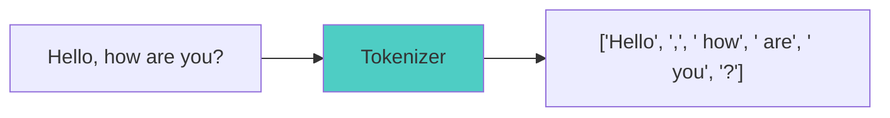
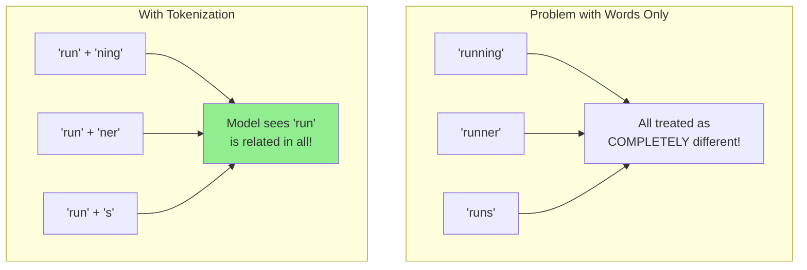
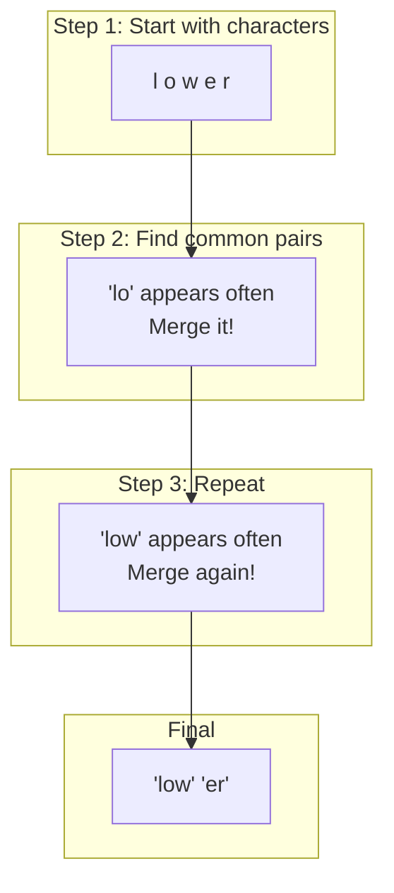
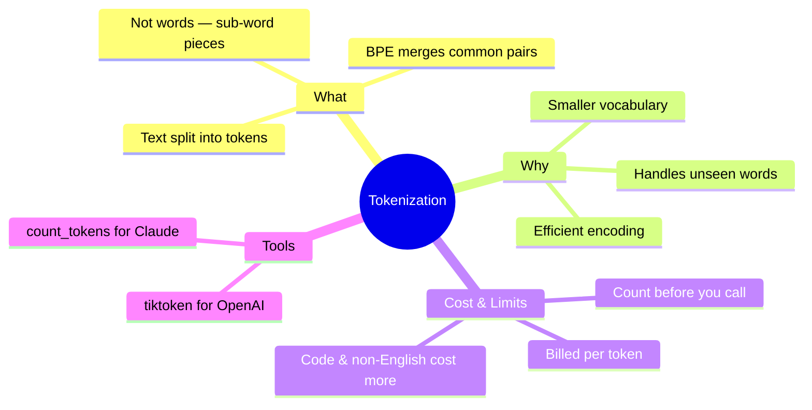

# Tokenization: How LLMs See Your Text

Ever wondered what happens to your text before an LLM processes it? Spoiler: the model doesn't see words like you do. It sees **tokens** - and understanding this will save you money and help you write better prompts!

> **Coming from Software Engineering?** Tokenization is like character encoding (UTF-8, ASCII) but for meaning. Just as you've dealt with encoding bugs where one byte doesn't equal one character, in LLMs one word doesn't equal one token. Understanding this mapping is crucial for cost control and debugging — it's the impedance mismatch between human text and model input.

---

## What is Tokenization?

Tokenization is the process of breaking text into smaller pieces called **tokens**. These tokens are what the LLM actually processes.



### The Key Insight

**Tokens are NOT always words!**

A token can be:
- A whole word: `"hello"`
- Part of a word: `"un"` + `"believ"` + `"able"`
- A single character: `"!"`
- A space + word: `" the"`
- Multiple characters: `"ing"`

---

## Why Not Just Use Words?

Great question! Here's why tokenization is smarter than simple word splitting:



### Benefits of Tokenization

1. **Smaller vocabulary**: Instead of millions of words, models use ~50,000-100,000 tokens
2. **Handles new words**: Can tokenize words it's never seen before
3. **Efficient encoding**: Common patterns get shorter representations
4. **Language agnostic**: Works across different languages

---

## How Tokenization Actually Works

Most modern LLMs use **Byte-Pair Encoding (BPE)** or similar algorithms.

### The BPE Intuition

Imagine you're creating a texting shorthand:



The algorithm:
1. Starts with individual characters
2. Finds the most common pair of adjacent tokens
3. Merges them into a new token
4. Repeats until vocabulary size is reached

---

## Let's See Real Tokenization in Python!

Here's how to actually tokenize text using the `tiktoken` library (OpenAI's tokenizer):

```python
# script_id: day_003_tokenization/basic_tokenization
# Install: pip install tiktoken

import tiktoken

# Get the tokenizer for GPT-4o
encoder = tiktoken.encoding_for_model("gpt-4o")

# Let's tokenize some text!
text = "Hello, how are you doing today?"

# Encode text to tokens
tokens = encoder.encode(text)
print(f"Text: {text}")
print(f"Tokens: {tokens}")
print(f"Number of tokens: {len(tokens)}")

# Output:
# Text: Hello, how are you doing today?
# Tokens: [9906, 11, 1268, 527, 499, 3815, 3432, 30]
# Number of tokens: 8
```

### Decoding Tokens Back to Text

```python
# script_id: day_003_tokenization/decode_tokens
import tiktoken

encoder = tiktoken.encoding_for_model("gpt-4o")

text = "Hello, how are you doing today?"
tokens = encoder.encode(text)

# Decode each token individually to see what it represents
for token in tokens:
    decoded = encoder.decode([token])
    print(f"Token {token} = '{decoded}'")

# Output:
# Token 9906 = 'Hello'
# Token 11 = ','
# Token 1268 = ' how'
# Token 527 = ' are'
# Token 499 = ' you'
# Token 3815 = ' doing'
# Token 3432 = ' today'
# Token 30 = '?'
```

Notice how most tokens include the leading space? That's a design choice in GPT tokenizers!

---

## Tokenization Surprises

Let's explore some interesting tokenization behaviors:

### Example 1: Numbers

```python
# script_id: day_003_tokenization/tokenize_numbers
import tiktoken

encoder = tiktoken.encoding_for_model("gpt-4o")

# Numbers can be tricky!
numbers = ["42", "1000", "123456789"]

for num in numbers:
    tokens = encoder.encode(num)
    print(f"'{num}' = {len(tokens)} tokens: {tokens}")

# Output:
# '42' = 1 tokens: [2983]
# '1000' = 1 tokens: [1041]
# '123456789' = 3 tokens: [4513, 10961, 19608]
```

Large numbers get split into multiple tokens!

### Example 2: Different Languages

```python
# script_id: day_003_tokenization/tokenize_languages
import tiktoken

encoder = tiktoken.encoding_for_model("gpt-4o")

texts = [
    "Hello world",      # English
    "Bonjour monde",    # French
    "こんにちは世界",      # Japanese
    "مرحبا بالعالم",    # Arabic
]

for text in texts:
    tokens = encoder.encode(text)
    print(f"'{text}' = {len(tokens)} tokens")

# Output:
# 'Hello world' = 2 tokens
# 'Bonjour monde' = 3 tokens
# 'こんにちは世界' = 5 tokens
# 'مرحبا بالعالم' = 8 tokens
```

Non-English text often uses more tokens because the tokenizer was trained primarily on English!

### Example 3: Code vs Text

```python
# script_id: day_003_tokenization/tokenize_code_vs_text
import tiktoken

encoder = tiktoken.encoding_for_model("gpt-4o")

# Prose
prose = "The function calculates the sum of two numbers."
prose_tokens = encoder.encode(prose)

# Code
code = "def calculate_sum(a, b): return a + b"
code_tokens = encoder.encode(code)

print(f"Prose ({len(prose)} chars): {len(prose_tokens)} tokens")
print(f"Code ({len(code)} chars): {len(code_tokens)} tokens")

# Prose (47 chars): 9 tokens
# Code (38 chars): 14 tokens
```

Code often requires more tokens than natural language!

---

## Counting Tokens Before You Call the API

The most practical use of tokenization is estimating cost and staying under context limits *before* you send a request. Count first, then decide.

```python
# script_id: day_003_tokenization/estimate_cost
import tiktoken

encoder = tiktoken.encoding_for_model("gpt-4o")

def estimate_cost(text: str, price_per_1m_input: float = 2.50) -> dict:
    """Estimate input-token cost for a prompt. Verify current pricing before relying on it."""
    n_tokens = len(encoder.encode(text))
    cost = (n_tokens / 1_000_000) * price_per_1m_input
    return {"tokens": n_tokens, "estimated_input_cost_usd": round(cost, 6)}

prompt = "Summarize the following article:\n\n" + ("lorem ipsum " * 500)
print(estimate_cost(prompt))
# {'tokens': 1012, 'estimated_input_cost_usd': 0.00253}
```

> **A note on tokenizers:** `tiktoken` is OpenAI's tokenizer. Other providers tokenize differently — Anthropic's Claude models, for example, use their own tokenizer, so a `tiktoken` count is only an approximation for non-OpenAI models. For an exact Claude count, use the Anthropic SDK's token-counting endpoint (`client.messages.count_tokens(...)`) rather than `tiktoken`.

---

## Summary



**Key takeaways:**
- LLMs see **tokens**, not words. One word ≠ one token.
- Tokens are billed and counted against the context window — tokenization is a cost and capacity concern, not just a curiosity.
- English is cheapest; code and non-English text use noticeably more tokens for the same content.
- Count tokens **before** calling the API to estimate cost and avoid blowing the context limit.

---

## Quick Reference

| Task | Code |
|------|------|
| Get an OpenAI tokenizer | `enc = tiktoken.encoding_for_model("gpt-4o")` |
| Count tokens | `len(enc.encode(text))` |
| Encode → tokens | `enc.encode(text)` |
| Decode tokens → text | `enc.decode(tokens)` |
| Inspect one token | `enc.decode([token_id])` |
| Count tokens for Claude | `client.messages.count_tokens(model=..., messages=[...])` |

**Rules of thumb (English):** ~1 token ≈ 4 characters ≈ ¾ of a word. ~100 tokens ≈ 75 words.

---

## Exercises

1. **Measure your own prompts.** Take a prompt you actually use and count its tokens. Then estimate the cost per call at current pricing.
2. **Compare languages.** Tokenize the same sentence translated into three languages. How much more does the most expensive one cost?
3. **Code vs prose.** Count tokens for a 50-line Python file and a 50-line prose document of similar character length. Which is more token-dense, and why?
4. **Context budgeting.** Given a 128K-token context window, how many ~500-word documents could you fit if you also reserve 4K tokens for the system prompt and response?

---

*Next up: Temperature and Sampling Part 1 — how LLMs turn token probabilities into the words you actually see, and how the temperature dial reshapes that distribution.*
