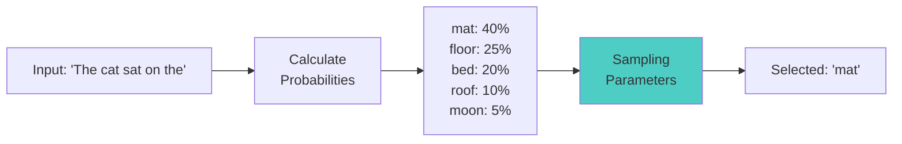
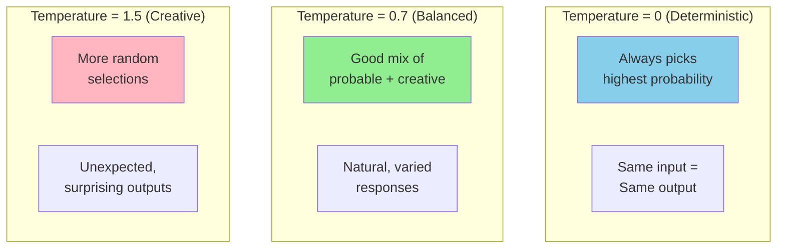
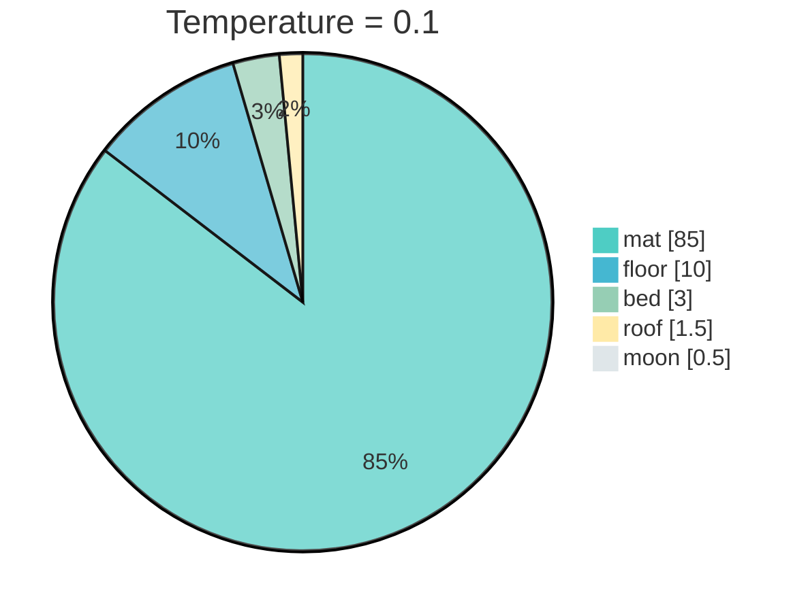
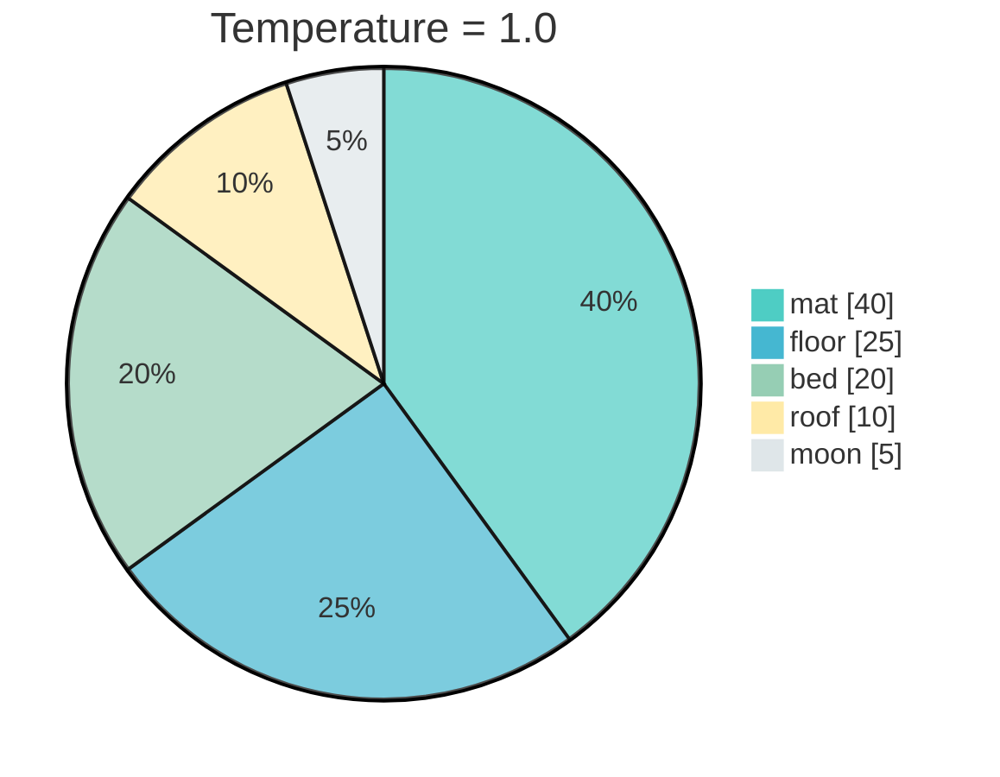
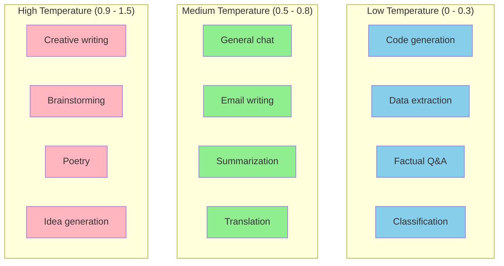
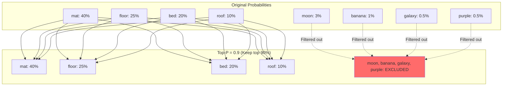
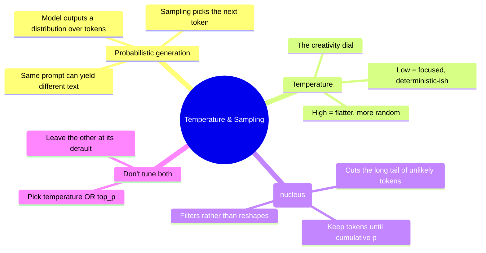

# Temperature and Top-P (Part 1)

Welcome back! Now that you understand how LLMs read text (tokenization) and turn it into predictions, let's learn how to control the **creativity** and **randomness** of their outputs.

Think of these as the "personality knobs" for your AI!

> **Coming from Software Engineering?** Temperature is a dial for HOW MUCH randomness you allow — like a config flag from fully deterministic to highly varied. temperature=0 behaves like a fixed test (same input → same output, great for testing); higher values trade reproducibility for creative variety.

---

## The Big Picture: How LLMs Generate Text

Before diving into the controls, let's understand what we're controlling.

When an LLM generates text, it doesn't just pick the "best" next word. Instead, it:

1. Calculates a probability for EVERY possible next token
2. Uses sampling parameters to pick from those probabilities
3. Repeats until done



---

## Temperature: The Creativity Dial

Temperature is the most important sampling parameter. It controls how "random" or "creative" the output is.

### The Intuition



### How Temperature Works (Simplified)

Temperature adjusts the probability distribution — the full list of every possible next token paired with its percentage chance:

Under the hood, temperature is just a divisor applied to the model's raw scores before they become percentages. Dividing by a small number (below 1) exaggerates the gaps so the top choice dominates; dividing by a larger number shrinks the gaps so the choices become more equal. Temperature = 1 leaves them unchanged.

- **Low temperature (0-0.3)**: Makes high-probability tokens MUCH more likely
- **Medium temperature (0.5-0.8)**: Balanced selection
- **High temperature (1.0+)**: Flattens probabilities, more randomness

```python
# script_id: day_004_temperature_and_sampling_part1/probability_distribution_concept
# Conceptual example (not actual API code)

# Original probabilities
probabilities = {
    "mat": 0.40,
    "floor": 0.25,
    "bed": 0.20,
    "roof": 0.10,
    "moon": 0.05
}

# With temperature = 0.1 (very focused)
# "mat" becomes almost certain (~85%)

# With temperature = 1.0 (neutral)
# Probabilities stay roughly the same

# With temperature = 2.0 (very random)
# All options become more equal (~20% each)
```

### Visual Comparison





### Code Example: Temperature in Action

```python
# script_id: day_004_temperature_and_sampling_part1/temperature_in_action
from openai import OpenAI

client = OpenAI()

def generate_with_temperature(prompt: str, temperature: float):
    """Generate text with specified temperature."""
    response = client.chat.completions.create(
        model="gpt-4o-mini",
        messages=[{"role": "user", "content": prompt}],
        temperature=temperature,
        # Note: gpt-4o uses max_tokens; OpenAI o-series reasoning models require max_completion_tokens instead.
        max_tokens=50
    )
    return response.choices[0].message.content

prompt = "Write a one-sentence story about a robot:"

# Let's see how temperature affects output
temperatures = [0.0, 0.5, 1.0, 1.5]

for temp in temperatures:
    print(f"\n--- Temperature: {temp} ---")
    # Generate 3 times to see variation
    for i in range(3):
        result = generate_with_temperature(prompt, temp)
        print(f"  {i+1}. {result}")
```

**Expected Output:**

```
--- Temperature: 0.0 ---
  1. A robot discovered it could dream and wondered what it meant to be alive.
  2. A robot discovered it could dream and wondered what it meant to be alive.
  3. A robot discovered it could dream and wondered what it meant to be alive.

--- Temperature: 0.5 ---
  1. A robot discovered it could dream and wondered what it meant to be alive.
  2. A lonely robot found friendship in an abandoned teddy bear.
  3. A robot discovered it could dream and pondered the meaning of existence.

--- Temperature: 1.0 ---
  1. The robot baked cookies for the first time and accidentally invented a new element.
  2. A robot wandered through the desert searching for its creator.
  3. In the year 3000, a robot learned to laugh at its own jokes.

--- Temperature: 1.5 ---
  1. Rusty the robot accidentally sneezed bolts into a time vortex of dancing electrons.
  2. A mechanical dreamer composed symphonies from static and stardust memories.
  3. Robot-7 transcended its circuits through interpretive welding dance.
```

Your exact wording will differ — what matters is the pattern: identical at temp 0, increasingly varied as temperature rises.

Notice how:
- **Temp 0**: Same (or near-identical) output every time
- **Temp 0.5**: Slight variations
- **Temp 1.0**: Creative but coherent
- **Temp 1.5**: Wild and unexpected

---

## Temperature Use Cases



---

## Top-P (Nucleus Sampling): The Probability Filter

Top-P is another way to control randomness, but with a different approach (called nucleus sampling because you keep only the dense "nucleus" of likely options and discard the thin tail).

> **Coming from Software Engineering?** Top-P is like a percentile cutoff: sort the candidates, keep just enough of the top to cover P% of the total probability, and drop the rest.

### The Intuition

Instead of adjusting ALL probabilities (like temperature), Top-P **cuts off** the long tail of unlikely options.



### How Top-P Works

1. Sort all tokens by probability (highest first)
2. Add up probabilities until you reach P (e.g., 0.9 = 90%)
3. Only sample from those tokens

```python
# script_id: day_004_temperature_and_sampling_part1/top_p_concept
# Conceptual example

probabilities = [
    ("mat", 0.40),
    ("floor", 0.25),
    ("bed", 0.20),
    ("roof", 0.10),
    ("moon", 0.03),
    ("banana", 0.02),
]

def apply_top_p(probs, p=0.9):
    """Keep only tokens that make up top P probability."""
    sorted_probs = sorted(probs, key=lambda x: x[1], reverse=True)

    cumulative = 0
    filtered = []

    for token, prob in sorted_probs:
        if cumulative < p:
            filtered.append((token, prob))
            cumulative += prob
        else:
            break

    return filtered

result = apply_top_p(probabilities, p=0.9)
print("Tokens kept:", result)
# Output: [('mat', 0.40), ('floor', 0.25), ('bed', 0.20), ('roof', 0.10)]
# "moon" and "banana" are excluded!
```

### Top-P in API Calls

```python
# script_id: day_004_temperature_and_sampling_part1/top_p_api_call
from openai import OpenAI

client = OpenAI()

def generate_with_top_p(prompt: str, top_p: float):
    """Generate text with specified top_p."""
    response = client.chat.completions.create(
        model="gpt-4o-mini",
        messages=[{"role": "user", "content": prompt}],
        top_p=top_p,
        temperature=1.0,  # Keep temperature neutral
        max_tokens=50
    )
    return response.choices[0].message.content

prompt = "Complete this sentence creatively: The scientist discovered that..."

# Compare different top_p values
print("--- Top-P = 0.1 (Very focused) ---")
print(generate_with_top_p(prompt, 0.1))

print("\n--- Top-P = 0.5 (Moderate) ---")
print(generate_with_top_p(prompt, 0.5))

print("\n--- Top-P = 0.95 (Open) ---")
print(generate_with_top_p(prompt, 0.95))
```

> **Warning: Temperature + Top-P Together**
> OpenAI recommends setting **only one** of `temperature` or `top_p`, not both. When both are set, they interact in unpredictable ways — temperature reshapes the probability distribution, then top_p filters it. This double transformation makes output behavior hard to reason about. **Best practice:** Use `temperature` for most use cases (it's more intuitive). Only switch to `top_p` when you specifically need nucleus sampling behavior. If you must use both, keep one at its default value (`temperature=1.0` or `top_p=1.0`).

---

## Checkpoint

Run the `generate_with_temperature` loop a few times and confirm: at `temperature=0` the same prompt gives you the same (or nearly identical) completion every time, while at `temperature=1.0+` the wording drifts run to run. If even the high-temperature runs come back identical, check that you're not passing `seed` or that some caching layer isn't returning a stored response.

---

## Summary



## Quick Reference

| Setting | What it does | Typical use |
|---|---|---|
| `temperature=0` | Near-deterministic; picks the top token | Extraction, classification, code |
| `temperature=0.7` | Balanced, natural variation | Chat, general use |
| `temperature=1.0+` | Flatter distribution, more surprising | Brainstorming, creative writing |
| `top_p=0.9` | Sample only from the top 90% probability mass | When you want nucleus sampling |
| `top_p=1.0` | No filtering (the default) | Leave here when tuning temperature |
| Both at once | Interact unpredictably | Avoid — set only one |

```python
# script_id: day_004_temperature_and_sampling_part1/quick_reference
# fragment: illustrative cheat-sheet, not standalone-runnable
response = client.chat.completions.create(
    model="gpt-4o-mini",
    messages=[{"role": "user", "content": prompt}],
    temperature=0.0,   # deterministic; or set top_p instead, not both
)
```

## Exercises

1. **Measure determinism.** Call the model 5 times at `temperature=0` with the same prompt, then 5 times at `temperature=1.2`. Count how many distinct outputs you get in each batch.
2. **Pick by task.** For each task — extracting a date from text, writing a poem, classifying sentiment — choose a temperature and justify it in one line.
3. **Implement top-p by hand.** Extend the `apply_top_p` function above to also return the *excluded* tokens, and verify the kept probabilities sum to ≥ p.
4. **Break the rule on purpose.** Set both `temperature=0.2` and `top_p=0.5`, run the creative prompt a few times, and describe how the output feels versus tuning just one.

<details><summary>Solutions (approaches)</summary>

1. At `temperature=0` you'll usually get 1 distinct output (the model is near-greedy); at `1.2` expect 4–5 distinct outputs. Determinism isn't *guaranteed* even at 0, but it's close.
2. Date extraction → `0` (you want the exact answer). Poem → `0.9–1.2` (variety). Sentiment classification → `0` (consistent labels).
3. Track a second list for tokens once `cumulative >= p`; assert `sum(prob for _, prob in kept) >= p`.
4. Output tends to feel narrower than `top_p=0.5` alone but with odd variance — exactly the "hard to reason about" interaction the warning describes.
</details>

## What's Next?

Tomorrow (Day 5) is **Temperature and Sampling Part 2** — we go deeper on choosing between temperature and top-p, add **frequency and presence penalties** to curb repetition, and build a decision tree for picking sampling settings by use case.
