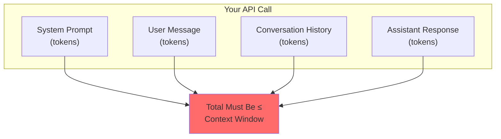
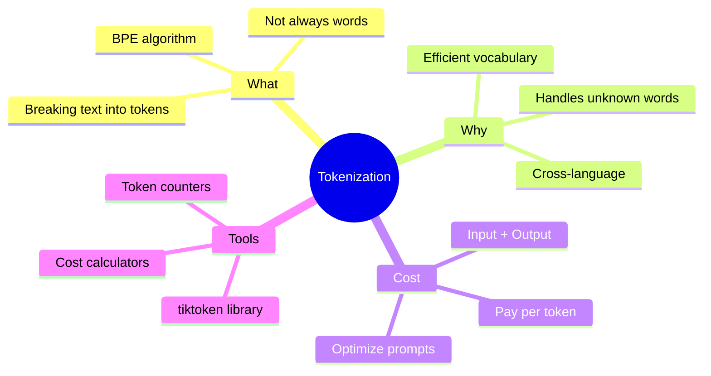

> **Coming from Software Engineering?** Token cost management is similar to bandwidth optimization in networking — you're paying per unit of data transferred. The same cost-awareness you apply to API rate limits and cloud compute bills applies here, just measured in tokens instead of requests or CPU-hours.

## Calculating Token Costs

This is where understanding tokenization saves you money!


### Pricing Structure

LLMs typically charge per token:

| Model | Input Cost | Output Cost |
|-------|------------|-------------|
| GPT-4o | $0.0025/1K tokens | $0.01/1K tokens |
| GPT-4o mini | $0.00015/1K tokens | $0.0006/1K tokens |
| Claude 3.5 Sonnet | $0.003/1K tokens | $0.015/1K tokens |

### Cost Calculator

```python
import tiktoken

def calculate_cost(prompt: str, expected_response_tokens: int = 500):
    """
    Calculate the estimated cost of an API call.
    """
    encoder = tiktoken.encoding_for_model("gpt-4o")
    input_tokens = len(encoder.encode(prompt))

    # GPT-4o pricing (as of early 2025)
    input_cost_per_1k = 0.0025   # $2.50 per 1M tokens
    output_cost_per_1k = 0.01    # $10.00 per 1M tokens

    input_cost = (input_tokens / 1000) * input_cost_per_1k
    output_cost = (expected_response_tokens / 1000) * output_cost_per_1k
    total_cost = input_cost + output_cost

    return {
        "input_tokens": input_tokens,
        "estimated_output_tokens": expected_response_tokens,
        "input_cost": f"${input_cost:.4f}",
        "output_cost": f"${output_cost:.4f}",
        "total_cost": f"${total_cost:.4f}"
    }

# Example usage
prompt = """
You are an expert Python developer. Please review the following code
and provide detailed feedback on:
1. Code quality
2. Performance optimizations
3. Security concerns
4. Best practices

Code:
def process_user_data(users):
    results = []
    for user in users:
        if user['age'] > 18:
            results.append(user['name'])
    return results
"""

cost = calculate_cost(prompt, expected_response_tokens=800)
print(cost)

# Output:
# {
#   'input_tokens': 89,
#   'estimated_output_tokens': 800,
#   'input_cost': '$0.0027',
#   'output_cost': '$0.0480',
#   'total_cost': '$0.0507'
# }
```

---

## Practical Tips for Token Efficiency

### Tip 1: Be Concise in Prompts

```python
# Bad: Verbose prompt (more tokens = more cost)
verbose_prompt = """
I would really appreciate it if you could please help me by
providing a comprehensive and detailed summary of the following
text. I want you to make sure that you capture all the important
points and key takeaways from the content below:
"""

# Good: Concise prompt (fewer tokens = less cost)
concise_prompt = "Summarize this text, highlighting key points:"

# The concise version saves ~30 tokens per request!
```

### Tip 2: Remove Unnecessary Whitespace

```python
import tiktoken

encoder = tiktoken.encoding_for_model("gpt-4o")

# Extra whitespace wastes tokens!
messy = """

    Hello     world!

    How    are   you?

"""

clean = "Hello world! How are you?"

print(f"Messy: {len(encoder.encode(messy))} tokens")
print(f"Clean: {len(encoder.encode(clean))} tokens")

# Messy: 15 tokens
# Clean: 7 tokens
```

### Tip 3: Use Abbreviations Strategically

```python
import tiktoken

encoder = tiktoken.encoding_for_model("gpt-4o")

# In system prompts, abbreviations can help
full = "JavaScript Object Notation"
abbrev = "JSON"

print(f"'{full}': {len(encoder.encode(full))} tokens")
print(f"'{abbrev}': {len(encoder.encode(abbrev))} tokens")

# 'JavaScript Object Notation': 4 tokens
# 'JSON': 1 token
```

---

## Token Limits and Context Windows

Remember: **Context Window = Maximum Tokens**



```python
import tiktoken

def check_fits_context(messages: list, model: str = "gpt-4o"):
    """
    Check if messages fit within the context window.
    """
    encoder = tiktoken.encoding_for_model(model)

    context_limits = {
        "gpt-4o": 128000,
        "gpt-4o-mini": 128000,
    }

    total_tokens = 0
    for message in messages:
        total_tokens += len(encoder.encode(message["content"]))
        total_tokens += 4  # Overhead per message

    limit = context_limits.get(model, 8192)
    fits = total_tokens < limit

    return {
        "total_tokens": total_tokens,
        "context_limit": limit,
        "fits": fits,
        "remaining": limit - total_tokens if fits else 0
    }

# Example
messages = [
    {"role": "system", "content": "You are a helpful assistant."},
    {"role": "user", "content": "Explain quantum computing in simple terms."},
]

result = check_fits_context(messages)
print(result)

# Output:
# {
#   'total_tokens': 19,
#   'context_limit': 8192,
#   'fits': True,
#   'remaining': 8173
# }
```

---

## Quick Reference: Token Rules of Thumb

| Text Type | Rough Token Ratio |
|-----------|-------------------|
| English text | ~1 token per 4 characters |
| English text | ~0.75 tokens per word |
| Code | ~1 token per 3 characters |
| Numbers | Varies widely |
| Non-English | 2-4x more tokens than English |

---

## Summary



---

## What's Next?

Now that you understand tokenization, let's explore how to control the LLM's creativity using **Temperature, Top-P, and Frequency Penalties** - the knobs that tune your AI's output!

---

## Exercises

1. **Token Counter**: Write a function that counts tokens in a file and estimates the API cost

2. **Language Comparison**: Compare token counts for the same sentence in 5 different languages

3. **Optimization Challenge**: Take a 500-token prompt and reduce it to under 300 tokens while keeping the same meaning

```python
# Starter code for Exercise 1
import tiktoken

def analyze_file(filepath: str):
    encoder = tiktoken.encoding_for_model("gpt-4o")

    with open(filepath, 'r') as f:
        content = f.read()

    tokens = encoder.encode(content)

    return {
        "characters": len(content),
        "tokens": len(tokens),
        "ratio": len(content) / len(tokens),
        "estimated_cost_gpt4": f"${(len(tokens)/1000) * 0.03:.4f}"
    }

# Try it on your own files!
```
