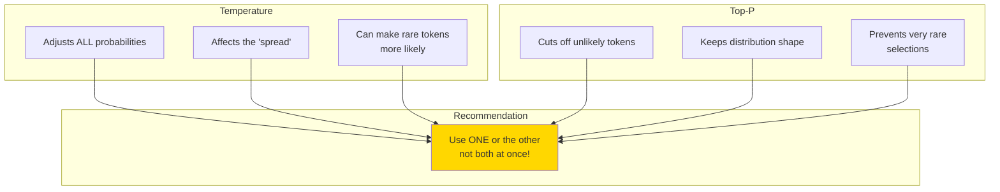
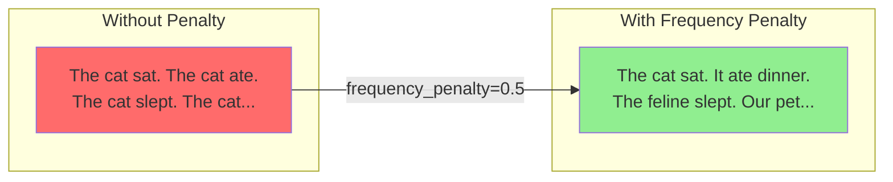
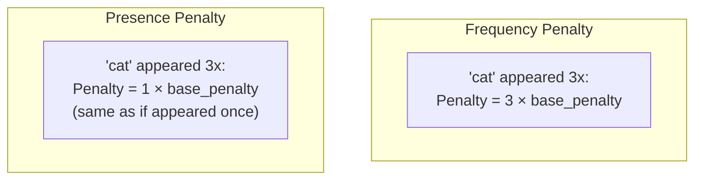
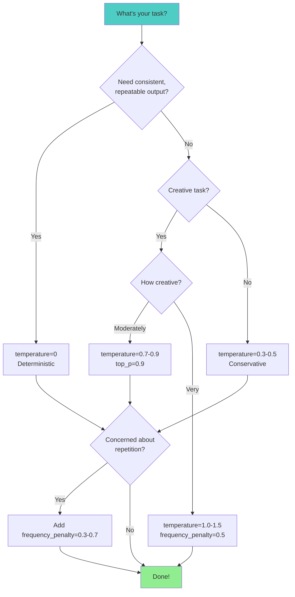
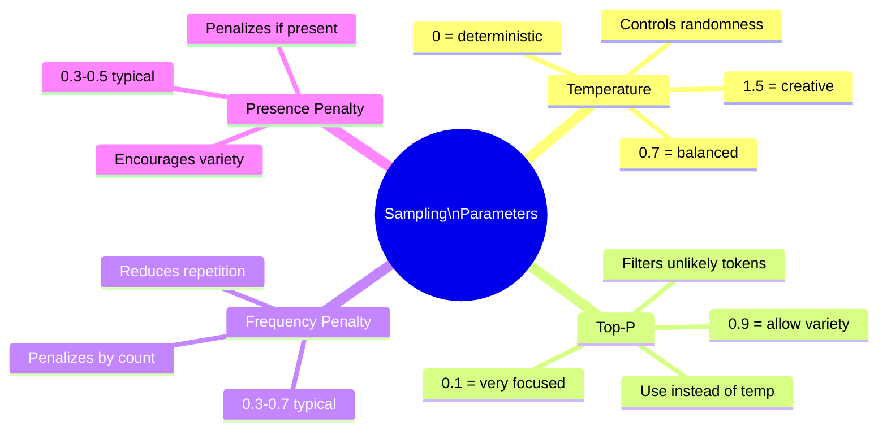

> **Coming from Software Engineering?** Configuring sampling parameters is like tuning a system's performance knobs — connection pool sizes, cache TTLs, retry intervals. There's no universal best setting; it depends on your use case. The decision tree here is your equivalent of a runbook for model configuration.

## Temperature vs Top-P: When to Use Which?



### Quick Guide

| Goal | Use | Settings |
|------|-----|----------|
| Deterministic output | Temperature | `temperature=0` |
| Creative but safe | Top-P | `top_p=0.9, temperature=1` |
| Maximum creativity | Temperature | `temperature=1.5` |
| Balanced general use | Either | `temperature=0.7` or `top_p=0.9` |

---

## Frequency and Presence Penalties

These parameters help prevent repetition in outputs.

### Frequency Penalty

Reduces the likelihood of tokens that have already appeared, **proportional to how often** they've appeared.



### Presence Penalty

Reduces the likelihood of tokens that have appeared **at all**, regardless of how many times.



### Code Example

```python
from openai import OpenAI

client = OpenAI()

def generate_with_penalties(
    prompt: str,
    frequency_penalty: float = 0,
    presence_penalty: float = 0
):
    """Generate text with repetition penalties."""
    response = client.chat.completions.create(
        model="gpt-4o-mini",
        messages=[{"role": "user", "content": prompt}],
        temperature=0.7,
        max_tokens=100,
        frequency_penalty=frequency_penalty,
        presence_penalty=presence_penalty
    )
    return response.choices[0].message.content

prompt = "Write a paragraph about cats. Include lots of details."

print("--- No penalties ---")
print(generate_with_penalties(prompt))

print("\n--- With frequency_penalty=0.5 ---")
print(generate_with_penalties(prompt, frequency_penalty=0.5))

print("\n--- With presence_penalty=0.5 ---")
print(generate_with_penalties(prompt, presence_penalty=0.5))

print("\n--- With both penalties ---")
print(generate_with_penalties(prompt, frequency_penalty=0.5, presence_penalty=0.5))
```

### Penalty Value Ranges

Both penalties range from **-2.0 to 2.0**:

| Value | Effect |
|-------|--------|
| -2.0 | Strongly ENCOURAGE repetition |
| 0 | No effect (default) |
| 0.5 | Mild discouragement |
| 1.0 | Moderate discouragement |
| 2.0 | Strong discouragement |

---

## Putting It All Together: A Practical Configuration Guide

```python
from openai import OpenAI

client = OpenAI()

# Different configurations for different tasks
CONFIGS = {
    "code_generation": {
        "temperature": 0,
        "top_p": 1,
        "frequency_penalty": 0,
        "presence_penalty": 0
    },
    "creative_writing": {
        "temperature": 0.9,
        "top_p": 0.95,
        "frequency_penalty": 0.5,
        "presence_penalty": 0.5
    },
    "factual_qa": {
        "temperature": 0.3,
        "top_p": 0.9,
        "frequency_penalty": 0,
        "presence_penalty": 0
    },
    "brainstorming": {
        "temperature": 1.2,
        "top_p": 0.95,
        "frequency_penalty": 0.7,
        "presence_penalty": 0.7
    },
    "chat_assistant": {
        "temperature": 0.7,
        "top_p": 0.9,
        "frequency_penalty": 0.3,
        "presence_penalty": 0.3
    }
}

def smart_generate(prompt: str, task_type: str):
    """Generate text with task-appropriate settings."""
    config = CONFIGS.get(task_type, CONFIGS["chat_assistant"])

    response = client.chat.completions.create(
        model="gpt-4o-mini",
        messages=[{"role": "user", "content": prompt}],
        max_tokens=200,
        **config
    )
    return response.choices[0].message.content

# Usage examples
print(smart_generate("Write a Python function to sort a list", "code_generation"))
print(smart_generate("Give me 5 unique startup ideas", "brainstorming"))
print(smart_generate("What is the capital of France?", "factual_qa"))
```

---

## Decision Tree: Choosing Your Settings



---

## Common Mistakes to Avoid

### Mistake 1: Using High Temperature AND Low Top-P

```python
# BAD: Conflicting settings
response = client.chat.completions.create(
    model="gpt-4o-mini",
    messages=[...],
    temperature=1.5,  # "Be creative!"
    top_p=0.1  # "But only use common tokens!"
)

# GOOD: Pick one approach
# For creativity:
temperature=1.2, top_p=1.0

# For focus:
temperature=0.3, top_p=1.0
# OR
temperature=1.0, top_p=0.5
```

### Mistake 2: Extreme Penalties

```python
# BAD: Penalties too high
frequency_penalty=2.0
presence_penalty=2.0
# Result: Model avoids ALL repeated words, even necessary ones like "the", "is"

# GOOD: Moderate penalties
frequency_penalty=0.5
presence_penalty=0.3
```

---

## Summary



---

## Exercises

1. **Temperature Explorer**: Create a script that generates the same prompt with temperatures from 0 to 2 in 0.2 increments. Visualize how the outputs change.

2. **Repetition Fighter**: Take a prompt that tends to produce repetitive output. Find the optimal frequency/presence penalty combination.

3. **Task Matcher**: Given these tasks, choose appropriate settings:
   - Generating unit tests
   - Writing poetry
   - Extracting dates from text
   - Generating product descriptions

---

## What's Next?

You now understand the three pillars of LLM interaction:
1. How they process text (Transformers)
2. How they see text (Tokenization)
3. How to control their output (Sampling Parameters)

Next week, we'll dive into **Advanced Prompting Techniques** - the art of communicating effectively with LLMs to get exactly what you want!
