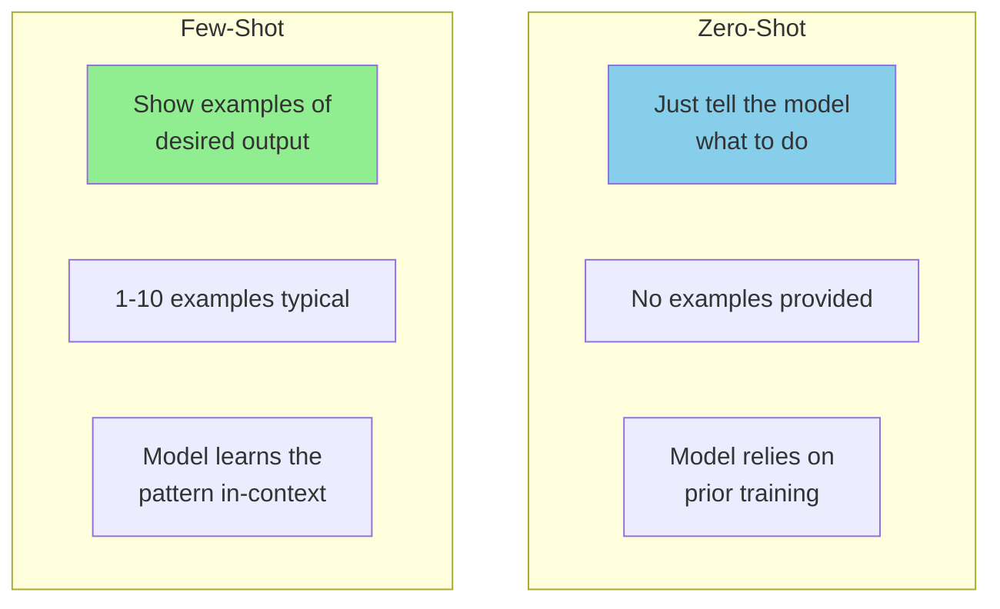
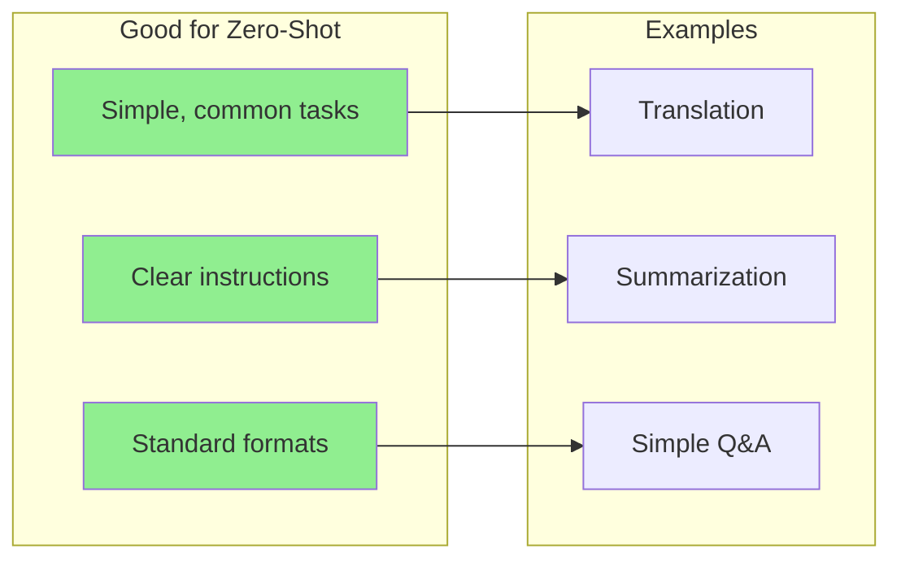
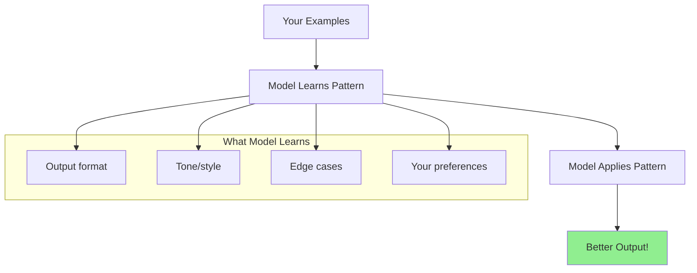
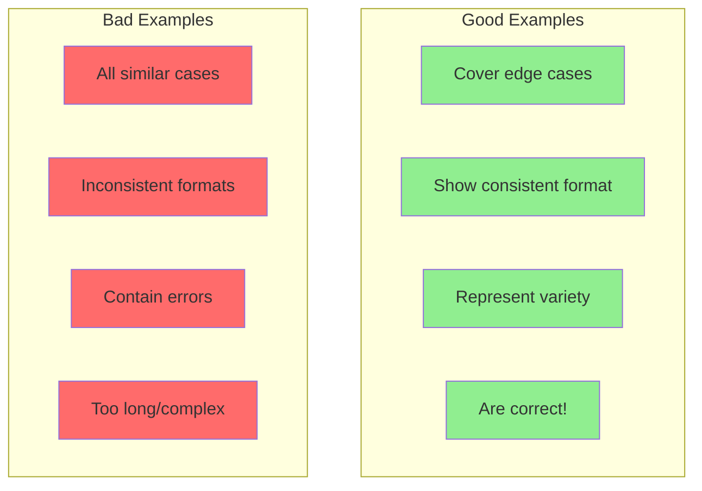
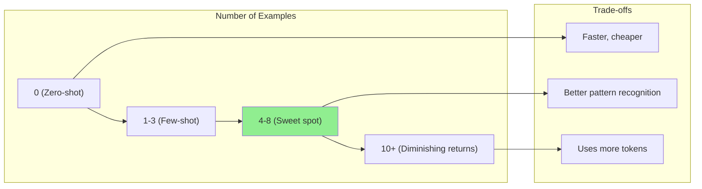
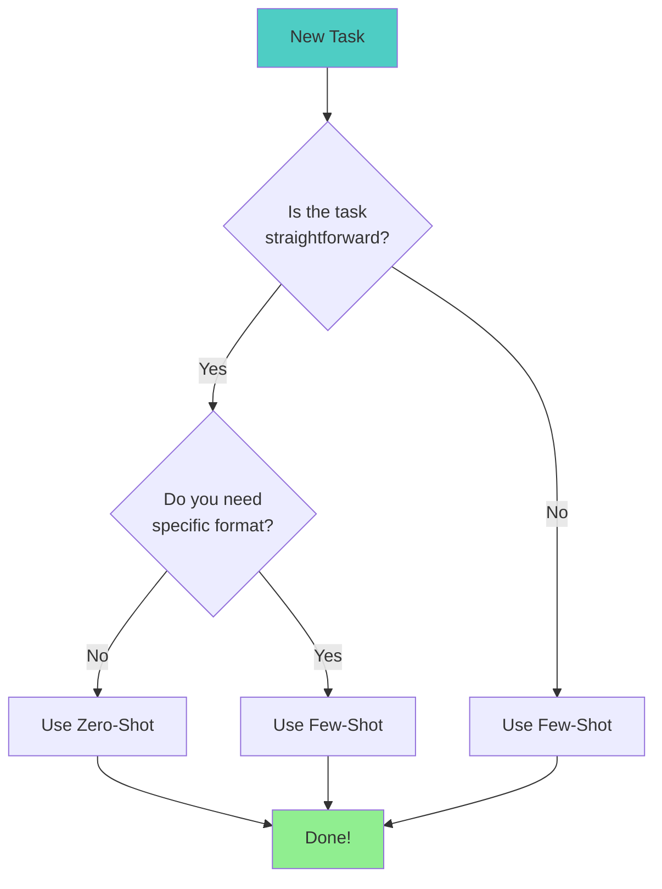
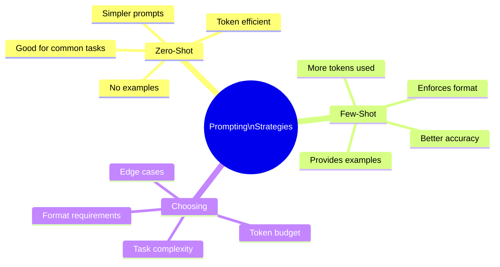

# Zero-Shot vs Few-Shot Prompting

Welcome to the world of prompt engineering! In this guide, you'll learn two fundamental techniques that dramatically improve LLM outputs: **zero-shot** and **few-shot** prompting.

Think of it like teaching someone a new task - sometimes you just explain it, and sometimes you show examples first.

> **Coming from Software Engineering?** Zero-shot is like calling a function with just a docstring. Few-shot is like adding unit test examples in the docstring — the more examples you provide, the better the function 'understands' the expected behavior. If you've written clear API documentation with request/response examples, you already think in few-shot patterns. Choosing between them is a cost-performance tradeoff, just like choosing between an in-memory cache hit vs a database query. Few-shot costs more tokens (like more compute) but gives better results. Dynamic few-shot selection is essentially building a retrieval cache for your best examples.

---

## What's the Difference?



### Simple Analogy

| Approach | Real-World Example |
|----------|-------------------|
| Zero-Shot | "Please sort these books by color" |
| Few-Shot | "Sort these books by color. For example: red books go on shelf 1, blue books on shelf 2. Now sort the rest." |

---

## Zero-Shot Prompting

Zero-shot means asking the model to do something **without providing any examples**. You're relying entirely on the model's training.

### Basic Zero-Shot Example

```python
# script_id: day_006_zero_shot_vs_few_shot/zero_shot_classify
from openai import OpenAI

client = OpenAI()

def zero_shot_classify(text: str) -> str:
    """Classify sentiment without examples."""
    response = client.chat.completions.create(
        model="gpt-4o-mini",
        messages=[
            {
                "role": "user",
                "content": f"Classify the sentiment of this text as positive, negative, or neutral:\n\n{text}"
            }
        ],
        temperature=0
    )
    return response.choices[0].message.content

# Test it
texts = [
    "I absolutely loved this movie! Best film of the year!",
    "The service was okay, nothing special.",
    "Terrible experience. Would never recommend."
]

for text in texts:
    result = zero_shot_classify(text)
    print(f"Text: {text[:50]}...")
    print(f"Sentiment: {result}\n")
```

### When Zero-Shot Works Well



### Zero-Shot Best Practices

```python
# script_id: day_006_zero_shot_vs_few_shot/zero_shot_best_practices
# BAD: Vague zero-shot prompt
bad_prompt = "Analyze this text"

# GOOD: Clear, specific zero-shot prompt
good_prompt = """Analyze the following customer review and extract:
1. Main product mentioned
2. Customer's overall sentiment (positive/negative/neutral)
3. Key complaints (if any)
4. Key praises (if any)

Review: {text}

Provide your analysis in a structured format."""
```

---

## Few-Shot Prompting

Few-shot prompting means **showing the model examples** of the input-output pattern you want, then asking it to follow that pattern.

### The Power of Examples



### Basic Few-Shot Example

```python
# script_id: day_006_zero_shot_vs_few_shot/few_shot_classify
from openai import OpenAI

client = OpenAI()

def few_shot_classify(text: str) -> str:
    """Classify sentiment with examples."""
    response = client.chat.completions.create(
        model="gpt-4o-mini",
        messages=[
            {
                "role": "user",
                "content": """Classify the sentiment of texts as positive, negative, or neutral.

Example 1:
Text: "This product exceeded all my expectations!"
Sentiment: positive

Example 2:
Text: "Worst purchase I've ever made. Complete waste of money."
Sentiment: negative

Example 3:
Text: "It works as described. Nothing more, nothing less."
Sentiment: neutral

Now classify this:
Text: "{text}"
Sentiment:""".format(text=text)
            }
        ],
        temperature=0
    )
    return response.choices[0].message.content

# Compare with zero-shot
tricky_text = "Well, I guess it didn't completely ruin my day."

print("Few-shot result:", few_shot_classify(tricky_text))
# Output: negative (correctly identifies sarcasm/negativity)
```

### Structured Few-Shot Template

```python
# script_id: day_006_zero_shot_vs_few_shot/few_shot_prompt_template
def create_few_shot_prompt(examples: list, task: str, new_input: str) -> str:
    """
    Create a few-shot prompt from examples.

    Args:
        examples: List of {"input": ..., "output": ...} dicts
        task: Description of what to do
        new_input: The new input to process

    Returns:
        Formatted few-shot prompt
    """
    prompt = f"{task}\n\n"

    for i, example in enumerate(examples, 1):
        prompt += f"Example {i}:\n"
        prompt += f"Input: {example['input']}\n"
        prompt += f"Output: {example['output']}\n\n"

    prompt += f"Now process this:\n"
    prompt += f"Input: {new_input}\n"
    prompt += f"Output:"

    return prompt

# Usage
examples = [
    {
        "input": "Dr. Sarah Johnson from MIT",
        "output": '{"name": "Sarah Johnson", "title": "Dr.", "affiliation": "MIT"}'
    },
    {
        "input": "Prof. Michael Chen, Stanford University",
        "output": '{"name": "Michael Chen", "title": "Prof.", "affiliation": "Stanford University"}'
    },
    {
        "input": "Jane Smith, PhD - Harvard Medical School",
        "output": '{"name": "Jane Smith", "title": "PhD", "affiliation": "Harvard Medical School"}'
    }
]

prompt = create_few_shot_prompt(
    examples=examples,
    task="Extract structured information from academic affiliations and format as JSON.",
    new_input="Associate Prof. David Kim from Berkeley"
)

print(prompt)
```

---

## Choosing Examples: Quality Over Quantity

The examples you choose dramatically affect results. Here's how to pick good ones:



### Example Selection Strategy

```python
# script_id: day_006_zero_shot_vs_few_shot/select_diverse_examples
def select_diverse_examples(all_examples: list, n: int = 5) -> list:
    """
    Select diverse examples for few-shot prompting.

    Strategy:
    1. Include at least one "easy" example
    2. Include at least one "edge case"
    3. Cover different categories/types
    4. Keep examples concise
    """
    selected = []

    # Get one from each category
    categories = set(ex.get('category', 'default') for ex in all_examples)
    for category in categories:
        category_examples = [ex for ex in all_examples if ex.get('category') == category]
        if category_examples:
            selected.append(category_examples[0])
        if len(selected) >= n:
            break

    # Add edge cases if we have room
    edge_cases = [ex for ex in all_examples if ex.get('is_edge_case', False)]
    for edge in edge_cases:
        if len(selected) >= n:
            break
        if edge not in selected:
            selected.append(edge)

    return selected[:n]

# Example usage
all_examples = [
    {"input": "hello", "output": "greeting", "category": "greeting", "is_edge_case": False},
    {"input": "HELLO!!!", "output": "greeting", "category": "greeting", "is_edge_case": True},
    {"input": "goodbye", "output": "farewell", "category": "farewell", "is_edge_case": False},
    {"input": "I'm leaving now", "output": "farewell", "category": "farewell", "is_edge_case": True},
    {"input": "thanks", "output": "gratitude", "category": "gratitude", "is_edge_case": False},
]

selected = select_diverse_examples(all_examples, n=3)
```

---

## How Many Examples? The Sweet Spot



### Token Cost Calculation

```python
# script_id: day_006_zero_shot_vs_few_shot/token_cost_calculation
import tiktoken

def calculate_few_shot_cost(
    examples: list,
    task_description: str,
    model: str = "gpt-4o"
):
    """Calculate token cost of few-shot prompt."""
    encoder = tiktoken.encoding_for_model(model)

    # Build the prompt
    prompt = task_description + "\n\n"
    for i, ex in enumerate(examples):
        prompt += f"Example {i+1}:\nInput: {ex['input']}\nOutput: {ex['output']}\n\n"

    tokens = len(encoder.encode(prompt))

    # Input-token cost per 1K tokens (~$2.50/1M input for GPT-4o; verify current pricing).
    # NOTE: this counts INPUT tokens only. Output tokens are billed separately and
    # are typically several times more expensive, so output-heavy calls cost more
    # than this estimate suggests.
    cost_per_1k = 0.0025

    return {
        "example_count": len(examples),
        "total_tokens": tokens,
        "cost_per_request": f"${(tokens/1000) * cost_per_1k:.4f}",
        "cost_per_1000_requests": f"${(tokens/1000) * cost_per_1k * 1000:.2f}"
    }

# Compare different example counts
examples = [
    {"input": "text1", "output": "output1"},
    {"input": "text2", "output": "output2"},
    {"input": "text3", "output": "output3"},
    {"input": "text4", "output": "output4"},
    {"input": "text5", "output": "output5"},
]

for n in [1, 3, 5]:
    cost = calculate_few_shot_cost(examples[:n], "Classify the following text:")
    print(f"{n} examples: {cost['total_tokens']} tokens, {cost['cost_per_1000_requests']} per 1K requests")
```

---

## Side-by-Side Comparison

Let's see zero-shot vs few-shot on the same challenging task:

```python
# script_id: day_006_zero_shot_vs_few_shot/side_by_side_comparison
from openai import OpenAI

client = OpenAI()

# Task: Extract structured data from messy product descriptions

messy_input = """
SALE!!! Nike Air Max 90s - mens size 10.5, barely worn maybe 2x,
original box included. asking $85 obo. pick up in brooklyn or can ship
for extra $$. no lowballers pls
"""

# Zero-shot approach
zero_shot_prompt = f"""Extract product information from this listing as JSON with fields:
brand, product_name, size, condition, price, location, shipping_available

Listing: {messy_input}"""

# Few-shot approach
few_shot_prompt = f"""Extract product information from listings as JSON.

Example 1:
Listing: "Adidas Ultraboost 21 - Size 9 mens, worn once, $120 firm, NYC pickup only"
Output: {{"brand": "Adidas", "product_name": "Ultraboost 21", "size": "9 mens", "condition": "worn once", "price": 120, "location": "NYC", "shipping_available": false}}

Example 2:
Listing: "BNIB Jordan 1 Retro High sz11 - $250 shipped anywhere in US"
Output: {{"brand": "Jordan", "product_name": "1 Retro High", "size": "11", "condition": "new in box", "price": 250, "location": null, "shipping_available": true}}

Example 3:
Listing: "Vans Old Skool black/white 8.5W used but good condition, $30, LA area, will ship for $10"
Output: {{"brand": "Vans", "product_name": "Old Skool", "size": "8.5 womens", "condition": "used good", "price": 30, "location": "LA", "shipping_available": true}}

Now extract from this listing:
Listing: {messy_input}
Output:"""

def compare_approaches():
    """Compare zero-shot vs few-shot results."""

    # Zero-shot
    zero_response = client.chat.completions.create(
        model="gpt-4o-mini",
        messages=[{"role": "user", "content": zero_shot_prompt}],
        temperature=0
    )

    # Few-shot
    few_response = client.chat.completions.create(
        model="gpt-4o-mini",
        messages=[{"role": "user", "content": few_shot_prompt}],
        temperature=0
    )

    print("=== Zero-Shot Result ===")
    print(zero_response.choices[0].message.content)
    print("\n=== Few-Shot Result ===")
    print(few_response.choices[0].message.content)

compare_approaches()
```

**Expected Results:**

```
=== Zero-Shot Result ===
{
  "brand": "Nike",
  "product_name": "Air Max 90s",
  "size": "10.5",
  "condition": "barely worn",
  "price": "$85 obo",          # Inconsistent format
  "location": "brooklyn",      # Inconsistent case
  "shipping_available": "yes"  # String instead of boolean
}

=== Few-Shot Result ===
{
  "brand": "Nike",
  "product_name": "Air Max 90",
  "size": "10.5 mens",
  "condition": "barely worn",
  "price": 85,                 # Clean integer
  "location": "Brooklyn",      # Proper case
  "shipping_available": true   # Proper boolean
}
```

Few-shot learned the exact format from examples!

---

## When to Use Each Approach



### Decision Matrix

| Scenario | Recommended | Why |
|----------|-------------|-----|
| Simple sentiment analysis | Zero-shot | Common task, models know it well |
| Custom classification categories | Few-shot | Need to teach your specific categories |
| Translation | Zero-shot | Well-known task |
| Specific output format | Few-shot | Examples enforce format |
| Edge cases matter | Few-shot | Can show how to handle them |
| Token budget is tight | Zero-shot | Fewer tokens used |

---

## Advanced: Dynamic Few-Shot Selection

Instead of static examples, select them based on the input. This is essentially building a retrieval cache for your best examples.

```python
# script_id: day_006_zero_shot_vs_few_shot/dynamic_few_shot_selection
from openai import OpenAI
import numpy as np

client = OpenAI()

# Example database (in practice, this would be larger)
EXAMPLE_DATABASE = [
    {"input": "laptop won't turn on", "output": "hardware", "embedding": None},
    {"input": "software keeps crashing", "output": "software", "embedding": None},
    {"input": "can't connect to wifi", "output": "network", "embedding": None},
    {"input": "keyboard not working", "output": "hardware", "embedding": None},
    {"input": "app freezes on startup", "output": "software", "embedding": None},
    {"input": "slow internet speed", "output": "network", "embedding": None},
]

def get_embedding(text: str) -> list:
    """Get embedding for text.

    Note: Embeddings convert text into numerical vectors that capture meaning.
    We'll cover embeddings in depth in Phase 2 (Day 19). For now, just know
    that similar texts produce similar vectors — enabling "find me examples
    like this" queries.
    """
    response = client.embeddings.create(
        model="text-embedding-3-small",
        input=text
    )
    return response.data[0].embedding

def cosine_similarity(a: list, b: list) -> float:
    """Calculate cosine similarity between two vectors."""
    a = np.array(a)
    b = np.array(b)
    return np.dot(a, b) / (np.linalg.norm(a) * np.linalg.norm(b))

def select_similar_examples(query: str, examples: list, n: int = 3) -> list:
    """Select most similar examples to the query."""
    query_embedding = get_embedding(query)

    # Calculate similarity for each example
    for ex in examples:
        if ex["embedding"] is None:
            ex["embedding"] = get_embedding(ex["input"])
        ex["similarity"] = cosine_similarity(query_embedding, ex["embedding"])

    # Sort by similarity and return top n
    sorted_examples = sorted(examples, key=lambda x: x["similarity"], reverse=True)
    return sorted_examples[:n]

def dynamic_few_shot(query: str) -> str:
    """Classify with dynamically selected examples."""
    # Select most relevant examples
    relevant_examples = select_similar_examples(query, EXAMPLE_DATABASE, n=3)

    # Build prompt
    prompt = "Classify IT support tickets into categories: hardware, software, or network.\n\n"
    for i, ex in enumerate(relevant_examples, 1):
        prompt += f"Example {i}:\n"
        prompt += f"Ticket: {ex['input']}\n"
        prompt += f"Category: {ex['output']}\n\n"

    prompt += f"Now classify:\nTicket: {query}\nCategory:"

    response = client.chat.completions.create(
        model="gpt-4o-mini",
        messages=[{"role": "user", "content": prompt}],
        temperature=0
    )

    return response.choices[0].message.content

# Test it
test_queries = [
    "monitor displaying weird colors",
    "email client won't sync",
    "bluetooth connection drops frequently"
]

for query in test_queries:
    result = dynamic_few_shot(query)
    print(f"Query: {query}")
    print(f"Category: {result}\n")
```

---

## Checkpoint

Run the `compare_approaches` side-by-side on a tricky input and confirm: the few-shot version lands on the label/format your examples demonstrate, while the zero-shot version is looser or off-format. If few-shot doesn't visibly beat zero-shot, check that your examples actually cover the hard case you're testing — three near-duplicate examples teach the model less than three diverse ones.

---

## Summary



---

## Quick Reference

| Aspect | Zero-Shot | Few-Shot |
|--------|-----------|----------|
| Examples needed | 0 | 1-10 |
| Token usage | Lower | Higher |
| Format control | Less | More |
| Setup time | Minimal | More |
| Best for | Common tasks | Custom/complex tasks |

---

## Exercises

1. **Format Enforcer**: Create a few-shot prompt that extracts dates from various formats and always outputs YYYY-MM-DD

2. **Category Creator**: Build a custom classifier for your own categories (e.g., email types, bug priorities)

3. **Dynamic Selection**: Implement dynamic example selection based on input similarity

---

## What's Next?

Now that you understand example-based prompting, let's level up with **Chain of Thought (CoT)** - teaching the model to show its reasoning step by step!
