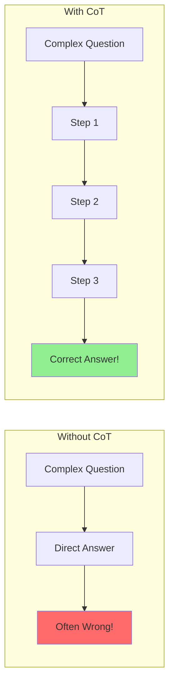
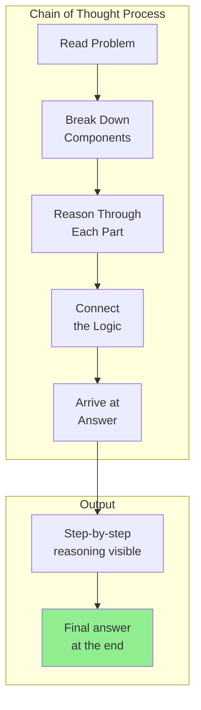
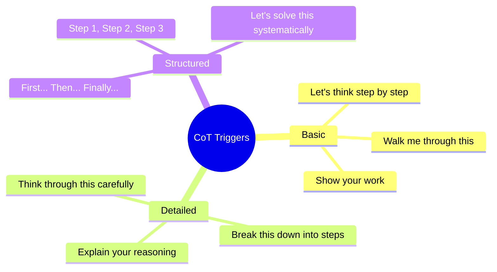
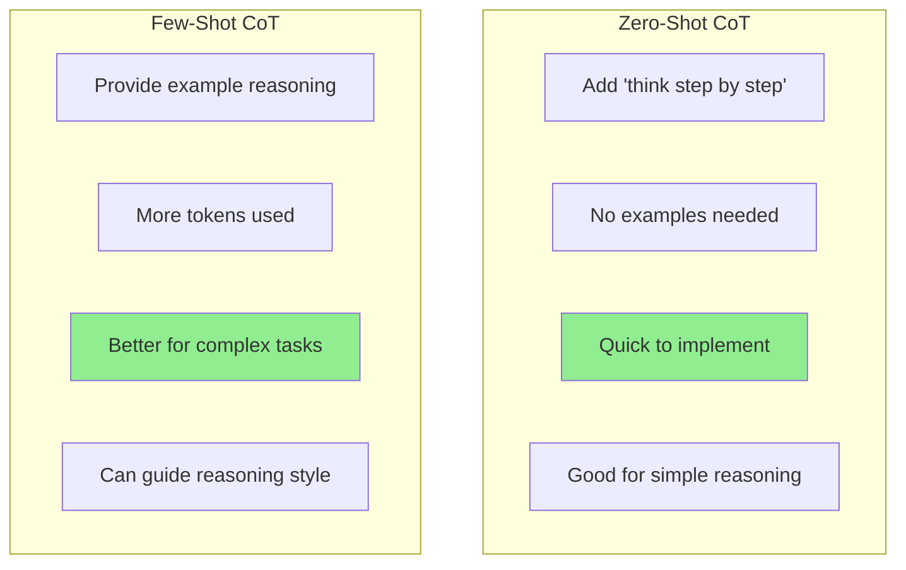
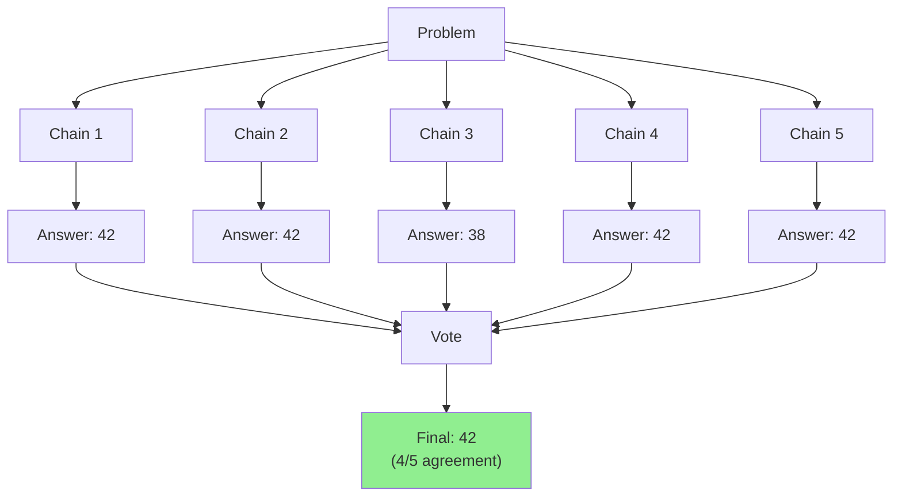
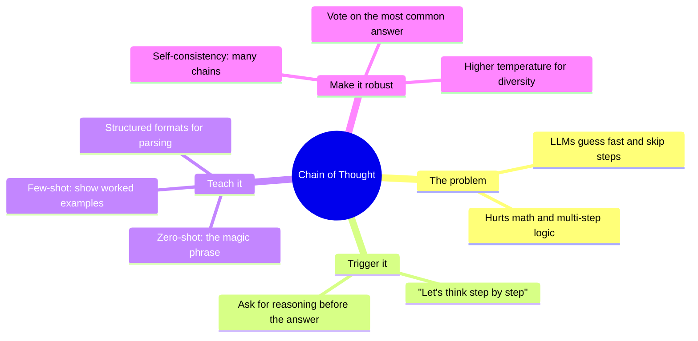

# Chain of Thought (CoT) and Step-by-Step Reasoning

Ever noticed how explaining your thinking helps you solve problems better? The same is true for LLMs! In this guide, you'll learn **Chain of Thought prompting** — a powerful technique that dramatically improves reasoning. First introduced in [Wei et al. 2022](https://arxiv.org/abs/2201.11903) ("Chain-of-Thought Prompting Elicits Reasoning in Large Language Models"), CoT showed that simply asking a model to "think step by step" could boost accuracy on math reasoning benchmarks (GSM8K) from ~18% to ~57%.

> **Coming from Software Engineering?** Chain of Thought is like adding verbose logging to a complex function. Instead of just getting the return value, you ask the model to show its work — each intermediate step. If you've ever debugged by adding print statements to trace execution flow, CoT is the same idea applied to reasoning.

---

## The Problem: LLMs Take Shortcuts

By default, LLMs try to jump straight to answers. This works for simple questions but fails for complex reasoning.



### A Classic Example

**Question:** "A bat and ball cost $1.10 together. The bat costs $1 more than the ball. How much does the ball cost?"

**Without CoT (Intuitive but wrong):** "The ball costs $0.10" ❌

**With CoT (Reasoned correctly):** "Let me work through this... If the ball is $0.10, the bat would be $1.10, totaling $1.20. That's wrong. Let me set up equations... The ball costs $0.05" ✅

---

## What is Chain of Thought?

Chain of Thought prompting encourages the model to **show its reasoning** before giving a final answer.



---

## Basic CoT: Just Ask!

The simplest way to get Chain of Thought is to just ask for it:

```python
# script_id: day_007_chain_of_thought_part1/basic_cot
from openai import OpenAI

client = OpenAI()

def solve_with_cot(problem: str) -> str:
    """Solve a problem using Chain of Thought."""
    response = client.chat.completions.create(
        model="gpt-4o",
        messages=[
            {
                "role": "user",
                "content": f"{problem}\n\nLet's think step by step."
            }
        ],
        temperature=0
    )
    return response.choices[0].message.content

# Math problem
problem = """
A store sells apples for $2 each and oranges for $3 each.
If Sarah bought 5 fruits and spent exactly $12, how many
apples and oranges did she buy?
"""

print(solve_with_cot(problem))
```

**Output:**
```
Let me solve this step by step.

Step 1: Define variables
- Let a = number of apples
- Let o = number of oranges

Step 2: Set up equations from the problem
- Total fruits: a + o = 5
- Total cost: 2a + 3o = 12

Step 3: Solve the system of equations
From equation 1: a = 5 - o
Substitute into equation 2: 2(5 - o) + 3o = 12
10 - 2o + 3o = 12
10 + o = 12
o = 2

Step 4: Find apples
a = 5 - 2 = 3

Step 5: Verify
- 3 apples + 2 oranges = 5 fruits ✓
- (3 × $2) + (2 × $3) = $6 + $6 = $12 ✓

Answer: Sarah bought 3 apples and 2 oranges.
```

---

## Magic Phrases That Trigger CoT

These phrases encourage step-by-step reasoning:



### Comparison of Trigger Phrases

```python
# script_id: day_007_chain_of_thought_part1/trigger_phrases_comparison
from openai import OpenAI

client = OpenAI()

problem = "If it takes 5 machines 5 minutes to make 5 widgets, how long does it take 100 machines to make 100 widgets?"

triggers = [
    "",  # No trigger (baseline)
    "Let's think step by step.",
    "Break this down into steps and show your reasoning.",
    "Think carefully about this before answering.",
]

for trigger in triggers:
    prompt = f"{problem}\n\n{trigger}" if trigger else problem

    response = client.chat.completions.create(
        model="gpt-4o-mini",
        messages=[{"role": "user", "content": prompt}],
        temperature=0,
        max_tokens=300
    )

    print(f"=== Trigger: '{trigger or 'None'}' ===")
    print(response.choices[0].message.content)
    print()
```

---

## Few-Shot CoT: Teaching by Example

Combine few-shot with CoT by showing examples of reasoning:

```python
# script_id: day_007_chain_of_thought_part1/few_shot_cot
from openai import OpenAI

client = OpenAI()

def few_shot_cot(problem: str) -> str:
    """Solve using few-shot Chain of Thought."""
    prompt = """Solve these problems by showing your reasoning step by step.

Question: There are 15 trees in a grove. Grove workers planted trees today.
After they finished, there are 21 trees. How many trees did they plant?

Reasoning: Let me think step by step.
1. We started with 15 trees
2. We ended with 21 trees
3. The difference tells us how many were planted
4. 21 - 15 = 6
Answer: 6 trees

Question: If there are 3 cars in a parking lot and 2 more arrive,
how many cars are in the parking lot?

Reasoning: Let me think step by step.
1. We start with 3 cars
2. 2 more cars arrive (addition)
3. 3 + 2 = 5
Answer: 5 cars

Question: {problem}

Reasoning: Let me think step by step.""".format(problem=problem)

    response = client.chat.completions.create(
        model="gpt-4o-mini",
        messages=[{"role": "user", "content": prompt}],
        temperature=0
    )
    return response.choices[0].message.content

# Test with a trickier problem
problem = """
Olivia has $23. She bought 5 bagels for $3 each.
How much money does she have left?
"""

print(few_shot_cot(problem))
```

---

## Zero-Shot CoT vs Few-Shot CoT



### When to Use Which

| Scenario | Use | Why |
|----------|-----|-----|
| Quick math problems | Zero-Shot CoT | Simple, fast |
| Complex multi-step reasoning | Few-Shot CoT | Need to show pattern |
| Domain-specific logic | Few-Shot CoT | Teach domain rules |
| General problem solving | Zero-Shot CoT | Usually sufficient |

---

## Structured CoT Formats

Sometimes you want the reasoning in a specific structure:

### Format 1: Numbered Steps

```python
# script_id: day_007_chain_of_thought_part1/structured_cot_formats
from openai import OpenAI

client = OpenAI()

def structured_cot(problem: str) -> str:
    """Get reasoning in numbered step format."""
    prompt = f"""{problem}

Please solve this by:
1. Identifying what we know
2. Identifying what we need to find
3. Planning the approach
4. Executing each calculation step
5. Verifying the answer
6. Stating the final answer clearly

Work through each step:"""

    response = client.chat.completions.create(
        model="gpt-4o",
        messages=[{"role": "user", "content": prompt}],
        temperature=0
    )
    return response.choices[0].message.content
```

### Format 2: Thought-Action-Observation

```python
# script_id: day_007_chain_of_thought_part1/structured_cot_formats
def tao_format(problem: str) -> str:
    """Use Thought-Action-Observation format."""
    prompt = f"""Solve this problem using the following format for each step:

Thought: [What I'm thinking about]
Action: [What calculation or reasoning I'll do]
Result: [The outcome]

Problem: {problem}

Let's begin:"""

    response = client.chat.completions.create(
        model="gpt-4o",
        messages=[{"role": "user", "content": prompt}],
        temperature=0
    )
    return response.choices[0].message.content

# Example
problem = "A train travels 120 miles in 2 hours. How long will it take to travel 300 miles at the same speed?"
print(tao_format(problem))
```

**Output:**
```
Thought: I need to find the speed first, then use it to calculate time for 300 miles.

Action: Calculate speed using distance/time
Result: 120 miles ÷ 2 hours = 60 mph

Thought: Now I can find time using time = distance/speed

Action: Calculate time for 300 miles at 60 mph
Result: 300 miles ÷ 60 mph = 5 hours

Final Answer: It will take 5 hours to travel 300 miles.
```

---

## Self-Consistency: Multiple Chains

A powerful technique is to generate multiple reasoning chains and pick the most common answer:



```python
# script_id: day_007_chain_of_thought_part1/self_consistency_cot
from openai import OpenAI
from collections import Counter
import re

client = OpenAI()

def self_consistency_cot(problem: str, num_samples: int = 5) -> dict:
    """
    Generate multiple reasoning chains and vote on the answer.
    """
    answers = []
    chains = []

    for i in range(num_samples):
        response = client.chat.completions.create(
            model="gpt-4o-mini",
            messages=[
                {
                    "role": "user",
                    "content": f"{problem}\n\nLet's think step by step. At the end, clearly state 'Final Answer: X'"
                }
            ],
            temperature=0.7  # Higher temp for diversity
        )

        chain = response.choices[0].message.content
        chains.append(chain)

        # Extract the final answer (simple regex)
        match = re.search(r"Final Answer:\s*(.+?)(?:\n|$)", chain, re.IGNORECASE)
        if match:
            answers.append(match.group(1).strip())

    # Vote on most common answer
    answer_counts = Counter(answers)
    most_common = answer_counts.most_common(1)[0] if answer_counts else (None, 0)

    return {
        "final_answer": most_common[0],
        "confidence": most_common[1] / num_samples,
        "all_answers": answers,
        "vote_distribution": dict(answer_counts)
    }

# Test it
problem = """
A farmer has 17 sheep. All but 9 die. How many sheep are left?
"""

result = self_consistency_cot(problem, num_samples=5)
print(f"Final Answer: {result['final_answer']}")
print(f"Confidence: {result['confidence']:.0%}")
print(f"Vote Distribution: {result['vote_distribution']}")
```

---

## Summary



## Quick Reference

| Technique | How to invoke | When to use |
|---|---|---|
| Zero-shot CoT | Append `"Let's think step by step."` | Quick boost on reasoning tasks, no examples handy |
| Few-shot CoT | Provide 1–3 worked examples showing the reasoning | When you need a consistent reasoning *format* |
| Structured CoT | Ask for labeled steps (e.g. `Step 1:`, `Final Answer:`) | When you must parse the answer out reliably |
| Self-consistency | Sample N chains at `temperature≈0.7`, vote | High-stakes answers where accuracy beats cost |
| Extracting the answer | `re.search(r"Final Answer:\s*(.+)", text)` | Pulling the result from a reasoning chain |

## Exercises

1. **Add the magic phrase.** Take a word problem the model gets wrong in one shot, append "Let's think step by step," and compare the two answers.
2. **Write a few-shot CoT prompt.** Build a 2-example prompt for a custom task (e.g. computing a discounted price) where each example shows the reasoning, then test it on a new input.
3. **Measure self-consistency confidence.** Extend `self_consistency_cot` to also return how often the top answer changes as you raise `num_samples` from 1 → 9.
4. **Harden the extractor.** Modify the regex/parsing so it still finds the final answer when the model writes "The final answer is 42." instead of "Final Answer: 42".

<details><summary>Solutions (approaches)</summary>

1. The single-shot answer is often a fast wrong guess; the step-by-step version usually corrects it. Note *which* step the reasoning fixes.
2. Format each example as `Input → reasoning → Final Answer:`. The model copies the pattern, so consistency comes from the demonstrated format, not just the content.
3. Call the function in a loop over `num_samples` values and record `result["confidence"]`; confidence usually stabilizes by ~5 samples — diminishing returns after that.
4. Broaden the pattern, e.g. `re.search(r"final answer(?: is)?:?\s*(.+)", text, re.IGNORECASE)`, and strip trailing punctuation.
</details>

## What's Next?

Tomorrow (Day 8) is **Chain of Thought Part 2** — when CoT actually pays off versus when it just burns tokens, practical CoT patterns, reliable answer extraction, and the cost trade-offs of reasoning prompts.
