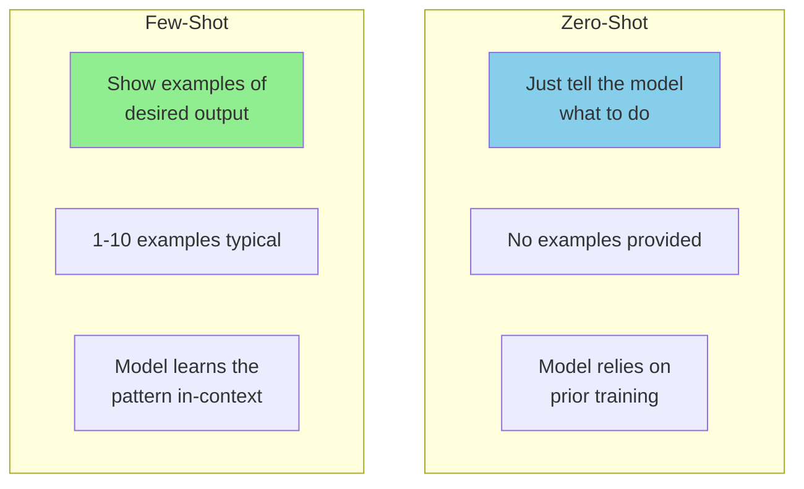
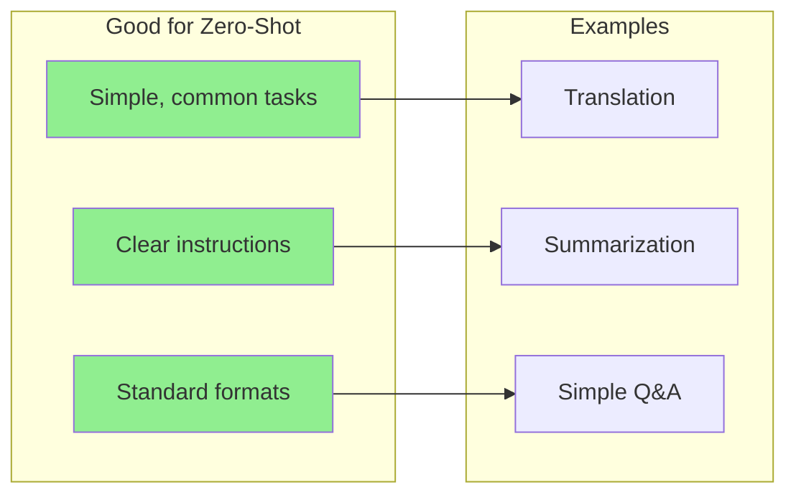
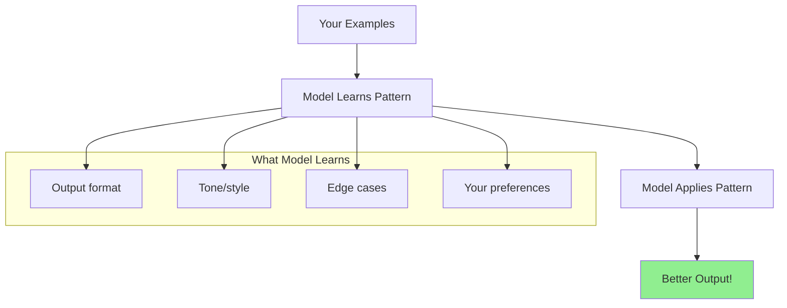
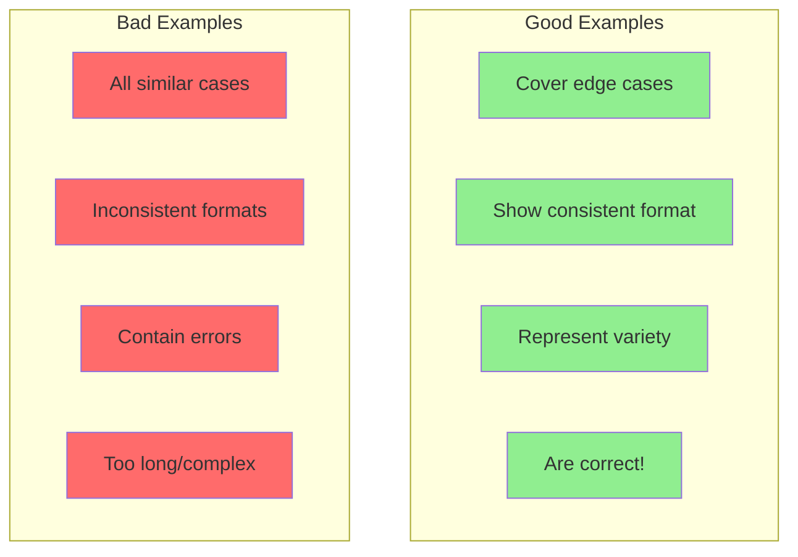
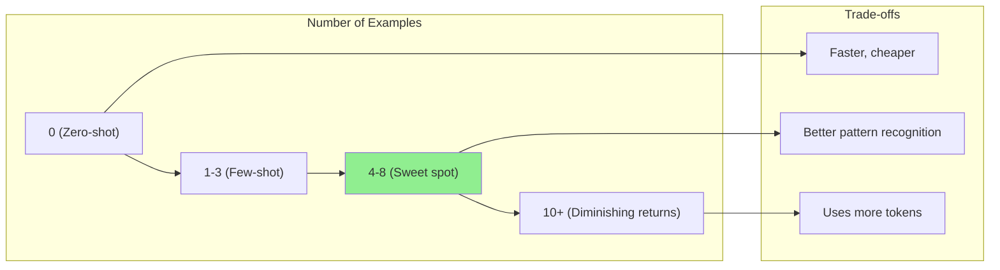

# Zero-Shot vs Few-Shot Prompting

Welcome to the world of prompt engineering! In this guide, you'll learn two fundamental techniques that dramatically improve LLM outputs: **zero-shot** and **few-shot** prompting.

Think of it like teaching someone a new task - sometimes you just explain it, and sometimes you show examples first.

> **Coming from Software Engineering?** Zero-shot is like calling a function with just a docstring. Few-shot is like adding unit test examples in the docstring — the more examples you provide, the better the function 'understands' the expected behavior. If you've written clear API documentation with request/response examples, you already think in few-shot patterns.

---

## What's the Difference?



### Simple Analogy

| Approach | Real-World Example |
|----------|-------------------|
| Zero-Shot | "Please sort these books by color" |
| Few-Shot | "Sort these books by color. For example: red books go on shelf 1, blue books on shelf 2. Now sort the rest." |

---

## Zero-Shot Prompting

Zero-shot means asking the model to do something **without providing any examples**. You're relying entirely on the model's training.

### Basic Zero-Shot Example

```python
from openai import OpenAI

client = OpenAI()

def zero_shot_classify(text: str) -> str:
    """Classify sentiment without examples."""
    response = client.chat.completions.create(
        model="gpt-4o-mini",
        messages=[
            {
                "role": "user",
                "content": f"Classify the sentiment of this text as positive, negative, or neutral:\n\n{text}"
            }
        ],
        temperature=0
    )
    return response.choices[0].message.content

# Test it
texts = [
    "I absolutely loved this movie! Best film of the year!",
    "The service was okay, nothing special.",
    "Terrible experience. Would never recommend."
]

for text in texts:
    result = zero_shot_classify(text)
    print(f"Text: {text[:50]}...")
    print(f"Sentiment: {result}\n")
```

### When Zero-Shot Works Well



### Zero-Shot Best Practices

```python
# BAD: Vague zero-shot prompt
bad_prompt = "Analyze this text"

# GOOD: Clear, specific zero-shot prompt
good_prompt = """Analyze the following customer review and extract:
1. Main product mentioned
2. Customer's overall sentiment (positive/negative/neutral)
3. Key complaints (if any)
4. Key praises (if any)

Review: {text}

Provide your analysis in a structured format."""
```

---

## Few-Shot Prompting

Few-shot prompting means **showing the model examples** of the input-output pattern you want, then asking it to follow that pattern.

### The Power of Examples



### Basic Few-Shot Example

```python
from openai import OpenAI

client = OpenAI()

def few_shot_classify(text: str) -> str:
    """Classify sentiment with examples."""
    response = client.chat.completions.create(
        model="gpt-4o-mini",
        messages=[
            {
                "role": "user",
                "content": """Classify the sentiment of texts as positive, negative, or neutral.

Example 1:
Text: "This product exceeded all my expectations!"
Sentiment: positive

Example 2:
Text: "Worst purchase I've ever made. Complete waste of money."
Sentiment: negative

Example 3:
Text: "It works as described. Nothing more, nothing less."
Sentiment: neutral

Now classify this:
Text: "{text}"
Sentiment:""".format(text=text)
            }
        ],
        temperature=0
    )
    return response.choices[0].message.content

# Compare with zero-shot
tricky_text = "Well, I guess it didn't completely ruin my day."

print("Few-shot result:", few_shot_classify(tricky_text))
# Output: negative (correctly identifies sarcasm/negativity)
```

### Structured Few-Shot Template

```python
def create_few_shot_prompt(examples: list, task: str, new_input: str) -> str:
    """
    Create a few-shot prompt from examples.

    Args:
        examples: List of {"input": ..., "output": ...} dicts
        task: Description of what to do
        new_input: The new input to process

    Returns:
        Formatted few-shot prompt
    """
    prompt = f"{task}\n\n"

    for i, example in enumerate(examples, 1):
        prompt += f"Example {i}:\n"
        prompt += f"Input: {example['input']}\n"
        prompt += f"Output: {example['output']}\n\n"

    prompt += f"Now process this:\n"
    prompt += f"Input: {new_input}\n"
    prompt += f"Output:"

    return prompt

# Usage
examples = [
    {
        "input": "Dr. Sarah Johnson from MIT",
        "output": '{"name": "Sarah Johnson", "title": "Dr.", "affiliation": "MIT"}'
    },
    {
        "input": "Prof. Michael Chen, Stanford University",
        "output": '{"name": "Michael Chen", "title": "Prof.", "affiliation": "Stanford University"}'
    },
    {
        "input": "Jane Smith, PhD - Harvard Medical School",
        "output": '{"name": "Jane Smith", "title": "PhD", "affiliation": "Harvard Medical School"}'
    }
]

prompt = create_few_shot_prompt(
    examples=examples,
    task="Extract structured information from academic affiliations and format as JSON.",
    new_input="Associate Prof. David Kim from Berkeley"
)

print(prompt)
```

---

## Choosing Examples: Quality Over Quantity

The examples you choose dramatically affect results. Here's how to pick good ones:



### Example Selection Strategy

```python
def select_diverse_examples(all_examples: list, n: int = 5) -> list:
    """
    Select diverse examples for few-shot prompting.

    Strategy:
    1. Include at least one "easy" example
    2. Include at least one "edge case"
    3. Cover different categories/types
    4. Keep examples concise
    """
    selected = []

    # Get one from each category
    categories = set(ex.get('category', 'default') for ex in all_examples)
    for category in categories:
        category_examples = [ex for ex in all_examples if ex.get('category') == category]
        if category_examples:
            selected.append(category_examples[0])
        if len(selected) >= n:
            break

    # Add edge cases if we have room
    edge_cases = [ex for ex in all_examples if ex.get('is_edge_case', False)]
    for edge in edge_cases:
        if len(selected) >= n:
            break
        if edge not in selected:
            selected.append(edge)

    return selected[:n]

# Example usage
all_examples = [
    {"input": "hello", "output": "greeting", "category": "greeting", "is_edge_case": False},
    {"input": "HELLO!!!", "output": "greeting", "category": "greeting", "is_edge_case": True},
    {"input": "goodbye", "output": "farewell", "category": "farewell", "is_edge_case": False},
    {"input": "I'm leaving now", "output": "farewell", "category": "farewell", "is_edge_case": True},
    {"input": "thanks", "output": "gratitude", "category": "gratitude", "is_edge_case": False},
]

selected = select_diverse_examples(all_examples, n=3)
```

---

## How Many Examples? The Sweet Spot



### Token Cost Calculation

```python
import tiktoken

def calculate_few_shot_cost(
    examples: list,
    task_description: str,
    model: str = "gpt-4o"
):
    """Calculate token cost of few-shot prompt."""
    encoder = tiktoken.encoding_for_model(model)

    # Build the prompt
    prompt = task_description + "\n\n"
    for i, ex in enumerate(examples):
        prompt += f"Example {i+1}:\nInput: {ex['input']}\nOutput: {ex['output']}\n\n"

    tokens = len(encoder.encode(prompt))

    # Cost per 1K tokens (GPT-4o pricing, ~$2.50/1M input)
    cost_per_1k = 0.0025

    return {
        "example_count": len(examples),
        "total_tokens": tokens,
        "cost_per_request": f"${(tokens/1000) * cost_per_1k:.4f}",
        "cost_per_1000_requests": f"${(tokens/1000) * cost_per_1k * 1000:.2f}"
    }

# Compare different example counts
examples = [
    {"input": "text1", "output": "output1"},
    {"input": "text2", "output": "output2"},
    {"input": "text3", "output": "output3"},
    {"input": "text4", "output": "output4"},
    {"input": "text5", "output": "output5"},
]

for n in [1, 3, 5]:
    cost = calculate_few_shot_cost(examples[:n], "Classify the following text:")
    print(f"{n} examples: {cost['total_tokens']} tokens, {cost['cost_per_1000_requests']} per 1K requests")
```

---
