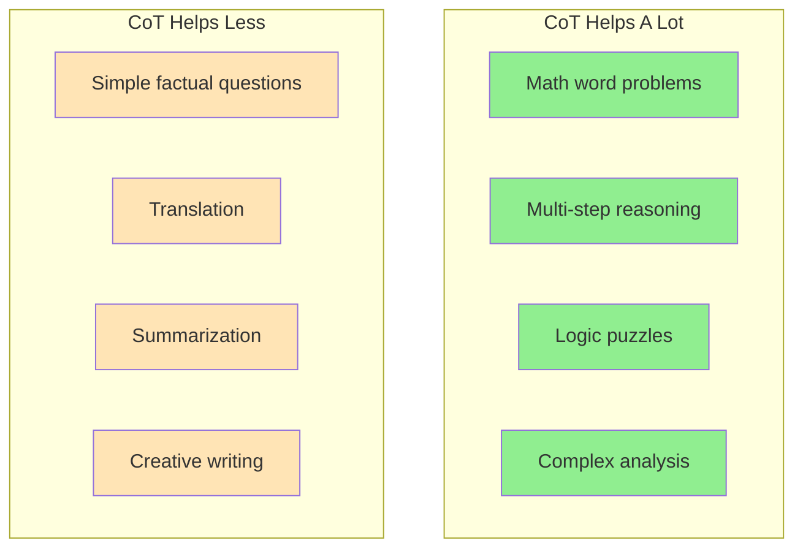
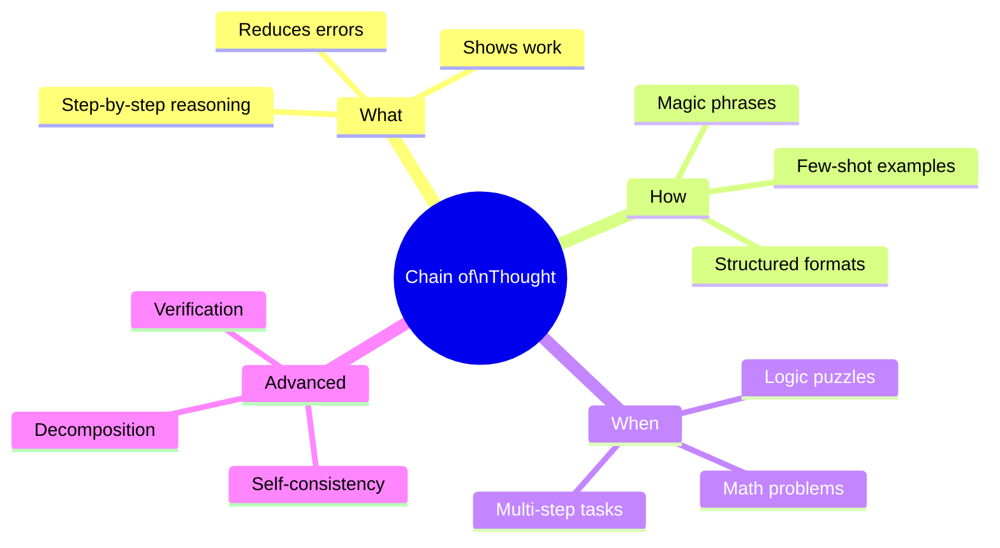

> **Coming from Software Engineering?** Self-consistency (running multiple CoT chains) is like running the same test with different random seeds and taking the majority result. If you've built consensus algorithms or voting systems, this pattern will feel familiar — it's ensemble methods applied to reasoning.

## When CoT Helps Most



### Performance Improvement Examples

| Task Type | Without CoT | With CoT | Improvement |
|-----------|-------------|----------|-------------|
| GSM8K (Math) | 18% | 57% | +217% |
| StrategyQA (Reasoning) | 65% | 73% | +12% |
| Date Understanding | 49% | 67% | +37% |
| Sports Understanding | 52% | 96% | +85% |

*Based on original CoT paper research*

---

## Practical CoT Patterns

### Pattern 1: Problem Decomposition

```python
def decompose_problem(complex_problem: str) -> str:
    """Break complex problems into sub-problems."""
    prompt = f"""I'll solve this complex problem by breaking it into smaller parts.

Problem: {complex_problem}

Let me decompose this:
1. What are the sub-problems I need to solve?
2. What order should I solve them in?
3. Let me solve each sub-problem:

Decomposition:"""

    response = client.chat.completions.create(
        model="gpt-4o",
        messages=[{"role": "user", "content": prompt}],
        temperature=0
    )
    return response.choices[0].message.content
```

### Pattern 2: Verify and Correct

```python
def cot_with_verification(problem: str) -> str:
    """Solve with built-in verification step."""
    prompt = f"""{problem}

Please:
1. Solve this step by step
2. State your answer
3. Verify your answer by checking if it satisfies all conditions
4. If verification fails, correct your answer

Solution:"""

    response = client.chat.completions.create(
        model="gpt-4o",
        messages=[{"role": "user", "content": prompt}],
        temperature=0
    )
    return response.choices[0].message.content

# Example
problem = """
A store offers 20% off, then an additional 10% off the reduced price.
If the original price is $100, what is the final price?
"""

print(cot_with_verification(problem))
```

### Pattern 3: Work Backwards

```python
def reverse_cot(goal: str, starting_point: str) -> str:
    """Reason backwards from goal to start."""
    prompt = f"""Let's work backwards from the goal to figure out the solution.

Goal: {goal}
Starting Point: {starting_point}

Working backwards:
- What's the last step before reaching the goal?
- What comes before that?
- Continue until we reach the starting point
- Now let's trace the path forward

Reasoning:"""

    response = client.chat.completions.create(
        model="gpt-4o",
        messages=[{"role": "user", "content": prompt}],
        temperature=0
    )
    return response.choices[0].message.content
```

---

## Extracting the Final Answer

CoT gives great reasoning but you often just need the answer:

```python
import re
from openai import OpenAI

client = OpenAI()

def cot_with_extraction(problem: str) -> dict:
    """Get both reasoning and clean final answer."""

    # Step 1: Get CoT response
    cot_response = client.chat.completions.create(
        model="gpt-4o",
        messages=[
            {
                "role": "user",
                "content": f"{problem}\n\nThink step by step, then end with 'FINAL ANSWER: [your answer]'"
            }
        ],
        temperature=0
    )

    full_response = cot_response.choices[0].message.content

    # Step 2: Extract the final answer
    match = re.search(r"FINAL ANSWER:\s*(.+?)(?:\n|$)", full_response, re.IGNORECASE)
    final_answer = match.group(1).strip() if match else None

    return {
        "reasoning": full_response,
        "answer": final_answer
    }

# Usage
result = cot_with_extraction("What is 15% of 80?")
print(f"Answer: {result['answer']}")  # Quick access to answer
print(f"\nFull reasoning:\n{result['reasoning']}")  # For debugging/logging
```

---

## Summary



---

## Quick Reference

| Technique | Prompt Pattern | Best For |
|-----------|---------------|----------|
| Zero-Shot CoT | "Let's think step by step" | Quick improvements |
| Few-Shot CoT | Show example reasoning | Complex domains |
| Self-Consistency | Multiple samples + vote | High-stakes answers |
| Verification | "Check your answer" | Accuracy-critical |

---

## Exercises

1. **CoT Battle**: Compare zero-shot vs few-shot CoT on 10 math problems. Track accuracy.

2. **Custom Domain**: Create few-shot CoT examples for a domain you know well (e.g., debugging code, analyzing data)

3. **Self-Consistency Implementation**: Build a robust answer extractor that works with different answer formats

---

## What's Next?

You've mastered prompting content. Next, let's learn about **System Prompts vs User Prompts** - understanding the different roles messages play in shaping LLM behavior!
