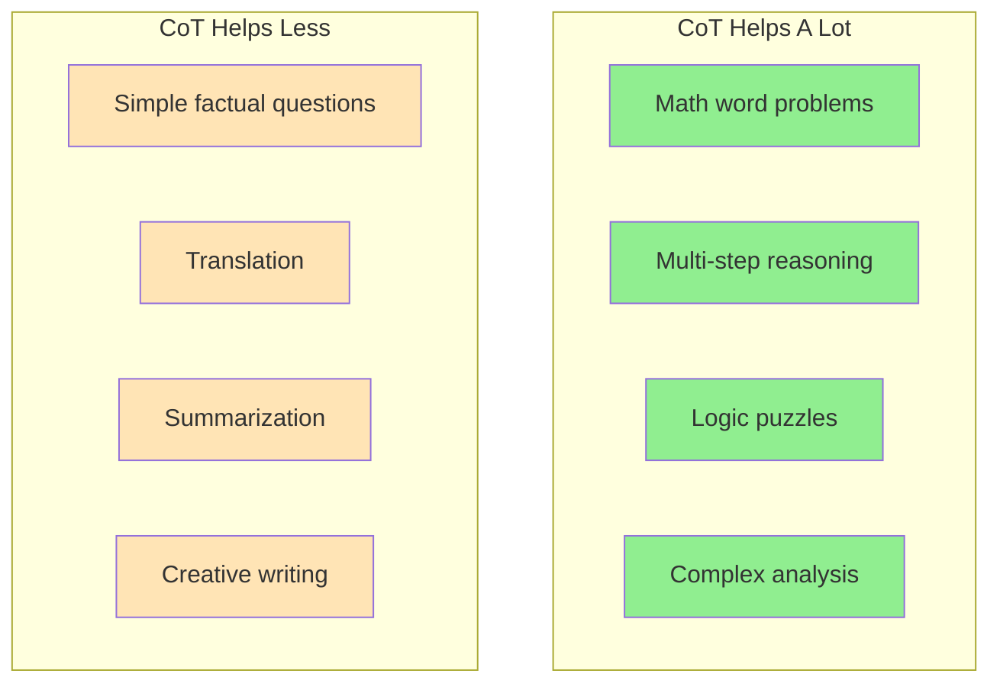
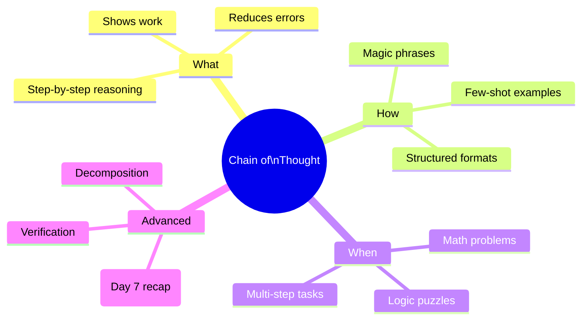

# Chain of Thought (CoT) and Step-by-Step Reasoning Part 2

> **Coming from Software Engineering?** Decomposition + verify-and-correct is the loop you already write: break a big task into helpers, then add a post-condition assert and re-run on failure. CoT just applies it to reasoning.

## When CoT Helps Most



### Performance Improvement Examples

These are standard research test sets — the only thing to read off here is the shape: CoT gives huge gains on multi-step math and logic, small gains on shallow tasks.

| Task Type | Without CoT | With CoT | Improvement |
|-----------|-------------|----------|-------------|
| Grade-school math word problems (GSM8K) | 18% | 57% | +39 pts |
| Common-sense multi-step reasoning (StrategyQA) | 65% | 73% | +8 pts |
| Date Understanding | 49% | 67% | +18 pts |
| Sports Understanding | 52% | 96% | +44 pts |

*Illustrative figures from the original chain-of-thought research; verify against the source.*

---

## Practical CoT Patterns

### Pattern 1: Problem Decomposition

```python
# script_id: day_008_chain_of_thought_part2/problem_decomposition
from openai import OpenAI

client = OpenAI()

def decompose_problem(complex_problem: str) -> str:
    """Break complex problems into sub-problems."""
    prompt = f"""I'll solve this complex problem by breaking it into smaller parts.

Problem: {complex_problem}

Let me decompose this:
1. What are the sub-problems I need to solve?
2. What order should I solve them in?
3. Let me solve each sub-problem:

Decomposition:"""

    response = client.chat.completions.create(
        model="gpt-4o",
        messages=[{"role": "user", "content": prompt}],
        temperature=0  # deterministic: same input gives the same answer (see Part 1)
    )
    return response.choices[0].message.content
```

### Pattern 2: Verify and Correct

```python
# script_id: day_008_chain_of_thought_part2/verify_and_correct
from openai import OpenAI

client = OpenAI()

def cot_with_verification(problem: str) -> str:
    """Solve with built-in verification step."""
    prompt = f"""{problem}

Please:
1. Solve this step by step
2. State your answer
3. Verify your answer by checking if it satisfies all conditions
4. If verification fails, correct your answer

Solution:"""

    response = client.chat.completions.create(
        model="gpt-4o",
        messages=[{"role": "user", "content": prompt}],
        temperature=0
    )
    return response.choices[0].message.content

# Example
problem = """
A store offers 20% off, then an additional 10% off the reduced price.
If the original price is $100, what is the final price?
"""

print(cot_with_verification(problem))
```

For the discount problem above, the model produces something like:

```text
1. Apply 20% off: $100 × 0.80 = $80
2. Apply an additional 10% off the reduced price: $80 × 0.90 = $72
3. Answer: $72
Verification: 20% of $100 is $20 → $80; 10% of $80 is $8 → $72. Conditions satisfied.
Final price: $72
```

Notice the verify step re-checks each discount against the stated conditions instead of blindly stacking "30% off" (which would wrongly give $70) — that catch is the whole point of the pattern.

### Pattern 3: Work Backwards

```python
# script_id: day_008_chain_of_thought_part2/work_backwards
from openai import OpenAI

client = OpenAI()

def reverse_cot(goal: str, starting_point: str) -> str:
    """Reason backwards from goal to start."""
    prompt = f"""Let's work backwards from the goal to figure out the solution.

Goal: {goal}
Starting Point: {starting_point}

Working backwards:
- What's the last step before reaching the goal?
- What comes before that?
- Continue until we reach the starting point
- Now let's trace the path forward

Reasoning:"""

    response = client.chat.completions.create(
        model="gpt-4o",
        messages=[{"role": "user", "content": prompt}],
        temperature=0
    )
    return response.choices[0].message.content
```

---

## Extracting the Final Answer

CoT gives great reasoning but you often just need the answer:

```python
# script_id: day_008_chain_of_thought_part2/cot_with_extraction
import re
from openai import OpenAI

client = OpenAI()

def cot_with_extraction(problem: str) -> dict:
    """Get both reasoning and clean final answer."""

    # Step 1: Get CoT response
    cot_response = client.chat.completions.create(
        model="gpt-4o",
        messages=[
            {
                "role": "user",
                "content": f"{problem}\n\nThink step by step, then end with 'FINAL ANSWER: [your answer]'"
            }
        ],
        temperature=0
    )

    full_response = cot_response.choices[0].message.content

    # Step 2: Extract the final answer
    match = re.search(r"FINAL ANSWER:\s*(.+?)(?:\n|$)", full_response, re.IGNORECASE)
    final_answer = match.group(1).strip() if match else None

    return {
        "reasoning": full_response,
        "answer": final_answer
    }

# Usage
result = cot_with_extraction("What is 15% of 80?")
print(f"Answer: {result['answer']}")  # Quick access to answer
print(f"\nFull reasoning:\n{result['reasoning']}")  # For debugging/logging
```

---

## When CoT Doesn't Help (and What It Costs)

Chain-of-thought isn't free, and it isn't always a win. Reach for it deliberately:

- **Simple lookups and classification.** "What's the capital of France?" or "Is this review positive or negative?" don't benefit from reasoning — CoT just adds latency and tokens for the same answer.
- **Format-constrained extraction.** If you need a single label or a JSON object, free-form reasoning can actually *hurt* by leaking prose into the output. Use structured outputs / tool calling instead.
- **When latency matters.** CoT can multiply output tokens 3–10× — and you pay per token of generated text, so the model writing out its reasoning is billed just like its answer. On a user-facing path where every 100ms counts, that tradeoff is often not worth a marginal accuracy gain.

**The cost tradeoff:** you pay for every reasoning token, and the self-consistency loop from Day 7 multiplies that by the number of samples (5 samples ≈ 5× the cost). The decision rule: use CoT when an error is *expensive* (math, multi-step logic, anything you'd double-check by hand) and skip it when the task is shallow or the output is tightly formatted. A useful middle ground is to reason internally but return only the final answer (the extraction pattern above), so callers don't pay to render the reasoning.

> **Coming from Software Engineering?** Treat CoT like adding logging or assertions to a hot path: invaluable when debugging hard logic, pure overhead on a trivial getter. Turn it on where correctness is worth the cost, off where it isn't.

---

## Checkpoint

Run `cot_with_extraction` and confirm: the returned dict gives you a clean `answer` field for programmatic use *and* a separate `reasoning` field for logging — so downstream code never has to regex the final number out of a paragraph. If `answer` comes back as the whole reasoning blob, check that your prompt asks the model to emit the final answer on its own clearly delimited line.

---

## Summary



---

## Quick Reference

| Technique | Prompt Pattern | Best For |
|-----------|---------------|----------|
| Zero-Shot CoT | "Let's think step by step" | Quick improvements |
| Few-Shot CoT | Show example reasoning | Complex domains |
| Self-Consistency (Day 7 recap) | Multiple samples + vote | High-stakes answers |
| Verification | "Check your answer" | Accuracy-critical |

---

## Exercises

1. **CoT Battle**: Compare zero-shot vs few-shot CoT on 10 math problems. Track accuracy.

2. **Custom Domain**: Create few-shot CoT examples for a domain you know well (e.g., debugging code, analyzing data)

3. **Work-Backwards in Practice**: Apply the `reverse_cot` pattern to a small planning problem (e.g., "what steps lead to a deployed service?") and inspect the traced path.

<details>
<summary>Solutions (approaches)</summary>

1. **CoT Battle**: Loop over your 10 problems twice — once with a plain prompt, once with "Let's think step by step" (or few-shot examples). Parse each answer with the extraction helper, compare to a known-correct list, and print the accuracy for each variant. The gap is your measured CoT lift.

2. **Custom Domain**: Pick 2–3 worked examples from your own domain (e.g., a bug, the reasoning steps, the fix) and put them in the prompt before the real question. The model imitates the reasoning style you demonstrate, so show the exact shape of "good" reasoning for that domain.

3. **Work-Backwards in Practice**: Call `reverse_cot(goal="a deployed service", starting_point="an empty repo")` and read the returned chain. Check that the last-step-first ordering produces a path you'd actually follow forward; if it skips steps, tighten the prompt to ask for one concrete action per line.

</details>

---

## What's Next?

You've mastered prompting content. Next, let's learn about **System Prompts vs User Prompts** - understanding the different roles messages play in shaping LLM behavior!
