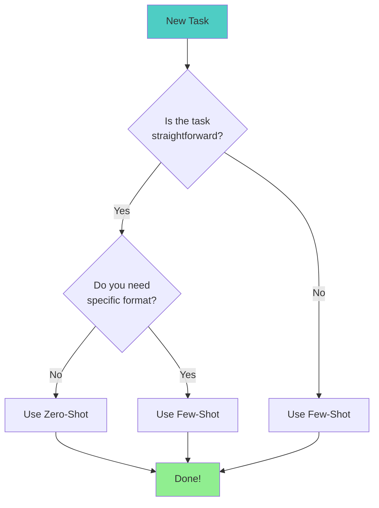
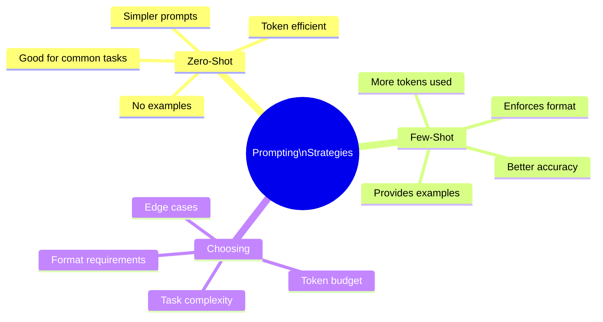

> **Coming from Software Engineering?** Choosing between zero-shot and few-shot is a cost-performance tradeoff, just like choosing between an in-memory cache hit vs a database query. Few-shot costs more tokens (like more compute) but gives better results. Dynamic few-shot selection is essentially building a retrieval cache for your best examples.

## Side-by-Side Comparison

Let's see zero-shot vs few-shot on the same challenging task:

```python
from openai import OpenAI

client = OpenAI()

# Task: Extract structured data from messy product descriptions

messy_input = """
SALE!!! Nike Air Max 90s - mens size 10.5, barely worn maybe 2x,
original box included. asking $85 obo. pick up in brooklyn or can ship
for extra $$. no lowballers pls
"""

# Zero-shot approach
zero_shot_prompt = f"""Extract product information from this listing as JSON with fields:
brand, product_name, size, condition, price, location, shipping_available

Listing: {messy_input}"""

# Few-shot approach
few_shot_prompt = f"""Extract product information from listings as JSON.

Example 1:
Listing: "Adidas Ultraboost 21 - Size 9 mens, worn once, $120 firm, NYC pickup only"
Output: {{"brand": "Adidas", "product_name": "Ultraboost 21", "size": "9 mens", "condition": "worn once", "price": 120, "location": "NYC", "shipping_available": false}}

Example 2:
Listing: "BNIB Jordan 1 Retro High sz11 - $250 shipped anywhere in US"
Output: {{"brand": "Jordan", "product_name": "1 Retro High", "size": "11", "condition": "new in box", "price": 250, "location": null, "shipping_available": true}}

Example 3:
Listing: "Vans Old Skool black/white 8.5W used but good condition, $30, LA area, will ship for $10"
Output: {{"brand": "Vans", "product_name": "Old Skool", "size": "8.5 womens", "condition": "used good", "price": 30, "location": "LA", "shipping_available": true}}

Now extract from this listing:
Listing: {messy_input}
Output:"""

def compare_approaches():
    """Compare zero-shot vs few-shot results."""

    # Zero-shot
    zero_response = client.chat.completions.create(
        model="gpt-4o-mini",
        messages=[{"role": "user", "content": zero_shot_prompt}],
        temperature=0
    )

    # Few-shot
    few_response = client.chat.completions.create(
        model="gpt-4o-mini",
        messages=[{"role": "user", "content": few_shot_prompt}],
        temperature=0
    )

    print("=== Zero-Shot Result ===")
    print(zero_response.choices[0].message.content)
    print("\n=== Few-Shot Result ===")
    print(few_response.choices[0].message.content)

compare_approaches()
```

**Expected Results:**

```
=== Zero-Shot Result ===
{
  "brand": "Nike",
  "product_name": "Air Max 90s",
  "size": "10.5",
  "condition": "barely worn",
  "price": "$85 obo",          # Inconsistent format
  "location": "brooklyn",      # Inconsistent case
  "shipping_available": "yes"  # String instead of boolean
}

=== Few-Shot Result ===
{
  "brand": "Nike",
  "product_name": "Air Max 90",
  "size": "10.5 mens",
  "condition": "barely worn",
  "price": 85,                 # Clean integer
  "location": "Brooklyn",      # Proper case
  "shipping_available": true   # Proper boolean
}
```

Few-shot learned the exact format from examples!

---

## When to Use Each Approach



### Decision Matrix

| Scenario | Recommended | Why |
|----------|-------------|-----|
| Simple sentiment analysis | Zero-shot | Common task, models know it well |
| Custom classification categories | Few-shot | Need to teach your specific categories |
| Translation | Zero-shot | Well-known task |
| Specific output format | Few-shot | Examples enforce format |
| Edge cases matter | Few-shot | Can show how to handle them |
| Token budget is tight | Zero-shot | Fewer tokens used |

---

## Advanced: Dynamic Few-Shot Selection

Instead of static examples, select them based on the input:

```python
from openai import OpenAI
import numpy as np

client = OpenAI()

# Example database (in practice, this would be larger)
EXAMPLE_DATABASE = [
    {"input": "laptop won't turn on", "output": "hardware", "embedding": None},
    {"input": "software keeps crashing", "output": "software", "embedding": None},
    {"input": "can't connect to wifi", "output": "network", "embedding": None},
    {"input": "keyboard not working", "output": "hardware", "embedding": None},
    {"input": "app freezes on startup", "output": "software", "embedding": None},
    {"input": "slow internet speed", "output": "network", "embedding": None},
]

def get_embedding(text: str) -> list:
    """Get embedding for text.

    Note: Embeddings convert text into numerical vectors that capture meaning.
    We'll cover embeddings in depth in Phase 2 (Day 27). For now, just know
    that similar texts produce similar vectors — enabling "find me examples
    like this" queries.
    """
    response = client.embeddings.create(
        model="text-embedding-3-small",
        input=text
    )
    return response.data[0].embedding

def cosine_similarity(a: list, b: list) -> float:
    """Calculate cosine similarity between two vectors."""
    a = np.array(a)
    b = np.array(b)
    return np.dot(a, b) / (np.linalg.norm(a) * np.linalg.norm(b))

def select_similar_examples(query: str, examples: list, n: int = 3) -> list:
    """Select most similar examples to the query."""
    query_embedding = get_embedding(query)

    # Calculate similarity for each example
    for ex in examples:
        if ex["embedding"] is None:
            ex["embedding"] = get_embedding(ex["input"])
        ex["similarity"] = cosine_similarity(query_embedding, ex["embedding"])

    # Sort by similarity and return top n
    sorted_examples = sorted(examples, key=lambda x: x["similarity"], reverse=True)
    return sorted_examples[:n]

def dynamic_few_shot(query: str) -> str:
    """Classify with dynamically selected examples."""
    # Select most relevant examples
    relevant_examples = select_similar_examples(query, EXAMPLE_DATABASE, n=3)

    # Build prompt
    prompt = "Classify IT support tickets into categories: hardware, software, or network.\n\n"
    for i, ex in enumerate(relevant_examples, 1):
        prompt += f"Example {i}:\n"
        prompt += f"Ticket: {ex['input']}\n"
        prompt += f"Category: {ex['output']}\n\n"

    prompt += f"Now classify:\nTicket: {query}\nCategory:"

    response = client.chat.completions.create(
        model="gpt-4o-mini",
        messages=[{"role": "user", "content": prompt}],
        temperature=0
    )

    return response.choices[0].message.content

# Test it
test_queries = [
    "monitor displaying weird colors",
    "email client won't sync",
    "bluetooth connection drops frequently"
]

for query in test_queries:
    result = dynamic_few_shot(query)
    print(f"Query: {query}")
    print(f"Category: {result}\n")
```

---

## Summary



---

## Quick Reference

| Aspect | Zero-Shot | Few-Shot |
|--------|-----------|----------|
| Examples needed | 0 | 1-10 |
| Token usage | Lower | Higher |
| Format control | Less | More |
| Setup time | Minimal | More |
| Best for | Common tasks | Custom/complex tasks |

---

## Exercises

1. **Format Enforcer**: Create a few-shot prompt that extracts dates from various formats and always outputs YYYY-MM-DD

2. **Category Creator**: Build a custom classifier for your own categories (e.g., email types, bug priorities)

3. **Dynamic Selection**: Implement dynamic example selection based on input similarity

---

## What's Next?

Now that you understand example-based prompting, let's level up with **Chain of Thought (CoT)** - teaching the model to show its reasoning step by step!
