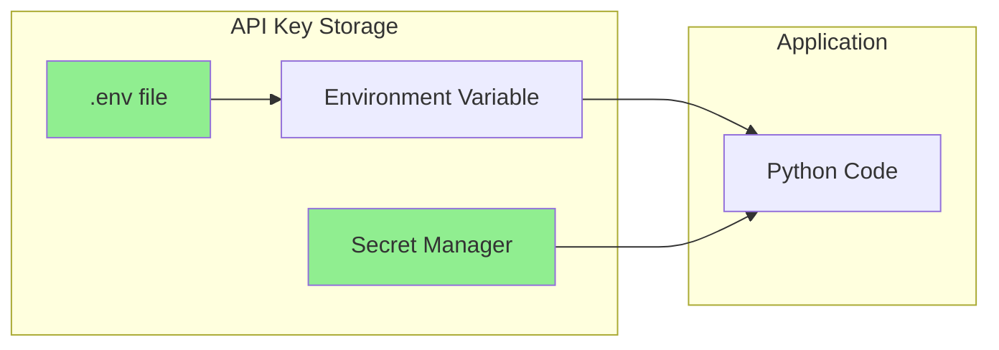
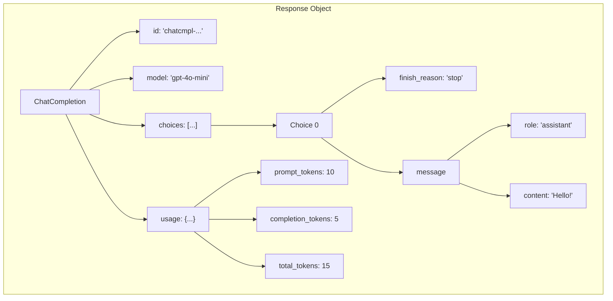
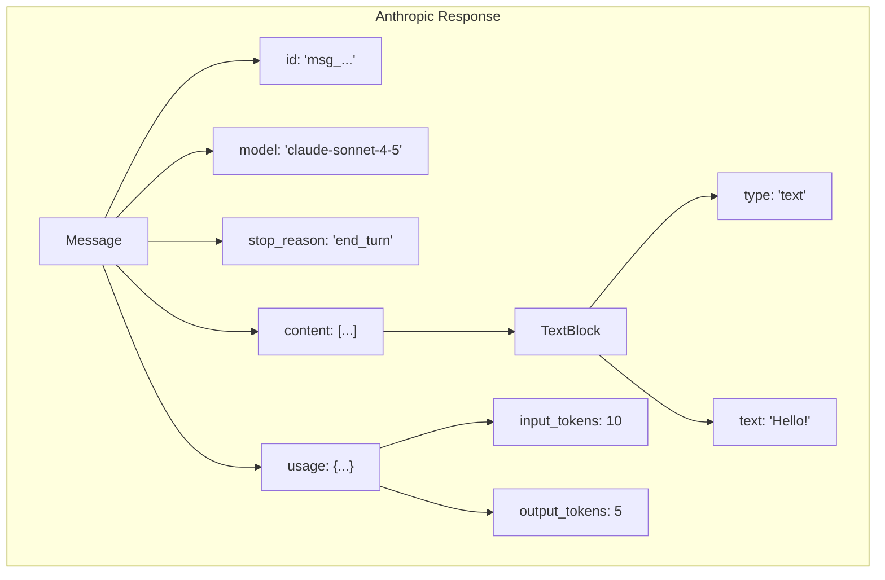

# Using OpenAI and Anthropic Python SDKs

Welcome to the hands-on world of LLM programming! In this guide, you'll learn to work with the two most popular LLM providers: OpenAI (GPT models) and Anthropic (Claude models).

Let's get coding!

> **Coming from Software Engineering?** Working with LLM SDKs is just like working with any REST API client — you configure a client, make requests with parameters, and handle responses. The OpenAI and Anthropic SDKs follow the same patterns as Stripe, Twilio, or AWS SDKs you've likely used before.

---

## Getting Started

### Installation

```bash
# Install both SDKs
pip install openai anthropic

# Or add to requirements.txt
# openai>=1.0.0
# anthropic>=0.18.0
```

### API Keys Setup

Both providers require API keys. Never hardcode them!

```python
# script_id: day_010_openai_anthropic_sdks_part1/api_keys_setup
# Best practice: Use environment variables

# In your terminal or .env file:
# export OPENAI_API_KEY="sk-..."
# export ANTHROPIC_API_KEY="sk-ant-..."

import os
from openai import OpenAI
from anthropic import Anthropic

# Clients automatically read from environment variables
openai_client = OpenAI()  # Reads OPENAI_API_KEY
anthropic_client = Anthropic()  # Reads ANTHROPIC_API_KEY

# Or explicitly pass the key (not recommended for production)
# openai_client = OpenAI(api_key="sk-...")
```



---

## OpenAI SDK Basics

### Your First API Call

```python
# script_id: day_010_openai_anthropic_sdks_part1/openai_simple_chat
from openai import OpenAI

client = OpenAI()

def simple_chat(message: str) -> str:
    """Make a simple chat completion request."""
    response = client.chat.completions.create(
        model="gpt-4o-mini",
        messages=[
            {"role": "user", "content": message}
        ]
    )
    return response.choices[0].message.content

# Try it!
result = simple_chat("What is Python in one sentence?")
print(result)
# 💰 This call costs ~$0.00001 with GPT-4o-mini (~20 tokens in, ~20 out)
# With GPT-4o it would be ~$0.0003 — 30x more. Always know your model's pricing!
```

### Understanding the Response Object

```python
# script_id: day_010_openai_anthropic_sdks_part1/openai_response_object
from openai import OpenAI

client = OpenAI()

response = client.chat.completions.create(
    model="gpt-4o-mini",
    messages=[{"role": "user", "content": "Hello!"}]
)

# Let's explore the response structure
print("Full response type:", type(response))
print("ID:", response.id)
print("Model:", response.model)
print("Created:", response.created)

# The actual content
print("\nChoices:", len(response.choices))
choice = response.choices[0]
print("Finish reason:", choice.finish_reason)
print("Message role:", choice.message.role)
print("Message content:", choice.message.content)

# Token usage
print("\nToken usage:")
print("  Prompt tokens:", response.usage.prompt_tokens)
print("  Completion tokens:", response.usage.completion_tokens)
print("  Total tokens:", response.usage.total_tokens)

# 💰 Cost estimation (always track this!)
# GPT-4o: $2.50/1M input, $10.00/1M output
# GPT-4o-mini: $0.15/1M input, $0.60/1M output
input_cost = response.usage.prompt_tokens * 2.50 / 1_000_000
output_cost = response.usage.completion_tokens * 10.00 / 1_000_000
print(f"\n  Estimated cost (GPT-4o): ${input_cost + output_cost:.6f}")
print(f"  At 10k requests/day: ${(input_cost + output_cost) * 10_000:.2f}/day")
```



### Complete OpenAI Example with All Parameters

```python
# script_id: day_010_openai_anthropic_sdks_part1/openai_advanced_chat
from openai import OpenAI

client = OpenAI()

def advanced_chat(
    messages: list,
    model: str = "gpt-4o-mini",
    temperature: float = 0.7,
    max_tokens: int = 1000,
    top_p: float = 1.0,
    frequency_penalty: float = 0,
    presence_penalty: float = 0,
    stop: list = None
) -> dict:
    """
    Make an advanced chat completion request with all common parameters.
    """
    response = client.chat.completions.create(
        model=model,
        messages=messages,
        temperature=temperature,
        max_tokens=max_tokens,
        top_p=top_p,
        frequency_penalty=frequency_penalty,
        presence_penalty=presence_penalty,
        stop=stop
    )

    return {
        "content": response.choices[0].message.content,
        "finish_reason": response.choices[0].finish_reason,
        "tokens_used": response.usage.total_tokens,
        "model": response.model
    }

# Usage example
messages = [
    {"role": "system", "content": "You are a helpful coding assistant."},
    {"role": "user", "content": "Write a Python function to reverse a string."}
]

result = advanced_chat(
    messages=messages,
    model="gpt-4o",
    temperature=0,  # Deterministic for code
    max_tokens=500
)

print(result["content"])
print(f"\nTokens used: {result['tokens_used']}")
```

---

## Anthropic SDK Basics

### Your First Claude API Call

```python
# script_id: day_010_openai_anthropic_sdks_part1/anthropic_simple_chat
from anthropic import Anthropic

client = Anthropic()

def simple_claude_chat(message: str) -> str:
    """Make a simple message request to Claude."""
    response = client.messages.create(
        model="claude-sonnet-4-5",
        max_tokens=1024,
        messages=[
            {"role": "user", "content": message}
        ]
    )
    return response.content[0].text

# Try it!
result = simple_claude_chat("What is Python in one sentence?")
print(result)
```

### Understanding Claude's Response Object

```python
# script_id: day_010_openai_anthropic_sdks_part1/anthropic_response_object
from anthropic import Anthropic

client = Anthropic()

response = client.messages.create(
    model="claude-sonnet-4-5",
    max_tokens=1024,
    messages=[{"role": "user", "content": "Hello!"}]
)

# Explore the response structure
print("Response type:", type(response))
print("ID:", response.id)
print("Model:", response.model)
print("Stop reason:", response.stop_reason)

# The content (can be multiple blocks!)
print("\nContent blocks:", len(response.content))
for i, block in enumerate(response.content):
    print(f"  Block {i} type:", block.type)
    print(f"  Block {i} text:", block.text)

# Token usage
print("\nToken usage:")
print("  Input tokens:", response.usage.input_tokens)
print("  Output tokens:", response.usage.output_tokens)
```



### Complete Anthropic Example

```python
# script_id: day_010_openai_anthropic_sdks_part1/anthropic_advanced_chat
from anthropic import Anthropic

client = Anthropic()

def advanced_claude_chat(
    messages: list,
    system: str = None,
    model: str = "claude-sonnet-4-5",
    max_tokens: int = 1024,
    temperature: float = 1.0,
    top_p: float = None,
    stop_sequences: list = None
) -> dict:
    """
    Make an advanced message request to Claude.
    """
    # Build kwargs
    kwargs = {
        "model": model,
        "max_tokens": max_tokens,
        "messages": messages,
    }

    # Add optional parameters
    if system:
        kwargs["system"] = system
    if temperature != 1.0:
        kwargs["temperature"] = temperature
    if top_p is not None:
        kwargs["top_p"] = top_p
    if stop_sequences:
        kwargs["stop_sequences"] = stop_sequences

    response = client.messages.create(**kwargs)

    return {
        "content": response.content[0].text,
        "stop_reason": response.stop_reason,
        "input_tokens": response.usage.input_tokens,
        "output_tokens": response.usage.output_tokens,
        "model": response.model
    }

# Usage example
result = advanced_claude_chat(
    messages=[
        {"role": "user", "content": "Write a Python function to reverse a string."}
    ],
    system="You are a helpful coding assistant. Write clean, well-documented code.",
    model="claude-sonnet-4-5",
    temperature=0,  # Deterministic for code
    max_tokens=500
)

print(result["content"])
print(f"\nTokens - Input: {result['input_tokens']}, Output: {result['output_tokens']}")
```

---

## Vision & Multimodal Input

Both OpenAI and Anthropic support **image input alongside text** in the same API call. This unlocks document understanding, screenshot analysis, chart reading, receipt processing, and more — all through the same chat completions interface you already know.

### OpenAI Vision

Pass a list of content blocks instead of a plain string. Mix `text` and `image_url` blocks freely:

```python
# script_id: day_010_openai_anthropic_sdks_part1/openai_vision
response = client.chat.completions.create(
    model="gpt-4o",
    messages=[
        {
            "role": "user",
            "content": [
                {"type": "text", "text": "What's in this image?"},
                {
                    "type": "image_url",
                    "image_url": {"url": "https://example.com/image.png"}
                }
            ]
        }
    ]
)
```

### Anthropic Vision

Anthropic requires base64-encoded image data (or a URL source). The content block uses `type: "image"` with a `source` object:

```python
# script_id: day_010_openai_anthropic_sdks_part1/anthropic_vision
import base64

with open("document.png", "rb") as f:
    image_data = base64.standard_b64encode(f.read()).decode("utf-8")

response = client.messages.create(
    model="claude-sonnet-4-5",
    max_tokens=1024,
    messages=[
        {
            "role": "user",
            "content": [
                {
                    "type": "image",
                    "source": {
                        "type": "base64",
                        "media_type": "image/png",
                        "data": image_data,
                    },
                },
                {"type": "text", "text": "Describe this document."}
            ],
        }
    ],
)
```

### When to Use Vision

- **PDF/document understanding** — faster and often more accurate than OCR + text extraction pipelines
- **UI screenshot analysis** — useful for automated testing and accessibility audits
- **Chart/graph interpretation** — extract data or summaries from visual reports
- **Receipt/invoice processing** — pull structured fields from unstructured images

> **Coming from Software Engineering?** Traditional image-understanding pipelines required stitching together separate OCR services (Tesseract, AWS Textract), computer vision models, and custom post-processing. With multimodal LLMs, a single API call handles text + image understanding together — dramatically reducing integration complexity.

---
