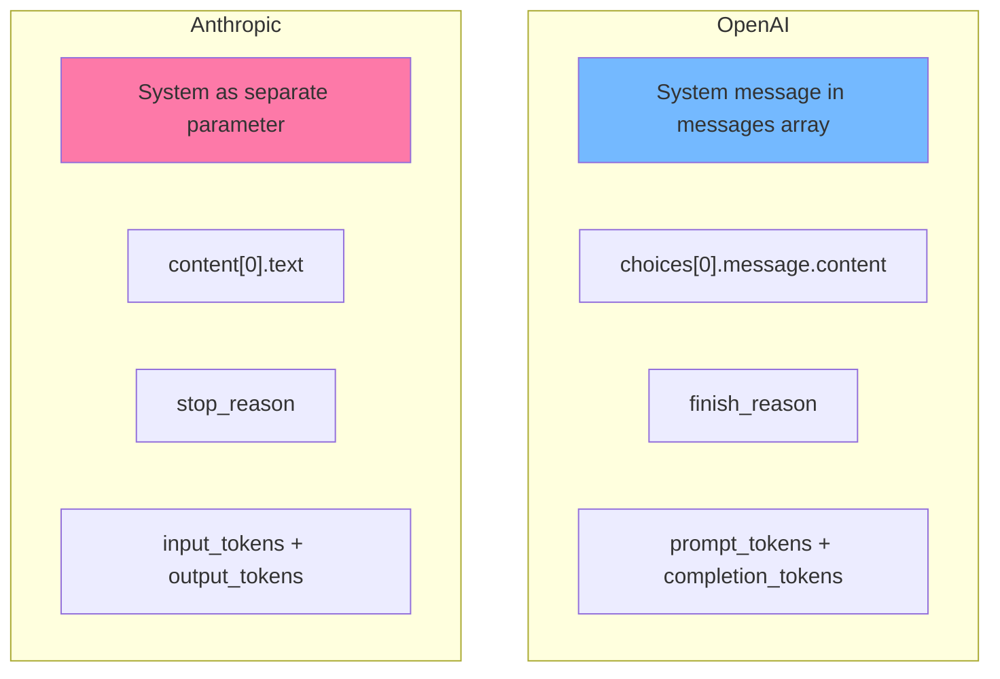
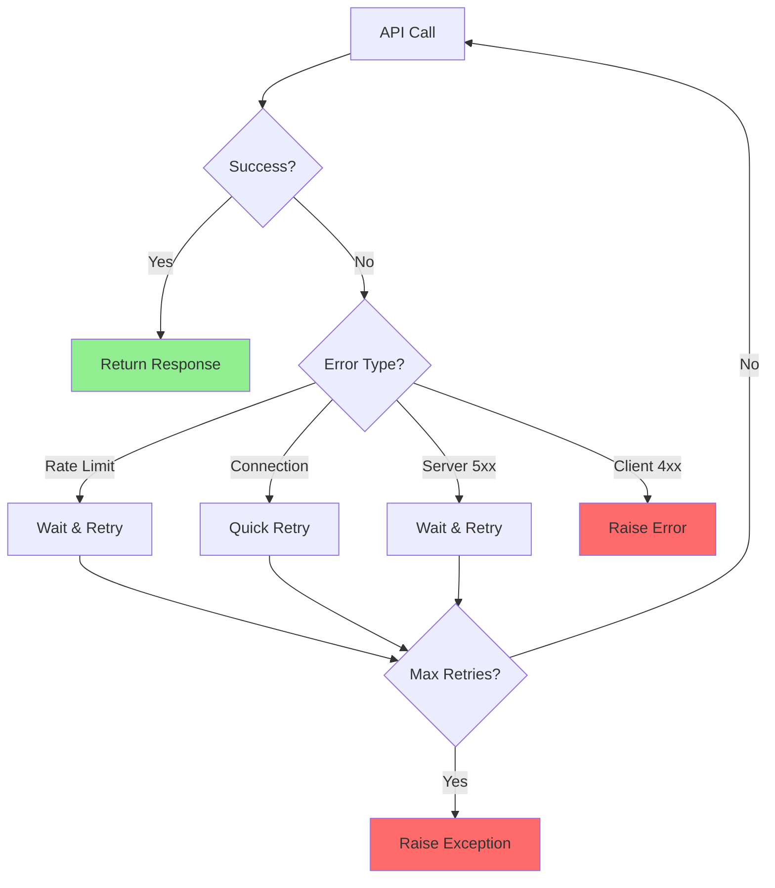

# Using OpenAI and Anthropic Python SDKs Part 2

> **Coming from Software Engineering?** Choosing between OpenAI and Anthropic is like choosing between AWS and GCP — both do similar things with different APIs, pricing, and strengths. The abstraction patterns (provider-agnostic wrapper functions) are the same ones you'd use with any multi-vendor integration.

## Key Differences: OpenAI vs Anthropic



### Side-by-Side Comparison

| Aspect | OpenAI | Anthropic |
|--------|--------|-----------|
| System prompt | In messages array | Separate `system` parameter |
| Response content | `choices[0].message.content` | `content[0].text` |
| Stop indicator | `finish_reason` | `stop_reason` |
| Input tokens | `prompt_tokens` | `input_tokens` |
| Output tokens | `completion_tokens` | `output_tokens` |
| Default temp | 1.0 | 1.0 |
| Max tokens | Optional | **Required** |

Anthropic requires `max_tokens` (an upper bound on reply length, in tokens) — the call errors without it. OpenAI defaults it for you.

### Unified Wrapper

```python
# script_id: day_011_openai_anthropic_sdks_part2/unified_llm_wrapper
from openai import OpenAI
from anthropic import Anthropic

class UnifiedLLM:
    """A unified interface for both OpenAI and Anthropic."""

    def __init__(self):
        self.openai = OpenAI()
        self.anthropic = Anthropic()

    def chat(
        self,
        messages: list,
        provider: str = "openai",
        model: str = None,
        system: str = None,
        temperature: float = 0.7,
        max_tokens: int = 1000
    ) -> dict:
        """
        Send a chat message to either provider.

        Args:
            messages: List of {"role": "user/assistant", "content": "..."}
            provider: "openai" or "anthropic"
            model: Model name (defaults based on provider)
            system: System prompt
            temperature: 0 = focused/deterministic, higher = more varied (see Day 4)
            max_tokens: Maximum response tokens
        """
        if provider == "openai":
            return self._openai_chat(messages, model, system, temperature, max_tokens)
        elif provider == "anthropic":
            return self._anthropic_chat(messages, model, system, temperature, max_tokens)
        else:
            raise ValueError(f"Unknown provider: {provider}")

    def _openai_chat(self, messages, model, system, temperature, max_tokens):
        model = model or "gpt-4o-mini"

        # Add system message if provided
        full_messages = []
        if system:
            full_messages.append({"role": "system", "content": system})
        full_messages.extend(messages)

        response = self.openai.chat.completions.create(
            model=model,
            messages=full_messages,
            temperature=temperature,
            max_tokens=max_tokens
        )

        return {
            "content": response.choices[0].message.content,
            "input_tokens": response.usage.prompt_tokens,
            "output_tokens": response.usage.completion_tokens,
            "model": response.model,
            "provider": "openai"
        }

    def _anthropic_chat(self, messages, model, system, temperature, max_tokens):
        model = model or "claude-sonnet-4-6"

        kwargs = {
            "model": model,
            "messages": messages,
            "max_tokens": max_tokens,
        }

        if system:
            kwargs["system"] = system
        # Anthropic's default temperature is already 1.0, so only send it when the caller wants something different.
        if temperature != 1.0:
            kwargs["temperature"] = temperature

        response = self.anthropic.messages.create(**kwargs)

        return {
            "content": response.content[0].text,
            "input_tokens": response.usage.input_tokens,
            "output_tokens": response.usage.output_tokens,
            "model": response.model,
            "provider": "anthropic"
        }

# Usage - same interface for both!
llm = UnifiedLLM()

# OpenAI
result1 = llm.chat(
    messages=[{"role": "user", "content": "Hello!"}],
    provider="openai",
    system="Be brief."
)
print("OpenAI:", result1["content"])

# Anthropic
result2 = llm.chat(
    messages=[{"role": "user", "content": "Hello!"}],
    provider="anthropic",
    system="Be brief."
)
print("Anthropic:", result2["content"])
```

---

## Error Handling

> **Coming from Software Engineering?** Exponential-backoff retry is the same resilience pattern you already use for any flaky downstream service — a database, a payment gateway, a third-party API.

Both SDKs can throw various errors. Handle them gracefully!

```python
# script_id: day_011_openai_anthropic_sdks_part2/error_handling_retry
from openai import OpenAI, APIError, RateLimitError, APIConnectionError
import time

client = OpenAI()

def robust_openai_call(messages: list, max_retries: int = 3) -> str:
    """Make an OpenAI call with retry logic."""

    for attempt in range(max_retries):
        try:
            response = client.chat.completions.create(
                model="gpt-4o-mini",
                messages=messages
            )
            return response.choices[0].message.content

        except RateLimitError as e:
            # Rate limited - wait and retry
            wait_time = 2 ** attempt  # Exponential backoff
            print(f"Rate limited. Waiting {wait_time}s... (Attempt {attempt + 1})")
            time.sleep(wait_time)

        except APIConnectionError as e:
            # Network issue - retry
            print(f"Connection error: {e}. Retrying...")
            time.sleep(1)

        except APIError as e:
            # Other API error
            print(f"API error: {e}")
            if getattr(e, 'status_code', 0) >= 500:
                # Server error - might be temporary
                time.sleep(2)
            else:
                # Client error - don't retry
                raise

    raise Exception("Max retries exceeded")

# Usage
try:
    result = robust_openai_call([{"role": "user", "content": "Hello!"}])
    print(result)
except Exception as e:
    print(f"Failed: {e}")
```



---

## Model Selection Guide

### OpenAI Models

| Model | Best For | Context | Cost |
|-------|----------|---------|------|
| gpt-4o | Complex reasoning | 128K | $$ |
| gpt-4o-mini | Fast, general use | 128K | $ |

### Anthropic Models

| Model | Best For | Context | Cost |
|-------|----------|---------|------|
| claude-opus-4-6 | Highest capability | 1M | $$$ |
| claude-sonnet-4-6 | Balance of speed/quality | 1M | $$ |
| claude-haiku-4-5 | Fast, efficient | 200K | $ |

---

## Beyond Two Providers: Google Gemini

Google's Gemini models are the third major LLM provider alongside OpenAI and Anthropic. The SDK follows similar patterns, so if you already know one SDK, picking up Gemini is straightforward.

### Installation and Basic Usage

```python
# script_id: day_011_openai_anthropic_sdks_part2/gemini_basic_usage
# pip install google-genai
from google import genai

client = genai.Client()  # Uses GOOGLE_API_KEY env var

response = client.models.generate_content(
    model="gemini-2.0-flash",
    contents="Explain quantum computing in one paragraph."
)
print(response.text)
```

### Three-Provider Comparison

| Feature | OpenAI | Anthropic | Google Gemini |
|---------|--------|-----------|---------------|
| Package | `openai` | `anthropic` | `google-genai` |
| Auth env var | `OPENAI_API_KEY` | `ANTHROPIC_API_KEY` | `GOOGLE_API_KEY` |
| Chat method | `chat.completions.create()` | `messages.create()` | `models.generate_content()` |
| Streaming | `stream=True` | `.stream()` context manager | `generate_content_stream()` |
| Context window | 128K (GPT-4o) | 1M (Claude Sonnet) | 1M (Gemini 2.0) |
| Vision | Built-in | Built-in | Built-in |

*Context window = how much text (in tokens) the model can hold in one call — bigger fits more document/history.*

> **Why this course focuses on OpenAI and Anthropic**: They're the most common in production AI engineering. But the patterns transfer -- once you know one SDK well, picking up another takes hours, not days.

---

## Checkpoint

Run the `UnifiedLLM` wrapper with the same prompt routed to both providers and confirm: you get a coherent answer from each through one identical `chat(...)` call, with the provider-specific request shapes hidden inside the wrapper. If one provider errors while the other works, check that the wrapper is mapping shared args (system prompt, `max_tokens`) into each SDK's expected location — Anthropic takes `system` as a top-level arg, not a message.

---

## Summary

```mermaid
mindmap
  root((SDK Mastery))
    Setup
      pip install
      API keys
      Environment vars
    OpenAI
      chat.completions.create
      choices[0].message.content
      prompt_tokens
    Anthropic
      messages.create
      content[0].text
      input_tokens
    Best Practices
      Error handling
      Retry logic
      Unified wrappers
```

---

## Quick Reference

```python
# script_id: day_011_openai_anthropic_sdks_part2/quick_reference_templates
# OpenAI Quick Template
from openai import OpenAI
client = OpenAI()
response = client.chat.completions.create(
    model="gpt-4o-mini",
    messages=[{"role": "user", "content": "Hello"}]
)
print(response.choices[0].message.content)

# Anthropic Quick Template
from anthropic import Anthropic
client = Anthropic()
response = client.messages.create(
    model="claude-sonnet-4-6",
    max_tokens=1024,
    messages=[{"role": "user", "content": "Hello"}]
)
print(response.content[0].text)
```

---

## Exercises

1. **Cost Tracker**: Build a class that tracks cumulative token usage and estimated costs across multiple calls

<details><summary>Solution</summary>

```python
# script_id: day_011_openai_anthropic_sdks_part2/exercise_cost_tracker
# Prices are illustrative ($ per 1M tokens) — verify current rates at each provider.
PRICES = {"gpt-4o-mini": {"in": 0.15, "out": 0.60}}

class CostTracker:
    def __init__(self):
        self.input_tokens = 0
        self.output_tokens = 0
        self.cost = 0.0

    def record(self, result):
        # result is the dict returned by UnifiedLLM.chat(...)
        p = PRICES.get(result["model"], {"in": 0, "out": 0})
        self.input_tokens += result["input_tokens"]
        self.output_tokens += result["output_tokens"]
        self.cost += (result["input_tokens"] / 1_000_000) * p["in"]
        self.cost += (result["output_tokens"] / 1_000_000) * p["out"]

    def report(self):
        return f"{self.input_tokens} in / {self.output_tokens} out -> ${self.cost:.6f}"

tracker = CostTracker()
llm = UnifiedLLM()
tracker.record(llm.chat(messages=[{"role": "user", "content": "Hi"}]))
print(tracker.report())
```

</details>

2. **Model Comparison**: Create a script that sends the same prompt to both providers and compares responses

<details><summary>Solution</summary>

```python
# script_id: day_011_openai_anthropic_sdks_part2/exercise_model_comparison
llm = UnifiedLLM()
prompt = [{"role": "user", "content": "Explain a hash map in one sentence."}]

for provider in ("openai", "anthropic"):
    result = llm.chat(messages=prompt, provider=provider, system="Be brief.")
    print(f"[{provider}] {result['content']}")
    print(f"  tokens: {result['input_tokens']} in / {result['output_tokens']} out")
```

</details>

3. **Error Simulator**: Write tests that simulate various API errors and verify your retry logic works

<details><summary>Solution</summary>

```python
# script_id: day_011_openai_anthropic_sdks_part2/exercise_error_simulator
# Force the client to raise on the first two calls, then succeed, and confirm we retry.
from unittest.mock import MagicMock
from openai import RateLimitError

calls = {"n": 0}

def flaky_create(**kwargs):
    calls["n"] += 1
    if calls["n"] < 3:
        raise RateLimitError("slow down", response=MagicMock(status_code=429), body=None)
    resp = MagicMock()
    resp.choices[0].message.content = "ok"
    return resp

client.chat.completions.create = flaky_create  # monkeypatch the module-level client
print(robust_openai_call([{"role": "user", "content": "Hello!"}]))  # -> "ok" after 2 retries
print("total attempts:", calls["n"])
```

</details>

---

## What's Next?

Now that you can make basic API calls, let's make them feel faster with **Streaming Responses** — showing output token-by-token as it's generated (async patterns included).
