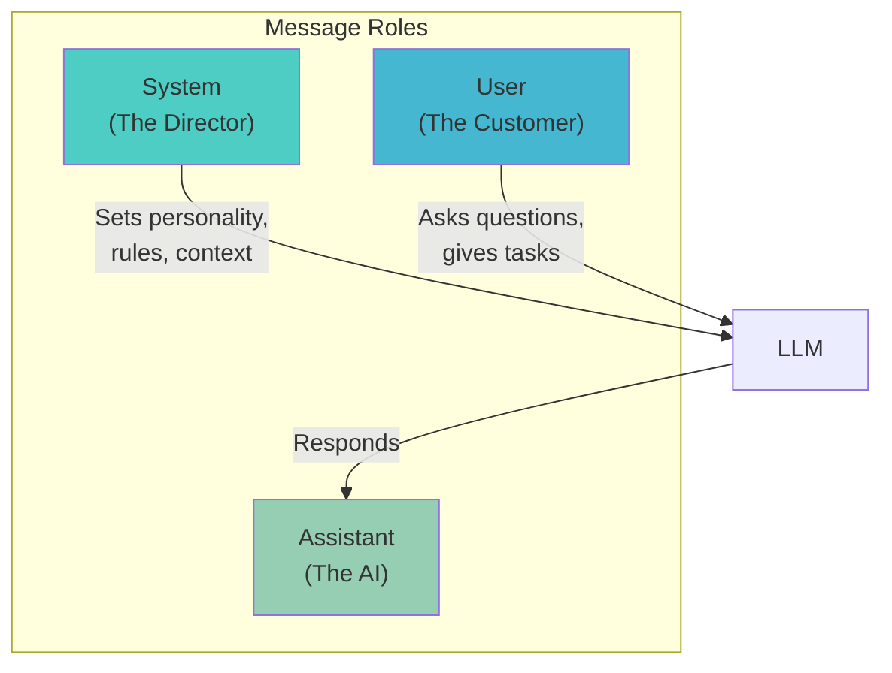
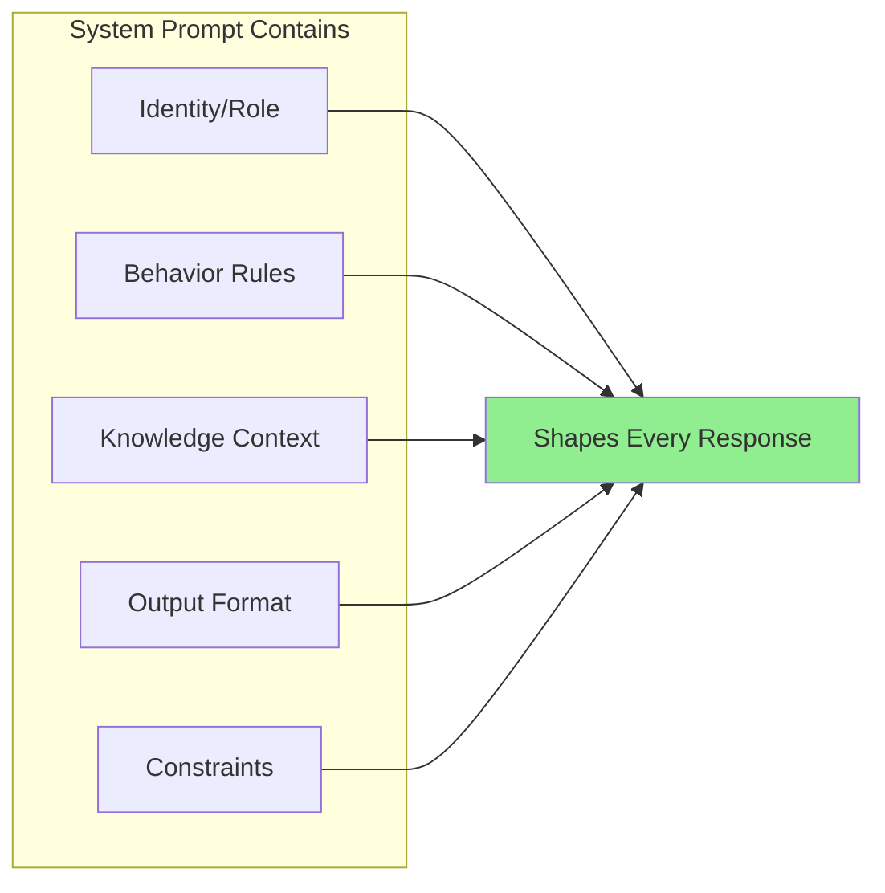
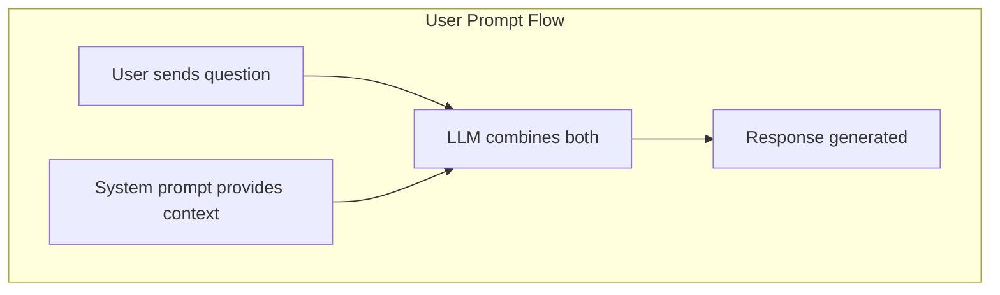
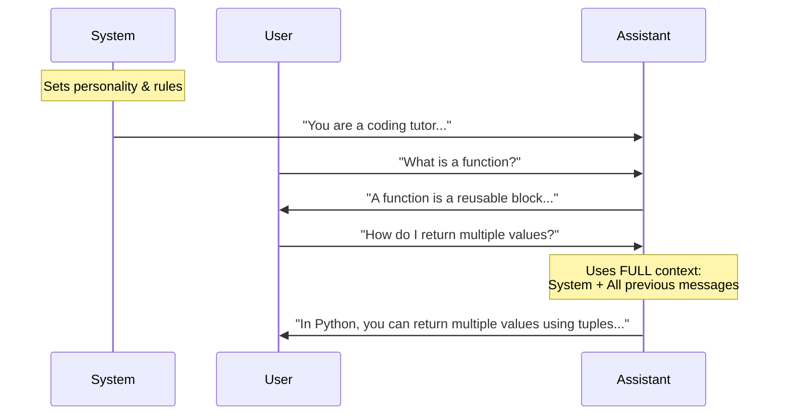
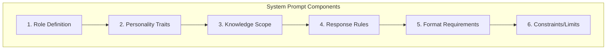

# System Prompts vs User Prompts

When you talk to an LLM through an API, not all messages are created equal. Understanding the difference between **system prompts** and **user prompts** is crucial for building effective AI applications.

Think of it like the difference between an employee's job description and their daily tasks!

> **Coming from Software Engineering?** The system prompt is like a class constructor or dependency injection config — it sets the behavior contract before any user interaction. The user prompt is the function call. If you've designed APIs with configuration objects and request payloads, you already understand this separation of concerns.

---

## The Three Message Roles

Most LLM APIs use three types of messages:



### Quick Definitions

| Role | Purpose | Who Writes It |
|------|---------|---------------|
| **System** | Define behavior, personality, constraints | You (the developer) |
| **User** | Provide input, ask questions | Your users (or you) |
| **Assistant** | Model's responses | The LLM |

---

## System Prompts: Setting the Stage

The system prompt is like a job description for the AI. It's typically set once at the start of a conversation and shapes ALL subsequent responses.



### Basic System Prompt Example

```python
from openai import OpenAI

client = OpenAI()

def chat_with_system_prompt(user_message: str, system_prompt: str) -> str:
    """Send a message with a system prompt."""
    response = client.chat.completions.create(
        model="gpt-4o-mini",
        messages=[
            {"role": "system", "content": system_prompt},
            {"role": "user", "content": user_message}
        ]
    )
    return response.choices[0].message.content

# Example: Friendly assistant
friendly_system = """You are a friendly, helpful assistant named Buddy.
You speak in a warm, conversational tone and use occasional emojis.
You always try to be encouraging and supportive."""

response = chat_with_system_prompt(
    "I'm learning to code but it's really hard.",
    friendly_system
)
print(response)
# Output: "Hey there! 😊 Learning to code can definitely feel challenging
# at first, but you're already doing amazing by sticking with it!..."
```

### The Same Question, Different System Prompts

```python
from openai import OpenAI

client = OpenAI()

user_question = "What should I eat for dinner?"

system_prompts = {
    "nutritionist": """You are a certified nutritionist. You provide
    health-focused meal recommendations based on nutritional value.
    Always mention protein, carbs, and vegetables.""",

    "chef": """You are a passionate Italian chef named Marco. You
    recommend dishes with enthusiasm, focusing on flavor, ingredients,
    and cooking techniques. Use some Italian phrases.""",

    "budget_advisor": """You are a frugal living expert. You suggest
    cost-effective meal options, always mentioning approximate costs
    and money-saving tips.""",

    "comedian": """You are a stand-up comedian. You answer questions
    with humor while still being helpful. Include at least one joke
    in every response."""
}

for role, system_prompt in system_prompts.items():
    response = client.chat.completions.create(
        model="gpt-4o-mini",
        messages=[
            {"role": "system", "content": system_prompt},
            {"role": "user", "content": user_question}
        ],
        temperature=0.7
    )
    print(f"\n=== {role.upper()} ===")
    print(response.choices[0].message.content[:200] + "...")
```

---

## User Prompts: The Actual Requests

User prompts are the messages your users (or your code) send to get things done. They assume the context from the system prompt.



### User Prompt Best Practices

```python
# BAD: Redundant with system prompt
system = "You are a Python expert."
user = "You are a Python expert. Write a function to sort a list."

# GOOD: System sets context, user gives task
system = "You are a Python expert who writes clean, well-documented code."
user = "Write a function to sort a list of dictionaries by a specific key."
```

---

## The Message Array: Building Conversations

Real conversations involve multiple messages:

```python
from openai import OpenAI

client = OpenAI()

# A full conversation flow
messages = [
    {
        "role": "system",
        "content": "You are a helpful coding tutor. Explain concepts simply and provide examples."
    },
    {
        "role": "user",
        "content": "What is a function?"
    },
    {
        "role": "assistant",
        "content": "A function is a reusable block of code that performs a specific task. Think of it like a recipe - you define the steps once, then use it whenever you need that task done.\n\nExample:\n```python\ndef greet(name):\n    return f'Hello, {name}!'\n\nprint(greet('Alice'))  # Output: Hello, Alice!\n```"
    },
    {
        "role": "user",
        "content": "How do I return multiple values?"
    }
]

response = client.chat.completions.create(
    model="gpt-4o-mini",
    messages=messages
)

print(response.choices[0].message.content)
```



---

## Crafting Effective System Prompts

### The Anatomy of a Great System Prompt



### Template: Professional System Prompt

```python
system_prompt_template = """
# Role
You are {role_name}, {role_description}.

# Personality
- Tone: {tone}
- Communication style: {style}

# Capabilities
You can help with:
{capabilities}

# Constraints
- {constraint_1}
- {constraint_2}
- {constraint_3}

# Response Format
{format_instructions}

# Special Instructions
{special_instructions}
"""

# Example filled in
customer_support_prompt = """
# Role
You are SupportBot, a customer service representative for TechCorp.

# Personality
- Tone: Professional yet friendly
- Communication style: Clear, concise, solution-focused

# Capabilities
You can help with:
- Product information and specifications
- Order status and tracking
- Basic troubleshooting
- Return and refund policies

# Constraints
- Never share customer personal data
- Don't make promises about delivery dates
- Escalate to human agent for billing disputes
- Don't discuss competitor products

# Response Format
1. Acknowledge the customer's issue
2. Provide relevant information or solution
3. Ask if they need further assistance

# Special Instructions
If you can't resolve an issue, provide the support ticket format:
TICKET: [Issue Type] - [Brief Description]
"""
```

---

## Common System Prompt Patterns

### Pattern 1: The Expert

```python
expert_prompt = """You are an expert {domain} specialist with 20+ years of experience.
You provide accurate, detailed information based on current best practices.
When uncertain, you clearly state your confidence level.
You cite sources or explain your reasoning when making claims."""
```

### Pattern 2: The Constrained Assistant

```python
constrained_prompt = """You are a helpful assistant with the following rules:

MUST DO:
- Answer only questions about {topic}
- Provide sources when possible
- Ask clarifying questions when the request is ambiguous

MUST NOT:
- Discuss topics outside {topic}
- Provide medical/legal/financial advice
- Generate harmful or inappropriate content
- Make up information"""
```

### Pattern 3: The Persona

```python
persona_prompt = """You are Captain Nova, a space explorer from the year 3000.
You speak with enthusiasm about technology and discovery.
You often relate modern concepts to futuristic analogies.
You use space-related metaphors and occasional made-up future slang.
Despite your futuristic persona, you provide accurate, helpful information."""
```

### Pattern 4: The Structured Output Generator

```python
structured_prompt = """You are a data extraction assistant.
You analyze text and extract information in strict JSON format.

For every response, output ONLY valid JSON with no additional text.
Use this schema:
{
  "field1": "extracted value or null",
  "field2": "extracted value or null",
  "confidence": "high/medium/low"
}

If information is not found, use null. Never invent data."""
```

---
