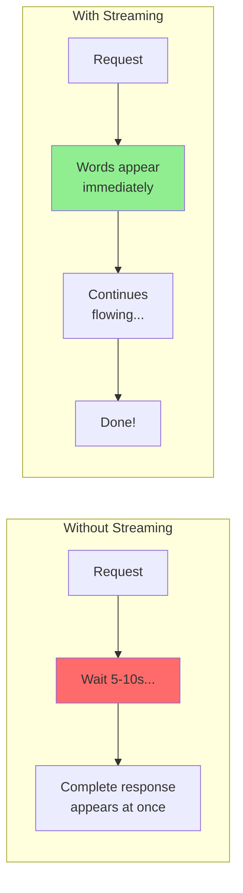
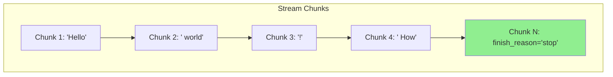

# Streaming Responses: Real-Time LLM Output

Have you noticed how ChatGPT types out responses word by word instead of making you wait for the complete answer? That's **streaming**! In this guide, you'll learn to implement the same experience in your applications.

> **Coming from Software Engineering?** LLM streaming is Server-Sent Events (SSE) — the same protocol used in real-time dashboards, stock tickers, and notification systems. If you've consumed webhooks or WebSocket streams, you already know how to handle streaming data. The only difference is you're getting text tokens instead of JSON events.

---

## Why Streaming Matters



### Benefits of Streaming

| Aspect | Without Streaming | With Streaming |
|--------|------------------|----------------|
| Time to first token | 5-10 seconds | ~0.5 seconds |
| User experience | Feels slow | Feels responsive |
| UI feedback | Loading spinner | Live text |
| Can cancel early? | No | Yes! |

---

## OpenAI Streaming Basics

Each chunk's `delta` is the NEW text added since the last chunk — not the full answer rebuilt each time. Coming from SWE: think of it like a git diff or an append-only log line, not a fresh snapshot. To get the whole reply you concatenate the deltas in order.

```python
# script_id: day_012_streaming_responses_part1/basic_stream_chat
from openai import OpenAI

client = OpenAI()

def stream_chat(prompt: str):
    """Stream a chat response word by word."""
    stream = client.chat.completions.create(
        model="gpt-4o-mini",
        messages=[{"role": "user", "content": prompt}],
        stream=True  # Enable streaming!
    )

    print("Response: ", end="", flush=True)

    for chunk in stream:
        # Each chunk contains a small piece of the response
        if chunk.choices[0].delta.content:
            content = chunk.choices[0].delta.content
            print(content, end="", flush=True)

    print()  # New line at the end

# Try it!
stream_chat("Write a short poem about coding")
```

### Understanding Stream Chunks

```python
# script_id: day_012_streaming_responses_part1/inspect_stream_chunks
from openai import OpenAI

client = OpenAI()

def inspect_stream(prompt: str):
    """Inspect what's in each stream chunk."""
    stream = client.chat.completions.create(
        model="gpt-4o-mini",
        messages=[{"role": "user", "content": prompt}],
        stream=True
    )

    for i, chunk in enumerate(stream):
        print(f"\n--- Chunk {i} ---")
        print(f"ID: {chunk.id}")
        print(f"Model: {chunk.model}")
        print(f"Delta content: {repr(chunk.choices[0].delta.content)}")
        print(f"Finish reason: {chunk.choices[0].finish_reason}")

        if i >= 5:  # Just show first few chunks
            print("\n... (more chunks follow)")
            break

inspect_stream("Say hello")
```

**Output:**
```
--- Chunk 0 ---
ID: chatcmpl-abc123
Model: gpt-4o-mini
Delta content: ''
Finish reason: None

--- Chunk 1 ---
ID: chatcmpl-abc123
Model: gpt-4o-mini
Delta content: 'Hello'
Finish reason: None

--- Chunk 2 ---
ID: chatcmpl-abc123
Model: gpt-4o-mini
Delta content: '!'
Finish reason: None

--- Chunk 3 ---
ID: chatcmpl-abc123
Model: gpt-4o-mini
Delta content: ' How'
Finish reason: None
...
```

Notice Chunk 0 has an empty delta — the first chunk usually just carries metadata (the role/id) before any text starts, and some later chunks are empty too. That is why every loop checks `if content:` before printing — to skip the empty pieces.

`finish_reason` is `None` on every chunk until the last one, where it becomes `"stop"` (the model finished on its own) or `"length"` (it hit max_tokens and got cut off). It is your signal that the stream is done and whether the answer was truncated.



---

## Anthropic Streaming

```python
# script_id: day_012_streaming_responses_part1/anthropic_basic_stream
from anthropic import Anthropic

client = Anthropic()

def stream_claude(prompt: str):
    """Stream a Claude response."""
    with client.messages.stream(
        model="claude-sonnet-4-6",
        max_tokens=1024,
        messages=[{"role": "user", "content": prompt}]
    ) as stream:
        print("Response: ", end="", flush=True)
        for text in stream.text_stream:
            print(text, end="", flush=True)
        print()

stream_claude("Write a haiku about Python")
```

### Anthropic Stream Events

Claude emits events in order: `message_start` (the reply is beginning), `content_block_start`, a series of `content_block_delta` events (each carrying a `delta` with the next text piece — the Anthropic equivalent of OpenAI's delta), `content_block_stop`, then `message_stop` (done). The code below just confirms this sequence.

```python
# script_id: day_012_streaming_responses_part1/anthropic_stream_events
from anthropic import Anthropic

client = Anthropic()

def detailed_claude_stream(prompt: str):
    """Show detailed stream events from Claude."""
    with client.messages.stream(
        model="claude-sonnet-4-6",
        max_tokens=1024,
        messages=[{"role": "user", "content": prompt}]
    ) as stream:
        for event in stream:
            print(f"Event type: {type(event).__name__}")

            # Different event types have different attributes
            if hasattr(event, 'type'):
                print(f"  Type: {event.type}")
            if hasattr(event, 'delta'):
                print(f"  Delta: {event.delta}")

detailed_claude_stream("Hi")
```

---

## Collecting Streamed Content

Sometimes you want to both stream to the user AND collect the full response:

```python
# script_id: day_012_streaming_responses_part1/stream_and_collect
from openai import OpenAI

client = OpenAI()

def stream_and_collect(prompt: str) -> str:
    """Stream response while collecting full text."""
    stream = client.chat.completions.create(
        model="gpt-4o-mini",
        messages=[{"role": "user", "content": prompt}],
        stream=True
    )

    collected_content = []

    print("Streaming: ", end="", flush=True)
    for chunk in stream:
        content = chunk.choices[0].delta.content
        if content:
            print(content, end="", flush=True)
            collected_content.append(content)
    print()

    full_response = "".join(collected_content)
    return full_response

# Usage
response = stream_and_collect("List 3 programming languages")
print(f"\n--- Full collected response ({len(response)} chars) ---")
print(response)
```

---

## Async Streaming

Combine async with streaming for maximum responsiveness:

```python
# script_id: day_012_streaming_responses_part1/async_stream
import asyncio
from openai import AsyncOpenAI

client = AsyncOpenAI()

async def async_stream(prompt: str) -> str:
    """Async streaming with collection."""
    # await opens the stream; the async for below then pulls chunks as they arrive (both steps are required)
    stream = await client.chat.completions.create(
        model="gpt-4o-mini",
        messages=[{"role": "user", "content": prompt}],
        stream=True
    )

    collected = []
    async for chunk in stream:
        content = chunk.choices[0].delta.content
        if content:
            print(content, end="", flush=True)
            collected.append(content)

    print()
    return "".join(collected)

async def main():
    result = await async_stream("Explain async streaming in one paragraph")
    print(f"\nCollected {len(result)} characters")

asyncio.run(main())
```

### Parallel Async Streams

```python
# script_id: day_012_streaming_responses_part1/parallel_async_streams
import asyncio
from openai import AsyncOpenAI

client = AsyncOpenAI()

async def stream_one(prompt: str, label: str) -> str:
    """Stream a single prompt with a label."""
    stream = await client.chat.completions.create(
        model="gpt-4o-mini",
        messages=[{"role": "user", "content": prompt}],
        stream=True,
        max_tokens=100
    )

    collected = []
    async for chunk in stream:
        content = chunk.choices[0].delta.content
        if content:
            collected.append(content)
            # Print with label for clarity
            print(f"[{label}] {content}", end="", flush=True)

    print(f"\n[{label}] --- Done ---")
    return "".join(collected)

async def parallel_streams():
    """Run multiple streams in parallel."""
    prompts = [
        ("What is Python?", "PY"),
        ("What is JavaScript?", "JS"),
        ("What is Rust?", "RS")
    ]

    tasks = [stream_one(prompt, label) for prompt, label in prompts]
    results = await asyncio.gather(*tasks)

    print("\n=== All streams complete ===")
    for (prompt, label), result in zip(prompts, results):
        print(f"{label}: {len(result)} chars")

asyncio.run(parallel_streams())
```

---

## Checkpoint

Run `stream_chat` and confirm: text appears token-by-token in your terminal instead of all at once after a pause. If it still arrives in one lump, check that you passed `stream=True` and that your `print(..., end="", flush=True)` uses `flush=True` — without the flush, Python buffers stdout and hides the streaming effect. Just like an SSE connection, the tokens arrive as a live stream rather than one buffered payload.

---

## Summary

```mermaid
mindmap
  root((Streaming Responses))
    Why stream
      Faster perceived speed
      Tokens appear as generated
      Better UX for long answers
    OpenAI
      stream=True on create
      Read chunk.choices[0].delta.content
      Skip empty deltas
    Anthropic
      client.messages.stream(...) context manager
      Iterate stream.text_stream
      Or loop raw events for detail
    Async
      AsyncOpenAI + async for
      gather() runs streams in parallel
      Collect while you print
```

## Quick Reference

| Task | OpenAI | Anthropic |
|---|---|---|
| Turn on streaming | `...create(..., stream=True)` | `with client.messages.stream(...) as stream:` |
| Get each text piece | `chunk.choices[0].delta.content` | `for text in stream.text_stream:` |
| Guard empty pieces | `if content:` | text pieces are already non-empty |
| Inspect raw events | iterate the stream object | `for event in stream:` |
| Async variant | `AsyncOpenAI()` + `async for chunk in stream` | same pattern via `AsyncAnthropic()` — see Day 13 |
| Run several at once | `await asyncio.gather(*tasks)` | same |

## Exercises

1. **Stream then collect.** Modify `stream_chat` so it prints tokens live *and* returns the full joined string at the end.
2. **Time the difference.** Measure time-to-first-token for a streaming call vs. total time for a non-streaming call on the same prompt. Which feels faster, and why?
3. **Add a token counter.** Count the number of streamed chunks and print it after the response completes; compare it to the `usage` token count from a non-streaming call.
4. **Stream from Anthropic.** Port the OpenAI streaming function to Anthropic using `client.messages.stream(...)` and its `text_stream`.

<details><summary>Solutions (approaches)</summary>

1. Append each non-empty `delta.content` to a list while printing, then `return "".join(collected)` — exactly the collect-while-streaming pattern shown above.
2. Time-to-first-token is much lower when streaming (you see output in ~100s of ms); total time is similar, but the *perceived* latency is what users feel.
3. Increment a counter inside the `for chunk` loop. Chunk count ≈ token count but isn't exact (some chunks carry no text, some carry several characters).
4. Wrap the call in `with client.messages.stream(model="claude-sonnet-4-6", max_tokens=512, messages=[...]) as stream:` and iterate `stream.text_stream`.
</details>

## What's Next?

Tomorrow (Day 13) is **Streaming Responses Part 2** — building a real streaming chat interface, streaming with callbacks, Server-Sent Events for web apps, handling interruptions, and measuring streaming performance.
