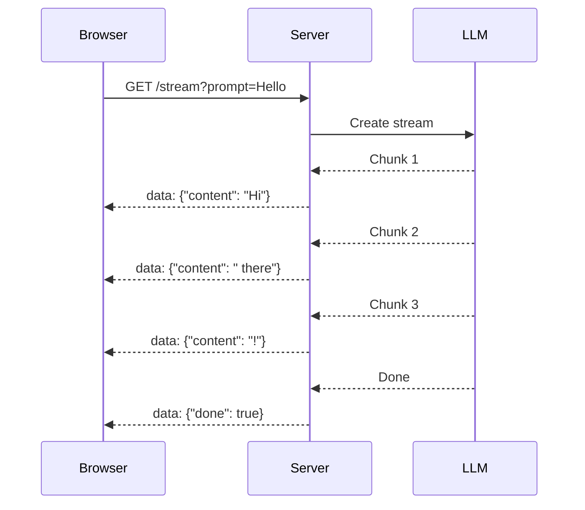

# Streaming Responses: Real-Time LLM Output Part 2

> **Coming from Software Engineering?** Building streaming chat interfaces is like building a real-time log viewer or terminal emulator — data arrives in chunks and you render progressively. The same buffering and display strategies you'd use for a live tail -f view apply here.

## Building a Streaming Chat Interface

Here's a complete streaming chat implementation:

```python
# script_id: day_013_streaming_responses_part2/streaming_chat_interface
from openai import OpenAI

client = OpenAI()

class StreamingChat:
    """A streaming chat interface."""

    def __init__(self, system_prompt: str = "You are a helpful assistant."):
        self.system_prompt = system_prompt
        self.messages = []

    def chat(self, user_input: str) -> str:
        """Send a message and stream the response."""
        # Add user message
        self.messages.append({"role": "user", "content": user_input})

        # Build full message list
        full_messages = [
            {"role": "system", "content": self.system_prompt}
        ] + self.messages

        # Stream response
        stream = client.chat.completions.create(
            model="gpt-4o-mini",
            messages=full_messages,
            stream=True
        )

        print("Assistant: ", end="", flush=True)
        collected = []

        for chunk in stream:
            content = chunk.choices[0].delta.content
            if content:
                print(content, end="", flush=True)
                collected.append(content)

        print()  # New line

        # Add assistant response to history
        full_response = "".join(collected)
        self.messages.append({"role": "assistant", "content": full_response})

        return full_response

    def clear_history(self):
        """Clear conversation history."""
        self.messages = []

# Interactive usage
def run_chat():
    chat = StreamingChat(
        system_prompt="You are a friendly coding tutor. Keep responses concise."
    )

    print("Streaming Chat (type 'quit' to exit, 'clear' to reset)")
    print("-" * 50)

    while True:
        user_input = input("\nYou: ").strip()

        if user_input.lower() == 'quit':
            break
        elif user_input.lower() == 'clear':
            chat.clear_history()
            print("History cleared!")
            continue
        elif not user_input:
            continue

        chat.chat(user_input)

if __name__ == "__main__":
    run_chat()
```

---

## Streaming with Callbacks

For frameworks and UIs, use callbacks:

```python
# script_id: day_013_streaming_responses_part2/stream_with_callbacks
from openai import OpenAI
from typing import Callable

client = OpenAI()

def stream_with_callbacks(
    prompt: str,
    on_token: Callable[[str], None],
    on_complete: Callable[[str], None],
    on_error: Callable[[Exception], None] = None
):
    """
    Stream with callback functions for integration with UIs.

    Args:
        prompt: The user's prompt
        on_token: Called for each new token
        on_complete: Called when streaming finishes
        on_error: Called if an error occurs
    """
    try:
        stream = client.chat.completions.create(
            model="gpt-4o-mini",
            messages=[{"role": "user", "content": prompt}],
            stream=True
        )

        collected = []
        for chunk in stream:
            content = chunk.choices[0].delta.content
            if content:
                collected.append(content)
                on_token(content)

        full_response = "".join(collected)
        on_complete(full_response)

    except Exception as e:
        if on_error:
            on_error(e)
        else:
            raise

# Example usage with simple callbacks
def my_token_handler(token: str):
    print(token, end="", flush=True)

def my_complete_handler(full_text: str):
    print(f"\n\n[Complete! {len(full_text)} chars]")

def my_error_handler(error: Exception):
    print(f"\n[Error: {error}]")

stream_with_callbacks(
    "Write a 2-line poem",
    on_token=my_token_handler,
    on_complete=my_complete_handler,
    on_error=my_error_handler
)
```

---

## Server-Sent Events (SSE) for Web Apps

When building web APIs, use SSE to stream to browsers:

```python
# script_id: day_013_streaming_responses_part2/sse_fastapi_endpoint
from fastapi import FastAPI
from fastapi.responses import StreamingResponse
from openai import OpenAI
import json

app = FastAPI()
client = OpenAI()

async def generate_stream(prompt: str):
    """Generator for SSE streaming."""
    stream = client.chat.completions.create(
        model="gpt-4o-mini",
        messages=[{"role": "user", "content": prompt}],
        stream=True
    )

    for chunk in stream:
        content = chunk.choices[0].delta.content
        if content:
            # SSE format: data: {json}\n\n
            data = json.dumps({"content": content})
            yield f"data: {data}\n\n"

    # Send completion signal
    yield f"data: {json.dumps({'done': True})}\n\n"

@app.get("/stream")
async def stream_endpoint(prompt: str):
    """SSE endpoint for streaming responses."""
    return StreamingResponse(
        generate_stream(prompt),
        media_type="text/event-stream"
    )

# Frontend JavaScript to consume this:
"""
const eventSource = new EventSource('/stream?prompt=Hello');
eventSource.onmessage = (event) => {
    const data = JSON.parse(event.data);
    if (data.done) {
        eventSource.close();
    } else {
        document.getElementById('output').textContent += data.content;
    }
};
"""
```



---

## Handling Stream Interruption

Allow users to cancel streams:

```python
# script_id: day_013_streaming_responses_part2/cancellable_stream
import asyncio
from openai import AsyncOpenAI

client = AsyncOpenAI()

class CancellableStream:
    """A stream that can be cancelled."""

    def __init__(self):
        self.cancelled = False

    def cancel(self):
        """Cancel the stream."""
        self.cancelled = True

    async def stream(self, prompt: str) -> str:
        """Stream with cancellation support."""
        stream = await client.chat.completions.create(
            model="gpt-4o-mini",
            messages=[{"role": "user", "content": prompt}],
            stream=True
        )

        collected = []
        async for chunk in stream:
            if self.cancelled:
                print("\n[Stream cancelled]")
                break

            content = chunk.choices[0].delta.content
            if content:
                print(content, end="", flush=True)
                collected.append(content)

        return "".join(collected)

async def demo_cancellation():
    """Demo cancelling a stream."""
    streamer = CancellableStream()

    # Start streaming in background
    stream_task = asyncio.create_task(
        streamer.stream("Write a very long story about a dragon")
    )

    # Cancel after 2 seconds
    await asyncio.sleep(2)
    streamer.cancel()

    result = await stream_task
    print(f"\n\nGot {len(result)} chars before cancellation")

asyncio.run(demo_cancellation())
```

---

## Measuring Streaming Performance

```python
# script_id: day_013_streaming_responses_part2/measure_streaming_performance
import time
from openai import OpenAI

client = OpenAI()

def measure_streaming(prompt: str) -> dict:
    """Measure streaming performance metrics."""
    start_time = time.time()
    first_token_time = None
    token_count = 0
    char_count = 0

    stream = client.chat.completions.create(
        model="gpt-4o-mini",
        messages=[{"role": "user", "content": prompt}],
        stream=True
    )

    for chunk in stream:
        content = chunk.choices[0].delta.content
        if content:
            if first_token_time is None:
                first_token_time = time.time()
            token_count += 1
            char_count += len(content)

    end_time = time.time()

    return {
        "total_time": end_time - start_time,
        "time_to_first_token": first_token_time - start_time if first_token_time else None,
        "streaming_time": end_time - first_token_time if first_token_time else None,
        "chunk_count": token_count,
        "char_count": char_count,
        "chars_per_second": char_count / (end_time - first_token_time) if first_token_time else 0
    }

# Test it
metrics = measure_streaming("Write a paragraph about streaming APIs")
print("\n--- Streaming Metrics ---")
for key, value in metrics.items():
    if isinstance(value, float):
        print(f"{key}: {value:.3f}")
    else:
        print(f"{key}: {value}")
```

---

## Checkpoint

Run `measure_streaming` and confirm: it reports a time-to-first-token that's noticeably smaller than the total completion time — that gap is exactly the latency win streaming buys you. If first-token time equals total time, check that you're timing inside the chunk loop (stamping the first chunk's arrival) rather than after the stream has fully drained.

---

## Summary

```mermaid
mindmap
  root((Streaming))
    Why
      Faster perceived response
      Better UX
      Cancellation support
    OpenAI
      stream=True
      chunk.choices[0].delta.content
    Anthropic
      messages.stream()
      stream.text_stream
    Patterns
      Collect while streaming
      Callbacks for UIs
      SSE for web apps
      Cancellation handling
```

---

## Quick Reference

```python
# script_id: day_013_streaming_responses_part2/quick_reference
# OpenAI Streaming
from openai import OpenAI
client = OpenAI()

stream = client.chat.completions.create(
    model="gpt-4o-mini",
    messages=[{"role": "user", "content": "Hi"}],
    stream=True
)
for chunk in stream:
    if chunk.choices[0].delta.content:
        print(chunk.choices[0].delta.content, end="")

# Anthropic Streaming
from anthropic import Anthropic
client = Anthropic()

with client.messages.stream(
    model="claude-sonnet-4-5",
    max_tokens=1024,
    messages=[{"role": "user", "content": "Hi"}]
) as stream:
    for text in stream.text_stream:
        print(text, end="")
```

---

## Exercises

1. **Typing Effect**: Implement a "typewriter" effect that adds a small delay between chunks for a more natural feel

2. **Progress Estimator**: Build a system that estimates completion percentage based on expected output length

3. **Stream Merger**: Create a function that streams from multiple prompts simultaneously and merges the output

---

## What's Next?

You now have complete API mastery! Next, we'll learn about **Structured Output & Data Parsing** - forcing LLMs to return valid JSON using Pydantic!
