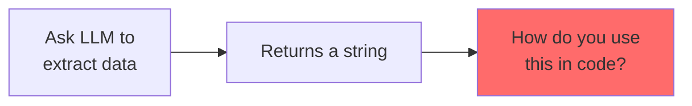
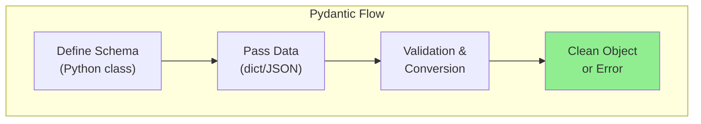
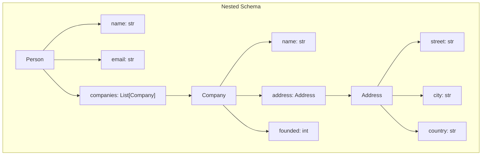
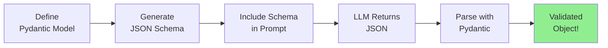
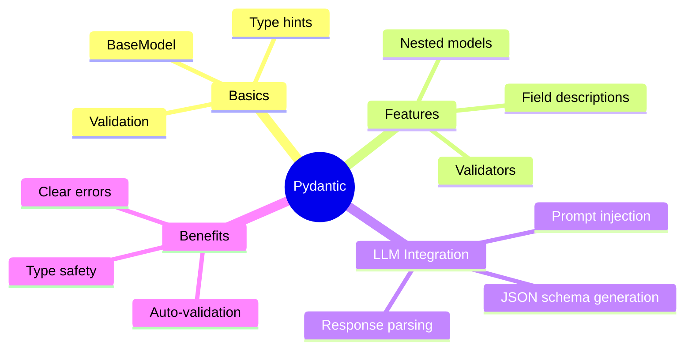

# Using Pydantic to Define Strict Data Schemas

LLMs are great at generating text, but applications need **structured data** - dictionaries, objects, typed fields. Enter **Pydantic**: the Python library that turns messy LLM output into clean, validated data structures.

> **Coming from Software Engineering?** Pydantic is the TypeScript of Python — it adds type safety and validation to a dynamically typed language. If you've used TypeScript interfaces, JSON Schema, or Protocol Buffers to define data contracts, Pydantic models serve the exact same purpose for LLM outputs. Using Pydantic with LLMs is like building a data transformation layer between an unreliable external API and your clean internal types. The same defensive programming patterns — validate, coerce, reject — that you use at API boundaries apply when parsing LLM output.

---

## The Problem: LLMs Return Strings



```python
# What we want
user_data = {
    "name": "John Doe",
    "age": 30,
    "email": "john@example.com"
}

# What LLM gives us
llm_response = """
The user's name is John Doe, they are 30 years old,
and their email is john@example.com.
"""

# Now what? Parse this mess manually?
```

---

## What is Pydantic?

Pydantic is a data validation library that:
- Defines data structures with type hints
- Automatically validates and converts data
- Provides clear error messages
- Generates JSON schemas



---

## Getting Started with Pydantic

### Installation

```bash
pip install pydantic
```

### Basic Model

```python
from pydantic import BaseModel
from typing import Optional

class User(BaseModel):
    name: str
    age: int
    email: str
    is_active: Optional[bool] = True

# Creating instances
user1 = User(
    name="John Doe",
    age=30,
    email="john@example.com"
)

print(user1)
# name='John Doe' age=30 email='john@example.com' is_active=True

print(user1.name)  # John Doe
print(user1.model_dump())  # {'name': 'John Doe', 'age': 30, ...}
print(user1.model_dump_json())  # JSON string
```

### Type Coercion

Pydantic automatically converts compatible types:

```python
from pydantic import BaseModel

class User(BaseModel):
    name: str
    age: int

# String "30" is converted to int 30
user = User(name="John", age="30")  # Works!
print(user.age)  # 30 (as int)
print(type(user.age))  # <class 'int'>
```

### Validation Errors

```python
from pydantic import BaseModel, ValidationError

class User(BaseModel):
    name: str
    age: int

try:
    user = User(name="John", age="not a number")
except ValidationError as e:
    print("Validation failed!")
    print(e.json())

# Output:
# [
#   {
#     "type": "int_parsing",
#     "loc": ["age"],
#     "msg": "Input should be a valid integer",
#     "input": "not a number"
#   }
# ]
```

---

## Building Complex Schemas

### Nested Models

```python
from pydantic import BaseModel
from typing import List, Optional
from datetime import datetime

class Address(BaseModel):
    street: str
    city: str
    country: str
    zip_code: Optional[str] = None

class Company(BaseModel):
    name: str
    address: Address
    founded: int

class Person(BaseModel):
    name: str
    email: str
    companies: List[Company]
    created_at: datetime = datetime.now()

# Usage
data = {
    "name": "Jane Smith",
    "email": "jane@example.com",
    "companies": [
        {
            "name": "TechCorp",
            "address": {
                "street": "123 Main St",
                "city": "San Francisco",
                "country": "USA"
            },
            "founded": 2020
        }
    ]
}

person = Person(**data)
print(person.companies[0].address.city)  # San Francisco
```



### Enums and Literals

```python
from pydantic import BaseModel
from enum import Enum
from typing import Literal

class Priority(str, Enum):
    LOW = "low"
    MEDIUM = "medium"
    HIGH = "high"

class Task(BaseModel):
    title: str
    priority: Priority
    status: Literal["pending", "in_progress", "completed"]

# Usage
task = Task(
    title="Fix bug",
    priority="high",  # Converted to Priority.HIGH
    status="pending"
)

print(task.priority)  # Priority.HIGH
print(task.priority.value)  # "high"
```

### Field Validators

```python
from pydantic import BaseModel, field_validator, Field
from typing import List

class Product(BaseModel):
    name: str
    price: float = Field(gt=0)  # Must be greater than 0
    tags: List[str] = []

    @field_validator('name')
    @classmethod
    def name_must_not_be_empty(cls, v):
        if not v.strip():
            raise ValueError('Name cannot be empty')
        return v.title()  # Capitalize

    @field_validator('tags')
    @classmethod
    def tags_lowercase(cls, v):
        return [tag.lower() for tag in v]

# Usage
product = Product(
    name="laptop",
    price=999.99,
    tags=["Electronics", "COMPUTERS"]
)

print(product.name)  # "Laptop" (capitalized)
print(product.tags)  # ["electronics", "computers"] (lowercased)
```

---

## Generating JSON Schemas

Pydantic can generate JSON schemas that LLMs understand:

```python
from pydantic import BaseModel
from typing import List, Optional
import json

class ExtractedEntity(BaseModel):
    """An entity extracted from text."""
    name: str
    entity_type: str
    confidence: float

class ExtractionResult(BaseModel):
    """Result of entity extraction."""
    entities: List[ExtractedEntity]
    source_text: str
    language: Optional[str] = "en"

# Generate JSON Schema
schema = ExtractionResult.model_json_schema()
print(json.dumps(schema, indent=2))
```

**Output:**
```json
{
  "title": "ExtractionResult",
  "description": "Result of entity extraction.",
  "type": "object",
  "properties": {
    "entities": {
      "title": "Entities",
      "type": "array",
      "items": {
        "$ref": "#/$defs/ExtractedEntity"
      }
    },
    "source_text": {
      "title": "Source Text",
      "type": "string"
    },
    "language": {
      "title": "Language",
      "default": "en",
      "type": "string"
    }
  },
  "required": ["entities", "source_text"],
  "$defs": {
    "ExtractedEntity": {
      "title": "ExtractedEntity",
      "description": "An entity extracted from text.",
      "type": "object",
      "properties": {
        "name": {"title": "Name", "type": "string"},
        "entity_type": {"title": "Entity Type", "type": "string"},
        "confidence": {"title": "Confidence", "type": "number"}
      },
      "required": ["name", "entity_type", "confidence"]
    }
  }
}
```

---

## Using Pydantic with LLMs

### The Pattern



### Basic Implementation

```python
from pydantic import BaseModel
from openai import OpenAI
import json

client = OpenAI()

class MovieReview(BaseModel):
    title: str
    rating: float
    sentiment: str
    key_points: list[str]

def extract_review(text: str) -> MovieReview:
    """Extract structured review from text."""

    # Get the JSON schema
    schema = MovieReview.model_json_schema()

    prompt = f"""Extract movie review information from the following text.
Return a JSON object matching this schema:

{json.dumps(schema, indent=2)}

Text to analyze:
{text}

Return only valid JSON, no other text."""

    response = client.chat.completions.create(
        model="gpt-4o-mini",
        messages=[{"role": "user", "content": prompt}],
        temperature=0
    )

    # Parse the JSON response
    json_str = response.choices[0].message.content
    data = json.loads(json_str)

    # Validate with Pydantic
    return MovieReview(**data)

# Usage
review_text = """
I just watched "Inception" and WOW! This movie is a masterpiece.
The visual effects are stunning, the plot keeps you guessing,
and the acting is superb. I'd give it a solid 9 out of 10.
My only complaint is it's a bit confusing at times.
"""

review = extract_review(review_text)
print(f"Title: {review.title}")
print(f"Rating: {review.rating}/10")
print(f"Sentiment: {review.sentiment}")
print(f"Key Points: {review.key_points}")
```

---

## Advanced Pydantic Features for LLMs

### Field Descriptions

Add descriptions that become part of the JSON schema:

```python
from pydantic import BaseModel, Field
from typing import Optional

class CustomerTicket(BaseModel):
    """A customer support ticket extracted from email."""

    subject: str = Field(
        description="Brief summary of the issue"
    )
    priority: str = Field(
        description="Priority level: low, medium, high, or urgent"
    )
    category: str = Field(
        description="Category: billing, technical, shipping, or other"
    )
    customer_sentiment: str = Field(
        description="Customer's emotional state: happy, neutral, frustrated, or angry"
    )
    action_required: Optional[str] = Field(
        default=None,
        description="Immediate action needed, if any"
    )

# The schema now includes these descriptions!
schema = CustomerTicket.model_json_schema()
print(schema["properties"]["priority"])
# {'description': 'Priority level: low, medium, high, or urgent', 'title': 'Priority', 'type': 'string'}
```

### Examples in Schema

```python
from pydantic import BaseModel, Field
from typing import List

class ProductInfo(BaseModel):
    name: str = Field(examples=["iPhone 15", "MacBook Pro"])
    price: float = Field(examples=[999.99, 1299.00])
    features: List[str] = Field(
        examples=[["5G capable", "A16 chip", "48MP camera"]]
    )
```

---

## Complete LLM + Pydantic Workflow

```python
from pydantic import BaseModel, Field, ValidationError
from openai import OpenAI
from typing import List, Optional
import json

client = OpenAI()

# Step 1: Define your schema
class ContactInfo(BaseModel):
    name: str = Field(description="Full name of the person")
    email: Optional[str] = Field(default=None, description="Email address if mentioned")
    phone: Optional[str] = Field(default=None, description="Phone number if mentioned")
    company: Optional[str] = Field(default=None, description="Company/organization name")

class ExtractedContacts(BaseModel):
    contacts: List[ContactInfo]
    extraction_notes: str = Field(description="Any relevant notes about the extraction")

# Step 2: Create extraction function
def extract_contacts(text: str) -> ExtractedContacts:
    """Extract contact information from text."""

    schema = ExtractedContacts.model_json_schema()

    system_prompt = """You are a contact information extractor.
    Extract all contact information from the provided text.
    Return valid JSON matching the provided schema exactly."""

    user_prompt = f"""Schema:
{json.dumps(schema, indent=2)}

Text to analyze:
{text}

Return only the JSON object, nothing else."""

    response = client.chat.completions.create(
        model="gpt-4o-mini",
        messages=[
            {"role": "system", "content": system_prompt},
            {"role": "user", "content": user_prompt}
        ],
        temperature=0
    )

    # Parse and validate
    json_str = response.choices[0].message.content

    # Clean up potential markdown formatting
    if json_str.startswith("```"):
        json_str = json_str.split("```")[1]
        if json_str.startswith("json"):
            json_str = json_str[4:]

    data = json.loads(json_str.strip())
    return ExtractedContacts(**data)

# Step 3: Use it!
email_text = """
Hi team,

Please reach out to the following people about the project:

- John Smith from Acme Corp (john.smith@acme.com, 555-123-4567)
- Sarah Johnson, our consultant (sarah@consulting.io)
- Mike at TechStart - his number is 555-987-6543

Best,
Alex
"""

try:
    result = extract_contacts(email_text)
    print("Extracted Contacts:")
    for contact in result.contacts:
        print(f"  - {contact.name}")
        if contact.email:
            print(f"    Email: {contact.email}")
        if contact.phone:
            print(f"    Phone: {contact.phone}")
        if contact.company:
            print(f"    Company: {contact.company}")
    print(f"\nNotes: {result.extraction_notes}")

except ValidationError as e:
    print(f"Validation failed: {e}")
except json.JSONDecodeError as e:
    print(f"JSON parsing failed: {e}")
```

---

## Summary



---

## Quick Reference

```python
from pydantic import BaseModel, Field
from typing import List, Optional

class MySchema(BaseModel):
    """Description becomes part of schema."""

    required_field: str
    optional_field: Optional[str] = None
    with_default: str = "default"
    with_description: str = Field(description="Explain the field")
    constrained: int = Field(gt=0, lt=100)
    list_field: List[str] = []

# Generate schema
schema = MySchema.model_json_schema()

# Parse data
obj = MySchema(**data_dict)

# Export
obj.model_dump()  # To dict
obj.model_dump_json()  # To JSON string
```

---

## Exercises

1. **Invoice Extractor**: Create a Pydantic model for invoices (vendor, items, totals) and extract from sample invoice text

2. **Resume Parser**: Build a schema for resumes and parse job application emails

3. **Sentiment Analyzer**: Create a model that extracts entities AND sentiment from product reviews

---

## What's Next?

Now that you can extract structured data from LLMs, let's learn how to **Test LLM Applications** — making sure your extractions are reliable and correct!
