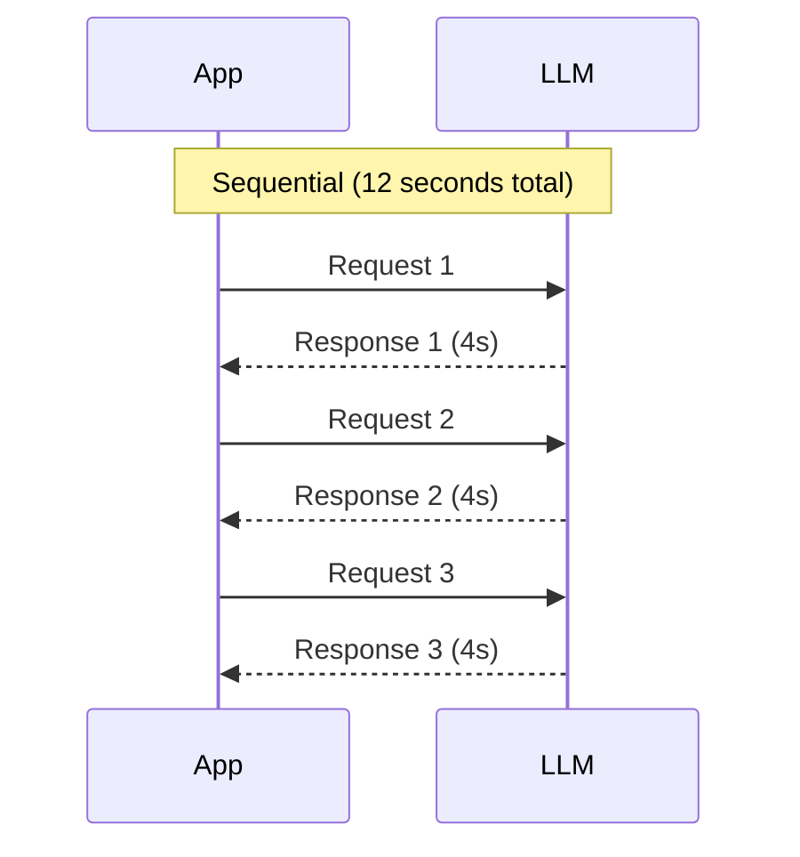
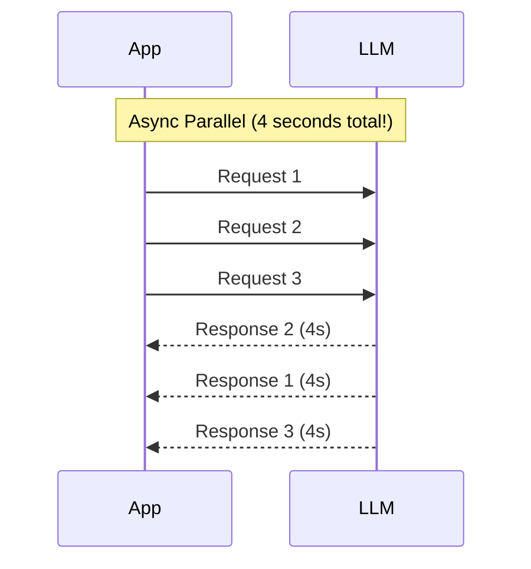
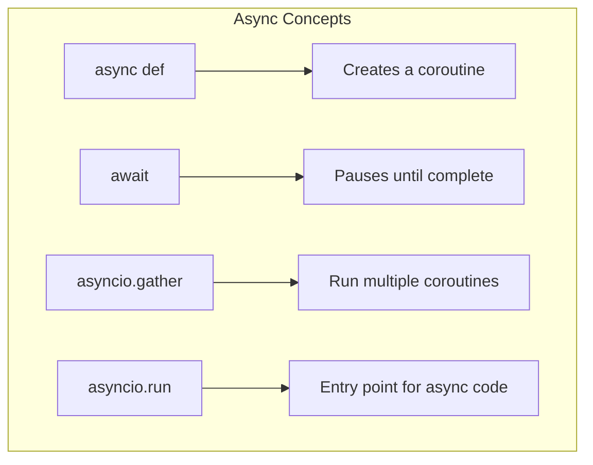
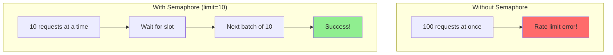

# Handling Asynchronous LLM Calls with asyncio

LLM API calls are slow - typically 1-10 seconds each. When you need to make multiple calls, waiting for each one sequentially is painfully inefficient. Enter **async programming**!

In this guide, you'll learn to make LLM calls blazingly fast using Python's `asyncio`.

> **Coming from Software Engineering?** If you've written async code with aiohttp, asyncpg, or Node.js promises, async LLM calls are exactly the same pattern. The LLM API is just another I/O-bound network call — the same semaphore patterns you use for database connection pools work here for rate limiting.

---

## The Problem: Sequential Calls Are Slow



```python
import time
from openai import OpenAI

client = OpenAI()

def sequential_calls(prompts: list) -> list:
    """Make LLM calls one at a time."""
    results = []
    for prompt in prompts:
        response = client.chat.completions.create(
            model="gpt-4o-mini",
            messages=[{"role": "user", "content": prompt}]
        )
        results.append(response.choices[0].message.content)
    return results

# Timing test
prompts = [
    "What is Python?",
    "What is JavaScript?",
    "What is Rust?"
]

start = time.time()
results = sequential_calls(prompts)
print(f"Sequential time: {time.time() - start:.2f}s")
# Output: Sequential time: ~9-12s (3-4s per call)
```

---

## The Solution: Async Parallel Calls



With async, all requests go out at once and we wait for them together!

---

## Async Basics: A Quick Primer

If you're new to async Python, here's what you need to know:

```python
import asyncio

# Regular function
def normal_function():
    return "I run synchronously"

# Async function (coroutine)
async def async_function():
    return "I can be awaited"

# Using await to call async functions
async def main():
    # await pauses here until async_function completes
    result = await async_function()
    print(result)

# Run the async code
asyncio.run(main())
```

### Key Concepts



---

## Async OpenAI Calls

The OpenAI SDK has a built-in async client:

```python
import asyncio
from openai import AsyncOpenAI

# Use AsyncOpenAI instead of OpenAI
client = AsyncOpenAI()

async def async_chat(prompt: str) -> str:
    """Make an async chat completion request."""
    response = await client.chat.completions.create(
        model="gpt-4o-mini",
        messages=[{"role": "user", "content": prompt}]
    )
    return response.choices[0].message.content

async def main():
    result = await async_chat("What is Python?")
    print(result)

# Run it
asyncio.run(main())
```

### Parallel Calls with asyncio.gather

```python
import asyncio
import time
from openai import AsyncOpenAI

client = AsyncOpenAI()

async def async_chat(prompt: str) -> str:
    """Make an async chat completion request."""
    response = await client.chat.completions.create(
        model="gpt-4o-mini",
        messages=[{"role": "user", "content": prompt}]
    )
    return response.choices[0].message.content

async def parallel_calls(prompts: list) -> list:
    """Make multiple LLM calls in parallel."""
    # Create a list of coroutines
    tasks = [async_chat(prompt) for prompt in prompts]
    # Run them all at once!
    results = await asyncio.gather(*tasks)
    return results

async def main():
    prompts = [
        "What is Python?",
        "What is JavaScript?",
        "What is Rust?",
        "What is Go?",
        "What is TypeScript?"
    ]

    start = time.time()
    results = await parallel_calls(prompts)
    print(f"Parallel time: {time.time() - start:.2f}s")

    for prompt, result in zip(prompts, results):
        print(f"\n{prompt}")
        print(f"Answer: {result[:100]}...")

asyncio.run(main())
# Output: Parallel time: ~3-4s (vs ~15-20s sequential!)
```

---

## Async Anthropic Calls

```python
import asyncio
from anthropic import AsyncAnthropic

client = AsyncAnthropic()

async def async_claude(prompt: str) -> str:
    """Make an async Claude request."""
    response = await client.messages.create(
        model="claude-sonnet-4-5",
        max_tokens=1024,
        messages=[{"role": "user", "content": prompt}]
    )
    return response.content[0].text

async def main():
    prompts = ["Explain async programming", "Explain multithreading", "Explain multiprocessing"]

    tasks = [async_claude(p) for p in prompts]
    results = await asyncio.gather(*tasks)

    for prompt, result in zip(prompts, results):
        print(f"\n{prompt}: {result[:100]}...")

asyncio.run(main())
```

---

## Rate Limiting with Semaphores

APIs have rate limits! Use semaphores to control concurrent requests:



```python
import asyncio
from openai import AsyncOpenAI

client = AsyncOpenAI()

async def rate_limited_chat(
    prompt: str,
    semaphore: asyncio.Semaphore
) -> str:
    """Make an async call with rate limiting."""
    async with semaphore:  # Wait for available slot
        response = await client.chat.completions.create(
            model="gpt-4o-mini",
            messages=[{"role": "user", "content": prompt}]
        )
        return response.choices[0].message.content

async def batch_process(prompts: list, max_concurrent: int = 5) -> list:
    """Process many prompts with controlled concurrency."""
    semaphore = asyncio.Semaphore(max_concurrent)

    tasks = [rate_limited_chat(p, semaphore) for p in prompts]
    results = await asyncio.gather(*tasks)
    return results

async def main():
    # 20 prompts, but only 5 at a time
    prompts = [f"What is fact #{i} about Python?" for i in range(20)]

    results = await batch_process(prompts, max_concurrent=5)
    print(f"Processed {len(results)} prompts")

asyncio.run(main())
```

---

## Error Handling in Async Code

```python
import asyncio
from openai import AsyncOpenAI, APIError, RateLimitError

client = AsyncOpenAI()

async def robust_async_chat(
    prompt: str,
    max_retries: int = 3
) -> str:
    """Async call with retry logic."""
    for attempt in range(max_retries):
        try:
            response = await client.chat.completions.create(
                model="gpt-4o-mini",
                messages=[{"role": "user", "content": prompt}]
            )
            return response.choices[0].message.content

        except RateLimitError:
            wait_time = 2 ** attempt
            print(f"Rate limited, waiting {wait_time}s...")
            await asyncio.sleep(wait_time)

        except APIError as e:
            if attempt < max_retries - 1:
                await asyncio.sleep(1)
            else:
                raise

    raise Exception("Max retries exceeded")

async def safe_gather(prompts: list) -> list:
    """Gather with error handling for individual tasks."""
    tasks = [robust_async_chat(p) for p in prompts]

    # return_exceptions=True means errors don't stop other tasks
    results = await asyncio.gather(*tasks, return_exceptions=True)

    # Process results, handling any errors
    processed = []
    for i, result in enumerate(results):
        if isinstance(result, Exception):
            print(f"Task {i} failed: {result}")
            processed.append(None)
        else:
            processed.append(result)

    return processed

async def main():
    prompts = ["Hello", "World", "How are you?"]
    results = await safe_gather(prompts)
    print(results)

asyncio.run(main())
```

---
