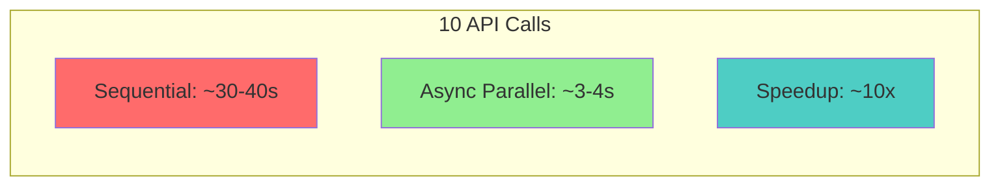
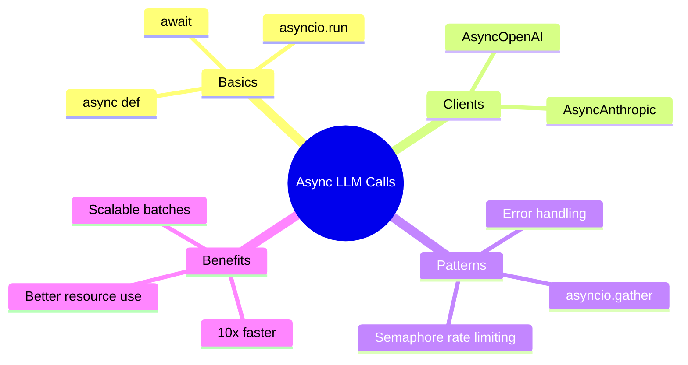

> **Coming from Software Engineering?** Progress tracking for async LLM calls is identical to progress bars in CLI tools or download managers. If you've built job queues with progress reporting (Celery, Bull, Sidekiq), the patterns here — callbacks, completion tracking, aggregation — are directly transferable.

## Progress Tracking

Show progress for long-running batch jobs:

```python
import asyncio
from openai import AsyncOpenAI

client = AsyncOpenAI()

async def chat_with_progress(
    prompt: str,
    index: int,
    total: int,
    progress_callback
) -> str:
    """Make a call and report progress."""
    response = await client.chat.completions.create(
        model="gpt-4o-mini",
        messages=[{"role": "user", "content": prompt}]
    )
    result = response.choices[0].message.content

    # Report progress
    await progress_callback(index, total)

    return result

async def batch_with_progress(prompts: list) -> list:
    """Process prompts with progress updates."""
    total = len(prompts)
    completed = 0
    lock = asyncio.Lock()

    async def update_progress(index: int, total: int):
        nonlocal completed
        async with lock:
            completed += 1
            percent = (completed / total) * 100
            print(f"\rProgress: {completed}/{total} ({percent:.1f}%)", end="", flush=True)

    tasks = [
        chat_with_progress(prompt, i, total, update_progress)
        for i, prompt in enumerate(prompts)
    ]

    results = await asyncio.gather(*tasks)
    print()  # New line after progress
    return results

async def main():
    prompts = [f"Tell me fact #{i} about space" for i in range(10)]
    results = await batch_with_progress(prompts)
    print(f"Completed {len(results)} requests")

asyncio.run(main())
```

---

## Async Context Manager Pattern

For complex applications, use a context manager:

```python
import asyncio
from openai import AsyncOpenAI
from contextlib import asynccontextmanager

class AsyncLLMClient:
    """Managed async LLM client with built-in rate limiting."""

    def __init__(self, max_concurrent: int = 10):
        self.client = AsyncOpenAI()
        self.semaphore = asyncio.Semaphore(max_concurrent)
        self.total_tokens = 0
        self.total_calls = 0

    async def chat(self, prompt: str, **kwargs) -> str:
        """Rate-limited chat completion."""
        async with self.semaphore:
            response = await self.client.chat.completions.create(
                model=kwargs.get("model", "gpt-4o-mini"),
                messages=[{"role": "user", "content": prompt}],
                **{k: v for k, v in kwargs.items() if k != "model"}
            )

            self.total_tokens += response.usage.total_tokens
            self.total_calls += 1

            return response.choices[0].message.content

    async def batch(self, prompts: list, **kwargs) -> list:
        """Process multiple prompts."""
        tasks = [self.chat(p, **kwargs) for p in prompts]
        return await asyncio.gather(*tasks)

    def get_stats(self) -> dict:
        """Get usage statistics."""
        return {
            "total_calls": self.total_calls,
            "total_tokens": self.total_tokens,
            "avg_tokens_per_call": self.total_tokens / max(1, self.total_calls)
        }

@asynccontextmanager
async def create_llm_client(max_concurrent: int = 10):
    """Create a managed LLM client."""
    client = AsyncLLMClient(max_concurrent)
    try:
        yield client
    finally:
        stats = client.get_stats()
        print(f"\nSession stats: {stats}")

async def main():
    async with create_llm_client(max_concurrent=5) as llm:
        # Single call
        result = await llm.chat("What is Python?")
        print(f"Single: {result[:50]}...")

        # Batch call
        prompts = ["What is AI?", "What is ML?", "What is DL?"]
        results = await llm.batch(prompts)
        print(f"Batch: Got {len(results)} results")

asyncio.run(main())
```

---

## Performance Comparison



```python
import asyncio
import time
from openai import OpenAI, AsyncOpenAI

sync_client = OpenAI()
async_client = AsyncOpenAI()

def benchmark_sequential(prompts: list) -> float:
    """Benchmark sequential calls."""
    start = time.time()
    for prompt in prompts:
        sync_client.chat.completions.create(
            model="gpt-4o-mini",
            messages=[{"role": "user", "content": prompt}]
        )
    return time.time() - start

async def benchmark_async(prompts: list) -> float:
    """Benchmark async parallel calls."""
    start = time.time()

    async def single_call(prompt):
        return await async_client.chat.completions.create(
            model="gpt-4o-mini",
            messages=[{"role": "user", "content": prompt}]
        )

    await asyncio.gather(*[single_call(p) for p in prompts])
    return time.time() - start

async def run_benchmark():
    prompts = [f"Say hello in language #{i}" for i in range(10)]

    # Sequential
    seq_time = benchmark_sequential(prompts)
    print(f"Sequential: {seq_time:.2f}s")

    # Async
    async_time = await benchmark_async(prompts)
    print(f"Async: {async_time:.2f}s")

    print(f"Speedup: {seq_time/async_time:.1f}x faster!")

asyncio.run(run_benchmark())
```

---

## Summary



---

## Quick Reference

```python
# Async OpenAI Template
import asyncio
from openai import AsyncOpenAI

client = AsyncOpenAI()

async def batch_process(prompts):
    async def single(p):
        r = await client.chat.completions.create(
            model="gpt-4o-mini",
            messages=[{"role": "user", "content": p}]
        )
        return r.choices[0].message.content

    return await asyncio.gather(*[single(p) for p in prompts])

results = asyncio.run(batch_process(["Q1", "Q2", "Q3"]))
```

---

## Exercises

1. **Benchmark**: Compare sequential vs async for 5, 10, and 20 prompts. Plot the results.

2. **Rate Limiter**: Implement a token bucket rate limiter for API calls.

3. **Progress Bar**: Integrate `tqdm` for a nice progress bar during batch processing.

---

## What's Next?

You can now make fast, parallel API calls! Next, let's learn about **Streaming Responses** - getting real-time output as the LLM generates text!
