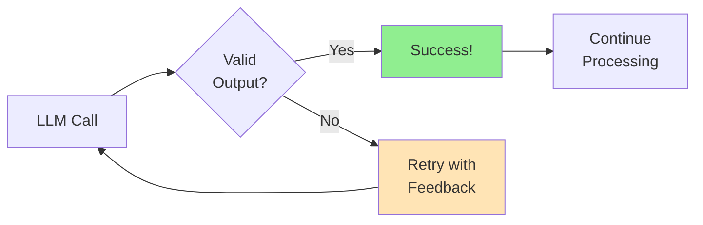
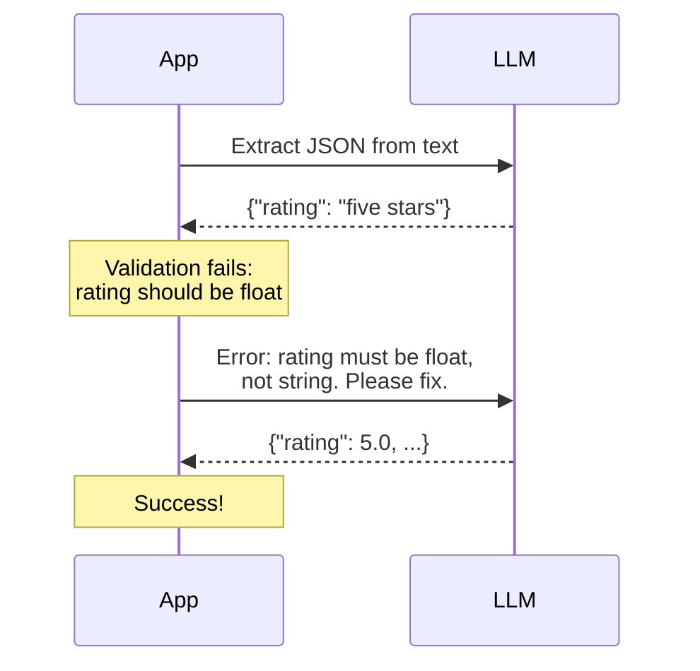
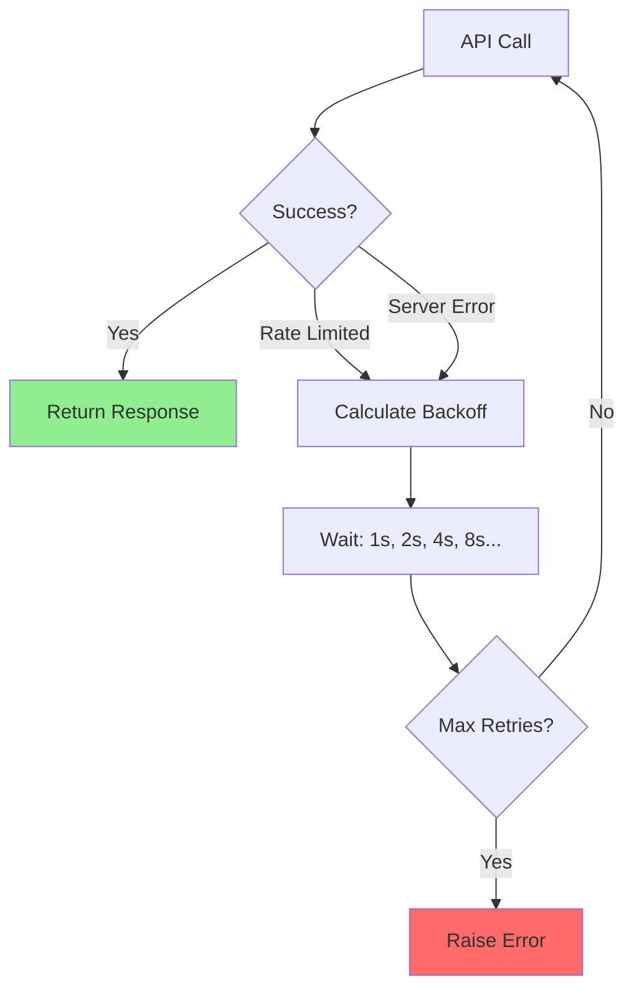
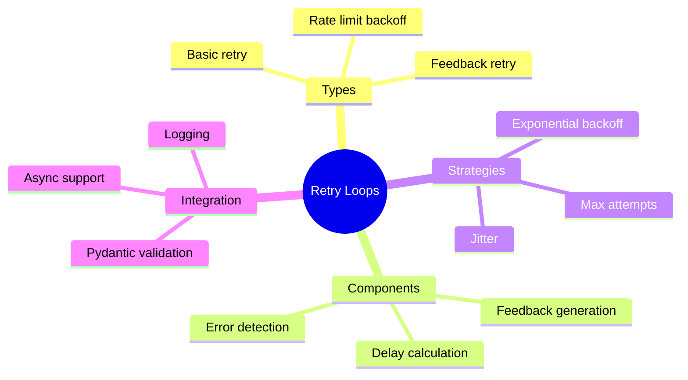

# Building Retry Loops for LLM Output Errors

Even with the best prompts and JSON modes, LLMs sometimes produce invalid output. A production-ready system needs **intelligent retry logic** that can recover from errors, provide feedback to the LLM, and eventually succeed.

> **Coming from Software Engineering?** Retry loops for LLMs are identical to retry patterns for any flaky external service — the same exponential backoff, jitter, and max-retries patterns from your HTTP client libraries (requests, axios) apply. The one new thing vs. a normal HTTP 500: an LLM can be *told what it got wrong* and corrected on the next turn. Production retry systems follow the exact same patterns as circuit breakers in microservices (Hystrix, resilience4j, Polly). If you've implemented retry policies for database connections or API calls, this will feel like home — just with token costs as an additional concern.

---

## Why Retry Loops Matter



### Common Failure Scenarios

| Scenario | Example | Recovery Strategy |
|----------|---------|-------------------|
| Invalid JSON | `{name: "John"}` | Clean and repair |
| Missing fields | `{"name": "John"}` (missing age) | Ask to complete |
| Wrong types | `{"age": "thirty"}` | Ask for correction |
| Schema mismatch | Extra/wrong fields | Provide specific feedback |
| Rate limiting | API 429 error | Exponential backoff |

---

## Basic Retry Pattern

```python
# script_id: day_016_retry_loops/basic_retry_pattern
from openai import OpenAI
from pydantic import BaseModel, ValidationError
import json
import time

client = OpenAI()

class UserInfo(BaseModel):
    name: str
    age: int
    email: str

def extract_with_retry(
    text: str,
    max_retries: int = 3
) -> UserInfo | None:
    """Extract user info with basic retry logic."""

    schema = UserInfo.model_json_schema()
    last_error = None

    for attempt in range(max_retries):
        try:
            response = client.chat.completions.create(
                model="gpt-4o-mini",
                messages=[
                    {
                        "role": "user",
                        "content": f"""Extract user info as JSON:
Schema: {json.dumps(schema)}
Text: {text}
Return only JSON."""
                    }
                ],
                temperature=0,  # most predictable, least-random output (Day 9) — note a blind retry can re-emit the SAME wrong answer, which is why feedback retry below changes the prompt instead of just re-rolling
                response_format={"type": "json_object"}  # JSON mode — forces a parseable JSON reply (Day 14)
            )

            data = json.loads(response.choices[0].message.content)
            return UserInfo(**data)

        except json.JSONDecodeError as e:
            last_error = f"JSON parse error: {e}"
        except ValidationError as e:
            last_error = f"Validation error: {e}"
        except Exception as e:
            last_error = f"Unexpected error: {e}"

        print(f"Attempt {attempt + 1} failed: {last_error}")
        time.sleep(1)  # Brief pause between retries

    print(f"All {max_retries} attempts failed")
    return None

# Usage
result = extract_with_retry("Contact John Doe, age 30, at john@email.com")
if result:
    print(f"Success: {result}")
```

---

## Intelligent Retry with Feedback

The real power comes from telling the LLM what went wrong:

(See the round-trip in the diagram below: the model first returns `{"rating": "five stars"}`, we feed the error back, and it returns `{"rating": 5.0}`.)

```python
# script_id: day_016_retry_loops/feedback_retry
from openai import OpenAI
from pydantic import BaseModel, ValidationError
import json

client = OpenAI()

class ProductReview(BaseModel):
    product_name: str
    rating: float  # 1-5
    sentiment: str  # positive, negative, neutral
    summary: str

def extract_with_feedback(
    text: str,
    max_retries: int = 3
) -> ProductReview | None:
    """Extract with error feedback to LLM."""

    schema = ProductReview.model_json_schema()
    content = None

    messages = [
        {
            "role": "system",
            "content": """You are a JSON extraction assistant.
Extract information and return valid JSON matching the schema.
If you receive error feedback, correct your response accordingly."""
        },
        {
            "role": "user",
            "content": f"""Extract product review info from this text.

Schema: {json.dumps(schema, indent=2)}

Text: {text}

Return only valid JSON."""
        }
    ]

    for attempt in range(max_retries):
        try:
            response = client.chat.completions.create(
                model="gpt-4o-mini",
                messages=messages,
                temperature=0,
                response_format={"type": "json_object"}
            )

            content = response.choices[0].message.content
            data = json.loads(content)
            result = ProductReview(**data)

            print(f"Success on attempt {attempt + 1}")
            return result

        except json.JSONDecodeError as e:
            error_feedback = f"JSON parsing failed: {e}. Please return valid JSON."

        except ValidationError as e:
            # Create detailed error feedback
            errors = e.errors()
            error_details = []
            for err in errors:
                field = ".".join(str(x) for x in err["loc"])
                error_details.append(f"- {field}: {err['msg']}")

            error_feedback = f"""Validation failed with these errors:
{chr(10).join(error_details)}

Please fix these issues and return corrected JSON."""

        # Add the failed response and error to conversation
        messages.append({
            "role": "assistant",
            "content": content if content is not None else "Invalid response"
        })
        messages.append({
            "role": "user",
            "content": error_feedback
        })

        print(f"Attempt {attempt + 1} failed, providing feedback...")

    return None

# Test with challenging input
review_text = """
OMG this phone is AMAZING!!! Battery lasts forever, camera is insane.
Definitely 5 stars, would buy again!!! Best purchase of 2024!
"""

result = extract_with_feedback(review_text)
if result:
    print(f"\nExtracted: {result.model_dump_json(indent=2)}")
```



---

## Exponential Backoff for Rate Limits

```python
# script_id: day_016_retry_loops/exponential_backoff
from openai import OpenAI, RateLimitError, APIStatusError, APIConnectionError
import time
import random

client = OpenAI()

def call_with_backoff(
    messages: list,
    max_retries: int = 5,
    base_delay: float = 1.0
) -> str:
    """Make API call with exponential backoff for rate limits."""

    for attempt in range(max_retries):
        try:
            response = client.chat.completions.create(
                model="gpt-4o-mini",
                messages=messages
            )
            return response.choices[0].message.content

        except RateLimitError as e:
            if attempt == max_retries - 1:
                raise

            # Exponential backoff with jitter
            delay = base_delay * (2 ** attempt) + random.uniform(0, 1)
            print(f"Rate limited. Waiting {delay:.2f}s... (Attempt {attempt + 1})")
            time.sleep(delay)

        except APIStatusError as e:
            if e.status_code >= 500:  # Server error, might be temporary
                delay = base_delay * (2 ** attempt)
                print(f"Server error. Waiting {delay:.2f}s...")
                time.sleep(delay)
            else:
                raise  # Client error, don't retry

        except APIConnectionError as e:
            # Connection/timeout errors carry no status and are inherently retryable
            delay = base_delay * (2 ** attempt)
            print(f"Connection error. Waiting {delay:.2f}s...")
            time.sleep(delay)

    raise Exception("Max retries exceeded")

# Usage
result = call_with_backoff([{"role": "user", "content": "Hello"}])
```



---

## Complete Production Retry System

Here's a fully-featured retry system:

Note the two tiers of retry here: the inner loop in `_call_api` handles transient rate-limit/transport hiccups on a single call, while the outer loop in `extract()` re-prompts with feedback when the *content* itself is wrong. The retry logic lives in that `extract()` for-loop; the `_handle_*` and `_add_*_feedback` helpers are familiar SWE plumbing (backoff math, building the feedback message) — skim them.

```python
# script_id: day_016_retry_loops/production_retry_system
from openai import OpenAI, RateLimitError, APIError, APIConnectionError
from pydantic import BaseModel, ValidationError
from typing import TypeVar, Type, Callable, Any
from dataclasses import dataclass
import json
import time
import random
import logging

# Setup logging
logging.basicConfig(level=logging.INFO)
logger = logging.getLogger(__name__)

client = OpenAI()
T = TypeVar('T', bound=BaseModel)

@dataclass
class RetryConfig:
    """Configuration for retry behavior."""
    max_retries: int = 3
    base_delay: float = 1.0
    max_delay: float = 60.0
    exponential_base: float = 2.0
    jitter: bool = True
    retry_on_validation_error: bool = True

@dataclass
class RetryResult:
    """Result of a retry operation."""
    success: bool
    data: Any = None
    attempts: int = 0
    errors: list = None

class SmartRetry:
    """Smart retry system for LLM calls with Pydantic validation."""

    def __init__(self, config: RetryConfig = None):
        self.config = config or RetryConfig()

    def extract(
        self,
        text: str,
        schema: Type[T],
        system_prompt: str = None
    ) -> RetryResult:
        """Extract structured data with smart retries."""

        json_schema = schema.model_json_schema()
        errors = []

        messages = self._build_initial_messages(text, json_schema, system_prompt)

        for attempt in range(self.config.max_retries):
            logger.info(f"Attempt {attempt + 1}/{self.config.max_retries}")

            try:
                # Make API call with rate limit handling
                response = self._call_api(messages)
                content = response.choices[0].message.content

                # Parse JSON
                data = json.loads(content)

                # Validate with Pydantic
                result = schema(**data)

                return RetryResult(
                    success=True,
                    data=result,
                    attempts=attempt + 1,
                    errors=errors
                )

            except RateLimitError as e:
                error_info = self._handle_rate_limit(attempt, e)
                errors.append(error_info)

            except APIConnectionError as e:
                error_info = self._handle_connection_error(attempt, e)
                errors.append(error_info)

            except json.JSONDecodeError as e:
                error_info = {"type": "json_error", "message": str(e)}
                errors.append(error_info)

                # Add feedback for JSON errors
                messages = self._add_json_error_feedback(messages, content, e)

            except ValidationError as e:
                error_info = {"type": "validation_error", "details": e.errors()}
                errors.append(error_info)

                if not self.config.retry_on_validation_error:
                    break

                # Add feedback for validation errors
                messages = self._add_validation_feedback(messages, content, e)

        return RetryResult(
            success=False,
            attempts=self.config.max_retries,
            errors=errors
        )

    def _build_initial_messages(
        self,
        text: str,
        schema: dict,
        system_prompt: str
    ) -> list:
        """Build initial message list."""
        system = system_prompt or """You are a precise JSON extraction assistant.
Extract information and return valid JSON matching the provided schema.
If you receive error feedback, carefully correct your response."""

        return [
            {"role": "system", "content": system},
            {
                "role": "user",
                "content": f"""Extract information from the following text.

Schema:
{json.dumps(schema, indent=2)}

Text:
{text}

Return only valid JSON matching the schema."""
            }
        ]

    def _call_api(self, messages: list):
        """Make API call with rate limit retry."""
        for rate_attempt in range(3):  # Inner retry for rate limits
            try:
                return client.chat.completions.create(
                    model="gpt-4o-mini",
                    messages=messages,
                    temperature=0,
                    response_format={"type": "json_object"}
                )
            except RateLimitError:
                delay = self._calculate_delay(rate_attempt)
                logger.warning(f"Rate limited, waiting {delay:.2f}s")
                time.sleep(delay)
        # Note: don't re-raise openai.RateLimitError directly — its constructor
        # requires an httpx response object, so RateLimitError("...") would itself
        # raise a TypeError. Use a plain exception to signal exhaustion.
        raise RuntimeError("Rate limit retry exhausted after 3 attempts")

    def _calculate_delay(self, attempt: int) -> float:
        """Calculate delay with exponential backoff and jitter."""
        delay = self.config.base_delay * (self.config.exponential_base ** attempt)
        delay = min(delay, self.config.max_delay)

        if self.config.jitter:
            delay += random.uniform(0, delay * 0.1)

        return delay

    def _handle_rate_limit(self, attempt: int, error) -> dict:
        """Handle rate limit error."""
        delay = self._calculate_delay(attempt)
        logger.warning(f"Rate limited. Waiting {delay:.2f}s")
        time.sleep(delay)
        return {"type": "rate_limit", "delay": delay}

    def _handle_connection_error(self, attempt: int, error) -> dict:
        """Handle connection error."""
        delay = min(5, self.config.base_delay * (attempt + 1))
        logger.warning(f"Connection error. Waiting {delay:.2f}s")
        time.sleep(delay)
        return {"type": "connection_error", "message": str(error)}

    def _add_json_error_feedback(
        self,
        messages: list,
        content: str,
        error: json.JSONDecodeError
    ) -> list:
        """Add feedback for JSON parsing errors."""
        messages.append({"role": "assistant", "content": content})
        messages.append({
            "role": "user",
            "content": f"""Your response was not valid JSON.
Error: {error}

Please return ONLY valid JSON with no additional text or formatting."""
        })
        return messages

    def _add_validation_feedback(
        self,
        messages: list,
        content: str,
        error: ValidationError
    ) -> list:
        """Add feedback for validation errors."""
        error_details = []
        for err in error.errors():
            loc = ".".join(str(x) for x in err["loc"])
            error_details.append(f"- Field '{loc}': {err['msg']} (got: {err.get('input', 'N/A')})")

        messages.append({"role": "assistant", "content": content})
        messages.append({
            "role": "user",
            "content": f"""The JSON has validation errors:

{chr(10).join(error_details)}

Please fix these specific issues and return corrected JSON."""
        })
        return messages

# Usage Example
class OrderInfo(BaseModel):
    customer_name: str
    items: list[str]
    total: float
    shipping_address: str

retry_system = SmartRetry(RetryConfig(
    max_retries=3,
    retry_on_validation_error=True
))

order_text = """
Order from John Smith
Items: 2x Widget ($10 each), 1x Gadget ($25)
Ship to: 123 Main St, Boston MA
Total: $45.00
"""

result = retry_system.extract(order_text, OrderInfo)

if result.success:
    print(f"Extracted in {result.attempts} attempt(s):")
    print(result.data.model_dump_json(indent=2))
else:
    print(f"Failed after {result.attempts} attempts")
    print(f"Errors: {result.errors}")
```

---

## Async Retry System

For high-throughput applications:

```python
# script_id: day_016_retry_loops/async_retry_system
import asyncio
from openai import AsyncOpenAI
from pydantic import BaseModel, ValidationError
import json

async_client = AsyncOpenAI()

async def extract_with_async_retry(
    text: str,
    schema_class: type[BaseModel],
    max_retries: int = 3
) -> BaseModel | None:
    """Async extraction with retry."""

    schema = schema_class.model_json_schema()
    messages = [
        {"role": "user", "content": f"Extract as JSON matching: {json.dumps(schema)}\n\nText: {text}"}
    ]

    for attempt in range(max_retries):
        try:
            response = await async_client.chat.completions.create(
                model="gpt-4o-mini",
                messages=messages,
                temperature=0,
                response_format={"type": "json_object"}
            )

            data = json.loads(response.choices[0].message.content)
            return schema_class(**data)

        except (json.JSONDecodeError, ValidationError) as e:
            print(f"Async attempt {attempt + 1} failed: {e}")
            if attempt < max_retries - 1:
                messages.append({
                    "role": "assistant",
                    "content": response.choices[0].message.content
                })
                messages.append({
                    "role": "user",
                    "content": f"Error: {e}. Please fix and return valid JSON."
                })
                await asyncio.sleep(1)

    return None

# Batch processing with retries
async def batch_extract(
    texts: list[str],
    schema_class: type[BaseModel],
    max_concurrent: int = 5
) -> list:
    """Process multiple texts concurrently with retry."""

    semaphore = asyncio.Semaphore(max_concurrent)

    async def process_one(text: str):
        async with semaphore:
            return await extract_with_async_retry(text, schema_class)

    tasks = [process_one(text) for text in texts]
    return await asyncio.gather(*tasks)

# Usage
class Person(BaseModel):
    name: str
    age: int

async def main():
    texts = [
        "John is 30 years old",
        "Sarah, age 25",
        "Mike (45)"
    ]

    results = await batch_extract(texts, Person)
    for text, result in zip(texts, results):
        print(f"{text} -> {result}")

asyncio.run(main())
```

---

## Checkpoint

Run the `SmartRetry`/feedback-retry example against an input the model first gets wrong and confirm: it logs the failed attempt, feeds the validation error back into the next prompt, and eventually returns a valid object with `attempts > 1`. If it gives up immediately or loops forever, check that you're retrying only on `ValidationError` (not on every exception) and that `max_retries` is finite.

---

## Summary



---

## Quick Reference

```python
# script_id: day_016_retry_loops/quick_reference
# Basic retry pattern
for attempt in range(max_retries):
    try:
        result = make_call()
        return result
    except Exception as e:
        if attempt == max_retries - 1:
            raise
        time.sleep(2 ** attempt)  # Exponential backoff

# With feedback
messages.append({"role": "assistant", "content": bad_response})
messages.append({"role": "user", "content": f"Error: {e}. Please fix."})
```

---

## Exercises

1. **Retry Dashboard**: Build a system that tracks retry statistics (success rate, average attempts, common errors)

2. **Adaptive Retry**: Create a retry system that adjusts its strategy based on error patterns

3. **Circuit Breaker**: Implement a circuit breaker that stops retrying after too many failures

<details>
<summary>Solutions (approaches)</summary>

1. **Retry Dashboard**: Wrap each call in a counter that records attempts, final outcome, and error type, then aggregate across runs into a success rate and mean attempts-per-success. A simple dict keyed by error type plus a running total is enough.

2. **Adaptive Retry**: Key the backoff/feedback strategy off the error type you're seeing — e.g. lengthen the backoff after repeated `RateLimitError`s, and send stronger, more explicit feedback after repeated `ValidationError`s. Track the last few error types and branch on them.

3. **Circuit Breaker**: Track consecutive failures; once they exceed N, "open" the circuit and reject calls fast (raise immediately) instead of hitting the API. After a cooldown, go "half-open" and let one call through to test recovery — close the circuit on success, re-open on failure.

</details>

---

## Phase 1 is almost done

You can now:
- Turn text into tokens and reason about cost
- Prompt effectively (few-shot, chain-of-thought, system prompts)
- Use the SDKs (sync, async, streaming)
- Get reliable structured output (Pydantic, JSON mode, retries)

Two foundations days remain: **DSPy** (Day 17) and the Phase 1 capstone (Day 18).

---

## What's Next?

Tomorrow (Day 17) is **DSPy — Programmatic Prompt Optimization** — instead of hand-tuning prompt strings, you'll declare input/output signatures and let an optimizer compile the prompt for you, turning the retry-and-tweak loop you just learned into a data-driven process. After that comes the Phase 1 capstone (Day 18).
