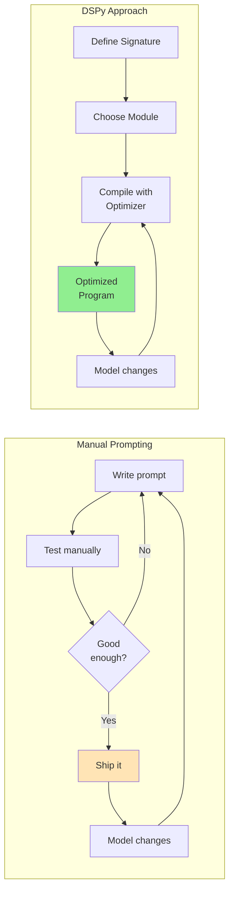
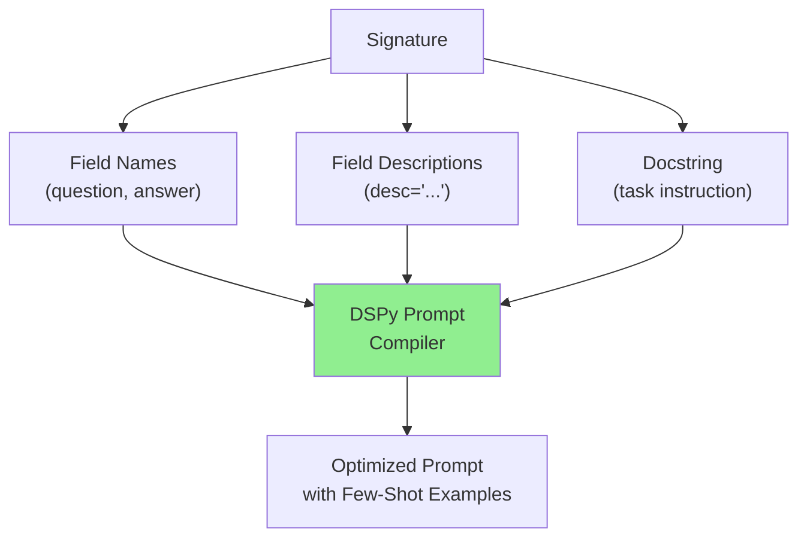
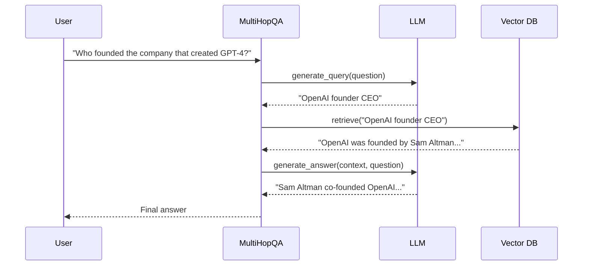
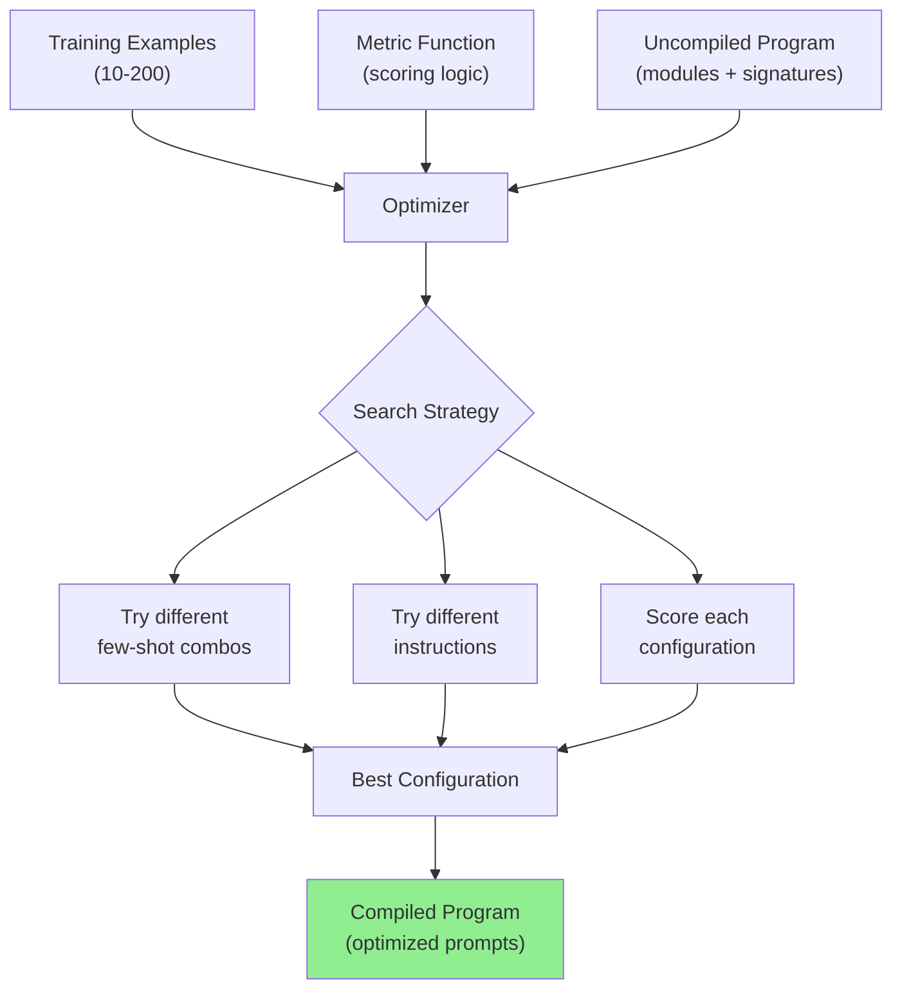
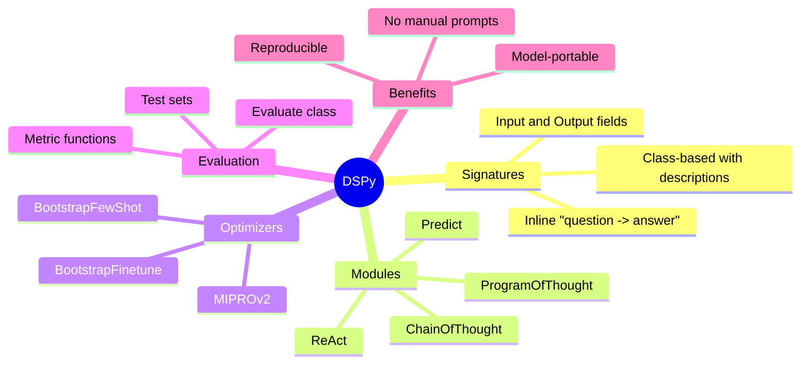

# DSPy -- Programmatic Prompt Optimization

Manual prompt engineering is fragile, tedious, and doesn't scale. Every time you tweak a prompt, you're guessing. **DSPy** replaces this guesswork with a programmatic framework: you declare *what* you want (signatures), compose *how* it flows (modules), and let a **compiler** optimize the actual prompts automatically.

> **Coming from Software Engineering?** DSPy is like a compiler for prompts -- you write the spec, it generates the optimized implementation. Think of it as the difference between writing assembly by hand vs. writing C and letting GCC optimize. You declare intent with type signatures, compose modules like functions, and the compiler (optimizer) searches for the best few-shot examples and instructions. If you've used SQLAlchemy (declare schema, engine generates SQL), DSPy follows the same philosophy.

---

## Why DSPy?



### The Core Problem with Manual Prompting

| Aspect | Manual Prompting | DSPy |
|--------|-----------------|------|
| Optimization | Trial and error | Systematic search |
| Portability | Tied to one model | Recompile for new model |
| Reproducibility | Copy-paste prompts | Version-controlled code |
| Few-shot examples | Hand-picked | Automatically selected |
| Maintenance | Rewrite on model change | Recompile |

---

## Signatures: Declaring Input/Output Specs

A **signature** is a concise declaration of what a module should do -- its inputs and outputs:

```python
# script_id: day_017_dspy/inline_signature
import dspy

# DSPy uses litellm-style "provider/model" IDs (e.g. openai/...), distinct from the bare IDs used when calling SDKs directly.
lm = dspy.LM("openai/gpt-4o-mini")
dspy.configure(lm=lm)

# Simple inline signature: "input_field -> output_field"
# This tells DSPy: take a sentence, produce a sentiment label.
classify = dspy.Predict("sentence -> sentiment")

result = classify(sentence="DSPy makes prompt engineering obsolete!")
print(result.sentiment)  # "positive"
```

### Class-Based Signatures for More Control

```python
# script_id: day_017_dspy/class_based_signature
import dspy

class FactCheck(dspy.Signature):
    """Verify whether a claim is supported by the provided context."""

    context: str = dspy.InputField(desc="Reference text with known facts")
    claim: str = dspy.InputField(desc="The claim to verify")
    verdict: str = dspy.OutputField(desc="'supported', 'refuted', or 'not enough info'")
    evidence: str = dspy.OutputField(desc="Quote from context supporting the verdict")

# DSPy uses the docstring, field names, and descriptions
# to automatically construct the optimal prompt
```



---

## Modules: Composing Behavior

Modules wrap signatures with specific prompting strategies:

```python
# script_id: day_017_dspy/modules_predict_cot
import dspy

# Configure the language model
lm = dspy.LM("openai/gpt-4o-mini")
dspy.configure(lm=lm)

# Predict: basic prompt, no reasoning
basic_qa = dspy.Predict("question -> answer")

# ChainOfThought: adds step-by-step reasoning automatically
cot_qa = dspy.ChainOfThought("question -> answer")

# Both have the same signature, but ChainOfThought
# adds a "reasoning" field internally before producing the answer
result = cot_qa(question="What is 15% of 240?")
print(result.reasoning)  # "15% means 15/100. 15/100 * 240 = 36"
print(result.answer)     # "36"
```

### Building a Multi-Step Program

```python
# script_id: day_017_dspy/multi_hop_qa
import dspy

class MultiHopQA(dspy.Module):
    """Answer questions that require multiple reasoning steps."""

    def __init__(self):
        super().__init__()  # good practice: initialize the dspy.Module base
        # Each sub-module handles one step
        self.generate_query = dspy.ChainOfThought(
            "question -> search_query"
        )
        self.generate_answer = dspy.ChainOfThought(
            "context, question -> answer"
        )

    def forward(self, question: str) -> dspy.Prediction:
        # Step 1: Generate a search query from the question
        query_result = self.generate_query(question=question)

        # Step 2: Retrieve context (using a DSPy retriever or custom function)
        context = self.retrieve(query_result.search_query)

        # Step 3: Generate answer from retrieved context
        answer_result = self.generate_answer(
            context=context,
            question=question
        )
        return answer_result

    def retrieve(self, query: str) -> str:
        # Placeholder -- plug in your vector DB here
        return f"Retrieved context for: {query}"

# Usage
program = MultiHopQA()
result = program(question="Who founded the company that created GPT-4?")
print(result.answer)
```



---

## Optimizers (Compilers): Automatic Prompt Tuning

Optimizers search for the best prompts, few-shot examples, and instructions:

```python
# script_id: day_017_dspy/optimizer_and_evaluator
import dspy

# 1. Define your program
qa = dspy.ChainOfThought("question -> answer")

# 2. Prepare training examples
trainset = [
    dspy.Example(
        question="What is the capital of France?",
        answer="Paris"
    # .with_inputs marks which fields the model sees; the rest (answer) are the expected output used only for scoring
    ).with_inputs("question"),
    dspy.Example(
        question="Who wrote Romeo and Juliet?",
        answer="William Shakespeare"
    ).with_inputs("question"),
    # ... more examples (10-200 is typical)
]

# 3. Define a metric: how to score predictions
# trace=None is passed by optimizers; keep the param even if you don't use it
def exact_match(example, prediction, trace=None):
    return example.answer.lower() == prediction.answer.lower()

# 4. Compile with BootstrapFewShot
optimizer = dspy.BootstrapFewShot(
    metric=exact_match,
    max_bootstrapped_demos=4,  # Max few-shot examples to include
    max_labeled_demos=4
)

# This runs your program on training data, finds the best
# few-shot examples, and bakes them into the prompt
compiled_qa = optimizer.compile(qa, trainset=trainset)

# 5. Use the compiled (optimized) program
result = compiled_qa(question="What is the capital of Japan?")
print(result.answer)  # "Tokyo"
```

BootstrapFewShot runs your program on the training questions, checks each output against the known answer using your metric, and keeps the runs that passed. Those successful runs — the model's own correct reasoning traces — become the worked examples it pastes into the prompt. So you supply the answers; DSPy figures out which fully-worked demonstrations teach the model best.

### Optimizer Comparison

| Optimizer | Strategy | Best For | Cost |
|-----------|----------|----------|------|
| `BootstrapFewShot` | Selects best few-shot demos | Quick optimization, small datasets | Low |
| `BootstrapFewShotWithRandomSearch` | Random search over demo sets | Better quality, more exploration | Medium |
| `MIPROv2` | Optimizes instructions + demos jointly | Maximum quality, larger datasets | High |
| `BootstrapFinetune` | Generates data, then finetunes the model (= retrains the model itself on your data; covered in Phase 6, Day 74) — use only when you need a smaller/cheaper model | When you need a smaller/cheaper model | Very High |



---

## Evaluators: Measuring Quality

```python
# script_id: day_017_dspy/optimizer_and_evaluator
import dspy
from dspy.evaluate import Evaluate

# Your compiled program
compiled_qa = ...  # from optimizer step above

# Held-out test set (never seen during compilation)
testset = [
    dspy.Example(
        question="What is the largest planet?",
        answer="Jupiter"
    ).with_inputs("question"),
    dspy.Example(
        question="Who painted the Mona Lisa?",
        answer="Leonardo da Vinci"
    ).with_inputs("question"),
]

# Define evaluation metric
def fuzzy_match(example, prediction, trace=None):
    """Check if the expected answer appears in the prediction."""
    return example.answer.lower() in prediction.answer.lower()

# Run evaluation
evaluator = Evaluate(
    devset=testset,
    metric=fuzzy_match,
    num_threads=4,
    display_progress=True
)

score = evaluator(compiled_qa)
# Evaluate returns an EvaluationResult; .score is the float percentage
print(f"Accuracy: {score.score}%")
```

---

## Manual Prompting vs DSPy: Side by Side

```python
# script_id: day_017_dspy/manual_vs_dspy_comparison
# fragment: illustrative side-by-side using externally-defined client/exact_match/train_data
# ---- MANUAL APPROACH ----
# Fragile, model-specific, hard to maintain

def classify_manual(text: str) -> str:
    response = client.chat.completions.create(
        model="gpt-4o-mini",
        messages=[
            {"role": "system", "content": """You are a sentiment classifier.
Classify the sentiment as positive, negative, or neutral.
Here are some examples:
- "I love this!" -> positive
- "This is terrible" -> negative
- "It's okay I guess" -> neutral
Return ONLY the sentiment label."""},
            {"role": "user", "content": text}
        ]
    )
    return response.choices[0].message.content.strip()


# ---- DSPy APPROACH ----
# Declarative, portable, auto-optimized

class SentimentClassifier(dspy.Module):
    def __init__(self):
        super().__init__()  # good practice: initialize the dspy.Module base
        self.classify = dspy.Predict(
            "text -> sentiment: str"  # That's it. No prompt needed.
        )

    def forward(self, text: str):
        return self.classify(text=text)

# Compile with examples -- DSPy finds optimal few-shot demos
optimizer = dspy.BootstrapFewShot(metric=exact_match)
classifier = optimizer.compile(SentimentClassifier(), trainset=train_data)

# Switch models? Just recompile.
dspy.configure(lm=dspy.LM("anthropic/claude-sonnet-4-6"))
classifier_claude = optimizer.compile(SentimentClassifier(), trainset=train_data)
```

---

## Checkpoint

Run the optimizer-and-evaluator example and confirm: the compiled module scores higher on your eval set than the same module before optimization — DSPy earned that lift by tuning the prompt for you, not by you hand-editing it. If the score doesn't move, check that you configured `dspy.configure(lm=...)` with a working model and that your metric function actually returns a comparable value rather than always `True`.

---

## Summary



---

## Quick Reference

```python
# script_id: day_017_dspy/quick_reference
import dspy

# Configure LM
dspy.configure(lm=dspy.LM("openai/gpt-4o-mini"))

# Inline signature
predict = dspy.Predict("question -> answer")

# Chain of thought
cot = dspy.ChainOfThought("question -> answer")

# Compile with optimizer
optimizer = dspy.BootstrapFewShot(metric=my_metric)
compiled = optimizer.compile(my_module, trainset=examples)

# Evaluate
from dspy.evaluate import Evaluate
score = Evaluate(devset=testset, metric=my_metric)(compiled)
```

---

## Exercises

1. **Signature Explorer**: Define three different DSPy signatures (summarization, translation, entity extraction) and compare `Predict` vs `ChainOfThought` outputs for each

<details>
<summary>Solution</summary>

```python
import dspy
dspy.configure(lm=dspy.LM("openai/gpt-4o-mini"))

summarize = "document -> summary"
translate = "english_text -> french_text"
extract   = "text -> entities: list[str]"

for sig in (summarize, translate, extract):
    fast = dspy.Predict(sig)        # answer only
    slow = dspy.ChainOfThought(sig) # adds a reasoning field first
    # Predict is cheaper/faster; ChainOfThought tends to be more accurate
    # on multi-step tasks because it reasons before answering.
```

</details>

2. **Optimizer Showdown**: Take a classification task with 20+ examples, compile with `BootstrapFewShot` and `BootstrapFewShotWithRandomSearch`, and compare accuracy on a held-out test set

<details>
<summary>Solution</summary>

```python
import dspy
from dspy.evaluate import Evaluate

program = dspy.Predict("text -> label")

def acc(example, prediction, trace=None):
    return example.label.lower() == prediction.label.lower()

evaluator = Evaluate(devset=testset, metric=acc, num_threads=4)

for OptCls in (dspy.BootstrapFewShot, dspy.BootstrapFewShotWithRandomSearch):
    compiled = OptCls(metric=acc).compile(program, trainset=trainset)
    score = evaluator(compiled)
    print(f"{OptCls.__name__}: {score.score}%")  # .score is the float percentage
```

</details>

3. **Model Portability**: Build a DSPy program, compile it for GPT-4o-mini, then recompile for Claude Sonnet -- measure how accuracy changes without touching any prompt text

<details>
<summary>Solution</summary>

```python
import dspy
from dspy.evaluate import Evaluate

program = dspy.ChainOfThought("question -> answer")
optimizer = dspy.BootstrapFewShot(metric=exact_match)
evaluator = Evaluate(devset=testset, metric=exact_match, num_threads=4)

for model in ("openai/gpt-4o-mini", "anthropic/claude-sonnet-4-6"):
    dspy.configure(lm=dspy.LM(model))   # switch models, no prompt edits
    compiled = optimizer.compile(program, trainset=trainset)
    print(f"{model}: {evaluator(compiled).score}%")
```

</details>

---

## What's Next?

You've covered the core LLM foundations toolkit! Next, we build a **Capstone Data Extraction Pipeline** — putting everything from Phase 1 into a complete project. Then on to Phase 2: **Embeddings** — learning how to represent text as vectors that capture meaning!
