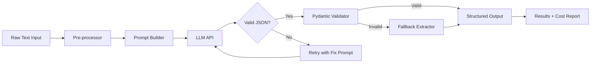
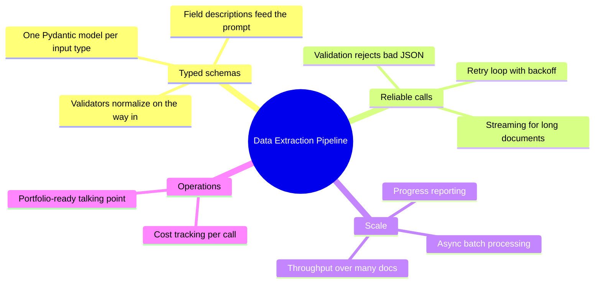

# Capstone — Build a Structured Data Extraction Pipeline

You've spent the last 20 days learning the fundamentals: how LLMs work, how to call APIs, how to write prompts that don't embarrass you, and how to force structured output using Pydantic. Today you put it all together.

> **Coming from Software Engineering?** This capstone is basically an ETL pipeline where the "Transform" step is an LLM instead of regex or rule-based parsing. You'll use the same patterns you know — input validation, retry logic, error handling, structured schemas — but the transformation engine is probabilistic. If you've built data pipelines with tools like Apache Beam, Airflow, or even simple Python scripts that scrape and normalize data, this will feel very familiar.

This is your first capstone project. By the end of today, you'll have a working, portfolio-ready pipeline that takes unstructured text — job postings, product reviews, news articles, whatever — and extracts clean, validated, structured data from it. This is a real problem that real companies pay real money to solve.

Let's build it.

---

## What You're Building

A data extraction pipeline that:
1. Accepts unstructured text input (job postings, reviews, articles)
2. Uses an LLM to extract structured fields defined by Pydantic models
3. Validates and normalizes the output
4. Handles failures with retry logic and fallback strategies
5. Streams progress for long documents
6. Logs cost and token usage



This is a pattern you'll use constantly as an AI engineer. Document parsing, data enrichment, ETL pipelines — they all follow this shape.

---

## The Schema: What We're Extracting

We'll support three input types, each with its own Pydantic model. This demonstrates how the same pipeline handles different schemas.

```python
# script_id: day_018_capstone_data_extraction_pipeline/extraction_pipeline
# schemas.py
from pydantic import BaseModel, Field, field_validator
from typing import Optional, List
from enum import Enum


class ExperienceLevel(str, Enum):
    ENTRY = "entry"
    MID = "mid"
    SENIOR = "senior"
    STAFF = "staff"
    UNKNOWN = "unknown"


class JobPosting(BaseModel):
    """Structured data extracted from a job posting."""
    title: str = Field(description="Job title, normalized (e.g. 'Senior Software Engineer')")
    company: Optional[str] = Field(None, description="Company name")
    location: Optional[str] = Field(None, description="Location or 'Remote'")
    experience_level: ExperienceLevel = Field(default=ExperienceLevel.UNKNOWN)
    salary_min: Optional[int] = Field(None, description="Minimum salary in USD annually")
    salary_max: Optional[int] = Field(None, description="Maximum salary in USD annually")
    required_skills: List[str] = Field(default_factory=list, description="Required technical skills")
    nice_to_have_skills: List[str] = Field(default_factory=list)
    remote_friendly: bool = Field(default=False)
    years_experience_required: Optional[int] = None
    summary: str = Field(description="2-3 sentence summary of the role")

    @field_validator("required_skills", "nice_to_have_skills", mode="before")
    @classmethod
    def normalize_skills(cls, v):
        if isinstance(v, list):
            return [s.strip().lower() for s in v if s.strip()]
        return []


class SentimentLabel(str, Enum):
    POSITIVE = "positive"
    NEGATIVE = "negative"
    MIXED = "mixed"
    NEUTRAL = "neutral"


class ProductReview(BaseModel):
    """Structured data extracted from a product review."""
    product_name: Optional[str] = None
    rating: Optional[float] = Field(None, ge=1.0, le=5.0, description="Inferred rating 1-5")
    sentiment: SentimentLabel
    pros: List[str] = Field(default_factory=list)
    cons: List[str] = Field(default_factory=list)
    use_case: Optional[str] = Field(None, description="What the reviewer used it for")
    would_recommend: Optional[bool] = None
    key_phrases: List[str] = Field(default_factory=list, description="Notable quotes or phrases")


class Article(BaseModel):
    """Structured data extracted from a news article or blog post."""
    title: str
    author: Optional[str] = None
    topics: List[str] = Field(default_factory=list, description="Main topics covered")
    entities: List[str] = Field(default_factory=list, description="Named entities: companies, people, places")
    key_claims: List[str] = Field(description="3-5 main claims or findings")
    sentiment: SentimentLabel
    publish_date: Optional[str] = None
    word_count_estimate: Optional[int] = None
    summary: str = Field(description="2-3 sentence neutral summary")
```

Notice we're using `Field` with descriptions everywhere. Those descriptions go into the prompt — they help the LLM understand what each field should contain.

---

## The Pipeline Core

```python
# script_id: day_018_capstone_data_extraction_pipeline/extraction_pipeline
# extractor.py
import json
import time
import logging
from typing import TypeVar, Type, Optional, Any
from openai import OpenAI
from pydantic import BaseModel, ValidationError
from schemas import JobPosting, ProductReview, Article

logging.basicConfig(level=logging.INFO, format="%(asctime)s %(levelname)s %(message)s")
logger = logging.getLogger(__name__)

T = TypeVar("T", bound=BaseModel)

client = OpenAI()

SYSTEM_PROMPT = """You are a precise data extraction assistant. 
Extract information from the provided text and return it as valid JSON matching the requested schema.
- Only extract information that is explicitly stated or strongly implied in the text.
- Use null for fields where information is not available.
- Do not invent or infer data beyond what the text supports.
- Return ONLY valid JSON, no commentary, no markdown fences."""


def build_extraction_prompt(text: str, schema_class: Type[T]) -> str:
    """Build the extraction prompt with schema documentation."""
    schema_json = json.dumps(schema_class.model_json_schema(), indent=2)
    return f"""Extract structured data from the following text according to this JSON schema:

{schema_json}

TEXT TO EXTRACT FROM:
---
{text}
---

Return only valid JSON matching the schema above."""


def extract_with_retry(
    text: str,
    schema_class: Type[T],
    model: str = "gpt-4o-mini",
    max_retries: int = 3,
    retry_delay: float = 1.0,
) -> tuple[T, dict]:
    """
    Extract structured data from text with retry logic.
    Returns (parsed_model, usage_stats).
    """
    prompt = build_extraction_prompt(text, schema_class)
    total_tokens = 0
    last_error = None

    for attempt in range(max_retries):
        try:
            if attempt > 0:
                logger.info(f"Retry attempt {attempt}/{max_retries - 1}")
                time.sleep(retry_delay * attempt)  # exponential backoff

            # Use JSON mode for reliable structured output
            response = client.chat.completions.create(
                model=model,
                messages=[
                    {"role": "system", "content": SYSTEM_PROMPT},
                    {"role": "user", "content": prompt},
                ],
                response_format={"type": "json_object"},
                temperature=0.1,  # low temp for extraction tasks
            )

            total_tokens += response.usage.total_tokens
            raw_json = response.choices[0].message.content

            # Parse JSON first
            data = json.loads(raw_json)

            # Then validate with Pydantic
            result = schema_class.model_validate(data)

            usage_stats = {
                "model": model,
                "total_tokens": total_tokens,
                "attempts": attempt + 1,
                "estimated_cost_usd": estimate_cost(total_tokens, model),
            }

            logger.info(
                f"Extracted {schema_class.__name__} in {attempt + 1} attempt(s), "
                f"{total_tokens} tokens, ~${usage_stats['estimated_cost_usd']:.4f}"
            )
            return result, usage_stats

        except json.JSONDecodeError as e:
            last_error = f"JSON parse error: {e}"
            logger.warning(f"Attempt {attempt + 1}: {last_error}")
            # Add the error context to help the model fix it
            prompt = f"{prompt}\n\nPrevious attempt produced invalid JSON. Ensure your response is valid JSON only."

        except ValidationError as e:
            last_error = f"Validation error: {e}"
            logger.warning(f"Attempt {attempt + 1}: {last_error}")
            # Tell the model what was wrong
            error_summary = "; ".join([f"{err['loc']}: {err['msg']}" for err in e.errors()])
            prompt = f"{prompt}\n\nPrevious attempt had validation errors: {error_summary}. Fix these issues."

        except Exception as e:
            last_error = f"Unexpected error: {e}"
            logger.error(f"Attempt {attempt + 1}: {last_error}")

    raise RuntimeError(f"Extraction failed after {max_retries} attempts. Last error: {last_error}")


def estimate_cost(tokens: int, model: str) -> float:
    """Rough cost estimate. Update these as pricing changes."""
    rates = {
        "gpt-4o-mini": 0.000375 / 1000,  # ~$0.375 per 1M tokens (blended input+output)
        "gpt-4o": 0.00625 / 1000,        # ~$6.25 per 1M tokens (blended input+output)
    }
    rate = rates.get(model, 0.002 / 1000)
    return tokens * rate
```

---

## Streaming for Long Documents

For long documents you don't want to wait 30 seconds staring at a blank terminal. Add streaming progress:

```python
# script_id: day_018_capstone_data_extraction_pipeline/extraction_pipeline
# streaming_extractor.py
import json
from openai import OpenAI
from typing import Type, TypeVar
from pydantic import BaseModel

T = TypeVar("T", bound=BaseModel)
client = OpenAI()


def extract_with_streaming(text: str, schema_class: Type[T]) -> T:
    """
    Stream the extraction response, showing progress.
    Useful for long documents where the LLM response takes a while.
    """
    from extractor import SYSTEM_PROMPT, build_extraction_prompt

    prompt = build_extraction_prompt(text, schema_class)
    collected_chunks = []

    print(f"Extracting {schema_class.__name__}... ", end="", flush=True)

    with client.chat.completions.stream(
        model="gpt-4o-mini",
        messages=[
            {"role": "system", "content": SYSTEM_PROMPT},
            {"role": "user", "content": prompt},
        ],
        response_format={"type": "json_object"},
        temperature=0.1,
    ) as stream:
        for chunk in stream:
            delta = chunk.choices[0].delta.content
            if delta:
                collected_chunks.append(delta)
                print(".", end="", flush=True)  # progress dots

    print(" done!")

    raw_json = "".join(collected_chunks)
    data = json.loads(raw_json)
    return schema_class.model_validate(data)
```

---

## The Main Pipeline

Now wire it all together into a clean interface:

```python
# script_id: day_018_capstone_data_extraction_pipeline/extraction_pipeline
# pipeline.py
import json
from pathlib import Path
from typing import Union
from schemas import JobPosting, ProductReview, Article
from extractor import extract_with_retry

# Map input types to schema classes
SCHEMA_MAP = {
    "job": JobPosting,
    "review": ProductReview,
    "article": Article,
}


def detect_input_type(text: str) -> str:
    """
    Simple heuristic to auto-detect input type.
    In production you'd use a classifier or explicit parameter.
    """
    text_lower = text.lower()
    job_signals = ["responsibilities", "requirements", "qualifications", "salary", "years of experience"]
    review_signals = ["pros", "cons", "stars", "recommend", "purchased", "bought"]

    job_score = sum(1 for s in job_signals if s in text_lower)
    review_score = sum(1 for s in review_signals if s in text_lower)

    if job_score >= 2:
        return "job"
    elif review_score >= 2:
        return "review"
    else:
        return "article"


def run_pipeline(
    text: str,
    input_type: str = "auto",
    output_file: str = None,
) -> dict:
    """
    Main pipeline entry point.

    Args:
        text: The unstructured text to extract from
        input_type: "job", "review", "article", or "auto"
        output_file: Optional path to save JSON output

    Returns:
        dict with "result", "type", and "usage" keys
    """
    if input_type == "auto":
        input_type = detect_input_type(text)
        print(f"Auto-detected input type: {input_type}")

    schema_class = SCHEMA_MAP.get(input_type)
    if not schema_class:
        raise ValueError(f"Unknown input type: {input_type}. Choose from: {list(SCHEMA_MAP.keys())}")

    result, usage = extract_with_retry(text, schema_class)

    output = {
        "type": input_type,
        "result": result.model_dump(),
        "usage": usage,
    }

    if output_file:
        Path(output_file).write_text(json.dumps(output, indent=2))
        print(f"Saved to {output_file}")

    return output


# ── Demo ──────────────────────────────────────────────────────────────────────

SAMPLE_JOB_POSTING = """
Senior AI Engineer - Remote

TechCorp is looking for a Senior AI Engineer to join our product team.
You'll be building LLM-powered features that serve millions of users.

What you'll do:
- Design and implement RAG systems for our knowledge base product
- Build and maintain AI agent pipelines using LangGraph
- Own the evaluation infrastructure for our AI features
- Collaborate with ML scientists on model selection and fine-tuning

Requirements:
- 4+ years of software engineering experience
- Strong Python skills
- Experience with LLM APIs (OpenAI, Anthropic)
- Familiarity with vector databases (Pinecone, Chroma, Weaviate)

Nice to have:
- Experience with LangChain or LangGraph
- Background in distributed systems
- Contributions to open source AI projects

Salary: $200,000 - $260,000 + equity
Location: Remote (US only)
"""

SAMPLE_REVIEW = """
I've been using this mechanical keyboard for 3 months now and I have mixed feelings.

The good: The tactile feedback is incredible, typing feels satisfying and I've noticed
my WPM improve. The build quality is excellent — heavy, solid, feels like it'll last a decade.
The RGB lighting is gorgeous and the software actually works (rare!).

The bad: It's LOUD. My coworkers on video calls have asked me to mute multiple times.
The price ($180) is steep for what you get. Also the USB-C cable that came with it is
weirdly short at only 1.5 feet.

Would I buy it again? Probably, but I'd look harder at quieter switches.
Overall: 3.5/5 stars.
"""

if __name__ == "__main__":
    print("=" * 60)
    print("EXAMPLE 1: Job Posting Extraction")
    print("=" * 60)
    result1 = run_pipeline(SAMPLE_JOB_POSTING, input_type="job")
    print(json.dumps(result1["result"], indent=2))
    print(f"\nUsage: {result1['usage']}")

    print("\n" + "=" * 60)
    print("EXAMPLE 2: Product Review Extraction (auto-detect)")
    print("=" * 60)
    result2 = run_pipeline(SAMPLE_REVIEW)  # auto-detect
    print(json.dumps(result2["result"], indent=2))
    print(f"\nUsage: {result2['usage']}")
```

---

## Batch Processing

Real pipelines process many documents. Here's how to do it efficiently:

```python
# script_id: day_018_capstone_data_extraction_pipeline/extraction_pipeline
# batch.py
import asyncio
from openai import AsyncOpenAI
from typing import List, Type, TypeVar
from pydantic import BaseModel
import json

T = TypeVar("T", bound=BaseModel)
async_client = AsyncOpenAI()


async def extract_single(
    text: str,
    schema_class: Type[T],
    semaphore: asyncio.Semaphore,
) -> tuple[T | None, dict]:
    """Extract from a single document, respecting the semaphore for rate limiting."""
    async with semaphore:
        from extractor import SYSTEM_PROMPT, build_extraction_prompt, estimate_cost

        prompt = build_extraction_prompt(text, schema_class)
        try:
            response = await async_client.chat.completions.create(
                model="gpt-4o-mini",
                messages=[
                    {"role": "system", "content": SYSTEM_PROMPT},
                    {"role": "user", "content": prompt},
                ],
                response_format={"type": "json_object"},
                temperature=0.1,
            )
            data = json.loads(response.choices[0].message.content)
            result = schema_class.model_validate(data)
            usage = {
                "tokens": response.usage.total_tokens,
                "cost": estimate_cost(response.usage.total_tokens, "gpt-4o-mini"),
                "success": True,
            }
            return result, usage
        except Exception as e:
            return None, {"error": str(e), "success": False}


async def batch_extract(
    texts: List[str],
    schema_class: Type[T],
    concurrency: int = 5,
) -> List[tuple[T | None, dict]]:
    """
    Extract from multiple documents concurrently.
    concurrency=5 means max 5 API calls in flight at once.
    """
    semaphore = asyncio.Semaphore(concurrency)
    tasks = [extract_single(text, schema_class, semaphore) for text in texts]
    results = await asyncio.gather(*tasks)

    total_cost = sum(r[1].get("cost", 0) for r in results)
    success_count = sum(1 for r in results if r[1].get("success"))
    print(f"Batch complete: {success_count}/{len(texts)} succeeded, total cost ~${total_cost:.4f}")

    return results


# Usage:
# results = asyncio.run(batch_extract(list_of_job_postings, JobPosting, concurrency=10))
```

---

## Running the Pipeline

```bash
# Install dependencies
pip install openai pydantic

# Set your API key
export OPENAI_API_KEY="sk-..."

# Run the demo
python pipeline.py
```

Expected output:
```json
{
  "title": "Senior AI Engineer",
  "company": "TechCorp",
  "location": "Remote",
  "experience_level": "senior",
  "salary_min": 200000,
  "salary_max": 260000,
  "required_skills": ["python", "llm apis", "vector databases"],
  "nice_to_have_skills": ["langchain", "langgraph", "distributed systems"],
  "remote_friendly": true,
  "years_experience_required": 4,
  "summary": "Senior AI Engineering role at TechCorp focused on RAG systems, agent pipelines, and evaluation infrastructure for a product serving millions of users."
}
```

---

## What You Built

Let's connect this to the real world before you close your laptop.

**The problem this solves:** Companies are drowning in unstructured text. Job boards, CRMs, review platforms, legal documents, support tickets. Manually extracting structured data from this is expensive and slow. An LLM-powered extraction pipeline can process thousands of documents per hour with high accuracy.

**Where this pattern appears in industry:**
- **Recruiting tools** extract skills, requirements, and compensation from job postings to power job matching
- **E-commerce** extracts product attributes from user reviews for catalog enrichment
- **Legal tech** extracts clauses, parties, and terms from contracts
- **Healthcare** extracts diagnoses, medications, and procedures from clinical notes
- **Finance** extracts financial metrics from earnings call transcripts

**What makes your implementation production-ready:**
- Retry logic with exponential backoff handles transient failures
- Pydantic validation catches malformed outputs before they corrupt your database
- Cost tracking prevents surprise bills
- Async batch processing handles volume
- Streaming progress keeps users informed on slow requests

**For your portfolio:**

When you describe this project in interviews, say: *"I built a structured data extraction pipeline that uses LLMs to parse unstructured text into validated Pydantic models. It handles job postings, reviews, and articles, with retry logic, async batch processing, and cost tracking. The same pattern is used in production systems for document processing at scale."*

That's a concrete, specific answer that demonstrates you understand both the AI engineering and the software engineering aspects.

---

## Checkpoint

Run the pipeline's `__main__` block on a sample document and confirm: it auto-detects the input type, prints a running cost estimate, and writes a validated JSON file to disk. If the run aborts on a single bad record, check that `extract_with_retry` is catching `ValidationError` per item so one malformed input doesn't sink the whole batch — the batch summary should report partial success (e.g. `4/5 succeeded`).

---

## Summary



## Quick Reference

| Piece | What it does | From which day |
|---|---|---|
| `BaseModel` + `Field(description=...)` | Defines the target schema; descriptions go into the prompt | Day 14 |
| `@field_validator(..., mode="before")` | Normalizes/cleans values during parsing | Day 14 |
| Retry with exponential backoff | Survives transient API failures and rate limits | Day 16 |
| Feedback-on-error retry | Re-prompts with the validation error so the LLM self-corrects | Day 16 |
| Async batch (`asyncio.gather`) | Processes many documents concurrently | Day 13 |
| Streaming | Keeps users informed on slow/long extractions | Day 12–13 |
| Cost tracking | Sums input/output tokens × price per call | Day 10–11 |

## Exercises

1. **Add a fourth schema.** Extend the pipeline with a `SupportTicket` model (fields like `category`, `priority`, `summary`, `requested_action`) and route raw ticket text through the same extraction function.
2. **Measure the failure rate.** Run a batch of 20 messy inputs and log how many succeed on the first try vs. after a feedback-retry. Report the retry rate and average attempts.
3. **Add a cost ceiling.** Extend the cost tracker to abort the batch (and report progress so far) once accumulated spend crosses a configurable limit.
4. **Export the results.** After extraction, write all validated models to a JSONL file using `model_dump()`, ready to load into a database.

<details><summary>Solutions (approaches)</summary>

1. Define `SupportTicket(BaseModel)` with an `Enum` priority and reuse the existing `extract(text, schema=SupportTicket)` path — only the schema and a one-line prompt hint change.
2. Wrap each call to count attempts; aggregate `sum(attempts)/n` and the share of items with `attempts > 1`. Feedback-retries usually clear most first-try JSON errors.
3. Track a running `total_cost`; before each call, check `if total_cost >= budget: break` and return the partial results plus a "stopped early" flag.
4. `with open("out.jsonl","w") as f: for m in results: f.write(m.model_dump_json() + "\n")` — one JSON object per line.
</details>

---

## What's Next?

You've now completed Phase 1. You can:
- Call LLM APIs and handle responses properly
- Write prompts that produce reliable, structured output
- Validate and normalize LLM output with Pydantic
- Handle failures gracefully with retry loops
- Process documents at scale with async

In Phase 2, we're going to give your LLM a long-term memory. Instead of putting all your knowledge in the prompt (which is expensive and has limits), you'll learn to store knowledge in a vector database and retrieve only what's relevant. This is the foundation of every RAG system.

See you on Day 19.

---

*Next up: Embeddings — Giving Numbers to Meaning*
