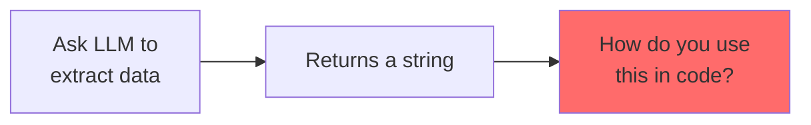
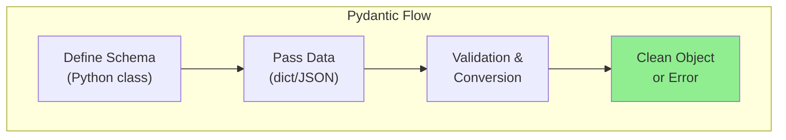
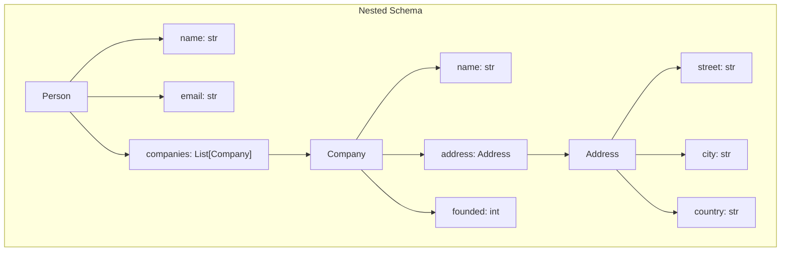

# Using Pydantic to Define Strict Data Schemas

LLMs are great at generating text, but applications need **structured data** - dictionaries, objects, typed fields. Enter **Pydantic**: the Python library that turns messy LLM output into clean, validated data structures.

> **Coming from Software Engineering?** Pydantic is the TypeScript of Python — it adds type safety and validation to a dynamically typed language. If you've used TypeScript interfaces, JSON Schema, or Protocol Buffers to define data contracts, Pydantic models serve the exact same purpose for LLM outputs.

---

## The Problem: LLMs Return Strings



```python
# What we want
user_data = {
    "name": "John Doe",
    "age": 30,
    "email": "john@example.com"
}

# What LLM gives us
llm_response = """
The user's name is John Doe, they are 30 years old,
and their email is john@example.com.
"""

# Now what? Parse this mess manually? 😫
```

---

## What is Pydantic?

Pydantic is a data validation library that:
- Defines data structures with type hints
- Automatically validates and converts data
- Provides clear error messages
- Generates JSON schemas



---

## Getting Started with Pydantic

### Installation

```bash
pip install pydantic
```

### Basic Model

```python
from pydantic import BaseModel
from typing import Optional

class User(BaseModel):
    name: str
    age: int
    email: str
    is_active: Optional[bool] = True

# Creating instances
user1 = User(
    name="John Doe",
    age=30,
    email="john@example.com"
)

print(user1)
# name='John Doe' age=30 email='john@example.com' is_active=True

print(user1.name)  # John Doe
print(user1.model_dump())  # {'name': 'John Doe', 'age': 30, ...}
print(user1.model_dump_json())  # JSON string
```

### Type Coercion

Pydantic automatically converts compatible types:

```python
from pydantic import BaseModel

class User(BaseModel):
    name: str
    age: int

# String "30" is converted to int 30
user = User(name="John", age="30")  # Works!
print(user.age)  # 30 (as int)
print(type(user.age))  # <class 'int'>
```

### Validation Errors

```python
from pydantic import BaseModel, ValidationError

class User(BaseModel):
    name: str
    age: int

try:
    user = User(name="John", age="not a number")
except ValidationError as e:
    print("Validation failed!")
    print(e.json())

# Output:
# [
#   {
#     "type": "int_parsing",
#     "loc": ["age"],
#     "msg": "Input should be a valid integer",
#     "input": "not a number"
#   }
# ]
```

---

## Building Complex Schemas

### Nested Models

```python
from pydantic import BaseModel
from typing import List, Optional
from datetime import datetime

class Address(BaseModel):
    street: str
    city: str
    country: str
    zip_code: Optional[str] = None

class Company(BaseModel):
    name: str
    address: Address
    founded: int

class Person(BaseModel):
    name: str
    email: str
    companies: List[Company]
    created_at: datetime = datetime.now()

# Usage
data = {
    "name": "Jane Smith",
    "email": "jane@example.com",
    "companies": [
        {
            "name": "TechCorp",
            "address": {
                "street": "123 Main St",
                "city": "San Francisco",
                "country": "USA"
            },
            "founded": 2020
        }
    ]
}

person = Person(**data)
print(person.companies[0].address.city)  # San Francisco
```



### Enums and Literals

```python
from pydantic import BaseModel
from enum import Enum
from typing import Literal

class Priority(str, Enum):
    LOW = "low"
    MEDIUM = "medium"
    HIGH = "high"

class Task(BaseModel):
    title: str
    priority: Priority
    status: Literal["pending", "in_progress", "completed"]

# Usage
task = Task(
    title="Fix bug",
    priority="high",  # Converted to Priority.HIGH
    status="pending"
)

print(task.priority)  # Priority.HIGH
print(task.priority.value)  # "high"
```

### Field Validators

```python
from pydantic import BaseModel, field_validator, Field
from typing import List

class Product(BaseModel):
    name: str
    price: float = Field(gt=0)  # Must be greater than 0
    tags: List[str] = []

    @field_validator('name')
    @classmethod
    def name_must_not_be_empty(cls, v):
        if not v.strip():
            raise ValueError('Name cannot be empty')
        return v.title()  # Capitalize

    @field_validator('tags')
    @classmethod
    def tags_lowercase(cls, v):
        return [tag.lower() for tag in v]

# Usage
product = Product(
    name="laptop",
    price=999.99,
    tags=["Electronics", "COMPUTERS"]
)

print(product.name)  # "Laptop" (capitalized)
print(product.tags)  # ["electronics", "computers"] (lowercased)
```

---

## Generating JSON Schemas

Pydantic can generate JSON schemas that LLMs understand:

```python
from pydantic import BaseModel
from typing import List, Optional
import json

class ExtractedEntity(BaseModel):
    """An entity extracted from text."""
    name: str
    entity_type: str
    confidence: float

class ExtractionResult(BaseModel):
    """Result of entity extraction."""
    entities: List[ExtractedEntity]
    source_text: str
    language: Optional[str] = "en"

# Generate JSON Schema
schema = ExtractionResult.model_json_schema()
print(json.dumps(schema, indent=2))
```

**Output:**
```json
{
  "title": "ExtractionResult",
  "description": "Result of entity extraction.",
  "type": "object",
  "properties": {
    "entities": {
      "title": "Entities",
      "type": "array",
      "items": {
        "$ref": "#/$defs/ExtractedEntity"
      }
    },
    "source_text": {
      "title": "Source Text",
      "type": "string"
    },
    "language": {
      "title": "Language",
      "default": "en",
      "type": "string"
    }
  },
  "required": ["entities", "source_text"],
  "$defs": {
    "ExtractedEntity": {
      "title": "ExtractedEntity",
      "description": "An entity extracted from text.",
      "type": "object",
      "properties": {
        "name": {"title": "Name", "type": "string"},
        "entity_type": {"title": "Entity Type", "type": "string"},
        "confidence": {"title": "Confidence", "type": "number"}
      },
      "required": ["name", "entity_type", "confidence"]
    }
  }
}
```

---
