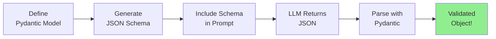
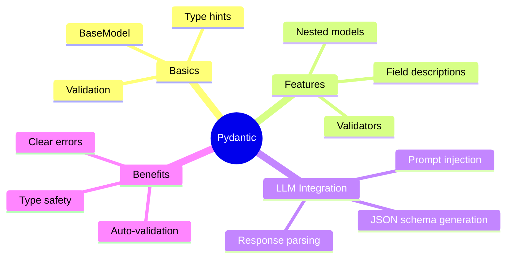

> **Coming from Software Engineering?** Using Pydantic with LLMs is like building a data transformation layer between an unreliable external API and your clean internal types. The same defensive programming patterns — validate, coerce, reject — that you use at API boundaries apply when parsing LLM output.

## Using Pydantic with LLMs

### The Pattern



### Basic Implementation

```python
from pydantic import BaseModel
from openai import OpenAI
import json

client = OpenAI()

class MovieReview(BaseModel):
    title: str
    rating: float
    sentiment: str
    key_points: list[str]

def extract_review(text: str) -> MovieReview:
    """Extract structured review from text."""

    # Get the JSON schema
    schema = MovieReview.model_json_schema()

    prompt = f"""Extract movie review information from the following text.
Return a JSON object matching this schema:

{json.dumps(schema, indent=2)}

Text to analyze:
{text}

Return only valid JSON, no other text."""

    response = client.chat.completions.create(
        model="gpt-4o-mini",
        messages=[{"role": "user", "content": prompt}],
        temperature=0
    )

    # Parse the JSON response
    json_str = response.choices[0].message.content
    data = json.loads(json_str)

    # Validate with Pydantic
    return MovieReview(**data)

# Usage
review_text = """
I just watched "Inception" and WOW! This movie is a masterpiece.
The visual effects are stunning, the plot keeps you guessing,
and the acting is superb. I'd give it a solid 9 out of 10.
My only complaint is it's a bit confusing at times.
"""

review = extract_review(review_text)
print(f"Title: {review.title}")
print(f"Rating: {review.rating}/10")
print(f"Sentiment: {review.sentiment}")
print(f"Key Points: {review.key_points}")
```

---

## Advanced Pydantic Features for LLMs

### Field Descriptions

Add descriptions that become part of the JSON schema:

```python
from pydantic import BaseModel, Field
from typing import Optional

class CustomerTicket(BaseModel):
    """A customer support ticket extracted from email."""

    subject: str = Field(
        description="Brief summary of the issue"
    )
    priority: str = Field(
        description="Priority level: low, medium, high, or urgent"
    )
    category: str = Field(
        description="Category: billing, technical, shipping, or other"
    )
    customer_sentiment: str = Field(
        description="Customer's emotional state: happy, neutral, frustrated, or angry"
    )
    action_required: Optional[str] = Field(
        default=None,
        description="Immediate action needed, if any"
    )

# The schema now includes these descriptions!
schema = CustomerTicket.model_json_schema()
print(schema["properties"]["priority"])
# {'description': 'Priority level: low, medium, high, or urgent', 'title': 'Priority', 'type': 'string'}
```

### Examples in Schema

```python
from pydantic import BaseModel, Field
from typing import List

class ProductInfo(BaseModel):
    name: str = Field(examples=["iPhone 15", "MacBook Pro"])
    price: float = Field(examples=[999.99, 1299.00])
    features: List[str] = Field(
        examples=[["5G capable", "A16 chip", "48MP camera"]]
    )
```

---

## Complete LLM + Pydantic Workflow

```python
from pydantic import BaseModel, Field, ValidationError
from openai import OpenAI
from typing import List, Optional
import json

client = OpenAI()

# Step 1: Define your schema
class ContactInfo(BaseModel):
    name: str = Field(description="Full name of the person")
    email: Optional[str] = Field(default=None, description="Email address if mentioned")
    phone: Optional[str] = Field(default=None, description="Phone number if mentioned")
    company: Optional[str] = Field(default=None, description="Company/organization name")

class ExtractedContacts(BaseModel):
    contacts: List[ContactInfo]
    extraction_notes: str = Field(description="Any relevant notes about the extraction")

# Step 2: Create extraction function
def extract_contacts(text: str) -> ExtractedContacts:
    """Extract contact information from text."""

    schema = ExtractedContacts.model_json_schema()

    system_prompt = """You are a contact information extractor.
    Extract all contact information from the provided text.
    Return valid JSON matching the provided schema exactly."""

    user_prompt = f"""Schema:
{json.dumps(schema, indent=2)}

Text to analyze:
{text}

Return only the JSON object, nothing else."""

    response = client.chat.completions.create(
        model="gpt-4o-mini",
        messages=[
            {"role": "system", "content": system_prompt},
            {"role": "user", "content": user_prompt}
        ],
        temperature=0
    )

    # Parse and validate
    json_str = response.choices[0].message.content

    # Clean up potential markdown formatting
    if json_str.startswith("```"):
        json_str = json_str.split("```")[1]
        if json_str.startswith("json"):
            json_str = json_str[4:]

    data = json.loads(json_str.strip())
    return ExtractedContacts(**data)

# Step 3: Use it!
email_text = """
Hi team,

Please reach out to the following people about the project:

- John Smith from Acme Corp (john.smith@acme.com, 555-123-4567)
- Sarah Johnson, our consultant (sarah@consulting.io)
- Mike at TechStart - his number is 555-987-6543

Best,
Alex
"""

try:
    result = extract_contacts(email_text)
    print("Extracted Contacts:")
    for contact in result.contacts:
        print(f"  - {contact.name}")
        if contact.email:
            print(f"    Email: {contact.email}")
        if contact.phone:
            print(f"    Phone: {contact.phone}")
        if contact.company:
            print(f"    Company: {contact.company}")
    print(f"\nNotes: {result.extraction_notes}")

except ValidationError as e:
    print(f"Validation failed: {e}")
except json.JSONDecodeError as e:
    print(f"JSON parsing failed: {e}")
```

---

## Summary



---

## Quick Reference

```python
from pydantic import BaseModel, Field
from typing import List, Optional

class MySchema(BaseModel):
    """Description becomes part of schema."""

    required_field: str
    optional_field: Optional[str] = None
    with_default: str = "default"
    with_description: str = Field(description="Explain the field")
    constrained: int = Field(gt=0, lt=100)
    list_field: List[str] = []

# Generate schema
schema = MySchema.model_json_schema()

# Parse data
obj = MySchema(**data_dict)

# Export
obj.model_dump()  # To dict
obj.model_dump_json()  # To JSON string
```

---

## Exercises

1. **Invoice Extractor**: Create a Pydantic model for invoices (vendor, items, totals) and extract from sample invoice text

2. **Resume Parser**: Build a schema for resumes and parse job application emails

3. **Sentiment Analyzer**: Create a model that extracts entities AND sentiment from product reviews

---

## What's Next?

Now that you understand Pydantic schemas, let's learn how to **Force LLMs to Return Valid JSON** - handling the cases when they don't cooperate!
