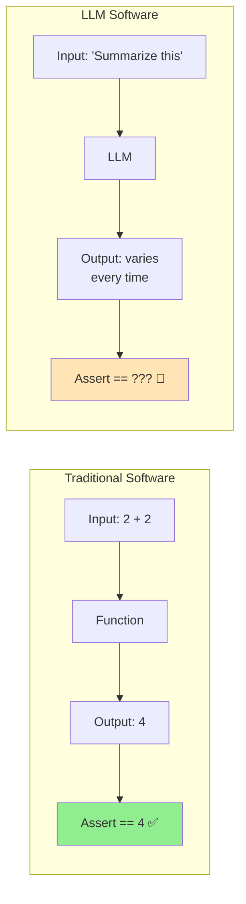
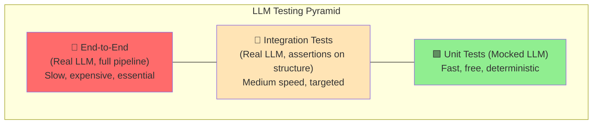
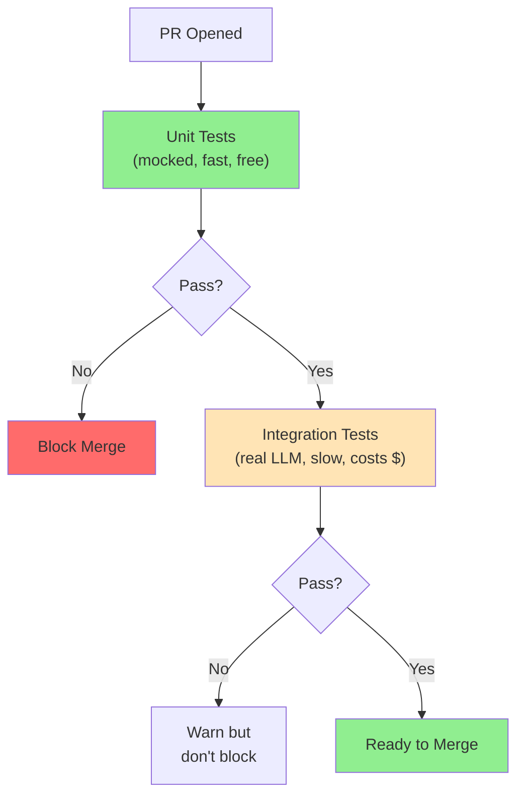

# Day 25: Testing LLM Applications

Every software engineer's first question when they see LLM code: "How do I test this?" It is a great question, and one the AI community has been slow to answer. The non-deterministic nature of LLMs breaks every assumption traditional testing relies on. Today we fix that.

> **Coming from Software Engineering?** You already have strong testing instincts — unit tests, integration tests, CI/CD pipelines. LLM testing reuses that entire mental model but swaps exact assertions for statistical ones. Think of it like testing a microservice that returns slightly different JSON each time: you stop asserting exact equality and start asserting *properties* (contains required fields, sentiment is positive, length is within range). Your pytest/Jest skills transfer directly — you're just writing different assertions.

---

## Why LLM Testing Is Different



### The Core Challenge

| Traditional Testing | LLM Testing |
|---|---|
| Deterministic outputs | Non-deterministic outputs |
| Exact equality checks | Fuzzy matching, structural checks |
| Fast execution (ms) | Slow execution (seconds) |
| Free to run | Costs money per call |
| Isolated | Depends on external API |
| Reproducible | Same input, different output |

The trick is to **test what you can control** and **validate the shape of what you cannot**.

---

## The Testing Pyramid for LLM Apps



Most of your tests should be at the bottom: mocked, fast, and free. But you need tests at every level.

---

## Unit Testing: Mock the LLM

The foundation. Replace LLM calls with predictable responses and test everything around them.

### Setting Up pytest Fixtures

```python
# conftest.py
import pytest
from unittest.mock import MagicMock, AsyncMock, patch
from openai.types.chat import ChatCompletion, ChatCompletionMessage
from openai.types.chat.chat_completion import Choice


@pytest.fixture
def mock_openai_response():
    """Factory fixture for creating mock OpenAI responses."""
    def _create(content: str, model: str = "gpt-4o"):
        return ChatCompletion(
            id="chatcmpl-test123",
            object="chat.completion",
            created=1234567890,
            model=model,
            choices=[
                Choice(
                    index=0,
                    message=ChatCompletionMessage(
                        role="assistant",
                        content=content,
                    ),
                    finish_reason="stop",
                )
            ],
            usage={"prompt_tokens": 10, "completion_tokens": 20, "total_tokens": 30},
        )
    return _create


@pytest.fixture
def mock_openai_client(mock_openai_response):
    """Mock OpenAI client that returns controlled responses."""
    client = MagicMock()
    client.chat.completions.create.return_value = mock_openai_response(
        '{"name": "John", "age": 30}'
    )
    return client


@pytest.fixture
def mock_json_response():
    """Fixture for common JSON responses."""
    return {
        "valid_user": '{"name": "John Doe", "age": 30, "email": "john@example.com"}',
        "invalid_json": '{"name": "John", age: 30}',
        "missing_fields": '{"name": "John"}',
        "wrong_types": '{"name": "John", "age": "thirty", "email": "john@example.com"}',
    }
```

### Testing Your Extraction Logic

```python
# test_extraction.py
import pytest
import json
from unittest.mock import patch, MagicMock
from pydantic import BaseModel, ValidationError

# -- The code under test --
class UserInfo(BaseModel):
    name: str
    age: int
    email: str

def extract_user(client, text: str) -> UserInfo:
    """Extract user info from text using an LLM."""
    response = client.chat.completions.create(
        model="gpt-4o",
        messages=[
            {"role": "system", "content": "Extract user info as JSON."},
            {"role": "user", "content": text},
        ],
        response_format={"type": "json_object"},
    )
    data = json.loads(response.choices[0].message.content)
    return UserInfo(**data)


# -- Tests --
class TestExtractUser:
    def test_successful_extraction(self, mock_openai_client, mock_openai_response):
        """Test that valid LLM output is correctly parsed."""
        mock_openai_client.chat.completions.create.return_value = mock_openai_response(
            '{"name": "Jane Doe", "age": 25, "email": "jane@example.com"}'
        )

        result = extract_user(mock_openai_client, "Jane Doe, 25, jane@example.com")

        assert result.name == "Jane Doe"
        assert result.age == 25
        assert result.email == "jane@example.com"

    def test_invalid_json_raises(self, mock_openai_client, mock_openai_response):
        """Test that invalid JSON from LLM raises an error."""
        mock_openai_client.chat.completions.create.return_value = mock_openai_response(
            "This is not JSON at all"
        )

        with pytest.raises(json.JSONDecodeError):
            extract_user(mock_openai_client, "some text")

    def test_missing_fields_raises(self, mock_openai_client, mock_openai_response):
        """Test that missing required fields raise ValidationError."""
        mock_openai_client.chat.completions.create.return_value = mock_openai_response(
            '{"name": "John"}'
        )

        with pytest.raises(ValidationError) as exc_info:
            extract_user(mock_openai_client, "John")

        errors = exc_info.value.errors()
        missing_fields = {e["loc"][0] for e in errors}
        assert "age" in missing_fields
        assert "email" in missing_fields

    def test_wrong_types_raises(self, mock_openai_client, mock_openai_response):
        """Test that wrong field types raise ValidationError."""
        mock_openai_client.chat.completions.create.return_value = mock_openai_response(
            '{"name": "John", "age": "not a number", "email": "j@x.com"}'
        )

        with pytest.raises(ValidationError):
            extract_user(mock_openai_client, "John")

    def test_prompt_includes_user_text(self, mock_openai_client):
        """Test that the user's input text is passed to the LLM."""
        extract_user(mock_openai_client, "Contact: Alice, age 40, alice@co.com")

        call_args = mock_openai_client.chat.completions.create.call_args
        messages = call_args.kwargs["messages"]
        assert "Contact: Alice, age 40, alice@co.com" in messages[1]["content"]
```

---

## Testing Pydantic Output Schemas

Your schemas are contracts. Test them independently from the LLM.

```python
# test_schemas.py
import pytest
from pydantic import BaseModel, field_validator, ValidationError
from typing import Literal
from enum import Enum


class SentimentResult(BaseModel):
    text: str
    sentiment: Literal["positive", "negative", "neutral"]
    confidence: float
    keywords: list[str]

    @field_validator("confidence")
    @classmethod
    def confidence_in_range(cls, v):
        if not 0 <= v <= 1:
            raise ValueError("confidence must be between 0 and 1")
        return v


class TestSentimentSchema:
    def test_valid_result(self):
        result = SentimentResult(
            text="Great product!",
            sentiment="positive",
            confidence=0.95,
            keywords=["great", "product"],
        )
        assert result.sentiment == "positive"

    def test_invalid_sentiment_value(self):
        with pytest.raises(ValidationError):
            SentimentResult(
                text="Okay",
                sentiment="maybe",  # not in Literal options
                confidence=0.5,
                keywords=[],
            )

    def test_confidence_out_of_range(self):
        with pytest.raises(ValidationError):
            SentimentResult(
                text="Bad",
                sentiment="negative",
                confidence=1.5,  # above 1.0
                keywords=["bad"],
            )

    def test_empty_keywords_allowed(self):
        result = SentimentResult(
            text="Meh",
            sentiment="neutral",
            confidence=0.3,
            keywords=[],
        )
        assert result.keywords == []

    @pytest.mark.parametrize(
        "llm_output",
        [
            '{"text": "Good", "sentiment": "positive", "confidence": 0.8, "keywords": ["good"]}',
            '{"text": "Bad", "sentiment": "negative", "confidence": 0.9, "keywords": ["bad"]}',
            '{"text": "Ok", "sentiment": "neutral", "confidence": 0.5, "keywords": []}',
        ],
    )
    def test_parses_realistic_llm_outputs(self, llm_output):
        """Test that realistic LLM JSON outputs parse correctly."""
        import json
        data = json.loads(llm_output)
        result = SentimentResult(**data)
        assert result.sentiment in ["positive", "negative", "neutral"]
        assert 0 <= result.confidence <= 1
```

---

## Testing Retry Logic

You built retry loops in Days 23-24. Now test them.

```python
# test_retry.py
import pytest
from unittest.mock import MagicMock, call
from pydantic import BaseModel
import json


class UserInfo(BaseModel):
    name: str
    age: int


def extract_with_retry(client, text: str, max_retries: int = 3) -> UserInfo | None:
    """The function under test (simplified from Day 23)."""
    for attempt in range(max_retries):
        try:
            response = client.chat.completions.create(
                model="gpt-4o",
                messages=[{"role": "user", "content": text}],
            )
            data = json.loads(response.choices[0].message.content)
            return UserInfo(**data)
        except (json.JSONDecodeError, Exception):
            continue
    return None


class TestRetryLogic:
    def test_succeeds_on_first_try(self, mock_openai_client, mock_openai_response):
        mock_openai_client.chat.completions.create.return_value = mock_openai_response(
            '{"name": "John", "age": 30}'
        )

        result = extract_with_retry(mock_openai_client, "John, 30")

        assert result is not None
        assert result.name == "John"
        assert mock_openai_client.chat.completions.create.call_count == 1

    def test_succeeds_after_retries(self, mock_openai_client, mock_openai_response):
        """Simulate: fail, fail, succeed."""
        mock_openai_client.chat.completions.create.side_effect = [
            mock_openai_response("not json"),
            mock_openai_response('{"name": "broken"}'),  # missing age
            mock_openai_response('{"name": "John", "age": 30}'),
        ]

        result = extract_with_retry(mock_openai_client, "John, 30")

        assert result is not None
        assert mock_openai_client.chat.completions.create.call_count == 3

    def test_returns_none_after_max_retries(self, mock_openai_client, mock_openai_response):
        """All attempts fail."""
        mock_openai_client.chat.completions.create.return_value = mock_openai_response(
            "never valid json {"
        )

        result = extract_with_retry(mock_openai_client, "text", max_retries=3)

        assert result is None
        assert mock_openai_client.chat.completions.create.call_count == 3

    def test_custom_max_retries(self, mock_openai_client, mock_openai_response):
        """Ensure max_retries is respected."""
        mock_openai_client.chat.completions.create.return_value = mock_openai_response(
            "broken"
        )

        extract_with_retry(mock_openai_client, "text", max_retries=5)

        assert mock_openai_client.chat.completions.create.call_count == 5
```

---

## Snapshot Testing for Prompts

Prompts change. You need to know when they change and whether the change was intentional.

```python
# test_prompts.py
import pytest
import json
from pathlib import Path

# Store prompts as files, not inline strings
PROMPTS_DIR = Path(__file__).parent / "prompts"


def load_prompt(name: str) -> str:
    """Load a prompt template from file."""
    return (PROMPTS_DIR / f"{name}.txt").read_text()


def build_extraction_prompt(text: str) -> list[dict]:
    """Build the messages list for extraction."""
    system_prompt = load_prompt("extraction_system")
    return [
        {"role": "system", "content": system_prompt},
        {"role": "user", "content": f"Extract info from: {text}"},
    ]


class TestPromptSnapshots:
    def test_system_prompt_unchanged(self, snapshot):
        """
        Snapshot test: catches unintentional prompt changes.

        Uses pytest-snapshot or syrupy. First run creates the snapshot.
        Subsequent runs compare against it.
        """
        prompt = load_prompt("extraction_system")
        # With syrupy: assert prompt == snapshot
        # Without a snapshot library, use hash comparison:
        import hashlib
        prompt_hash = hashlib.sha256(prompt.encode()).hexdigest()

        # Store expected hash (update when you intentionally change the prompt)
        expected_hash = "a1b2c3d4..."  # Update this when prompt changes
        # assert prompt_hash == expected_hash  # Uncomment in real usage

    def test_prompt_structure(self):
        """Test that prompt building produces the right structure."""
        messages = build_extraction_prompt("Hello world")

        assert len(messages) == 2
        assert messages[0]["role"] == "system"
        assert messages[1]["role"] == "user"
        assert "Hello world" in messages[1]["content"]

    def test_prompt_variables_injected(self):
        """Test that user text is properly injected into the prompt."""
        text = "Special chars: <>&'\""
        messages = build_extraction_prompt(text)
        assert text in messages[1]["content"]
```

---

## Integration Testing: Real LLM Calls

These tests hit real APIs. They are slow, expensive, and essential.

```python
# test_integration.py
import pytest
import json
import os
from openai import OpenAI
from pydantic import BaseModel


# Skip if no API key (e.g., in CI without secrets)
pytestmark = pytest.mark.skipif(
    not os.getenv("OPENAI_API_KEY"),
    reason="OPENAI_API_KEY not set"
)


@pytest.fixture(scope="module")
def openai_client():
    """Shared client for integration tests (module-scoped for efficiency)."""
    return OpenAI()


class MovieReview(BaseModel):
    title: str
    rating: float
    genre: str


class TestLLMIntegration:
    """Integration tests against real LLM APIs.

    These tests validate structure, not exact content.
    Run sparingly: they cost money and take seconds each.
    """

    @pytest.mark.slow
    def test_json_output_is_valid(self, openai_client):
        """Test that the LLM returns parseable JSON."""
        response = openai_client.chat.completions.create(
            model="gpt-4o-mini",
            messages=[
                {"role": "user", "content": "Return a JSON object with keys: title, rating (1-5), genre for the movie Inception."}
            ],
            response_format={"type": "json_object"},
            temperature=0,
        )

        data = json.loads(response.choices[0].message.content)
        assert isinstance(data, dict)
        assert "title" in data
        assert "rating" in data

    @pytest.mark.slow
    def test_output_matches_schema(self, openai_client):
        """Test that LLM output matches our Pydantic schema."""
        response = openai_client.chat.completions.create(
            model="gpt-4o-mini",
            messages=[
                {
                    "role": "system",
                    "content": f"Return JSON matching this schema: {json.dumps(MovieReview.model_json_schema())}",
                },
                {"role": "user", "content": "Review the movie Inception"},
            ],
            response_format={"type": "json_object"},
            temperature=0,
        )

        data = json.loads(response.choices[0].message.content)
        review = MovieReview(**data)  # Will raise if schema doesn't match
        assert review.title  # Non-empty
        assert 0 <= review.rating <= 5

    @pytest.mark.slow
    def test_response_within_token_limit(self, openai_client):
        """Test that responses stay within expected size."""
        response = openai_client.chat.completions.create(
            model="gpt-4o-mini",
            messages=[{"role": "user", "content": "Say hello in one sentence."}],
            max_tokens=50,
        )

        assert response.usage.completion_tokens <= 50
```

---

## Organizing Your Test Suite

```
tests/
  conftest.py              # Shared fixtures
  prompts/
    extraction_system.txt   # Prompt files for snapshot testing
  unit/
    test_schemas.py         # Pydantic model tests
    test_extraction.py      # Mocked LLM tests
    test_retry.py           # Retry logic tests
    test_prompts.py         # Prompt structure tests
  integration/
    test_llm_integration.py # Real API tests (marked @slow)
  pytest.ini
```

### pytest Configuration

```ini
# pytest.ini
[pytest]
markers =
    slow: marks tests that call real LLM APIs (deselect with '-m "not slow"')
    integration: marks integration tests

testpaths = tests
```

### Running Tests

```bash
# Fast unit tests only (CI default)
pytest -m "not slow" -v

# Include integration tests (costs money)
pytest -v

# Only integration tests
pytest -m slow -v

# With coverage
pytest -m "not slow" --cov=src --cov-report=term-missing
```

---

## CI/CD Considerations



### GitHub Actions Example

```yaml
# .github/workflows/test.yml
name: Test LLM Application
on: [push, pull_request]

jobs:
  unit-tests:
    runs-on: ubuntu-latest
    steps:
      - uses: actions/checkout@v4
      - uses: actions/setup-python@v5
        with:
          python-version: "3.11"
      - run: pip install -r requirements.txt
      - run: pytest -m "not slow" -v --tb=short

  integration-tests:
    runs-on: ubuntu-latest
    # Only run on main branch or when manually triggered
    if: github.ref == 'refs/heads/main' || github.event_name == 'workflow_dispatch'
    env:
      OPENAI_API_KEY: ${{ secrets.OPENAI_API_KEY }}
    steps:
      - uses: actions/checkout@v4
      - uses: actions/setup-python@v5
        with:
          python-version: "3.11"
      - run: pip install -r requirements.txt
      - run: pytest -m slow -v --tb=short
        continue-on-error: true  # Don't block deploy on flaky LLM tests
```

---

## Testing Anti-Patterns to Avoid

### 1. Testing Exact LLM Output

```python
# BAD - This will break constantly
def test_summary():
    result = summarize("Long article about Python...")
    assert result == "Python is a programming language that..."  # FRAGILE

# GOOD - Test structure and properties
def test_summary():
    result = summarize("Long article about Python...")
    assert len(result) < 500  # Length constraint
    assert isinstance(result, str)  # Type check
    assert len(result) > 10  # Not empty/trivial
```

### 2. No Mocking at All

```python
# BAD - Every test hits the API
def test_extraction():
    client = OpenAI()  # Real API call, slow, costs money
    result = extract(client, "text")
    assert result.name == "John"

# GOOD - Mock for unit tests, real API for integration only
def test_extraction(mock_openai_client):
    result = extract(mock_openai_client, "text")
    assert result.name == "John"
```

### 3. Ignoring Costs

```python
# BAD - Running GPT-4 integration tests on every commit
@pytest.mark.parametrize("text", [hundred_different_inputs])
def test_all_cases(text):
    client = OpenAI()
    extract(client, text)  # 100 API calls = $$$

# GOOD - Parametrize unit tests, sample integration tests
@pytest.mark.parametrize("text", [hundred_different_inputs])
def test_all_cases_mocked(mock_client, text):
    extract(mock_client, text)  # Free

@pytest.mark.slow
def test_sample_integration():
    client = OpenAI()
    extract(client, sample_inputs[:3])  # Just 3 real calls
```

---

## SWE to AI Engineering Bridge

| SWE Concept | LLM Testing Equivalent |
|---|---|
| Unit tests with mocks | Mock LLM responses, test parsing/validation |
| Integration tests | Real LLM calls with structural assertions |
| Snapshot tests | Prompt version tracking |
| Contract tests | Pydantic schema validation |
| Load tests | Token count and cost monitoring |
| Flaky test handling | `continue-on-error` for non-deterministic tests |

---

## Key Takeaways

1. **Mock aggressively** - Most of your tests should never call a real LLM
2. **Test the contract, not the content** - Validate structure, types, and constraints
3. **Separate test tiers** - Fast/free unit tests vs slow/paid integration tests
4. **Snapshot your prompts** - Know when prompts change
5. **Budget your integration tests** - They cost real money
6. **Make integration tests optional in CI** - Do not block deploys on non-deterministic failures

---

## Practice Exercises

1. Write a test suite for a function that classifies customer support tickets using an LLM
2. Add snapshot tests for three different prompt templates
3. Set up pytest markers so `pytest -m "not slow"` runs in under 2 seconds
4. Write a parametrized test that validates 10 different Pydantic schemas against mock LLM outputs

---

**Next up:** Day 26 - Capstone: Data Extraction Pipeline, where you will put together everything from Phase 1 into a complete, tested project.
