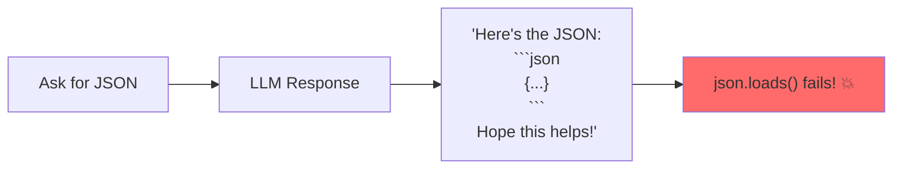
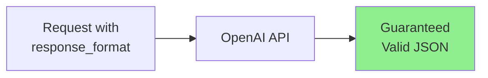

# Forcing LLMs to Return Valid JSON

LLMs are helpful, but they don't always follow instructions perfectly. Sometimes they add extra text, use markdown formatting, or produce malformed JSON. In this guide, you'll learn battle-tested techniques to get reliable JSON output every time.

> **Coming from Software Engineering?** Forcing JSON output is like writing a parser for an unreliable data source. If you've ever scraped web pages or parsed log files where the format isn't guaranteed, you'll recognize the patterns: try the clean path first, then progressively more aggressive extraction strategies.

---

## The Problem: LLMs Add Extra Stuff



Common issues:
- Markdown code blocks (` ```json ... ``` `)
- Explanatory text before/after
- Comments inside JSON
- Trailing commas
- Invalid escape sequences

---

## Technique 1: Explicit Instructions

The simplest approach - be very explicit about what you want:

```python
from openai import OpenAI
import json

client = OpenAI()

def get_json_explicit(prompt: str, schema: dict) -> dict:
    """Get JSON with explicit instructions."""
    system_prompt = """You are a JSON generator.

CRITICAL RULES:
1. Return ONLY valid JSON
2. Do NOT include markdown formatting (no ```)
3. Do NOT include any text before or after the JSON
4. Do NOT include comments in the JSON
5. The response must start with { or [ and end with } or ]

If you cannot fulfill the request, return: {"error": "description"}"""

    user_prompt = f"""Generate JSON matching this schema:
{json.dumps(schema, indent=2)}

Data to extract from: {prompt}

Remember: Return ONLY the JSON object, nothing else."""

    response = client.chat.completions.create(
        model="gpt-4o-mini",
        messages=[
            {"role": "system", "content": system_prompt},
            {"role": "user", "content": user_prompt}
        ],
        temperature=0  # Reduce randomness
    )

    return json.loads(response.choices[0].message.content)

# Usage
schema = {
    "name": "string",
    "age": "number",
    "hobbies": ["string"]
}

result = get_json_explicit(
    "John is 25 years old and enjoys reading and hiking",
    schema
)
print(result)
```

---

## Technique 2: OpenAI JSON Mode

OpenAI offers a built-in JSON mode that guarantees valid JSON output:

```python
from openai import OpenAI
import json

client = OpenAI()

def get_json_mode(prompt: str) -> dict:
    """Use OpenAI's JSON mode for guaranteed valid JSON."""
    response = client.chat.completions.create(
        model="gpt-4o-mini",
        messages=[
            {
                "role": "system",
                "content": "You extract data and return it as JSON."
            },
            {
                "role": "user",
                "content": f"Extract information from: {prompt}\n\nReturn as JSON with fields: name, age, location"
            }
        ],
        response_format={"type": "json_object"}  # Magic!
    )

    return json.loads(response.choices[0].message.content)

# Usage
result = get_json_mode("Sarah, 30, lives in New York")
print(result)  # {"name": "Sarah", "age": 30, "location": "New York"}
```



### Important Notes about JSON Mode

1. **Must mention JSON in prompt**: The system or user message must contain the word "JSON"
2. **No schema enforcement**: It guarantees valid JSON syntax, but not structure
3. **Available models**: GPT-4o, GPT-4o-mini, and most recent OpenAI models

---

## Technique 3: Structured Outputs (OpenAI)

For strict schema enforcement, use OpenAI's Structured Outputs:

```python
from openai import OpenAI
from pydantic import BaseModel
from typing import List

client = OpenAI()

# Define your schema with Pydantic
class MovieExtraction(BaseModel):
    title: str
    year: int
    genre: List[str]
    rating: float

def extract_with_structure(text: str) -> MovieExtraction:
    """Use structured outputs for guaranteed schema compliance."""
    response = client.chat.completions.parse(
        model="gpt-4o-mini",
        messages=[
            {
                "role": "system",
                "content": "Extract movie information from text."
            },
            {
                "role": "user",
                "content": text
            }
        ],
        response_format=MovieExtraction
    )

    return response.choices[0].message.parsed

# Usage
result = extract_with_structure(
    "Inception (2010) is a sci-fi thriller directed by Nolan. Critics gave it 8.8/10."
)

print(f"Title: {result.title}")
print(f"Year: {result.year}")
print(f"Genres: {result.genre}")
print(f"Rating: {result.rating}")
```

---

## Technique 4: JSON Cleaning/Repair

When LLMs don't cooperate, clean the output:

```python
import json
import re
from typing import Optional

def clean_json_response(response: str) -> str:
    """Clean common LLM JSON issues."""

    # Remove markdown code blocks
    if "```" in response:
        # Extract content between code blocks
        pattern = r"```(?:json)?\s*([\s\S]*?)\s*```"
        matches = re.findall(pattern, response)
        if matches:
            response = matches[0]

    # Remove leading/trailing whitespace
    response = response.strip()

    # Remove common prefixes
    prefixes_to_remove = [
        "Here's the JSON:",
        "Here is the JSON:",
        "JSON output:",
        "Result:",
    ]
    for prefix in prefixes_to_remove:
        if response.lower().startswith(prefix.lower()):
            response = response[len(prefix):].strip()

    # Find the JSON object/array
    # Look for first { or [ and last } or ]
    start_obj = response.find('{')
    start_arr = response.find('[')
    end_obj = response.rfind('}')
    end_arr = response.rfind(']')

    if start_obj != -1 and end_obj != -1:
        if start_arr == -1 or start_obj < start_arr:
            response = response[start_obj:end_obj + 1]
        elif start_arr < start_obj:
            response = response[start_arr:end_arr + 1]
    elif start_arr != -1 and end_arr != -1:
        response = response[start_arr:end_arr + 1]

    return response

def repair_json(json_str: str) -> str:
    """Attempt to repair common JSON syntax errors."""

    # Remove trailing commas before } or ]
    json_str = re.sub(r',\s*([}\]])', r'\1', json_str)

    # Replace single quotes with double quotes (risky but sometimes needed)
    # Only do this if there are no double quotes
    if '"' not in json_str and "'" in json_str:
        json_str = json_str.replace("'", '"')

    # Fix unquoted keys (simple cases)
    json_str = re.sub(r'(\{|,)\s*(\w+)\s*:', r'\1"\2":', json_str)

    return json_str

def safe_parse_json(response: str) -> Optional[dict]:
    """Safely parse JSON with cleaning and repair."""
    try:
        # Try direct parse first
        return json.loads(response)
    except json.JSONDecodeError:
        pass

    # Clean the response
    cleaned = clean_json_response(response)

    try:
        return json.loads(cleaned)
    except json.JSONDecodeError:
        pass

    # Try repairing
    repaired = repair_json(cleaned)

    try:
        return json.loads(repaired)
    except json.JSONDecodeError as e:
        print(f"Failed to parse JSON: {e}")
        print(f"Cleaned: {cleaned}")
        print(f"Repaired: {repaired}")
        return None

# Test it
messy_responses = [
    'Here is the JSON: {"name": "John", "age": 30}',
    '```json\n{"name": "Jane"}\n```',
    "{'name': 'Bob', 'age': 25,}",  # Single quotes and trailing comma
    '{"items": [1, 2, 3,]}',  # Trailing comma
]

for response in messy_responses:
    print(f"Input: {response[:50]}...")
    result = safe_parse_json(response)
    print(f"Parsed: {result}\n")
```

---
