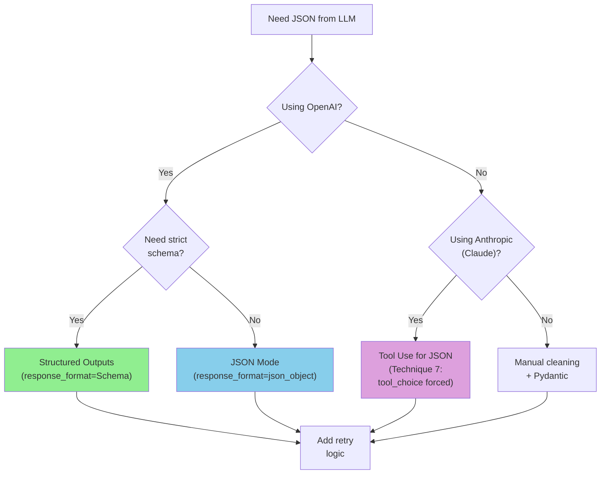
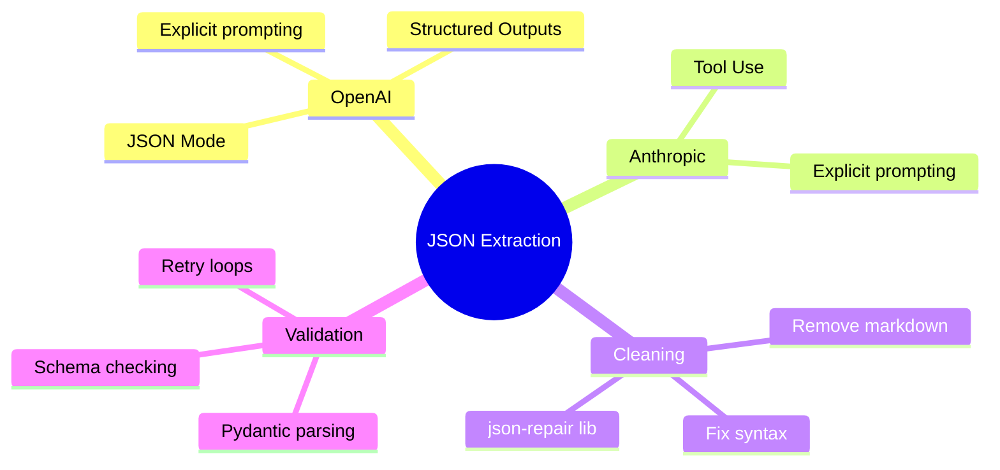

> **Coming from Software Engineering?** The json-repair library and two-step extraction are like building a resilient ETL pipeline — when the source data is messy, you add cleaning stages. This is the same approach as data pipelines that handle malformed CSV, broken JSON, or inconsistent API responses.

## Technique 5: Using json-repair Library

For more robust repair, use the `json-repair` library:

```python
# pip install json-repair

from json_repair import repair_json
import json

def robust_json_parse(text: str) -> dict:
    """Parse JSON with automatic repair."""
    # First try clean parse
    try:
        return json.loads(text)
    except json.JSONDecodeError:
        # Use json-repair
        repaired = repair_json(text)
        return json.loads(repaired)

# Examples
broken_json_samples = [
    '{name: "John", age: 30}',  # Unquoted keys
    '{"items": [1, 2, 3,],}',  # Trailing commas
    "{'nested': {'key': 'value'}}",  # Single quotes
    '{"text": "He said "hello""}',  # Unescaped quotes
]

for sample in broken_json_samples:
    try:
        result = robust_json_parse(sample)
        print(f"✅ Parsed: {result}")
    except Exception as e:
        print(f"❌ Failed: {e}")
```

---

## Technique 6: Two-Step Extraction

Ask the LLM to extract, then ask again to format:

```python
from openai import OpenAI
import json

client = OpenAI()

def two_step_extraction(text: str, schema: dict) -> dict:
    """Extract data in two steps for more reliability."""

    # Step 1: Extract information (free-form)
    extraction_response = client.chat.completions.create(
        model="gpt-4o-mini",
        messages=[
            {
                "role": "user",
                "content": f"List all the key information from this text:\n\n{text}"
            }
        ]
    )

    extracted_info = extraction_response.choices[0].message.content

    # Step 2: Format as JSON
    format_response = client.chat.completions.create(
        model="gpt-4o-mini",
        messages=[
            {
                "role": "system",
                "content": "Convert information to JSON. Return ONLY valid JSON."
            },
            {
                "role": "user",
                "content": f"""Information:
{extracted_info}

Format as JSON with this structure:
{json.dumps(schema, indent=2)}

Return only the JSON object."""
            }
        ],
        response_format={"type": "json_object"}
    )

    return json.loads(format_response.choices[0].message.content)

# Usage
schema = {
    "products": [{"name": "string", "price": "number"}],
    "total": "number"
}

receipt = """
ACME Store Receipt
------------------
Apples x3 @ $1.50 = $4.50
Bread = $2.99
Milk 2L = $3.25
------------------
Total: $10.74
"""

result = two_step_extraction(receipt, schema)
print(json.dumps(result, indent=2))
```

---

## Technique 7: Anthropic's Tool Use

Claude supports structured extraction via tool definitions:

```python
from anthropic import Anthropic
import json

client = Anthropic()

def extract_with_claude_tools(text: str) -> dict:
    """Use Claude's tool use for structured extraction."""

    tools = [
        {
            "name": "record_extraction",
            "description": "Record the extracted information",
            "input_schema": {
                "type": "object",
                "properties": {
                    "name": {
                        "type": "string",
                        "description": "Person's full name"
                    },
                    "email": {
                        "type": "string",
                        "description": "Email address"
                    },
                    "phone": {
                        "type": "string",
                        "description": "Phone number"
                    }
                },
                "required": ["name"]
            }
        }
    ]

    response = client.messages.create(
        model="claude-sonnet-4-5",
        max_tokens=1024,
        tools=tools,
        tool_choice={"type": "tool", "name": "record_extraction"},
        messages=[
            {
                "role": "user",
                "content": f"Extract contact info from: {text}"
            }
        ]
    )

    # Get the tool use response
    for block in response.content:
        if block.type == "tool_use":
            return block.input

    return {}

# Usage
result = extract_with_claude_tools(
    "Contact John Smith at john@email.com or call 555-1234"
)
print(result)
# {"name": "John Smith", "email": "john@email.com", "phone": "555-1234"}
```

---

## Complete Robust JSON Extractor

Here's a production-ready implementation combining multiple techniques:

```python
from openai import OpenAI
from pydantic import BaseModel, ValidationError
from typing import TypeVar, Type, Optional
import json
import re

client = OpenAI()
T = TypeVar('T', bound=BaseModel)

class JSONExtractor:
    """Robust JSON extraction from LLM responses."""

    def __init__(self, model: str = "gpt-4o-mini"):
        self.model = model

    def extract(
        self,
        text: str,
        schema: Type[T],
        max_retries: int = 3
    ) -> Optional[T]:
        """Extract structured data matching a Pydantic schema."""

        json_schema = schema.model_json_schema()

        for attempt in range(max_retries):
            try:
                # Make API call
                response = self._call_api(text, json_schema)

                # Clean the response
                cleaned = self._clean_response(response)

                # Parse JSON
                data = json.loads(cleaned)

                # Validate with Pydantic
                return schema(**data)

            except json.JSONDecodeError as e:
                print(f"Attempt {attempt + 1}: JSON parse error - {e}")
            except ValidationError as e:
                print(f"Attempt {attempt + 1}: Validation error - {e}")
            except Exception as e:
                print(f"Attempt {attempt + 1}: Unexpected error - {e}")

        return None

    def _call_api(self, text: str, schema: dict) -> str:
        """Make the API call."""
        response = client.chat.completions.create(
            model=self.model,
            messages=[
                {
                    "role": "system",
                    "content": "Extract information and return as JSON only. No markdown, no explanations."
                },
                {
                    "role": "user",
                    "content": f"Schema: {json.dumps(schema)}\n\nText: {text}\n\nJSON:"
                }
            ],
            temperature=0,
            response_format={"type": "json_object"}
        )
        return response.choices[0].message.content

    def _clean_response(self, response: str) -> str:
        """Clean the response string."""
        # Remove markdown
        response = re.sub(r'```(?:json)?\s*', '', response)
        response = re.sub(r'\s*```', '', response)

        # Trim whitespace
        response = response.strip()

        # Find JSON boundaries
        start = min(
            (response.find('{'), response.find('[')),
            key=lambda x: x if x >= 0 else float('inf')
        )
        end = max(response.rfind('}'), response.rfind(']'))

        if start < float('inf') and end >= 0:
            response = response[start:end + 1]

        return response

# Usage
class Person(BaseModel):
    name: str
    age: int
    occupation: str

extractor = JSONExtractor()
result = extractor.extract(
    "Meet Sarah, a 28-year-old software engineer from Boston.",
    Person
)

if result:
    print(f"Extracted: {result}")
else:
    print("Extraction failed")
```

---

## Decision Tree: Choosing Your Approach



---

## Summary



---

## Quick Reference

```python
# OpenAI JSON Mode
response = client.chat.completions.create(
    model="gpt-4o-mini",
    messages=[...],
    response_format={"type": "json_object"}
)

# OpenAI Structured Outputs
response = client.chat.completions.parse(
    model="gpt-4o-mini",
    messages=[...],
    response_format=MyPydanticModel
)

# Manual cleaning
import re
cleaned = re.sub(r'```(?:json)?\s*', '', response)
```

---

## Exercises

1. **Robust Extractor**: Build a function that tries multiple extraction methods in sequence until one succeeds

2. **Error Reporter**: Create a system that logs failed extractions for analysis and prompt improvement

3. **Schema Validator**: Build a tool that validates LLM output against arbitrary JSON schemas

---

## What's Next?

Now let's learn about **Building Retry Loops** - handling the inevitable cases when LLMs still produce invalid output!
